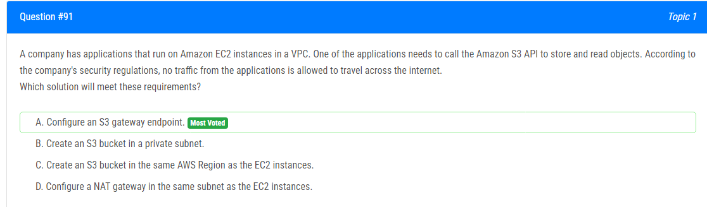
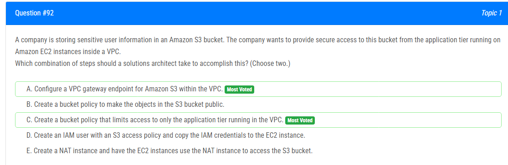
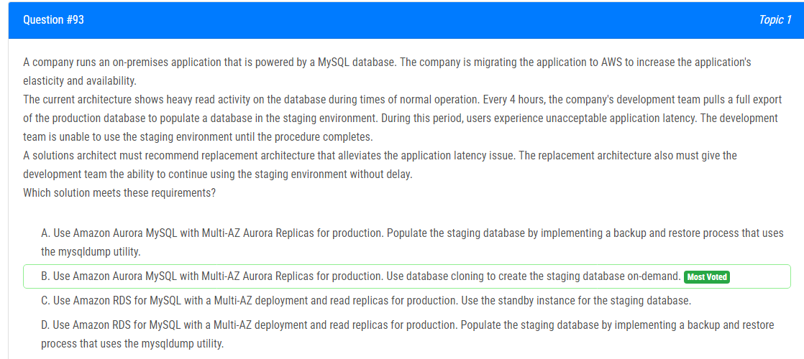
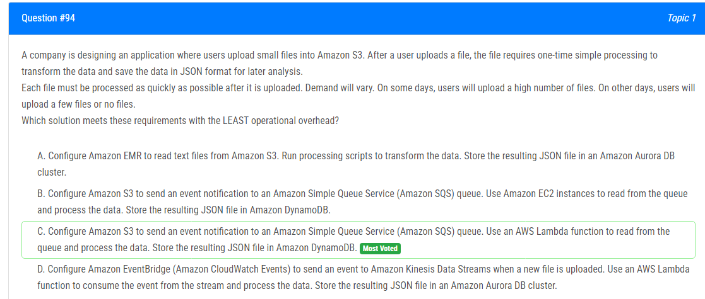
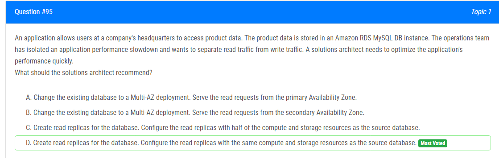
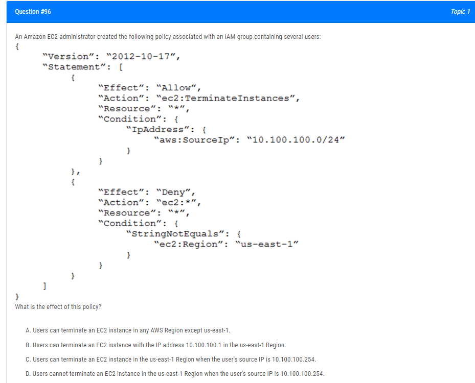
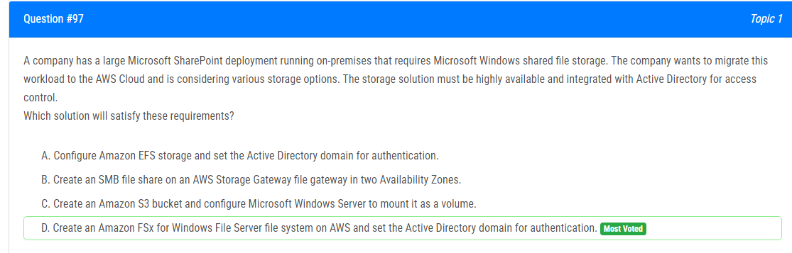
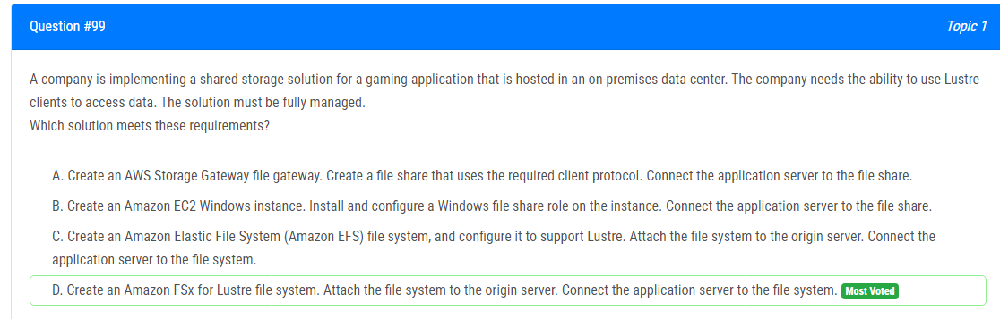
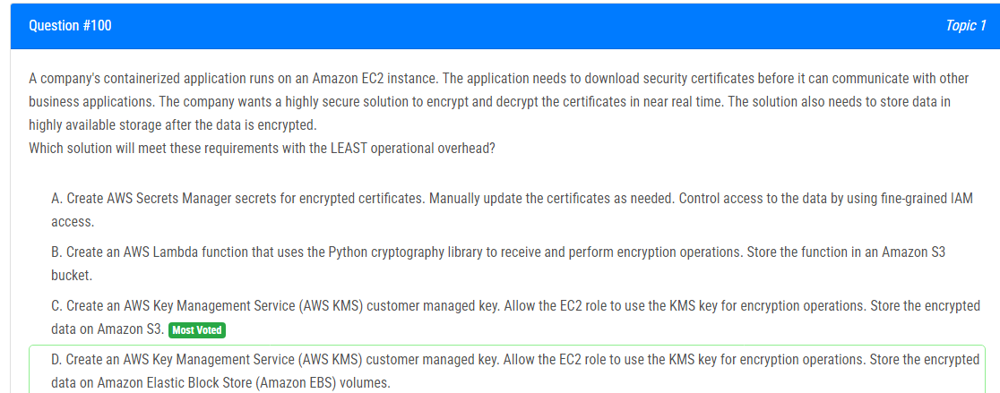

해설:

정답 A.

게이트웨이 엔드포인트는 VPC 내에서 Amazon S3에 연결할 수 있는 VPC 엔드포인트입니다. VPC와 Amazon S3 간의 트래픽은 Amazon 네트워크를 통과하므로 인터넷을 통하지 않습니다. 이로써 NAT 게이트웨이나 VPN 연결을 사용하지 않고도 Amazon S3에 액세스할 수 있습니다.

B(S3 버킷을 개인 서브넷에 생성): S3 버킷은 서브넷을 가지지 않기 때문에 유효한 해결책이 아닙니다.

C(EC2 인스턴스와 동일한 AWS 지역에 S3 버킷 생성): 주어진 보안 규정을 충족시키는 데 필요한 요구사항이 아닙니다.

D(EC2 인스턴스와 동일한 서브넷에 NAT 게이트웨이 구성): VPC를 벗어나 인터넷을 통해 트래픽을 허용하므로 유효한 해결책이 아닙니다.

해설:

정답 A, C.

올바른 옵션은 다음과 같습니다:

A) VPC 내에서 Amazon S3에 대한 VPC 게이트웨이 엔드포인트를 구성합니다.

C) VPC에서 실행 중인 응용 프로그램 계층에만 액세스를 제한하는 버킷 정책을 생성합니다.

주요 요구 사항은 VPC 내의 EC2 인스턴스에서 S3 버킷에 안전하게 액세스하는 것입니다.

S3에 대한 VPC 엔드포인트를 사용하면 인터넷 액세스 없이 VPC에서 S3로 연결할 수 있습니다. 버킷 정책은 VPC 엔드포인트를 화이트리스트로 지정하여 액세스를 VPC에만 허용해야 합니다.

해설:

정답 B.

옵션 B: 프로덕션에는 Amazon Aurora MySQL을 Multi-AZ Aurora 레플리카와 함께 사용하고 스테이징 데이터베이스를 필요할 때 생성하기 위해 데이터베이스 복제를 사용하는 것이 권장되는 솔루션입니다. 이를 통해 개발 팀은 지연 없이 스테이징 환경을 계속 사용할 수 있으며 동시에 프로덕션 응용 프로그램에 대한 탄력성과 가용성을 제공합니다.

A: 프로덕션에 Amazon Aurora MySQL을 Multi-AZ Aurora 레플리카와 함께 사용하고 mysqldump 유틸리티를 사용한 백업 및 복원 프로세스를 구현하여 스테이징 데이터베이스를 채우는 것은 권장되지 않습니다. 왜냐하면 이것은 프로덕션 데이터베이스의 전체 내보내기를 수행하며 이로 인해 수용할 수 없는 응용 프로그램 지연이 발생할 수 있습니다.

C: 프로덕션에는 Amazon RDS for MySQL을 Multi-AZ 배포 및 읽기 레플리카와 함께 사용하고 스탠바이 인스턴스를 스테이징 데이터베이스로 사용하는 것은 권장되지 않습니다. 이는 개발 팀이 지연 없이 스테이징 환경을 계속 사용할 수 있는 기능을 제공하지 않습니다. 스탠바이 인스턴스는 프로덕션 인스턴스의 장애 대비에 사용되며 스테이징 환경으로 사용하기 위해 설계되지 않았습니다.

D: 프로덕션에 Amazon RDS for MySQL을 Multi-AZ 배포 및 읽기 레플리카와 함께 사용하고 mysqldump 유틸리티를 사용한 백업 및 복원 프로세스를 구현하여 스테이징 데이터베이스를 채우는 것은 권장되지 않습니다. 왜냐하면 이것은 프로덕션 데이터베이스의 전체 내보내기를 수행하며 이로 인해 수용할 수 없는 응용 프로그램 지연이 발생할 수 있습니다.

해설:

정답 C.

옵션 C가 권장되는 솔루션입니다. 이 솔루션은 S3 이벤트 알림, SQS 및 Lambda를 사용하여 업로드된 파일을 처리하는 데 서버리스 및 확장 가능한 접근 방식을 제공합니다. 낮은 운영 오버헤드, 자동 스케일링 및 다양한 수요의 효율적인 처리를 제공합니다. 생성된 JSON 파일을 DynamoDB에 저장하는 것은 데이터를 나중에 분석하기 위한 요구 사항과 일치합니다.

A : 이 경우에 EMR 및 Aurora DB 클러스터를 구성하는 것은 불필요한 복잡성과 운영 오버헤드를 도입할 것입니다. EMR은 일반적으로 대량의 데이터셋을 처리하거나 Apache Spark 또는 Hadoop과 같은 빅데이터 프레임워크를 실행하는 데 사용됩니다.

B : S3 이벤트 알림 및 SQS를 사용하여 데이터 디커플링하는 것은 좋은 접근 방식이지만 EC2를 사용하여 데이터를 처리하면 EC2의 관리 및 확장과 관련된 운영 오버헤드가 도입됩니다.

D : 이 경우에 EventBridge 및 Kinesis Data Streams를 사용하면 다른 옵션에 비해 추가 복잡성과 운영 오버헤드가 도입됩니다. EventBridge 및 Kinesis는 일반적으로 대량의 데이터를 실시간으로 스트리밍하고 처리하는 데 사용됩니다.

해설: 

정답 D.

옵션 D가 올바른 솔루션입니다. 소스 데이터베이스와 동일한 컴퓨팅 및 저장 리소스로 읽기 복제를 구성하면 읽기 워크로드를 효과적으로 처리하고 필요한 성능 향상을 제공할 수 있습니다.

A : Multi-AZ 배포에서는 고가용성 및 자동 페일오버 목적으로 데이터베이스의 대기 복제본이 다른 가용 영역에 생성됩니다. 그러나 읽기 및 쓰기 트래픽을 효과적으로 분리하지 않고 기본 AZ에서만 읽기 요청을 처리하면 읽기 및 쓰기 트래픽이 여전히 기본 데이터베이스 인스턴스로 전송되어 성능 최적화가 완전하지 않을 수 있습니다.

B : Multi-AZ 배포의 보조 인스턴스는 장애 조치 및 백업 목적으로 사용되며 활성으로 읽기 트래픽을 처리하는 데 최적화되지 않습니다. 이는 대기 모드에서 작동하며 효과적으로 읽기 쿼리를 처리하지 않습니다.

C : 읽기 복제를 원본 데이터베이스의 절반의 컴퓨팅 및 저장 리소스로 구성하는 것이 최적이지 않을 수 있습니다. 일반적으로 읽기 복제를 원본 데이터베이스와 동일한 컴퓨팅 및 저장 리소스로 구성하여 읽기 워크로드를 효과적으로 처리할 수 있도록 하는 것이 권장됩니다.

해설: 

정답 C.

0.0: 네트워크 주소.
0.1: VPC 라우터를 위해 AWS에 의해 예약됨.
0.2: AWS에 의해 예약됨. DNS 서버의 IP 주소는 VPC 네트워크 범위의 기본 값에 두를 더한 것이다.
0.3: AWS에 의해 미래 사용을 위해 예약됨.
0.255: 네트워크 브로드캐스트 주소.

해설:

정답 D.

FSx for Windows File Server는 MS Windows 공유 파일 저장 요구 사항과 호환되는 완전히 관리되고 고가용성인 파일 저장 서비스입니다. 기존 AD 사용자 계정을 사용하여 원활한 액세스 제어 및 인증을 제공하는 AD와의 네이티브 통합이 가능합니다.

A : EFS는 액세스 제어를 위한 AD와의 네이티브 통합을 제공하지 않습니다. EFS를 AD와 함께 구성할 수 있지만 추가 설정이 필요하며 FSx for Windows File Server와 같이 명확하지 않습니다.

B : AWS Storage Gateway를 사용하여 SMB 파일 공유를 만들면 게이트웨이를 유지 관리하고 온프레미스 및 AWS 저장소 간의 동기화를 관리해야 할 수 있습니다. 이는 이 사용 사례에 대한 복잡성을 도입할 수 있습니다.

C : S3는 MS SharePoint 및 Windows 공유 파일 저장에 필요한 SMB 파일 프로토콜을 네이티브로 제공하지 않습니다. S3를 볼륨으로 마운트하는 것은 3rd-party 도구 또는 구성을 사용하여 가능하지만 권장되지 않습니다.

해설:

정답 C.

Lambda가 이미지 처리 및 이메일 전송에 필요한 총 시간보다 큰 값으로 가시성 타임아웃을 설정함으로써 중복 메시지에 대한 Lambda의 중복 호출을 방지할 수 있습니다. 이것은 메시지 처리의 동시성 문제를 해결하는 효과적인 방법입니다.

A : 롱 폴링은 Lambda에 대한 동일한 메시지의 여러 호출 문제를 직접 해결하지 않습니다. ReceiveMessage를 증가시켜도 완전히 중복 호출을 방지하지 못할 수 있습니다.

B : 표준 대신 FIFO로 큐 유형을 변경하는 것은 추가적인 고려사항과 응용 프로그램 아키텍처 변경이 필요할 수 있습니다. 이는 이벤트 구성 수정 및 메시지 중복 ID 처리를 포함할 수 있으며 운영 오버헤드를 도입할 수 있습니다.

D : 메시지를 읽은 후 즉시 삭제하면 Lambda가 이미지를 처리하거나 이미지 처리에 실패한 경우 메시지 손실이 발생할 수 있습니다. 이는 메시지 처리를 보장하지 않을 뿐만 아니라 데이터 손실을 초래할 수 있습니다.

해설:

정답 D.

Amazon FSx for Lustre는 Lustre 클라이언트를 지원하고 있으며, 고성능 컴퓨팅(HPC) 워크로드에 최적화된 완전히 관리되는 파일 시스템입니다. Lustre 클라이언트를 사용하여 데이터에 접근할 수 있도록 관리 및 확장 가능한 방식으로 구성할 수 있습니다. 이로써 회사는 Amazon FSx for Lustre의 성능과 관리 편의성을 활용하면서 Lustre 클라이언트 액세스 요구 사항을 충족시킬 수 있습니다.

A : AWS Storage Gateway 파일 게이트웨이는 Lustre 클라이언트 액세스를 지원하지 않습니다.

B : EC2 Windows 인스턴스에서 Windows 파일 공유를 만들면 Windows 기반 파일 공유에는 적합하지만 필요한 Lustre 클라이언트 액세스를 제공하지 않습니다. Lustre는 주로 고성능 컴퓨팅(HPC) 환경에서 사용되는 고성능 병렬 파일 시스템입니다.

C : EFS는 Lustre 클라이언트 액세스를 네이티브로 지원하지 않습니다. EFS는 일반적인 파일 저장을 위해 설계되었으며 Lustre 워크로드에 최적화되지 않았습니다.

해설:

정답 C.

**해석:**

최소한의 운영 오버헤드로 인증서를 안전하게 다운로드, 암호화, 복호화 및 저장하기 위해 AWS Key Management Service (KMS)와 Amazon S3를 사용할 수 있습니다.

이 솔루션은 다음과 같이 작동합니다:

1. 보안 인증서를 Server-Side Encryption이 활성화된 S3 버킷에 저장합니다.
2. 암호화 및 복호화를 위한 KMS Customer Master Key (CMK)를 생성합니다.
3. EC2 인스턴스가 CMK에 액세스 할 수 있도록 권한을 부여합니다.
4. EC2 인스턴스에서 실행되는 애플리케이션이 S3 버킷에서 보안 인증서를 검색합니다.
5. 필요에 따라 KMS API를 사용하여 인증서를 암호화 및 복호화합니다.
6. 암호화된 인증서를 Server-Side Encryption이 활성화된 다른 S3 버킷에 저장합니다.

이 솔루션은 데이터의 암호화 및 복호화를 안전하게 처리하고, S3는 암호화된 데이터를 위한 고가용성 저장소를 제공합니다. 유일한 운영 오버헤드는 KMS CMK 및 S3 버킷 설정으로, 이는 일회성 설정 작업입니다.

