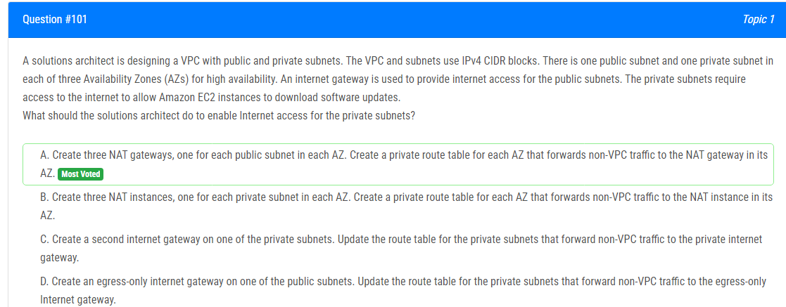
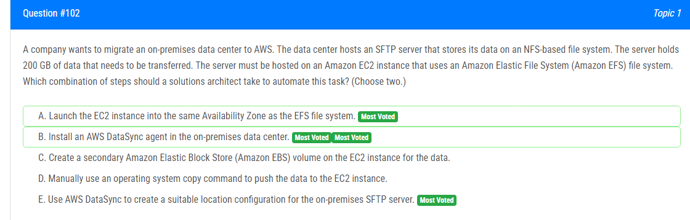
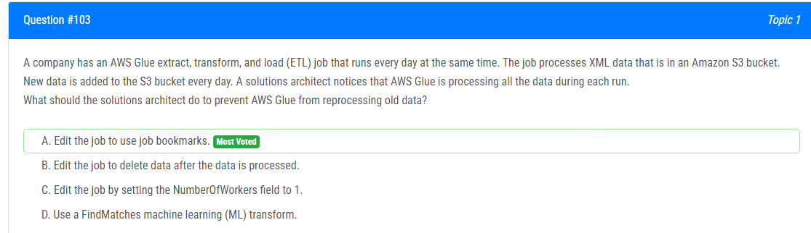
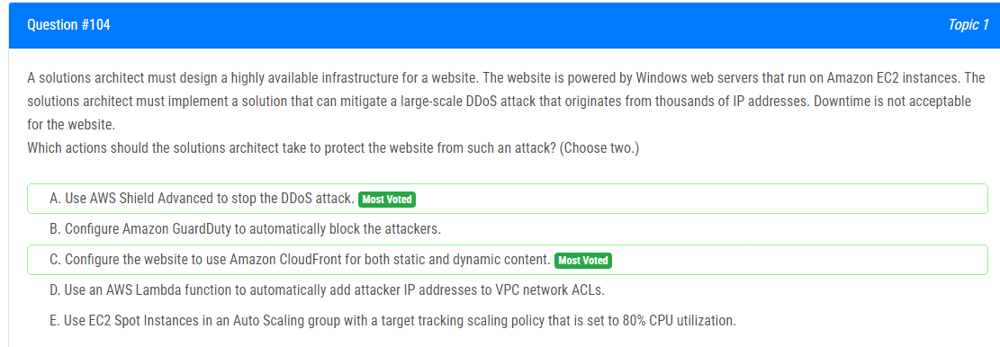
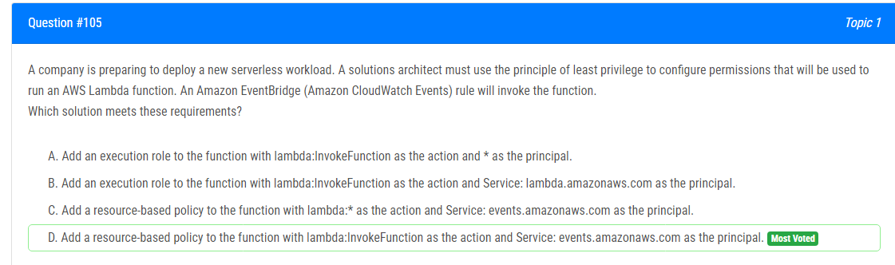
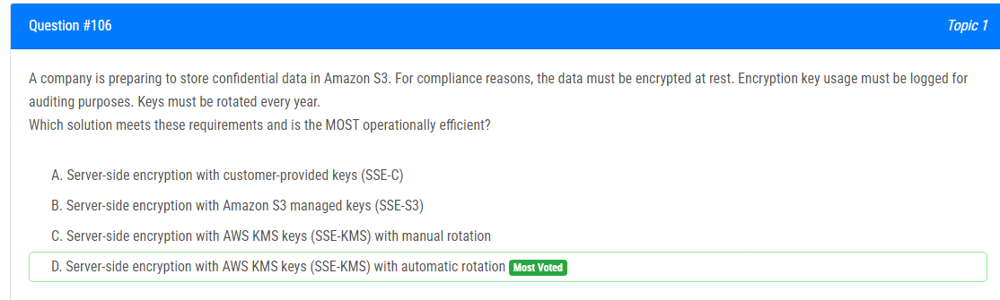
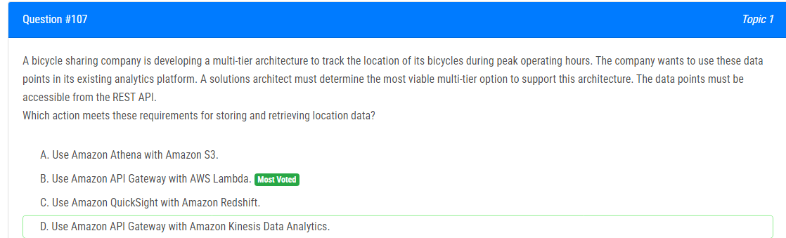
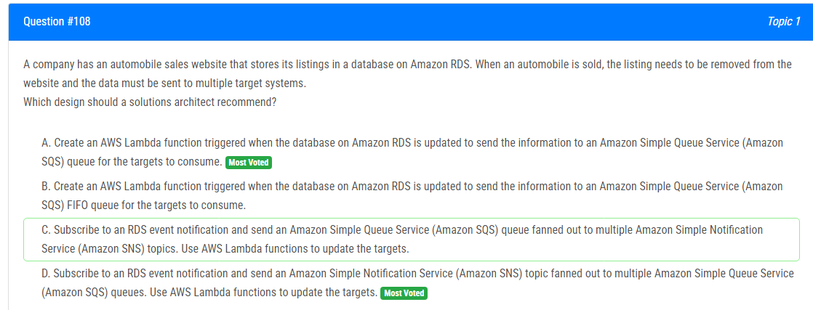
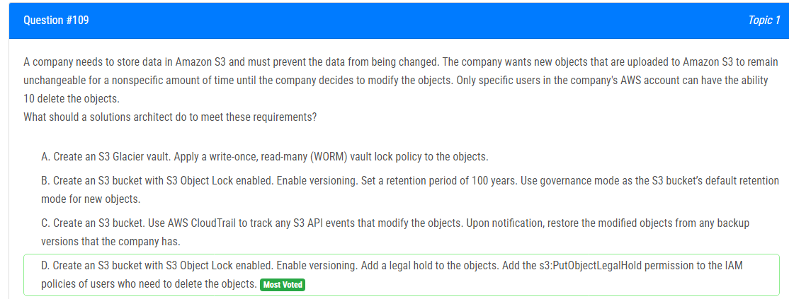
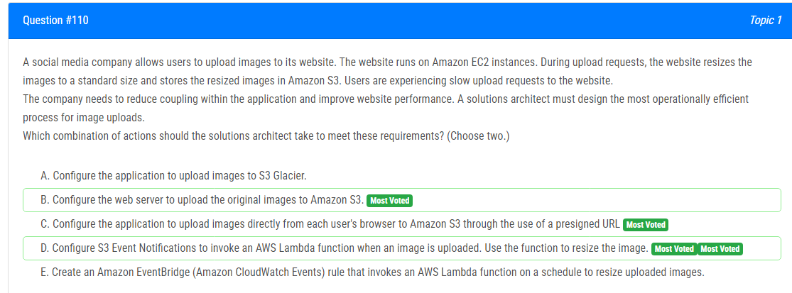

해설:

정답 A.

주어진 시나리오에서 올바른 답은 옵션 A입니다.

개인 서브넷에 대한 인터넷 액세스를 활성화하려면 솔루션 아키텍트는 각 가용 영역(Availability Zone, AZ)에 있는 각 공용 서브넷에 대해 하나의 NAT 게이트웨이를 생성해야 합니다. NAT 게이트웨이를 사용하면 개인 인스턴스가 인터넷으로의 아웃바운드 트래픽을 시작할 수 있지만 인터넷에서 개인 인스턴스로의 인바운드 트래픽은 허용하지 않습니다.

그런 다음 솔루션 아키텍트는 각 AZ에 대해 개인 라우트 테이블을 생성해야 합니다. 이 라우트 테이블은 VPC 외부 트래픽을 해당 AZ의 NAT 게이트웨이로 전달하여 개인 서브넷의 인스턴스가 공용 서브넷에있는 NAT 게이트웨이를 통해 인터넷에 액세스할 수 있도록 합니다.

해설:

정답 B, E.

해당 작업을 자동화하려면 다음 단계를 따를 수 있습니다.

B. 온프레미스 데이터 센터에 AWS DataSync 에이전트 설치:

1. 먼저, AWS Management Console 또는 AWS CLI를 사용하여 AWS DataSync를 시작합니다.
2. AWS DataSync 콘솔에서 "Create agent"를 선택하거나 AWS CLI에서 `create-agent` 명령을 사용하여 새로운 DataSync 에이전트를 생성합니다.
3. 생성된 에이전트를 온프레미스 데이터 센터에 다운로드하고 설치합니다.

E. AWS DataSync를 사용하여 온프레미스 SFTP 서버에 적합한 위치 구성 생성:

1. AWS Management Console에서 AWS DataSync로 이동하여 "Create location"을 선택하거나 AWS CLI에서 `create-location-s3` 또는 `create-location-efs` 명령을 사용하여 적절한 위치 구성을 생성합니다.
2. 적절한 소스 및 대상 위치를 선택하고, 에이전트를 사용하여 온프레미스 SFTP 서버와 EC2 인스턴스의 EFS 파일 시스템 간에 데이터 전송을 구성합니다.
3. 생성된 위치 구성에서 작업을 만들어 스케줄링하거나 즉시 실행하여 데이터 전송을 시작합니다.

이렇게 하면 AWS DataSync를 활용하여 온프레미스 SFTP 서버의 데이터를 EC2 인스턴스의 EFS 파일 시스템으로 효율적으로 이전할 수 있습니다.

해설:

정답 A.

A : Glue의 작업 북마크는 작업에서 마지막으로 처리된 데이터를 추적하는 데 사용됩니다. 작업 북마크를 활성화하면 Glue는 처리된 데이터를 추적하고 이전 작업 실행에서 중단된 위치에서 자동으로 처리를 재개합니다.

B : 이는 S3에서 데이터를 영구적으로 제거하므로 미래의 작업 실행에서 사용할 수 없게 됩니다. 데이터를 유지하거나 이후 분석에 사용해야 하는 경우에는 원치 않는 결과입니다.

C : 이는 작업의 병렬성에만 영향을 미칠 뿐, 오래된 데이터의 재처리 문제를 해결하지 않습니다. 처리된 데이터를 추적하거나 이미 처리된 데이터를 건너뛰는 메커니즘을 제공하지 않습니다.

D : 이는 Glue가 오래된 데이터를 재처리하는 것을 직접적으로 방지하는 데 관련이 없습니다. FindMatches 변환은 데이터 세트에서 중복 또는 일치하는 레코드를 식별하고 매칭시키는 데 사용됩니다. 데이터 처리 파이프라인에서 사용될 수 있지만, 이 시나리오에서 오래된 데이터를 재처리하지 않는 구체적인 요구 사항을 다루지 않습니다.

해설:

정답 A, C.

A. AWS Shield Advanced를 사용하여 DDoS 공격을 차단하세요.

AWS Shield Advanced는 Amazon EC2 인스턴스, Elastic Load Balancers 및 Amazon Route 53 리소스에 대한 항상 켜진 보호를 제공합니다. AWS Shield Advanced를 사용함으로써 솔루션 아키텍트는 대규모 DDoS 공격으로부터 웹 사이트를 보호할 수 있습니다.

C. 웹 사이트를 정적 및 동적 콘텐츠 모두에 대해 Amazon CloudFront를 사용하도록 구성하세요.

CloudFront는 콘텐츠 전송 네트워크 (CDN)로, Amazon S3 및 Amazon EC2와 같은 다른 Amazon Web Services 제품과 통합하여 낮은 대기 시간 및 높은 데이터 전송 속도로 사용자에게 콘텐츠를 전송합니다. CloudFront를 사용하면 솔루션 아키텍트는 웹 사이트의 콘텐츠를 여러 엣지 위치에 분산시켜 DDoS 공격의 영향을 흡수하고 웹 사이트의 다운타임 위험을 줄일 수 있습니다.

해설:

정답 D.

D. 함수에 lambda:InvokeFunction 동작 및 principal로 Service: events.amazonaws.com을 사용한 리소스 기반 정책을 추가하세요.

최소 권한의 원칙은 작업을 수행하는 데 필요한 최소한의 권한만 부여되어야 한다는 원칙입니다. 이 경우 람다 함수는 Amazon EventBridge (Amazon CloudWatch Events)에 의해 호출될 수 있어야 합니다. 이러한 요구 사항을 충족시키기 위해 함수에 리소스 기반 정책을 추가할 수 있습니다. 이 정책은 InvokeFunction 동작이 Service: events.amazonaws.com principal에 의해 수행될 수 있도록 허용합니다. 이것은 Amazon EventBridge가 함수를 호출할 수 있게 하지만 함수에 추가 권한을 부여하지 않습니다.

해설:

정답 D.

SSE-KMS는 S3에서 데이터를 안전하고 효율적으로 안정화하는 방법을 제공합니다. SSE-KMS는 KMS를 사용하여 암호화 키를 안전하게 관리합니다. SSE-KMS를 사용하면 KMS 키 회전 기능을 사용하여 암호화 키를 자동으로 회전시킬 수 있으며, 이는 키 관리 프로세스를 간소화하고 매년 키를 회전시키는 요구 사항을 준수할 수 있도록 합니다.

또한 SSE-KMS는 CloudTrail을 통해 암호화 키 사용에 대한 내장형 감사 로깅을 제공합니다. 이는 KMS 키의 관리 및 사용과 관련된 API 호출을 캡처하며 감사 목적으로 키 사용을 기록하는 요구 사항을 충족시킵니다.

A (SSE-C): 고객이 직접 암호화 키를 제공해야 하지만 키 회전이나 키 사용의 내장형 로깅을 제공하지 않습니다.
B (SSE-S3): Amazon S3 관리 키를 사용하여 암호화하지만 키 회전이나 자세한 키 사용 로깅을 제공하지 않습니다.
C (수동 키 회전을 사용한 SSE-KMS): AWS KMS 키를 사용하지만 수동 키 회전이 필요하며, 이는 옵션 D에서 제공하는 자동 키 회전보다 운영 효율성이 떨어집니다.

따라서 SSE-KMS (옵션 D)가 자동 키 회전 및 내장형 로깅을 통해 요구 사항을 가장 잘 충족시키는 선택지입니다.

해설:

정답 B.

B. Amazon API Gateway 및 AWS Lambda 사용

이 옵션은 회사가 필요한 엔드포인트를 노출하기 위해 RESTful API를 생성, 배포 및 관리할 수 있도록 합니다. AWS Lambda를 사용하여 들어오는 요청을 처리하고 CRUD 작업을 수행할 수 있습니다. 처리된 데이터는 그 후에 Amazon DynamoDB와 같은 데이터베이스에 저장될 수 있습니다. 이 아키텍처는 서버리스, 확장 가능하며 비용 효율적일 것입니다. 또한, 최적 운영 시간 동안 자전거를 실시간으로 추적할 수 있습니다. 다른 옵션들은 이 특정 사용 사례에 대해 동일한 수준의 실시간 처리와 유연성을 제공하지 않습니다.

해설:

정답 A.

RDS 이벤트는 DB 인스턴스 이벤트, DB 매개 변수 그룹 이벤트, DB 보안 그룹 이벤트 및 DB 스냅샷 이벤트와 같은 운영 이벤트만을 제공합니다. 그러나 이 시나리오에서 필요한 것은 데이터 수정 이벤트(INSERT, DELETE, UPDATE)를 캡처하는 것이며, 이는 네이티브 기능이나 저장 프로시저를 통해 달성할 수 있습니다.

RDS 이벤트 자체는 주로 데이터베이스 운영과 관련된 사항을 다룹니다. 데이터 변경 이벤트를 캡처하기 위해서는 트리거, 저장 프로시저 또는 변경 데이터 캡처(CDC)와 같은 데이터베이스 내부의 기능을 활용해야 합니다. RDS에서는 네이티브로 트리거나 저장 프로시저를 설정하는 것이 가능하며, 특정 데이터 변경 사항을 로그에 기록하거나 필요에 따라 외부 시스템으로 전송할 수 있습니다.

이러한 작업을 수행하기 위해서는 데이터베이스 엔진 및 사용하는 데이터베이스에 따라 구체적인 구현 방법이 달라질 수 있습니다. 따라서 데이터 변경 이벤트를 캡처하기 위해 데이터베이스의 내부 기능을 활용하는 방법을 검토하고 필요한 경우 트리거 또는 저장 프로시저를 구현해야 합니다.

해설:

정답 D.

객체 잠금(Object Lock)을 사용하면 객체 버전에 법적 홀드를 설정할 수 있습니다. 유지 기간과 마찬가지로 법적 홀드는 객체 버전이 덮어쓰기되거나 삭제되지 않도록 방지합니다. 그러나 법적 홀드에는 연관된 유지 기간이 없으며 제거될 때까지 계속 유효합니다.

해설:

정답 C, D.

C : 각 사용자 브라우저에서 Amazon S3로 직접 이미지를 업로드하도록 애플리케이션을 구성하세요. 이를 위해 미리 서명된 URL을 사용합니다. 이렇게 하면 애플리케이션이 웹 서버를 통하지 않고 직접 이미지를 S3로 업로드할 수 있으며, 이는 웹 서버의 부하를 줄이고 성능을 향상시킬 수 있습니다.

D : S3 이벤트 알림을 구성하여 이미지가 업로드될 때 AWS Lambda 함수를 호출하도록 설정하세요. 함수를 사용하여 이미지 크기를 조정하세요. 이렇게 하면 애플리케이션이 이미지 크기 조정을 동기적으로 업로드 요청 중에 수행하는 대신 비동기적으로 수행할 수 있으며, 이는 성능을 향상시킬 수 있습니다.

이러한 조치를 취함으로써 애플리케이션 내의 결합도를 낮추고 웹 사이트 성능을 향상시킬 수 있습니다. 직접 업로드 및 비동기적 이미지 크기 조정은 웹 서버의 부하를 감소시키고 효율적인 이미지 처리를 가능케 합니다.

