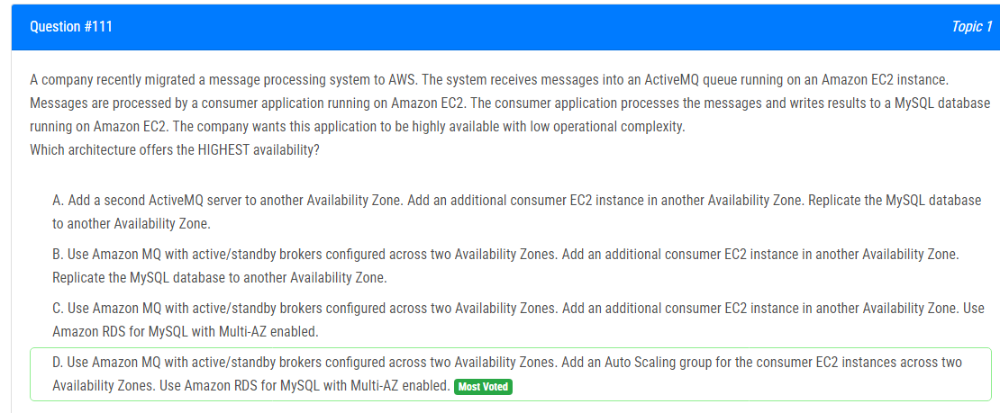
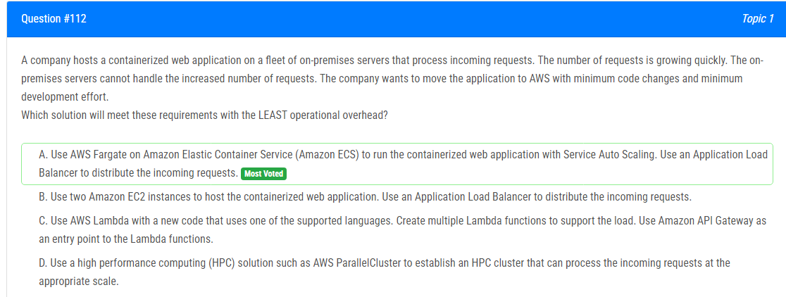
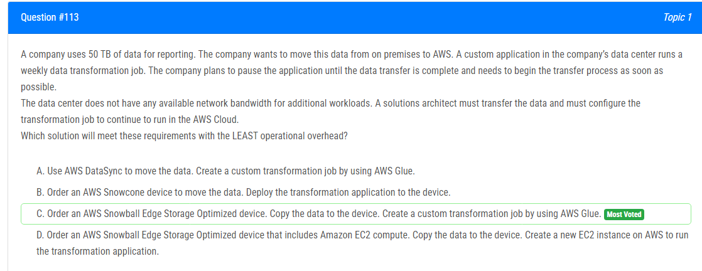
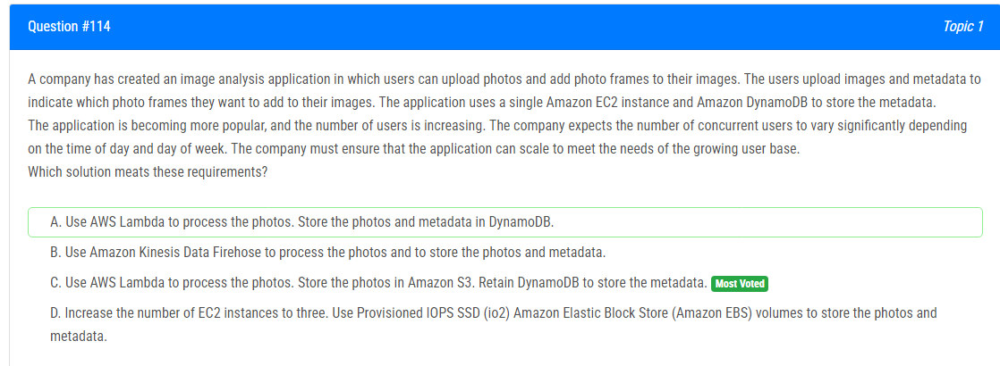
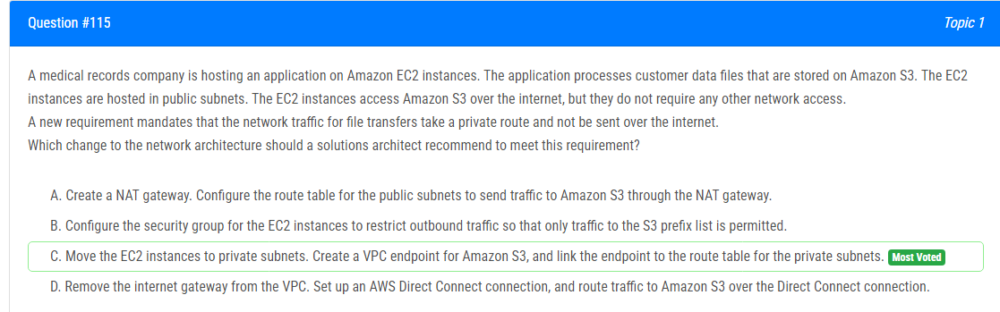
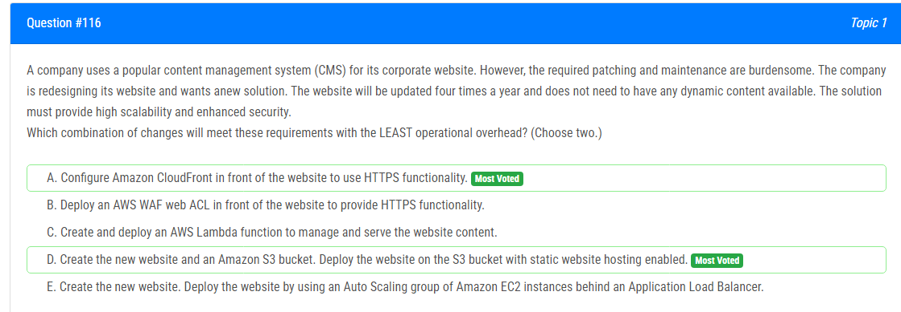
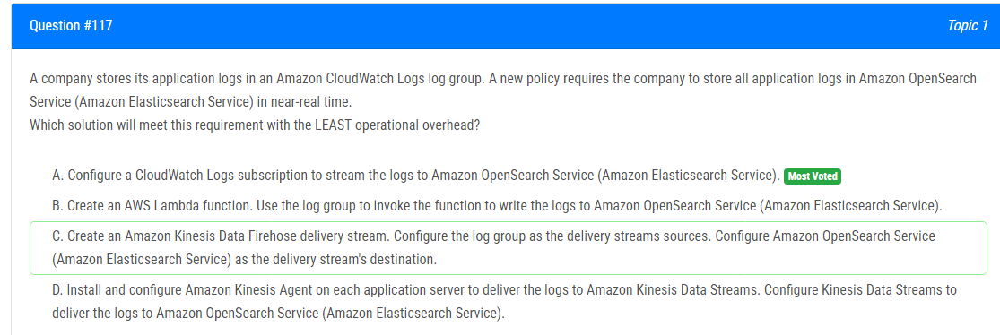
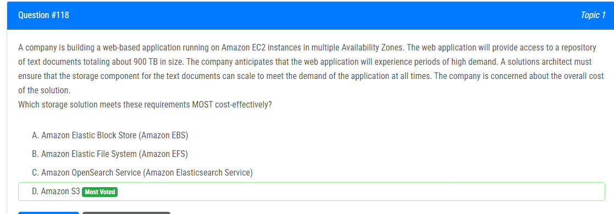
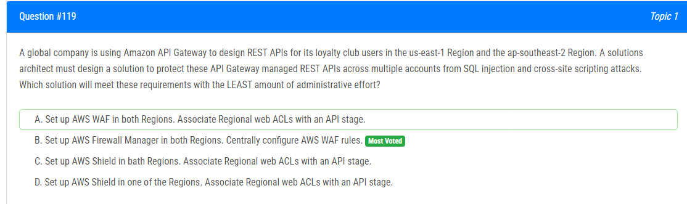
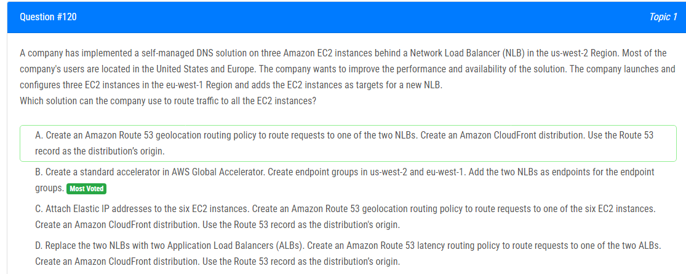

해설:

정답 D.

주요 이유는 다음과 같습니다:

1. Amazon MQ의 active/standby 브로커는 여러 가용 영역(AZs)에 걸쳐 대기열 고가용성을 제공합니다.
2. 소비자 EC2 인스턴스를 포함하는 Auto Scaling 그룹은 여러 가용 영역에 걸쳐 중복 처리를 위해 구성되어 있습니다.
3. RDS MySQL은 Multi-AZ를 활용하여 데이터베이스 고가용성을 제공합니다.

이는 MQ, EC2 및 RDS의 HA(고가용성) 기능을 결합하여 모든 구성 요소 간에 장애 허용성을 극대화합니다. 또한, Auto Scaling은 필요에 따라 처리 용량을 확장하는 유연성을 제공합니다.

해설:

정답 A.

A는 최소한의 운영 오버헤드로 요구 사항을 충족하기 위한 최상의 솔루션입니다. 주요 이유는 다음과 같습니다:

1. **AWS Fargate는 서버를 프로비저닝하고 관리할 필요성을 제거합니다.** Fargate는 수요에 따라 응용 프로그램을 자동으로 확장합니다. 이는 상당한 운영 부담을 제거합니다.

2. **Fargate와 함께 ECS를 사용하면 컨테이너화된 응용 프로그램을 쉽게 실행하고 확장할 수 있는 관리형 오케스트레이션 레이어를 제공합니다.** 이는 응용 프로그램을 관리하기 위한 편리한 환경을 제공합니다.

3. **Application Load Balancer는 추가적인 노력없이 트래픽을 분산합니다.** 이는 트래픽 관리를 단순화하고 성능을 향상시킵니다.

4. **Fargate로 응용 프로그램을 이동하기 위해서는 코드 변경이 필요하지 않습니다.** 컨테이너는 그대로 실행될 수 있습니다.

이러한 이유로 A가 가장 효과적인 솔루션으로 꼽힙니다.

해설:

정답 C.

C. AWS Snowball Edge Storage Optimized 장치를 주문하고 데이터를 장치로 복사한 다음 AWS Glue를 사용하여 사용자 정의 변환 작업을 만듭니다. - SnowBall은 80TB까지 저장할 수 있으며 (좋음), 장치를 이동하는 데 약 1주일이 걸립니다 (A보다 빠름). AWS Glue를 사용하면 ETL 작업을 수행할 수 있습니다. 이것이 정답입니다.

선택 C가 가장 적절합니다. Snowball Edge는 대량의 데이터를 안전하게 전송하는 데 사용되며, Storage Optimized 구성은 80TB까지 저장할 수 있습니다. 이는 필요한 용량을 충족시키는 데 충분합니다. 또한, AWS Glue를 사용하여 사용자 정의 변환 작업을 수행할 수 있어 데이터 처리에 효과적입니다. Snowball Edge의 물리적인 이동은 다소 시간이 걸리지만, 옵션 A보다는 효율적인 선택입니다. 옵션 C는 필요한 기능을 제공하면서도 데이터 이동 및 변환에 대한 효율적인 솔루션을 제공합니다.

해설:

정답 C.

C. 솔루션은 사진 처리를 Lambda로 오프로드합니다. 사진을 S3에 저장하는 것은 확장 가능성과 내구성을 보장하며, DynamoDB에 메타데이터를 유지하는 것은 관련 정보를 효과적으로 쿼리할 수 있도록 합니다.

A : DynamoDB가 이미지와 같은 큰 바이너리 데이터를 저장하는 데 적합하지 않기 때문에 사진을 저장하기 위한 적절한 솔루션을 제공하지 않습니다.

B : 실시간 스트리밍 데이터 처리에 중점을 둔 것이며, 이 경우 사진 및 메타데이터 처리에 이상적인 서비스가 아닙니다.

D : EC2 인스턴스의 수동 스케일링 및 관리를 포함하며, Lambda의 서버리스 특성과 비교하여 유연성이 떨어지며 노동 집약적입니다. 동시 사용자 수의 변동을 효율적으로 처리하지 못하고 높은 운영 오버헤드를 도입할 수 있습니다.

결론적으로, 옵션 C는 Lambda, S3 및 DynamoDB의 확장 가능성과 내구성을 활용하여 성장하는 사용자 베이스의 요구를 충족시키기 위한 최적의 솔루션을 제공합니다.

해설:

정답 C.

C 옵션은 EC2 인스턴스를 개인 서브넷으로 이동하고 S3에 대한 VPC 엔드포인트를 생성하며, 엔드포인트를 개인 서브넷의 라우트 테이블에 연결함으로써 직관적인 해결책을 제공합니다. 이렇게 하면 EC2 인스턴스와 S3 간의 파일 전송 트래픽이 인터넷을 통과하지 않고 개인 네트워크 내에서 이루어집니다.

A : NAT 게이트웨이를 생성하는 것이며, 이는 개인 서브넷에서의 아웃바운드 인터넷 연결에 사용됩니다. 그러나 이는 여전히 S3로의 트래픽을 인터넷을 통해 전송하므로 요구 사항을 충족하지 않습니다.

B : 보안 그룹을 구성하는 것으로 아웃바운드 트래픽을 제어하기 위한 것입니다. 아웃바운드 트래픽을 제한할 수 있지만, S3에 대한 개인 경로를 제공하지는 않습니다.

D : Direct Connect를 설정하는 것으로 온프레미스 환경과 AWS 간에 전용 개인 네트워크 연결을 확립하는 것입니다. 이는 하이브리드 시나리오에 더 적합하며 VPC 내에서 S3에 대한 개인 액세스를 달성하는 데 필요하지 않습니다.

요약하면, C 옵션은 EC2 인스턴스를 개인 서브넷으로 이동하고 S3에 대한 VPC 엔드포인트를 설정하여 효과적인 솔루션을 제공합니다.

해설:

정답 A, D.

A 옵션은 CloudFront를 구성하여 클라이언트에서 HTTPS를 필요로 하는 것입니다. 이는 향상된 보안을 제공하며 CloudFront를 통해 웹 사이트를 안전하게 제공할 수 있습니다. 클라이언트와 CloudFront 간의 통신은 안전한 HTTPS 연결을 통해 이루어집니다.

D 옵션은 정적 웹 사이트를 S3에 저장하고 있으며, 이는 확장 가능성과 운영 오버헤드를 줄이는 좋은 방법입니다. Application Load Balancer 및 EC2 인스턴스를 구성하는 대신에, 정적 콘텐츠를 S3에서 직접 제공함으로써 간소화된 아키텍처를 제공할 수 있습니다. 이로써 확장 가능성이 향상되고 운영의 복잡성이 감소합니다.

따라서 A와 D 옵션은 각각 향상된 보안 및 간소화된 아키텍처의 이점을 제공하여 선택 사항으로 적절합니다.

해설:

정답 A.

A : Amazon OpenSearch Service (Amazon Elasticsearch Service)로 로그를 스트리밍하기 위해 CloudWatch Logs 구독을 구성합니다.

이 옵션은 추가적인 서비스나 리소스가 필요하지 않고 CloudWatch에서 OpenSearch Service (Elasticsearch Service)로 로그를 거의 실시간으로 스트리밍할 수 있도록 허용하여 운영 오버헤드를 최소화합니다. 다른 옵션은 추가 서비스 (Lambda, Kinesis Data Firehose, Kinesis Data Streams)를 포함하고 있어 더 많은 운영 관리가 필요할 것입니다.

해설:

정답 D.

Amazon S3 (Simple Storage Service)는 높은 확장성과 비용 효율적인 저장 서비스로, 시나리오에서 언급된 900 TB의 텍스트 문서와 같은 대량의 데이터를 저장하기에 적합합니다. S3는 높은 내구성, 가용성 및 성능을 제공합니다.

A : (Amazon EBS)은 개별 EC2 인스턴스를 위해 설계된 블록 스토리지이며, 대량의 데이터에 대해 S3만큼 원활하게 확장되고 비용 효율적이지 않을 수 있습니다.

B : (Amazon EFS)는 확장 가능한 파일 스토리지 서비스이지만, 특히 예상되는 900 TB의 저장 크기에 대비해 S3에 비해 가장 비용 효율적인 옵션이 아닐 수 있습니다.

C : (Amazon OpenSearch Service)은 검색 및 분석 서비스로, 텍스트 문서의 주요 저장 솔루션으로는 적합하지 않을 수 있습니다.

요약하면, Amazon S3는 대량의 텍스트 문서를 웹 애플리케이션이 필요로 하는 높은 확장성, 비용 효율성 및 내구성을 제공하므로 권장되는 선택지입니다.

해설:

정답 B.

B 옵션이 올바른 답입니다.

AWS Firewall Manager를 사용하여 AWS WAF 규칙을 중앙에서 구성하는 것은 다른 옵션에 비해 최소한의 관리 노력이 필요합니다.

Firewall Manager는 여러 계정 및 리전에서 AWS WAF 규칙을 중앙에서 관리할 수 있게 해줍니다. Firewall Manager에서 한 번 규칙을 정의하면 해당 규칙이 필요한 모든 리전 및 계정의 API에 자동으로 적용될 수 있습니다.

해설:

정답 B.

B : Global Accelerator를 활용하여 글로벌 솔루션을 제공합니다. 표준 엑셀러레이터를 생성하고 두 리전에서 엔드포인트 그룹을 구성함으로써, 회사는 모든 리전의 여러 EC2로 트래픽을 라우팅할 수 있습니다. 두 NLB를 엔드포인트로 추가함으로써 트래픽이 효과적으로 분산됩니다.

A : 트래픽을 모든 EC2 인스턴스로 라우팅하는 요구 사항을 직접 다루지 않습니다. 지리적 위치 기반 라우팅 및 CloudFront를 사용하여 분산하는 데 중점을 두며, 원하는 결과를 얻지 못할 수 있습니다.

C : Elastic IP 주소를 관리하고 지리적 위치를 기반으로 라우팅하는 것을 포함합니다. 그러나 AWS Global Accelerator보다 성능 및 가용성 수준을 제공하지 못할 수 있습니다.

D : ALB와 지연 기반 라우팅에 중점을 둡니다. 유효한 솔루션일 수 있지만 AWS Global Accelerator를 활용하지 않으며, B 옵션과 비교하여 더 많은 구성 및 관리가 필요할 수 있습니다.