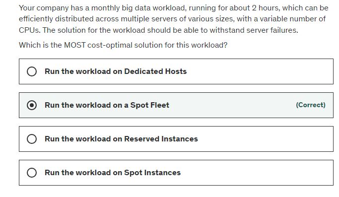

해설:

정답 B.

작업을 Spot Fleet에서 실행합니다.

Spot Fleet는 필요에 맞는 Spot Instance 풀을 선택하고, Fleet의 대상 용량을 충족시키기 위해 Spot Instances를 시작합니다. 기본적으로 Spot Fleet는 Spot Instances가 종료된 후 대체 인스턴스를 시작하여 대상 용량을 유지하도록 설정되어 있습니다.

Spot Instance는 온디맨드 가격보다 저렴한 가격으로 사용 가능한 사용되지 않는 EC2 인스턴스입니다. Spot Instances는 높은 비용 효율성을 제공하지만 미리 인스턴스 유형을 선택해야 합니다. 이 경우에는 가장 비용 효율적인 옵션을 사용하고 최저가 전략으로 최적화된 Spot Fleet 요청을 통해 가장 저렴한 Spot Instance의 선택을 맡기고 싶습니다. 따라서 이것이 올바른 옵션입니다.

주요 Spot Instance 개념:

1. **Spot Fleet (스팟 플릿):** Spot Fleet는 대상 용량을 충족시키기 위해 Spot Instances를 관리하는 Amazon EC2 서비스입니다.

2. **Spot Instance (스팟 인스턴스):** 사용되지 않은 EC2 인스턴스로서, 온디맨드 가격보다 저렴한 가격으로 제공됩니다.

3. **Spot Instance Pool (스팟 인스턴스 풀):** Spot Fleet가 선택한 Spot Instances의 집합으로, 특정 인스턴스 유형 또는 가용 영역에 대한 요청에 따라 변할 수 있습니다.

4. **Lowest Price Strategy (최저가 전략):** Spot Fleet 요청에서 사용할 수 있는 전략 중 하나로, 가장 저렴한 Spot Instances를 선택하는 전략입니다. 이를 통해 비용을 최적화할 수 있습니다.

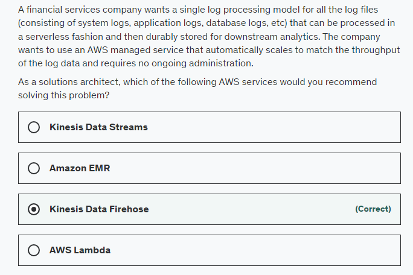

해설:

정답 C.

Amazon Kinesis Data Firehose는 스트리밍 데이터를 신뢰성 있게 데이터 레이크, 데이터 저장소 및 분석 도구로 로드하는 가장 간편한 방법 중 하나입니다. 이 서비스는 스트리밍 데이터를 캡처, 변환 및 Amazon S3, Amazon Redshift, Amazon Elasticsearch Service, 그리고 Splunk으로 로드할 수 있습니다. 이를 통해 기존에 사용 중인 비즈니스 인텔리전스 도구와 대시보드를 활용하여 거의 실시간 분석이 가능합니다. 또한, 데이터의 처리량에 자동으로 대응하며 지속적인 관리가 필요하지 않는 완전히 관리되는 서비스입니다. 따라서 이것이 올바른 옵션입니다.

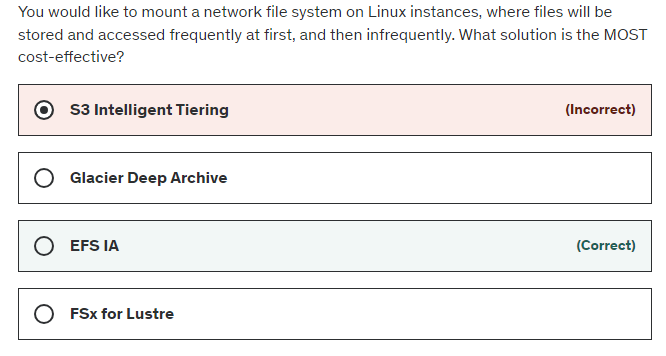

해설:

정답 C.

Amazon Elastic File System (Amazon EFS)은 AWS 클라우드 서비스 및 온프레미스 리소스와 함께 사용할 수 있는 간단하고 확장 가능하며 완전히 관리되는 NFS 파일 시스템을 제공합니다. Amazon EFS는 여러 가용 영역(AZs) 내 및 간에 데이터를 저장하여 고가용성과 내구성을 확보하는 리전별 서비스입니다.

Amazon EFS Infrequent Access (EFS IA)는 파일이 매일 액세스되지 않는 경우에 대해 가격/성능이 최적화된 스토리지 클래스를 제공합니다. Amazon EFS 표준에 비해 스토리지 가격이 최대 92% 낮습니다. 따라서 이것이 올바른 옵션입니다.

- **Amazon EFS Infrequent Access (EFS IA):** 매일 액세스되지 않는 파일을 위해 최적화된 스토리지 클래스로, 스토리지 비용이 Amazon EFS 표준에 비해 최대 92% 낮습니다.

- **고가용성 및 내구성:** Amazon EFS는 여러 가용 영역에 걸쳐 데이터를 저장하여 시스템의 고가용성과 내구성을 제공합니다.

- **간단하고 확장 가능한 파일 시스템:** Amazon EFS는 간편하고 확장 가능한 NFS 파일 시스템을 제공하여 다양한 AWS 서비스 및 온프레미스 환경에서 사용할 수 있습니다.

이 서비스와 스토리지 클래스를 사용하면 비용 효율적으로 파일 기반 데이터를 저장하고 액세스할 수 있습니다.


해설:

정답 A.

악성 IP 주소를 차단하기 위해 AWS WAF에서 IP 일치 조건을 생성합니다.

AWS WAF는 웹 응용 프로그램이나 API를 일반적인 웹 공격으로부터 보호하는 웹 애플리케이션 방화벽입니다. 이를 통해 가용성에 영향을 미칠 수 있는 일반적인 웹 공격으로부터 애플리케이션을 보호할 수 있습니다. AWS WAF는 공격 패턴을 차단하는 보안 규칙 및 특정 트래픽 패턴을 걸러내는 규칙을 생성하여 트래픽이 애플리케이션에 도달하는 방식을 제어할 수 있도록 해줍니다.

WAF 동작 방식: https://aws.amazon.com/waf/ 에서 확인 가능합니다.

특정 IP 주소를 기준으로 웹 요청을 허용하거나 차단하려면 하나 이상의 IP 일치 조건을 생성하세요. IP 일치 조건은 요청이 원래 어디에서 시작되었는지를 기반으로 최대 10,000개의 IP 주소 또는 IP 주소 범위를 나열합니다. 따라서 이 옵션이 올바른 선택입니다.

참고로, 이를 통해 특정 악성 IP 주소를 차단하여 웹 애플리케이션을 효과적으로 보호할 수 있습니다.

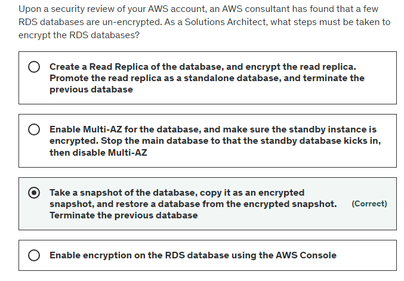

해설:

정답 C.

데이터베이스의 스냅샷을 찍고 해당 스냅샷을 암호화된 스냅샷으로 복사하며, 암호화된 스냅샷을 사용하여 데이터베이스를 복원하고 이전 데이터베이스를 종료합니다.

Amazon Relational Database Service (Amazon RDS)는 클라우드에서 관계형 데이터베이스를 쉽게 설정, 운영 및 확장할 수 있게 해주는 서비스입니다. 이 서비스는 비용 효율적이며 크기를 조절할 수 있으며, 하드웨어 프로비저닝, 데이터베이스 설정, 패치 및 백업과 같은 시간 소모적인 관리 작업을 자동화합니다.

Amazon RDS DB 인스턴스 및 스냅샷의 정지된 상태에서 데이터를 암호화하려면 Amazon RDS DB 인스턴스에 대한 암호화 옵션을 활성화하세요. 암호화된 데이터에는 DB 인스턴스의 기본 저장소, 자동 백업, 읽기 전용 복제본 및 스냅샷이 포함됩니다.

Amazon RDS DB 인스턴스를 생성할 때만 인스턴스를 암호화할 수 있습니다. 그러나 암호화되지 않은 DB 스냅샷의 복사본을 암호화할 수 있으므로 효과적으로 암호화를 추가할 수 있습니다. 즉, DB 인스턴스의 스냅샷을 찍은 다음 해당 스냅샷의 암호화된 복사본을 생성할 수 있습니다. 따라서 이것이 올바른 옵션입니다.

이를 통해 데이터베이스의 보안을 강화하고, 암호화된 스냅샷을 사용하여 새로운 데이터베이스를 생성한 후 이전 데이터베이스를 종료할 수 있습니다.


해설:

정답 D.

EC2 인스턴스 휴버네이트를 사용하면 AWS는 운영 체제에 휴버네이션(디스크에 일시 중지)을 수행하도록 신호를 보냅니다. 휴버네이션은 인스턴스 메모리(RAM)의 내용을 Amazon EBS 루트 볼륨에 저장합니다. 그런 다음 AWS는 인스턴스의 Amazon EBS 루트 볼륨과 연결된 모든 Amazon EBS 데이터 볼륨을 지속적으로 저장합니다.

인스턴스를 시작할 때:

1. Amazon EBS 루트 볼륨은 이전 상태로 복원됩니다.
2. RAM 내용이 다시로드됩니다.
3. 이전에 인스턴스에서 실행되던 프로세스가 재개됩니다.
4. 이전에 연결된 데이터 볼륨이 다시 연결되며, 인스턴스는 이전의 인스턴스 ID를 유지합니다.

EC2 휴버네이션 개요: https://docs.aws.amazon.com/AWSEC2/latest/UserGuide/Hibernate.html

EC2 휴버네이션을 사용함으로써 언제든지 애플리케이션이 이미 시작된 상태에서 인스턴스를 재개할 수 있습니다. 이로써 3분이 걸리는 시작 시간을 단축할 수 있습니다.

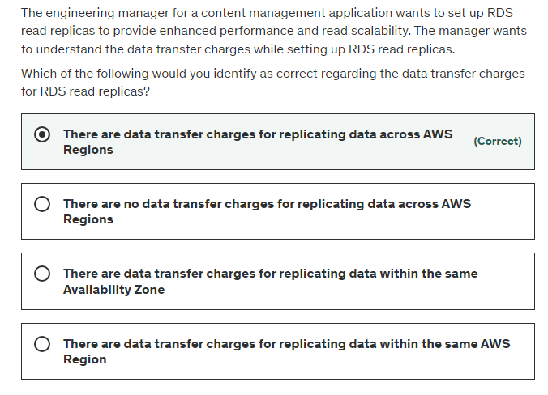

해설:

정답 A.

AWS 리전 간 데이터 복제에 대한 데이터 전송 요금이 부과됩니다.

RDS 읽기 복제는 RDS 데이터베이스(DB) 인스턴스에 대한 향상된 성능과 내구성을 제공합니다. 읽기 중심의 데이터베이스 워크로드에 대한 단일 DB 인스턴스의 용량 제한을 넘어서 탄력적으로 확장할 수 있게 해줍니다.

읽기 복제는 표준 DB 인스턴스로 청구되며 동일한 AWS 리전 내에서 소스 DB 인스턴스와 읽기 복제 간의 데이터 복제에 소요된 데이터 전송에 대해서는 요금이 부과되지 않습니다.

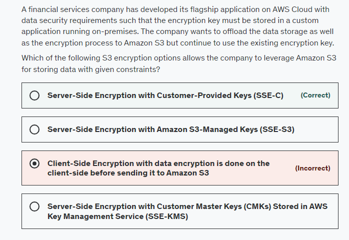

해설:

정답 A.

Amazon S3에서 데이터를 안전하게 보호하는 방법 중 하나로 "Server-Side Encryption with Customer-Provided Keys (SSE-C)" 옵션이 있습니다.

이 옵션을 사용하면 다음과 같은 작업을 수행할 수 있습니다:

1. **서버 측 암호화 (Server-Side Encryption):** Amazon S3에게 객체를 디스크에 저장하기 전에 암호화하도록 요청하고, 객체를 다운로드할 때 해독합니다.

2. **고객 제공 키를 사용한 서버 측 암호화 (SSE-C):** 기업은 자체 응용 프로그램을 통해 암호화 키를 관리하고, S3에게 암호화를 관리하도록 허용합니다.

이 경우, 회사는 자체 응용 프로그램을 통해 암호화 키를 관리하고 S3에게 암호화를 수행하도록 하려고 합니다. 따라서 "Server-Side Encryption with Customer-Provided Keys (SSE-C)"를 사용해야 합니다.

이 방식은 데이터의 안전한 저장 및 전송을 보장하면서도 암호화 키를 고객이 직접 관리할 수 있도록 합니다.

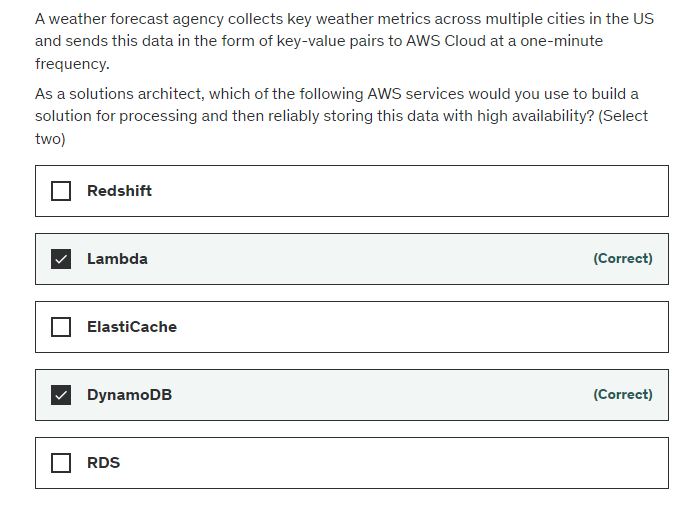

해설:

정답 B, D.

AWS Lambda와 DynamoDB를 조합하여 서버를 프로비저닝하거나 관리하지 않고 코드를 실행할 수 있습니다. 사용한 계산 시간만큼만 비용이 청구되며 코드가 실행되지 않을 때는 비용이 발생하지 않습니다. 이를 통해 어떠한 종류의 응용 프로그램이나 백엔드 서비스에 대해서도 관리 없이 코드를 실행할 수 있습니다.

Amazon DynamoDB는 단일 자릿수 밀리초 성능을 어떠한 규모에서도 제공하는 키-값 및 문서 데이터베이스입니다. 이는 완전히 관리되며 다중 지역, 다중 마스터, 내구성 있는 데이터베이스로서 내장된 보안, 백업 및 복원, 그리고 인터넷 규모 응용 프로그램을 위한 인-메모리 캐싱이 구현되어 있습니다. DynamoDB는 NoSQL 데이터베이스이며, 주로 키-값 쌍으로 데이터를 저장하는 데 적합합니다.

AWS Lambda를 DynamoDB와 결합하여 사용 사례에서 설명한 IoT 소스에서 키-값 데이터를 처리하고 캡처할 수 있습니다. 따라서 이 두 옵션은 모두 올바른 것입니다.

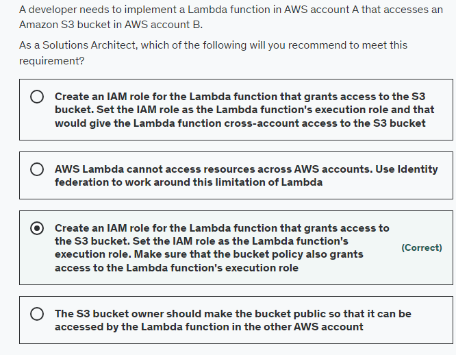

해설:

정답 C.

Lambda 함수에 대한 액세스 권한을 부여하기 위해 S3 버킷에 대한 IAM 역할을 생성합니다. 그리고 IAM 역할을 Lambda 함수의 실행 역할로 설정합니다. 또한, 버킷 정책도 Lambda 함수의 실행 역할에 대한 액세스 권한을 부여하도록 설정합니다.

만약 Lambda 함수에 대한 IAM 역할이 버킷과 동일한 AWS 계정에 있다면, IAM 역할과 버킷 정책에 모두 Amazon S3 권한을 부여할 필요가 없습니다. 대신 IAM 역할에 권한을 부여하고, 버킷 정책에서 명시적으로 Lambda 함수 역할에 액세스를 거부하지 않도록 확인할 수 있습니다. 그러나 IAM 역할과 버킷이 다른 계정에 속해 있다면, IAM 역할과 버킷 정책 모두에게 Amazon S3 권한을 부여해야 합니다. 따라서 이 방법은 주어진 사용 사례에서 AWS Lambda에 액세스 권한을 부여하는 올바른 방법입니다.

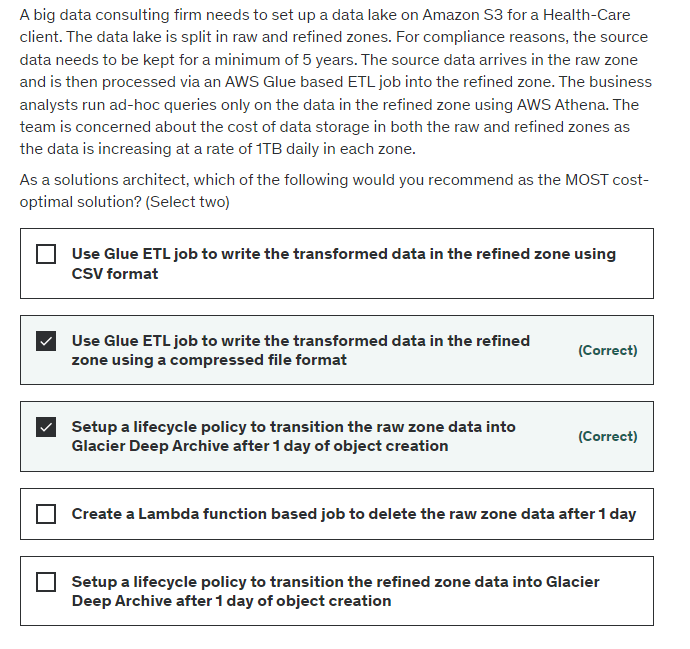

해설:

정답 B, C.

생성된 객체 1일 후에 원시 존 데이터를 Glacier Deep Archive로 전환하기 위해 S3 객체 수명주기 정책을 설정하세요.

Amazon S3 객체의 비용 효율적인 수명 주기를 관리하기 위해 Amazon S3 수명주기를 구성할 수 있습니다. S3 수명주기 구성은 일련의 규칙으로 구성된 것으로, Amazon S3가 객체 그룹에 적용하는 작업을 정의합니다. 예를 들어, 객체를 생성한 후 30일이 지나면 S3 Standard-IA 저장 클래스로 객체를 전환하거나, 객체를 생성한 후 1년이 지나면 S3 Glacier 저장 클래스로 객체를 아카이브할 수 있습니다.

주어진 사용 사례에서 원시 존은 원본 데이터로 구성되어 있으므로 규정상 삭제할 수 없습니다. 따라서 객체 생성 후 1일이 지난 후에 원시 존 데이터를 Glacier Deep Archive로 전환하기 위해 수명주기 정책을 사용해야 합니다.

S3 객체 수명 주기 관리에 대한 자세한 내용은 [여기](https://docs.aws.amazon.com/AmazonS3/latest/dev/object-lifecycle-mgmt.html)에서 확인할 수 있습니다.

또한, Glue ETL 작업을 사용하여 변환된 데이터를 정제된 존에 압축 파일 형식으로 쓸 수 있습니다.

AWS Glue는 완전히 관리되는 추출, 변환 및 로드 (ETL) 서비스로, 고객이 분석을 위해 데이터를 준비하고 로드하기 쉽도록 도와줍니다. 정제된 존 데이터는 비즈니스 분석가가 즉석 쿼리에 사용하므로 정제된 존 데이터를 Glacier Deep Archive로 전환할 수 없습니다. 따라서 최적화 방법은 Glue 작업을 통해 정제된 존 데이터를 압축된 형식으로 저장하는 것입니다. 압축된 데이터는 정제된 존 데이터에 발생하는 저장 비용을 줄일 수 있습니다.

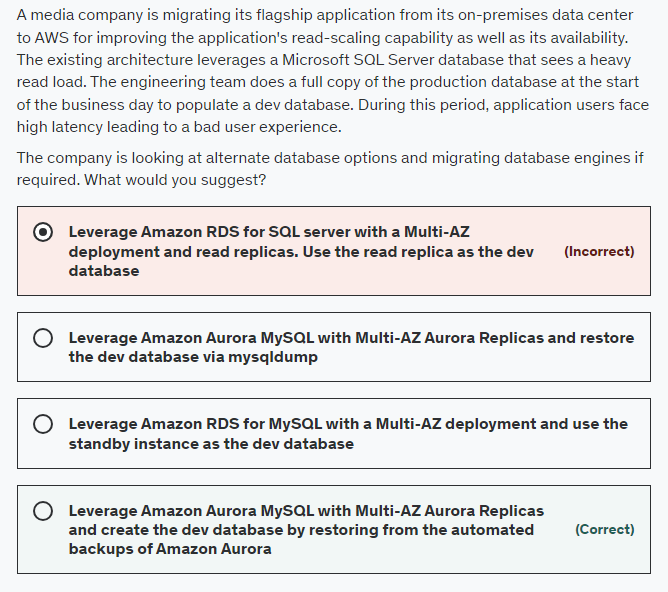

해설:

정답 D.

Amazon Aurora MySQL과 Multi-AZ Aurora Replicas를 활용하여 dev 데이터베이스를 생성하고 Amazon Aurora의 자동 백업에서 복원합니다.

Amazon Aurora (Aurora)는 MySQL 및 PostgreSQL과 호환되는 완전히 관리되는 관계형 데이터베이스 엔진입니다. Amazon Aurora DB 클러스터는 하나 이상의 DB 인스턴스와 해당 DB 인스턴스의 데이터를 관리하는 클러스터 볼륨으로 구성됩니다. Aurora 클러스터 볼륨은 여러 가용 영역에 걸쳐 있는 가상 데이터베이스 저장 볼륨으로, 각 가용 영역에는 DB 클러스터 데이터의 복사본이 있습니다. Aurora는 응용 프로그램의 읽기 확장 및 가용성을 향상시키는 Multi-AZ Aurora Replicas를 지원합니다.

Aurora는 클러스터 볼륨을 자동으로 백업하고 이러한 백업 데이터를 백업 보존 기간 동안 보관합니다. Aurora 백업은 지속적이고 점진적이므로 백업 보존 기간 내에서 언제든지 특정 지점으로 빠르게 복원할 수 있습니다. 백업 데이터가 기록되는 동안 성능 영향이나 데이터베이스 서비스의 중단이 발생하지 않습니다.

Aurora의 자동 백업은 기본적으로 매일 주어진 선호하는 백업 창에서 발생합니다. 백업이 지정된 백업 창에 할당된 시간보다 더 많은 시간이 필요한 경우, 백업은 창이 끝난 후에 계속 진행되어 완료됩니다. 백업 창은 DB 클러스터의 주간 유지 보수 창과 겹칠 수 없습니다. Aurora 백업은 지속적이고 점진적이지만 백업 창은 백업 보존 기간 내에서 일일 시스템 백업을 만드는 데 사용됩니다. DB 클러스터의 최신 복원 가능 시간은 일반적으로 현재 시간으로부터 약 5분 이내입니다.

주어진 사용 사례에 대해 Amazon Aurora의 자동 백업에서 복원하여 dev 데이터베이스를 생성할 수 있습니다.

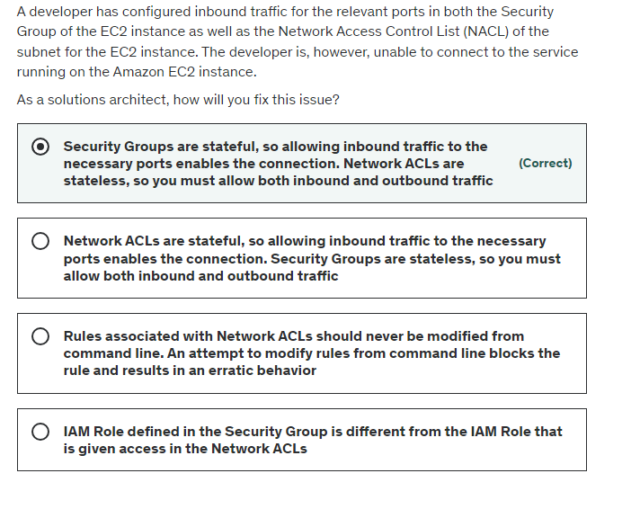

해설:

정답 A.

서버에서 실행 중인 서비스에 대한 연결을 가능하게 하려면 해당 네트워크 ACL은 서비스가 수신 대기 중인 포트에 대한 수신 트래픽뿐만 아니라 일회성 포트에서의 송신 트래픽도 허용해야 합니다. 클라이언트가 서버에 연결할 때는 임의의 포트가 일회성 포트 범위(1024-65535)에서 클라이언트의 소스 포트로 지정됩니다.

그런 다음 지정된 일회성 포트가 서비스로부터의 반환 트래픽의 대상 포트가 되므로 일회성 포트에서의 송신 트래픽도 네트워크 ACL에서 허용되어야 합니다.

기본적으로 네트워크 ACL은 모든 수신 및 송신 트래픽을 허용합니다. 네트워크 ACL이 더 제한적인 경우, 일회성 포트 범위에서의 트래픽을 명시적으로 허용해야 합니다.

인터넷에서 트래픽을 수락하는 경우, 인터넷 게이트웨이를 통해 경로를 설정해야 합니다. VPN 또는 AWS Direct Connect를 통해 트래픽을 수락하는 경우, 가상 사설 게이트웨이를 통해 경로를 설정해야 합니다.

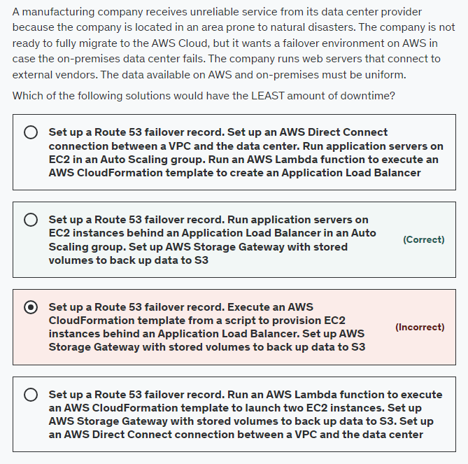

해설:

정답 B.

Route 53 페일오버 레코드를 설정합니다. EC2 인스턴스 뒤의 Auto Scaling 그룹에서 Application Load Balancer를 사용하여 애플리케이션 서버를 실행합니다. 또한 AWS Storage Gateway를 사용하여 저장된 볼륨을 설정하여 데이터를 S3로 백업합니다.

동일한 기능을 수행하는 여러 리소스가 있다면 DNS 페일오버를 구성하여 Route 53이 건강하지 않은 리소스에서 건강한 리소스로 트래픽을 라우팅하도록 할 수 있습니다.

Elastic Load Balancing은 실행 중인 모든 EC2 인스턴스에 대한 들어오는 애플리케이션 트래픽을 자동으로 분산하는 데 사용됩니다. Elastic Load Balancing을 사용하여 트래픽을 최적으로 라우팅하여 하나의 인스턴스가 과도하게 사용되지 않도록 들어오는 요청을 관리할 수 있습니다. 로드 밸런서는 Auto Scaling 그룹으로의 모든 들어오는 웹 트래픽에 대한 단일 연락처 역할을 합니다.

AWS Storage Gateway는 하이브리드 클라우드 저장 서비스로 온프레미스에서 거의 무제한의 클라우드 저장소에 액세스할 수 있게 해줍니다. Storage Gateway는 빈번하게 액세스되는 데이터를 온프레미스에서 캐싱하여 낮은 지연 시간의 성능을 제공하면서 데이터를 안전하게 Amazon 클라우드 저장소 서비스에 안전하고 내구성 있게 저장합니다. Storage Gateway는 변경된 데이터만 전송하고 데이터를 압축하여 AWS로의 데이터 전송을 최적화합니다. 또한 Storage Gateway는 Amazon S3 클라우드 저장소와 네이티브로 통합되어 데이터를 클라우드 처리용으로 사용할 수 있게 합니다.

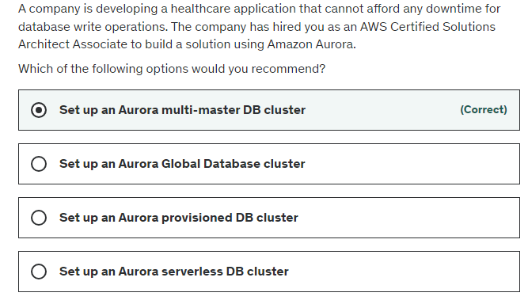

해설:

정답 A.

Aurora 다중 마스터 DB 클러스터를 설정합니다.

다중 마스터 클러스터에서는 모든 DB 인스턴스가 쓰기 작업을 수행할 수 있습니다. 쓰기 DB 인스턴스가 사용 불가능해지면 다른 쓰기 DB 인스턴스가 즉시 작동이 실패한 인스턴스의 역할을 대신합니다. AWS는 이러한 유형의 가용성을 연속 가용성(일시적인 장애 중단이없는 상태)이라고 참조하며, 단일 마스터 클러스터에서 제공되는 고 가용성(장애 조치(failover) 중에 잠시 다운타임이 발생)과 구별합니다. 데이터베이스 쓰기 작업을 위해 잠시라도 다운타임을 허용할 수 없는 응용 프로그램의 경우, 다중 마스터 클러스터는 작성자 인스턴스가 사용 불가능해질 때 중단을 피하는 데 도움이 될 수 있습니다. 다중 마스터 클러스터는 다른 DB 인스턴스를 승격하여 읽기/쓰기 기능을 갖게 할 필요가 없기 때문에 장애 조치 메커니즘을 사용하지 않습니다.

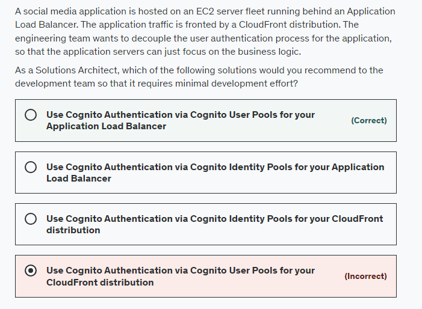

해설:

정답 A.

Cognito 사용자 풀을 통한 Cognito 인증을 사용하여 애플리케이션 로드 밸런서에 대한 사용자 인증을 수행할 수 있습니다.

Application Load Balancer를 사용하여 응용 프로그램에 대한 안전한 사용자 인증을 수행할 수 있습니다. 이를 통해 사용자의 인증 작업을 로드 밸런서에게 위임함으로써 응용 프로그램은 비즈니스 로직에 중점을 둘 수 있습니다. Cognito 사용자 풀을 사용하여 Amazon Cognito에서 지원하는 사용자 풀을 통해 Amazon, Facebook, 또는 Google과 같은 잘 알려진 소셜 IdP를 통해 사용자를 인증하거나, Amazon Cognito에서 지원하는 사용자 풀을 통해 SAML, LDAP 또는 Microsoft AD를 통해 기업 ID를 사용하여 사용자를 인증할 수 있습니다. 하나 이상의 리스너 규칙에 대한 인증 작업을 생성하여 사용자 인증을 구성합니다.

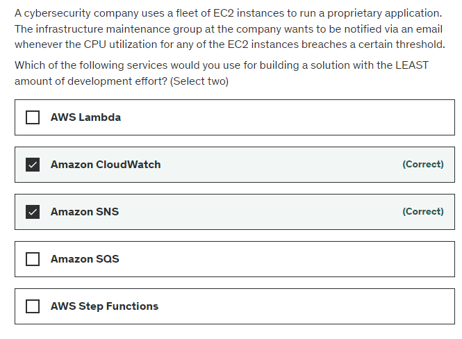

해설:

정답 B, C.

Amazon SNS - Amazon Simple Notification Service (SNS)는 고가용성, 내구성, 보안, 완전히 관리되는 게시/구독 메시징 서비스로, 마이크로서비스, 분산 시스템 및 서버리스 응용 프로그램을 분리할 수 있게 해줍니다. Amazon SNS는 고처리량, 푸시 기반, 다대다 메시징을 위한 토픽을 제공합니다.

Amazon CloudWatch - Amazon CloudWatch는 DevOps 엔지니어, 개발자, 사이트 신뢰성 엔지니어 (SRE), IT 관리자를 위해 만들어진 모니터링 및 관찰 서비스입니다. CloudWatch는 응용 프로그램을 모니터링하고 시스템 전반적인 성능 변경에 응답하며 리소스 이용률을 최적화하고 운영 상태의 통합된 보기를 얻을 수 있는 데이터와 실행 가능한 인사이트를 제공합니다. Amazon CloudWatch를 사용하면 AWS 클라우드 리소스 및 AWS에서 실행하는 응용 프로그램을 모니터링할 수 있습니다.

CloudWatch 알람을 사용하여 EC2 인스턴스 중 하나가 특정 임계값을 초과할 때마다 SNS를 통해 이메일을 보낼 수 있습니다. 따라서 이 두 옵션은 모두 올바른 것입니다.


해설:

정답 C.

"Secrets Manager"

AWS Secrets Manager는 응용 프로그램, 서비스 및 IT 리소스에 액세스하는 데 필요한 비밀을 보호하는 데 도움이 됩니다. 이 서비스를 사용하면 데이터베이스 자격 증명, API 키 및 기타 비밀을 수명 주기 동안 쉽게 회전, 관리 및 검색할 수 있습니다. 사용자 및 응용 프로그램은 Secrets Manager API를 호출하여 비밀을 검색하며 민감한 정보를 평문으로 하드코딩할 필요가 없습니다. Secrets Manager는 Amazon RDS, Amazon Redshift 및 Amazon DocumentDB에 대한 내장 통합을 통한 비밀 회전을 제공합니다. 여기서 올바른 답은 Secrets Manager입니다.

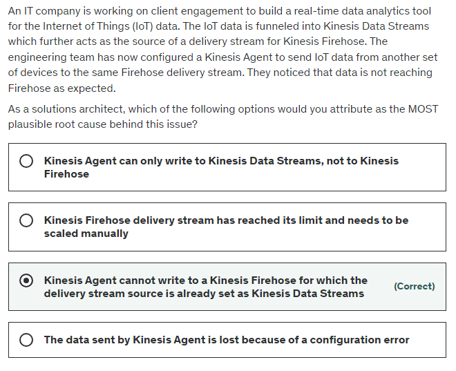

해설:

정답 C.

Kinesis Agent는 배달 스트림 소스로 이미 Kinesis Data Streams로 설정된 Kinesis Firehose에 쓸 수 없습니다.

Amazon Kinesis Data Firehose는 스트리밍 데이터를 데이터 레이크, 데이터 저장소 및 분석 도구에 안정적으로 로드하는 가장 간편한 방법입니다. 이 서비스는 데이터 처리량에 자동으로 확장되며 지속적인 관리가 필요하지 않습니다. 또한 데이터를 로드하기 전에 일괄 처리, 압축, 변환 및 암호화할 수 있어 목적지에서 사용되는 저장 공간의 양을 최소화하고 보안을 향상시킵니다.

Kinesis 데이터 스트림이 Firehose 배달 스트림의 소스로 구성된 경우 Firehose의 PutRecord 및 PutRecordBatch 작업이 비활성화되며 Kinesis Agent는 Firehose 배달 스트림에 직접 쓸 수 없습니다. 데이터는 대신 Kinesis Data Streams의 PutRecord 및 PutRecords 작업을 통해 Kinesis 데이터 스트림에 추가되어야 합니다. 따라서 이 옵션이 올바릅니다.

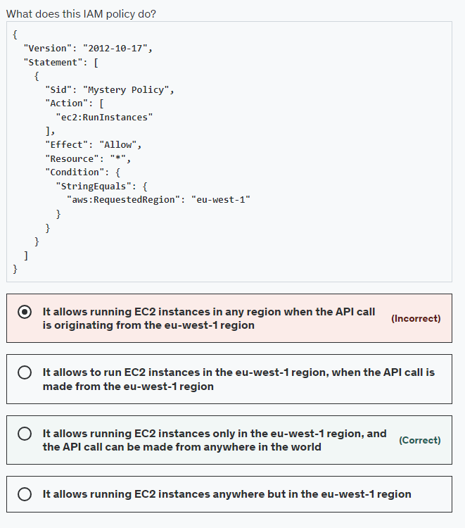

해설:

정답 C.

이는 EC2 인스턴스를 eu-west-1 지역에서만 실행할 수 있도록 허용하며 API 호출은 전 세계 어디서든 수행할 수 있습니다.

AWS에서는 IAM 정책을 생성하고 IAM 식별자(사용자, 사용자 그룹 또는 역할) 또는 AWS 리소스에 첨부하여 액세스를 관리합니다. 정책은 AWS에서 식별자 또는 리소스와 연결될 때 그들의 권한을 정의하는 AWS의 객체입니다. IAM 주체(사용자 또는 역할)가 요청을 만들 때 AWS는 이러한 정책을 평가합니다. 정책의 권한은 요청이 허용되었는지 또는 거부되었는지를 결정합니다. 대부분의 정책은 AWS에서 JSON 문서로 저장됩니다. AWS는 정책 유형으로 식별 기반 정책, 리소스 기반 정책, 권한 경계, 조직 SCP(서비스 제어 정책), ACL 및 세션 정책을 지원합니다.

aws:RequestedRegion 키를 사용하여 요청에서 호출된 AWS 지역을 정책에서 지정한 지역과 비교할 수 있습니다. 이 글로벌 조건 키를 사용하여 요청할 수 있는 지역을 제어할 수 있습니다.

aws:RequestedRegion은 API 호출의 대상을 나타냅니다. 따라서 이 예에서는 EC2 인스턴스를 eu-west-1에서만 시작할 수 있으며 이 API 호출은 전 세계 어디서든 수행할 수 있습니다.

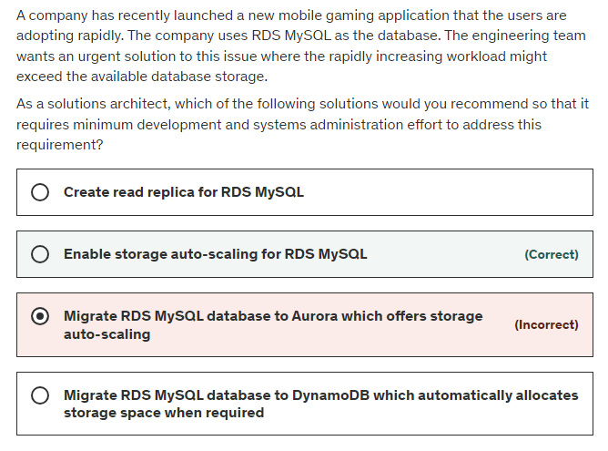

해설:

정답 B.

RDS MySQL에서 스토리지 자동 확장을 활성화하려면 다음과 같이 합니다.

워크로드가 예측 불가능한 경우 Amazon RDS DB 인스턴스에서 스토리지 자동 확장을 활성화할 수 있습니다. 스토리지 자동 확장이 활성화되면 Amazon RDS는 무료 데이터베이스 공간이 부족하다고 감지하면 자동으로 스토리지를 확장합니다. Amazon RDS는 다음과 같은 상황에서 스토리지 자동 확장을 위해 자동으로 작업을 시작합니다.

1. 사용 가능한 무료 공간이 할당된 스토리지의 10% 미만인 경우.
2. 낮은 스토리지 상태가 적어도 5분 동안 지속될 경우.
3. 마지막 스토리지 수정 이후에 적어도 6시간이 경과한 경우.

최대 스토리지 임계값은 DB 인스턴스에 대한 자동 확장을 설정한 한계입니다. 자동 확장이 활성화된 인스턴스에 대한 최대 스토리지 임계값을 최대 할당 스토리지보다 큰 값으로 설정할 수 없습니다.

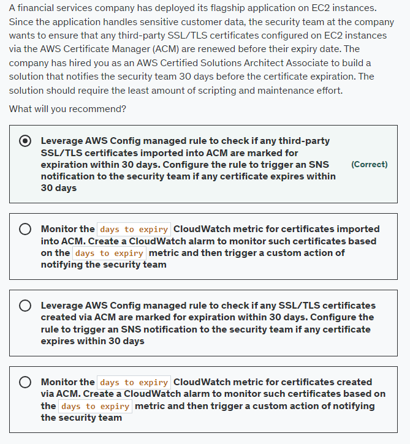

해설:

정답 A.

AWS Config 관리 규칙을 활용하여 ACM에 가져온 서드파티 SSL/TLS 인증서 중 30일 이내에 만료될 것으로 표시된 것이 있는지 확인합니다. 규칙을 구성하여 30일 이내에 만료되는 경우 보안 팀에 SNS 알림을 트리거하도록 설정합니다.

AWS Certificate Manager는 AWS 서비스 및 내부 연결된 리소스와 함께 사용하기 위해 공용 및 개인 SSL/TLS(보안 소켓 레이어/전송 계층 보안) 인증서를 손쉽게 프로비저닝, 관리 및 배포할 수 있게 해주는 서비스입니다. SSL/TLS 인증서는 네트워크 통신을 안전하게 하고 인터넷 상의 웹사이트 및 사설 네트워크의 리소스의 신원을 확인하는 데 사용됩니다.

AWS Config는 AWS 계정의 AWS 리소스 구성에 대한 상세한 보기를 제공합니다. 이는 리소스 간의 관계 및 이전에 어떻게 구성되었는지를 포함하며 구성 및 관계가 시간에 따라 어떻게 변경되는지를 확인할 수 있습니다.

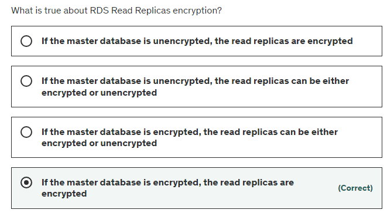

해설:

정답 D.

Amazon RDS Read Replicas는 RDS 데이터베이스(DB) 인스턴스에 대한 향상된 성능과 내구성을 제공합니다. 이는 하나의 DB 인스턴스의 용량 제한을 초과하여 읽기 중심 데이터베이스 워크로드에 대한 탄력적인 확장을 간편하게 만들어줍니다. MySQL, MariaDB, PostgreSQL, Oracle 및 SQL Server 데이터베이스 엔진의 경우 Amazon RDS는 소스 DB 인스턴스의 스냅샷을 사용하여 두 번째 DB 인스턴스를 생성합니다. 그런 다음 소스 DB 인스턴스에 변경이 있을 때마다 읽기 전용 복제본을 업데이트하기 위해 엔진의 기본 비동기 복제를 사용합니다. 읽기 전용 복제본은 가용 영역 내, Cross-AZ 또는 Cross-Region에 있을 수 있습니다.

Amazon RDS 암호화가 적용된 데이터베이스 인스턴스에서는 기본 저장소에 저장된 데이터뿐만 아니라 자동 백업, 읽기 전용 복제본 및 스냅샷도 모두 암호화됩니다. 따라서 이 옵션이 올바릅니다.

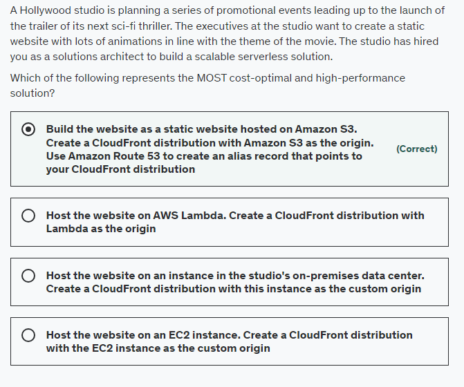

해설:

정답 A.

Amazon S3를 사용하여 정적 웹 사이트를 호스팅할 수 있습니다. 정적 웹 사이트에서 개별 웹 페이지에는 정적 콘텐츠가 포함될 수 있습니다. 또한 클라이언트 측 스크립트가 포함될 수도 있습니다. Amazon S3에서 정적 웹 사이트를 호스팅하려면 Amazon S3 버킷을 웹 사이트 호스팅용으로 구성한 다음 웹 사이트 콘텐츠를 버킷에 업로드합니다.

Amazon CloudFront는 안전하게 전 세계의 고객에게 데이터, 비디오, 응용 프로그램 및 API를 낮은 지연 시간, 높은 전송 속도로 제공하는 빠른 콘텐츠 전송 네트워크(CDN) 서비스입니다. 개발자 친화적인 환경에서 모든 작업을 수행할 수 있습니다.

Amazon CloudFront를 사용하여 웹 사이트의 성능을 향상시킬 수 있습니다. CloudFront는 웹 사이트 파일(HTML, 이미지, 비디오 등)을 전 세계의 데이터 센터(Edge Location이라고 함)에서 사용할 수 있게 합니다. 방문자가 웹 사이트에서 파일을 요청하면 CloudFront는 자동으로 해당 Edge Location의 파일 복사본으로 요청을 리디렉션합니다. 이는 방문자가 더 먼 데이터 센터에서 콘텐츠를 요청한 경우보다 더 빠른 다운로드 시간을 제공합니다. 따라서 이 옵션이 올바릅니다.

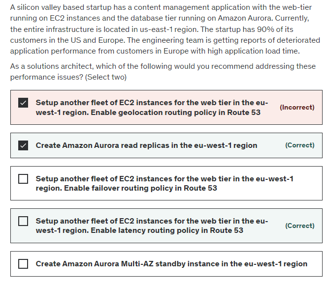

해설:

정답 B, D.

eu-west-1 지역에서 웹 티어를 위한 또 다른 EC2 인스턴스 플릿을 설정하십시오. Route 53에서 레이턴시 라우팅 정책을 활성화하십시오. Amazon Route 53은 고가용성 및 확장 가능한 클라우드 도메인 이름 시스템(DNS) 웹 서비스입니다. 여러 AWS 리전에 리소스가 있는 경우 및 트래픽을 가장 낮은 레이턴시를 제공하는 리전으로 라우팅하려는 경우 레이턴시 기반 라우팅을 사용합니다. 레이턴시 기반 라우팅을 사용하려면 여러 AWS 리전에 대한 리소스에 대한 레이턴시 레코드를 생성합니다. Route 53은 도메인 또는 서브도메인(example.com 또는 acme.example.com)에 대한 DNS 쿼리를 받으면 어떤 AWS 리전에 대한 레이턴시 레코드를 생성했는지 확인하고 사용자에게 가장 낮은 레이턴시를 제공하는 리전을 결정한 다음 해당 리전에 대한 레이턴시 레코드를 선택합니다. Route 53은 선택한 레코드의 값을, 예를 들면 웹 서버의 IP 주소 등을 반환합니다. 따라서 레이턴시 감소를 위해 이는 올바른 옵션입니다.

Amazon Aurora는 클라우드용으로 구축된 MySQL 및 PostgreSQL 호환 관계형 데이터베이스로, 전통적인 기업 데이터베이스의 성능과 가용성을 오픈 소스 데이터베이스의 간결함과 비용 효율성과 결합합니다. Amazon Aurora에는 자동으로 64TB까지 자동으로 스케일링되는 분산, 내결함성 및 자가 치유 스토리지 시스템이 포함되어 있습니다.

Amazon Aurora 읽기 전용 복제본은 리전 간에 읽기를 확장하는 데 사용할 수 있습니다. 이는 유럽의 사용자를 위한 응용 프로그램 성능을 향상시킵니다. 따라서 주어진 사용 사례에 대한 올바른 옵션입니다.

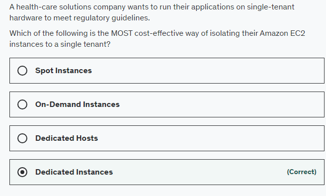

해설:

정답 D.

Dedicated Instances는 단일 고객을 위해 전용으로 구성된 하드웨어에서 가상 사설 클라우드(VPC)에서 실행되는 Amazon EC2 인스턴스입니다. 다른 AWS 계정에 속한 Dedicated Instances는 하드웨어 수준에서 물리적으로 격리되어 있으며 이러한 계정이 단일 지불 계정에 연결되어 있더라도 해당됩니다. 그러나 Dedicated Instances는 동일한 AWS 계정에서 Dedicated Instances가 아닌 다른 인스턴스와 하드웨어를 공유할 수 있습니다.

Dedicated Host는 또한 사용자 전용으로 할당된 물리적 서버입니다. Dedicated Host를 사용하면 인스턴스가 서버에 배치되는 방식에 대한 가시성과 제어권이 생깁니다.

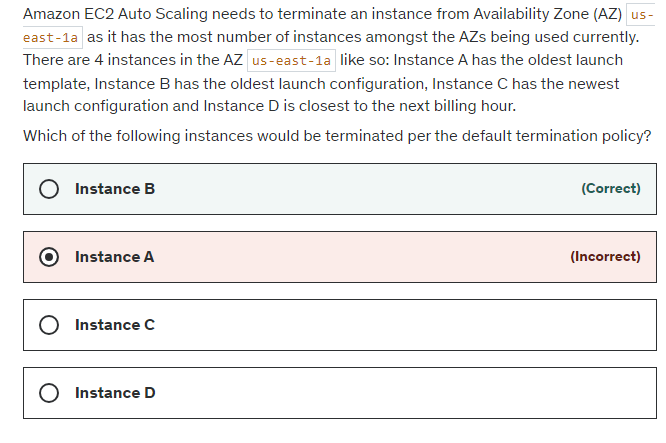

해설:

정답 A.

인스턴스 B

기본 종료 정책에 따르면 먼저 On-Demand 대 Spot 인스턴스에 대한 할당 전략을 고려합니다. 주어진 사용 사례에 대한 정보가 제공되지 않았으므로이 기준은 무시할 수 있습니다. 다음으로 가장 오래된 론칭 템플릿을 사용하는 인스턴스가 있는 경우 해당 인스턴스를 사용합니다. 따라서 인스턴스 A는 이 기준에 맞지 않습니다. 다음으로 가장 오래된 론칭 구성을 사용하는 인스턴스를 고려해야 합니다. 이는 인스턴스 B가 종료되도록 함을 의미하며 인스턴스 C는 가장 최신의 론칭 구성을 사용하므로 이 기준에서 제외됩니다. 다음으로 다음 청구 시간에 가장 가까운 인스턴스 D가 선택되지 않습니다. 이 기준은 우선 순위의 마지막에 있기 때문입니다.

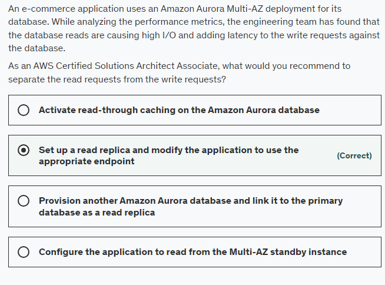

해설:

정답 B.

Aurora DB 클러스터를 설정하는 과정에서 읽기 레플리카를 만들고 응용 프로그램을 적절한 엔드포인트를 사용하도록 수정하라는 지침입니다. Amazon Aurora DB 클러스터는 하나 이상의 DB 인스턴스와 해당 데이터를 관리하는 클러스터 볼륨으로 구성됩니다. Aurora 클러스터 볼륨은 여러 가용 영역에 걸쳐 있는 가상 데이터베이스 저장 볼륨으로, 각 가용 영역에는 DB 클러스터 데이터의 사본이 있습니다.

Aurora DB 클러스터에는 두 가지 유형의 DB 인스턴스가 있습니다:

1. **Primary DB 인스턴스**: 읽기 및 쓰기 작업을 지원하며 클러스터 볼륨에 대한 모든 데이터 수정을 수행합니다. 각 Aurora DB 클러스터에는 하나의 주 DB 인스턴스가 있습니다.

2. **Aurora Replica**: 주 DB 인스턴스와 동일한 저장 볼륨에 연결되어 읽기 작업만 지원합니다. 각 Aurora DB 클러스터에는 주 DB 인스턴스에 추가로 최대 15개의 Aurora Replicas가 있을 수 있습니다. 주 DB 인스턴스가 사용 불가능해지면 Aurora는 자동으로 Aurora Replica 중 하나를 새로운 라이터로서 그 자리에 승격시킵니다. Aurora Replicas는 주 DB 인스턴스에서 읽기 워크로드를 오프로드하는 데도 도움이 됩니다.

**읽기 레플리카의 주요 목적**:
- 응용 프로그램의 읽기 작업을 확장하기 위해 읽기 전용 쿼리를 수행할 수 있습니다.
- 가용성을 높일 수 있습니다. 클러스터의 라이터 인스턴스가 사용 불가능해지면 Aurora는 자동으로 하나의 리더 인스턴스를 새 라이터로서 승격시킵니다.

멀티-AZ 배포를 위해 Aurora에서 읽기 전용 노드 또는 레플리카를 다른 가용 영역에 생성하는 과정을 설명하고 있습니다. Aurora의 리더 엔드포인트를 사용하여 읽기 전용 연결을 수행하면 Aurora가 클러스터의 사용 가능한 Aurora Replicas로 읽기 전용 연결을 분산시킬 수 있습니다.

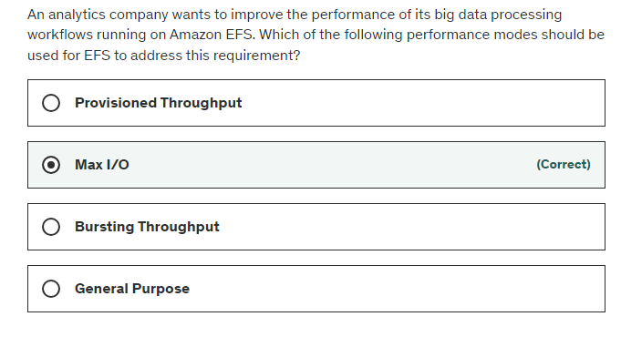

해설:

정답 B.

"Max I/O 성능 모드"는 높은 수준의 총 처리량 및 초당 작업 수로 확장하기 위해 사용됩니다. 이 확장은 파일 메타데이터 작업의 약간 높은 지연을 감내하면서 이루어집니다. 고도로 병렬화된 응용 프로그램 및 워크로드(예: 대용량 데이터 분석, 미디어 처리 및 유전체 분석)에서는 이 모드에서 이점을 얻을 수 있습니다.

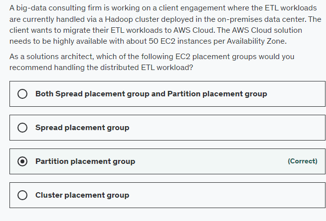

해설:

정답 C.

파티션 배치 그룹은 상호 종속적인 인스턴스 그룹의 배치를 조절하여 작업 부하를 충족시키기 위해 사용할 수 있습니다. 워크로드 유형에 따라 다음 배치 전략 중 하나를 사용하여 배치 그룹을 만들 수 있습니다.

**파티션(분할) 전략**: 여러 파티션에 인스턴스를 분산시켜 한 파티션의 인스턴스 그룹이 다른 파티션의 인스턴스 그룹과 기본 하드웨어를 공유하지 않도록 합니다. 이 전략은 일반적으로 대규모 분산 및 복제 워크로드에서 사용되며, Hadoop, Cassandra, Kafka와 같은 시스템에 적합합니다. 따라서 주어진 사용 사례에 대한 올바른 옵션입니다.

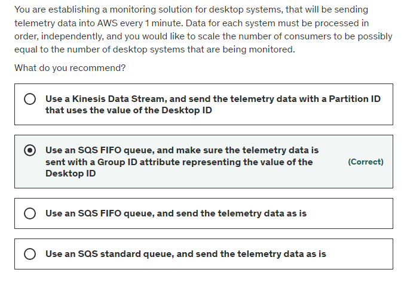

해설:

정답 B.

Amazon Simple Queue Service (SQS)는 마이크로서비스, 분산 시스템 및 서버리스 애플리케이션의 디커플링 및 스케일링을 가능케 하는 완전히 관리되는 메시지 큐 서비스입니다. SQS에는 두 가지 유형의 메시지 큐가 있습니다. 표준 큐는 최대 처리량, 최선의 노력을 기반으로 한 순서 유지 및 적어도 한 번의 전달을 제공합니다. SQS FIFO 큐는 메시지가 정확히 한 번 처리되고 전송된 순서대로 처리되도록 보장하도록 설계되었습니다.

따라서 SQS FIFO 큐를 사용해야 합니다. GroupID를 지정하지 않으면 모든 메시지가 절대적인 순서로 있게 되지만 최대 1개의 소비자만 허용할 수 있습니다. 각 데스크톱 애플리케이션에 대해 데이터를 여러 소비자가 읽을 수 있도록 하고 소비자 수를 확장하려면 "그룹 ID" 속성을 사용해야 합니다. 따라서 이것이 올바른 옵션입니다.


해설:

정답 D.

Amazon Cognito 사용자 풀은 Amazon Cognito의 사용자 디렉터리입니다. Amazon Cognito 사용자 풀을 활용하여 내장된 사용자 관리를 제공하거나 Facebook, Twitter, Google+, Amazon과 같은 외부 식별 공급자와 통합할 수 있습니다. 사용자가 직접 로그인하거나 제3자를 통해 로그인하는 경우에도 사용자 풀의 모든 회원은 SDK를 통해 액세스할 수 있는 디렉터리 프로필을 갖습니다.

사용자 풀은 다음을 제공합니다:
1. 가입 및 로그인 서비스.
2. 사용자를 로그인하기 위한 내장형 및 사용자 정의 웹 UI.
3. Facebook, Google, Amazon 로그인 및 Apple 로그인과 함께 SAML 식별 제공자를 통한 소셜 로그인.
4. 사용자 디렉터리 관리 및 사용자 프로필.
5. 다중 인증 (MFA), 침해된 자격 증명 확인, 계정 탈취 방지, 전화 및 이메일 확인과 같은 보안 기능.
6. AWS Lambda 트리거를 통한 사용자 지정된 워크플로 및 사용자 이관.

Amazon Cognito 사용자 풀을 생성한 후에는 API Gateway에서 사용자 풀을 사용하는 COGNITO_USER_POOLS 인증기를 만들어야 합니다.
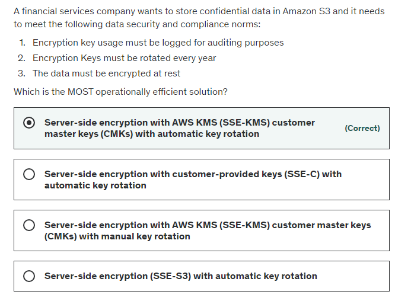

해설:

정답 A.

AWS Key Management Service (KMS)는 데이터를 보호하는 데 사용되는 암호 키를 쉽게 생성하고 제어할 수 있도록 하는 관리형 서비스입니다. AWS KMS 키 (KMS 키는 고객 마스터 키 (CMK)로도 알려져 있음)는 AWS KMS의 주요 리소스입니다. KMS 키를 사용하여 데이터를 암호화, 복호화 및 다시 암호화할 수 있습니다. AWS KMS 키는 암호화 키의 논리적 표현입니다. KMS 키에는 키 ID, 키 사양, 키 사용, 생성 날짜, 설명 및 키 상태와 같은 메타데이터가 포함되어 있습니다. 가장 중요한 것은 KMS 키와 관련된 키 재료에 대한 참조가 포함되어 있습니다.

KMS 키의 자동 키 회전을 활성화하면 AWS KMS가 매년 새로운 암호 재료를 생성합니다.

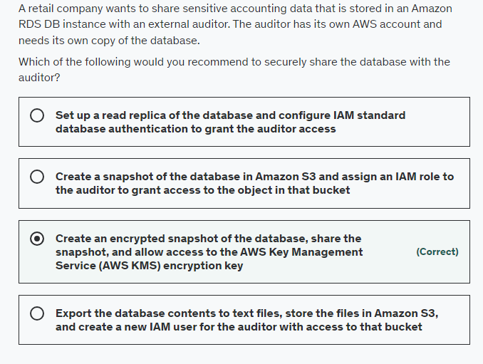

해설:

정답 C.

데이터베이스의 암호화된 스냅샷을 만들면 감사인이 주어진 사용 사례에 필요한 데이터베이스의 사본을 얻을 수 있습니다. AWS Key Management Service (AWS KMS) 고객 마스터 키 (CMK)를 스냅샷에 대한 암호화에 사용한 경우 해당 CMK를 스냅샷에 액세스할 수 있어야 하는 원하는 모든 계정과 공유할 수 있습니다. AWS KMS CMK를 다른 AWS 계정과 공유하려면 다른 계정을 AWS KMS 키 정책에 추가하면 됩니다.

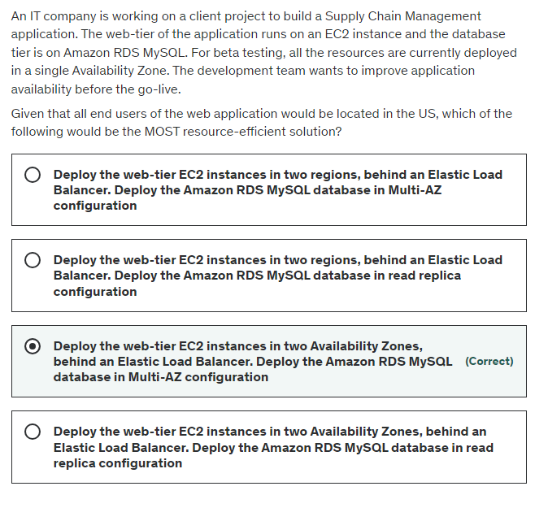

해설:

정답 C.

웹 티어 EC2 인스턴스를 두 가용 영역에 Elastic Load Balancer 뒤에 배치하면 Elastic Load Balancing이 들어오는 응용 프로그램 트래픽을 여러 대상 (예: Amazon EC2 인스턴스, 컨테이너, IP 주소 및 Lambda 함수)에 자동으로 분산시킬 수 있습니다. 이렇게 함으로써 응용 프로그램 트래픽의 변동 부하를 단일 가용 영역 또는 여러 가용 영역에 걸쳐 처리할 수 있습니다. 따라서 웹 티어 EC2 인스턴스를 Elastic Load Balancer 뒤에 두 가용 영역에 배치하는 것은 응용 프로그램의 가용성을 향상시킬 수 있습니다.

Amazon RDS Multi-AZ 배포는 RDS 데이터베이스(DB) 인스턴스에 대한 향상된 가용성 및 내구성을 제공하여 프로덕션 데이터베이스 워크로드에 적합합니다. Multi-AZ DB 인스턴스를 프로비저닝하면 Amazon RDS는 자동으로 기본 DB 인스턴스를 만들고 동기적으로 데이터를 다르게 구성된 가용 영역의 대기 인스턴스로 복제합니다. 각 가용 영역은 독립된 물리적으로 구분된 인프라에서 실행되며 높은 신뢰성을 보장하도록 설계되었습니다. Amazon RDS MySQL 데이터베이스를 Multi-AZ 구성으로 배포하면 가용성이 향상되므로 이것이 올바른 옵션입니다.


해설:

정답 C.

DNS 호스트 이름 및 DNS 해결을 위해 사설 호스팅 영역에 대한 설정을 활성화해야 합니다. 사설 호스팅 영역에 대한 DNS 쿼리는 Amazon에서 제공하는 VPC DNS 서버에서만 해결될 수 있습니다. 결과적으로 이러한 옵션은 사설 호스팅 영역이 작동하려면 활성화되어야 합니다.

DNS 호스트 이름: Amazon VPC 마법사를 사용하여 생성되지 않은 기본 가상 사설망에 대해 이 옵션은 기본적으로 비활성화되어 있습니다. 도메인에 대한 사설 호스팅 영역을 생성하고 DNS 호스트 이름을 활성화하지 않고 영역에 레코드를 생성하면 사설 호스팅 영역이 활성화되지 않습니다. 사설 호스팅 영역을 사용하려면 이 옵션을 활성화해야 합니다.

DNS 해결: 사설 호스팅 영역은 VPC DNS 서버에서만 DNS 쿼리를 수락합니다. VPC DNS 서버의 IP 주소는 VPC IPv4 네트워크 범위의 기본 부분에 더해진 예약된 IP 주소입니다. DNS 해결을 활성화하면 DNS 해결을 수행하는 Resolver로서 VPC DNS 서버를 사용할 수 있습니다. DHCP 옵션 세트에서 사용자 지정 DNS 서버를 사용하고 사설 호스팅 영역을 사용하지 않는 경우 이 옵션을 비활성화 상태로 유지하십시오.

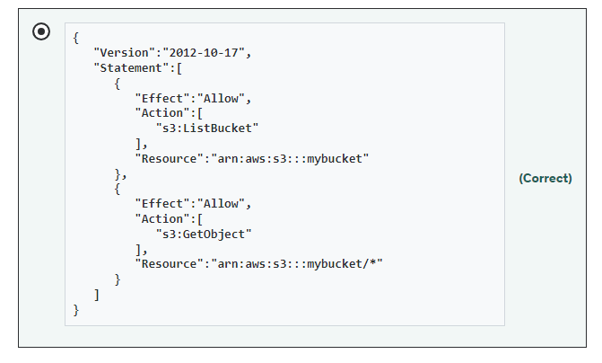

해설:

AWS에서는 정책을 생성하고 해당 정책을 IAM 신원(사용자, 사용자 그룹 또는 역할) 또는 AWS 리소스에 첨부하여 액세스를 관리합니다. 정책은 AWS의 개체로, 해당 정책이 신원이나 리소스와 연결될 때 권한을 정의합니다. AWS는 IAM 주체(사용자 또는 역할)가 요청을 할 때 이러한 정책을 평가합니다. 정책의 권한에 따라 요청이 허용되거나 거부됩니다. 대부분의 정책은 JSON 문서로 AWS에 저장됩니다. AWS는 식별 기반 정책, 리소스 기반 정책, 권한 경계, 조직 SCP(서비스 제어 정책), ACL 및 세션 정책 등 여섯 가지 유형의 정책을 지원합니다.

s3:ListBucket은 버킷에 적용되므로 ARN은 "Resource":"arn:aws:s3:::mybucket" 형식으로 지정되며, 뒤에 슬래시(/)가 없습니다. s3:GetObject는 버킷 내의 객체에 적용되므로 ARN은 "Resource":"arn:aws:s3:::mybucket/*" 형식으로 지정되며, 뒤에 /*가 있어 모든 버킷 객체를 나타냅니다.

따라서 이것이 올바른 옵션입니다.

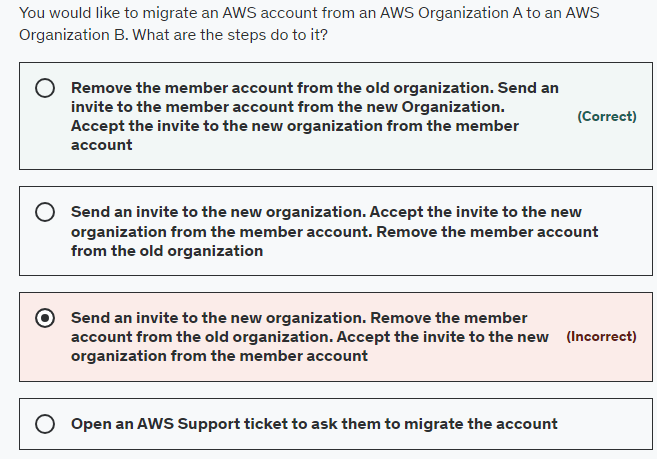

해설:

정답 A.

AWS Organizations을 사용하면 AWS에서 워크로드를 성장시키고 확장하는 동안 환경을 중앙에서 관리할 수 있습니다. AWS Organizations를 사용하면 계정 생성을 자동화하고 비즈니스 요구 사항을 반영하는 계정 그룹을 만들고 이러한 그룹에 대한 정책을 적용하여 중앙에서 환경을 관리할 수 있습니다. 또한 모든 AWS 계정에 대한 단일 지불 방법을 설정하여 청구를 간소화할 수 있습니다. AWS Organizations와 다른 AWS 서비스의 통합을 통해 조직 내 계정 간에 중앙 구성 및 리소스 공유를 정의할 수 있습니다.

하나의 조직에서 다른 조직로 계정을 마이그레이션하려면 회원 및 마스터 계정 모두에 대한 루트 또는 IAM 액세스가 있어야 합니다. 다음은 계정을 마이그레이션하는 단계입니다:
1. 이전 조직에서 회원 계정 제거
2. 새 조직에서 회원 계정으로 초대 전송
3. 회원 계정에서 새 조직의 초대 수락

이와 같은 단계를 따라야 합니다.

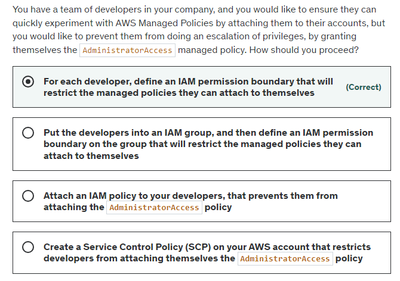

해설:

정답 A.

각 개발자에 대해 IAM 엔터티(사용자 또는 역할)에 대한 권한 경계를 정의합니다. 권한 경계는 IAM 엔터티가 수행할 수 있는 최대 권한을 설정하기 위한 관리형 정책을 사용하는 고급 기능입니다. 엔터티의 권한 경계는 해당 엔터티의 식별 기반 정책 및 권한 경계에서 허용하는 작업만 수행할 수 있도록 합니다. 여기서는 IAM 권한 경계를 사용해야 합니다. IAM 그룹에는 적용할 수 없습니다.

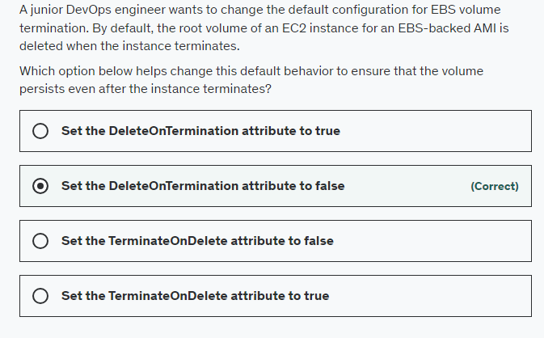

해설:

정답 B.

`DeleteOnTermination` 속성을 `false`로 설정하십시오.

EC2 인스턴스는 인스턴스 스토어로 지원되는 AMI 또는 Amazon EBS로 지원되는 AMI에서 시작할 수 있습니다. Amazon EBS를 루트 디바이스로 사용하는 인스턴스는 자동으로 Amazon EBS 볼륨이 연결됩니다. Amazon EBS로 지원되는 AMI의 루트 볼륨은 기본적으로 인스턴스가 종료될 때 삭제됩니다.<br/> 기본 동작을 변경하여 인스턴스 종료 후에도 볼륨이 유지되도록 하려면 `DeleteOnTermination` 속성을 `false`로 설정하고 블록 디바이스 매핑을 사용하십시오.

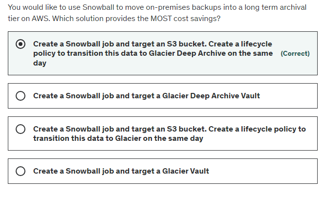

해설:

정답 A.

Snowball 작업을 생성하고 S3 버킷을 대상으로 설정하십시오. 이 데이터를 동일한 날에 Glacier Deep Archive로 전환하기 위해 수명 주기 정책을 생성하십시오.

AWS Snowball은 AWS Snow Family의 일부로, 두 가지 옵션으로 제공되는 데이터 이전 및 엣지 컴퓨팅 디바이스입니다. Snowball Edge Storage Optimized 디바이스는 블록 스토리지와 Amazon S3 호환 객체 스토리지, 그리고 40개의 vCPU를 제공합니다. 이는 로컬 스토리지 및 대규모 데이터 전송에 적합합니다. Snowball Edge Compute Optimized 디바이스는 52개의 vCPU, 블록 및 객체 스토리지, 그리고 선택적인 GPU를 제공하여 비연결 환경에서 고급 기계 학습 및 전체 모션 비디오 분석과 같은 사용 사례에 적합합니다.

Snowball Edge Storage Optimized는 AWS로 수십 테라바이트에서 페타바이트까지 안전하고 신속하게 데이터를 전송해야 하는 경우 최적의 선택지입니다. 최대 80TB의 사용 가능한 HDD 스토리지, 40개의 vCPU, 1TB의 SATA SSD 스토리지 및 최대 40Gb 네트워크 연결성을 제공하여 대규모 데이터 전송 및 사전 처리 사용 사례를 해결합니다.

원래의 Snowball 디바이스는 서비스에서 제외되었으며 Snowball Edge Storage Optimized가 데이터 전송에 주로 사용되고 있습니다. 시험에서는 원래의 Snowball 디바이스를 볼 수 있지만 원래의 Snowball 디바이스는 80TB의 저장 공간이 있었음을 기억하십시오.

이 시나리오에서는 모든 파일의 S3 Standard에서의 소요 시간을 최소화하여 의도하지 않은 S3 Standard 저장 비용을 방지해야 합니다. 이를 위해 AWS는 0일 수명 주기 정책 사용을 권장합니다. 0일 수명 주기 정책을 사용할 때 비용 관점에서는 전송된 파일에 대해 S3 Glacier Deep Archive 요금만 청구됩니다. 청구 시 수명 주기 정책이 먼저 고려되며 대상이 S3 Glacier Deep Archive인 경우 전송된 파일에 대해 S3 Glacier Deep Archive 요금이 청구됩니다.

데이터를 Snowball에서 직접 Glacier로 이동할 수 없으며 먼저 S3를 통과한 후 수명 주기 정책을 사용해야 합니다. 따라서 이 옵션이 올바릅니다.

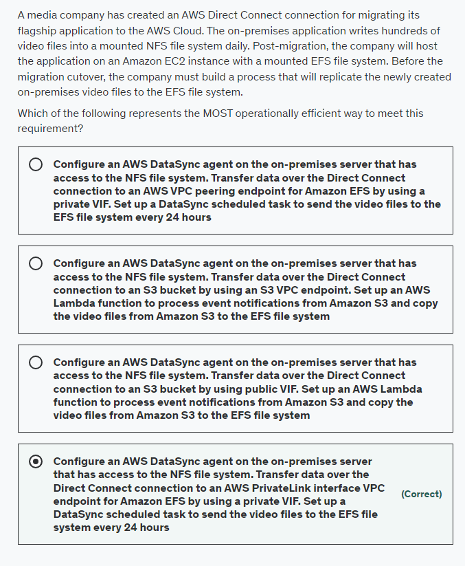

해설:

정답 D.

NFS 파일 시스템에 액세스 권한이 있는 온프레미스 서버에 AWS DataSync 에이전트를 구성하십시오. Direct Connect 연결을 통해 AWS PrivateLink 인터페이스 VPC 엔드포인트로 데이터를 전송하려면 개인 VIF를 사용하십시오. AWS DataSync 예약된 작업을 설정하여 24시간마다 비디오 파일을 EFS 파일 시스템으로 전송하도록 합니다.

AWS DataSync는 온프레미스 저장 시스템과 AWS 저장소 서비스 간, 그리고 AWS 저장소 서비스 간에 대량의 데이터 복사를 간소화하고 자동화하며 가속화하는 온라인 데이터 전송 서비스입니다.

AWS DataSync를 사용하면 온프레미스, 엣지 또는 기타 클라우드에 있는 데이터를 Amazon S3, Amazon EFS, Amazon FSx for Windows File Server, Amazon FSx for Lustre, Amazon FSx for OpenZFS 및 Amazon FSx for NetApp ONTAP으로 마이그레이션할 수 있습니다.

가상 사설 클라우드(VPC)와 Amazon EFS API 간에 개인 연결을 수립하려면 인터페이스 VPC 엔드포인트를 생성할 수 있습니다. 또한 AWS VPN, AWS Direct Connect 또는 VPC 피어링을 사용하여 온프레미스 환경이나 다른 VPC에서 인터페이스 VPC 엔드포인트에 액세스할 수 있습니다.

AWS Direct Connect는 공용, 개인 및 트랜짓 세 가지 유형의 가상 인터페이스를 제공합니다.

지정된 사용 사례에서 Direct Connect 연결을 통해 개인 VIF를 사용하여 Amazon EFS에 대한 AWS PrivateLink 인터페이스 VPC 엔드포인트로 데이터를 전송할 수 있습니다.

AWS DataSync에서 작업 예약을 사용하여 정기적으로 소스 저장 시스템에서 대상으로의 전송 작업을 실행할 수 있습니다. AWS DataSync 예약된 작업을 사용하여 24시간마다 비디오 파일을 EFS 파일 시스템으로 전송할 수 있습니다.

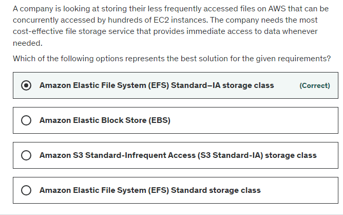

해설:

정답 A.

Amazon Elastic File System (EFS) Standard–IA 스토리지 클래스 - Amazon EFS는 Amazon 컴퓨팅(EC2, 컨테이너, 서버리스) 및 온프레미스 서버와 함께 사용하는 파일 스토리지 서비스입니다. Amazon EFS는 파일 시스템 인터페이스, 파일 시스템 액세스 의미론(강력한 일관성 및 파일 락 등), 최대 수천 개의 Amazon EC2 인스턴스에 대해 동시에 액세스할 수 있는 저장소를 제공합니다.

Standard–IA 스토리지 클래스는 매일 액세스되지 않는 파일에 대한 스토리지 비용을 감소시킵니다. 이는 Amazon EFS가 제공하는 고가용성, 고내구성, 탄력성 및 POSIX 파일 시스템 액세스를 희생하지 않고 수행됩니다. AWS는 데이터 집합 전체에 신속하게 액세스해야 하며 덜 자주 액세스되는 파일에 대한 저장 비용을 자동으로 절약하려는 경우 Standard-IA 스토리지를 권장합니다.

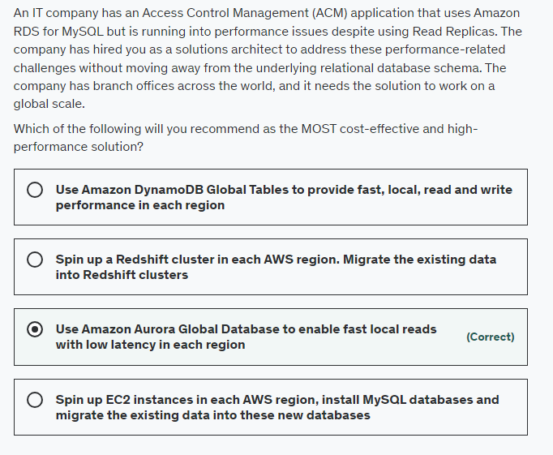

해설:

정답 C.

Amazon Aurora Global Database를 사용하여 각 지역에서 낮은 지연 시간과 빠른 로컬 읽기를 활성화합니다.

Amazon Aurora는 클라우드용으로 구축된 MySQL 및 PostgreSQL 호환 관계형 데이터베이스로, 전통적인 기업용 데이터베이스의 성능과 가용성을 오픈 소스 데이터베이스의 간단함과 비용 효과적인 특성과 결합합니다. Amazon Aurora에는 자가 치유 및 확장이 가능한 분산형 내구성 스토리지 시스템이 있어 각 데이터베이스 인스턴스당 최대 64TB로 자동으로 스케일링됩니다. Aurora는 인메모리 데이터베이스가 아닙니다.

Amazon Aurora Global Database는 전 세계 분산 애플리케이션을 위해 설계되어 단일 Amazon Aurora 데이터베이스가 여러 AWS 지역에 걸쳐 확장될 수 있습니다. 이는 데이터베이스 성능에 영향을 미치지 않고 데이터를 복제하며 각 지역에서 낮은 지연 시간으로 빠른 로컬 읽기를 가능케하며 지역 전체의 장애로부터의 재해 복구를 제공합니다. Amazon Aurora Global Database가 주어진 사용 사례에 대한 올바른 선택입니다.

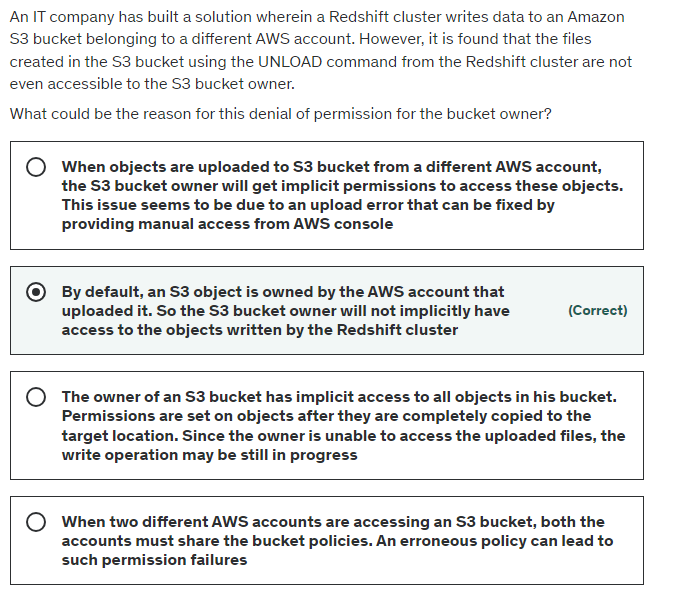

해설:

정답 B.

기본적으로 S3 객체는 해당 객체를 업로드한 AWS 계정에 소유권이 있습니다. 따라서 S3 버킷 소유자는 Redshift 클러스터에서 작성한 객체에 암묵적으로 액세스할 수 없습니다. UNLOAD 명령에서 생성된 Amazon Redshift 데이터 파일이 다른 계정에서 버킷에 저장된 경우 (즉, 버킷 소유자가 아닌 경우), 이러한 파일에 대한 기본 권한이 없게 됩니다.

데이터 파일에 액세스하려면 교차 계정 권한을 가진 AWS Identity and Access Management (IAM) 역할이 UNLOAD 명령을 실행해야 합니다. 다음은 Amazon Redshift 클러스터에 교차 계정 권한을 부여하려면 수행해야 할 단계입니다.

1. S3 버킷의 계정에서 버킷에 대한 권한이 있는 IAM 역할 (Bucket Role)을 생성합니다.
2. Amazon Redshift 클러스터의 계정에서 다른 IAM 역할 (Cluster Role)을 생성하고 Bucket Role을 가정할 수 있는 권한을 부여합니다.
3. Bucket Role을 업데이트하여 버킷 액세스 권한을 부여하고 Cluster Role과의 신뢰 관계를 생성합니다.
4. Amazon Redshift 클러스터에서 Cluster Role과 Bucket Role을 사용하여 UNLOAD 명령을 실행합니다.

이 솔루션은 AWS Key Management Service (AWS KMS)를 사용하여 서버 측 암호화를 하는 Amazon Redshift 클러스터나 S3 버킷에는 적용되지 않습니다.

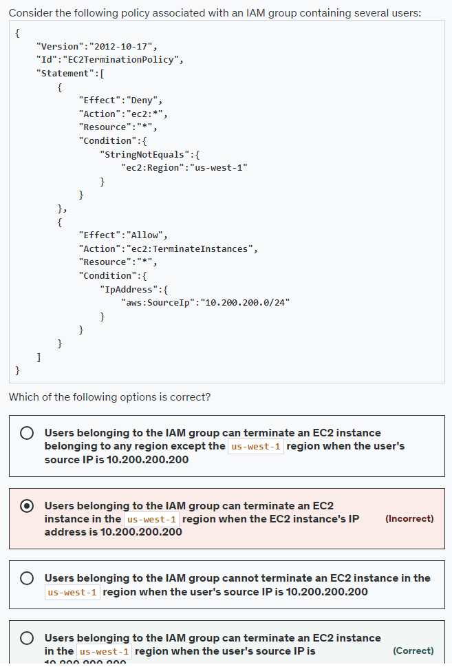

해설:

정답 D.

제공된 정책은 모든 EC2 특정 작업을 해당 리소스의 지역이 us-west-1이 아닌 경우에 모든 리소스에 대해 거부합니다. 정책은 소스 IP 주소가 CIDR 범위 10.200.200.0/24에 있는 경우 모든 리소스에서 EC2 인스턴스를 종료할 수 있도록 허용합니다. 따라서 소스 IP가 10.200.200.200인 사용자는 EC2 인스턴스를 종료할 수 있을 것입니다.

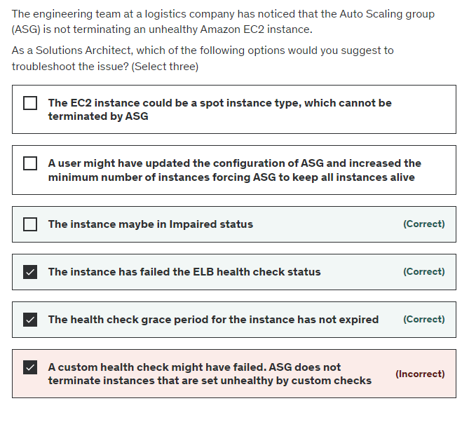

해설:

정답 C, D, E.

Amazon EC2 Auto Scaling은 EC2 상태 확인 및 ELB(로드 밸런서) 헬스 체크를 기반으로 서비스에 들어온 인스턴스를 헬스 체크 기간이 만료될 때까지 종료하지 않습니다.

자세한 내용은 [Health Check Grace Period 문서](https://docs.aws.amazon.com/autoscaling/ec2/userguide/healthcheck.html#health-check-grace-period)를 참조하세요.

- **헬스 체크 기간이 만료되지 않았을 때:** EC2 Auto Scaling은 헬스 체크 기간이 만료될 때까지 인스턴스를 종료하지 않습니다.

- **인스턴스가 Impaired 상태에 있을 때:** EC2 Auto Scaling은 즉시 Impaired 상태의 인스턴스를 종료하지 않습니다. 대신 EC2 Auto Scaling은 인스턴스가 회복되기 몇 분 동안 기다립니다. EC2 Auto Scaling은 상태 확인 메트릭에 대한 데이터가 충분하지 않은 경우에도 인스턴스 종료를 지연하거나 실행하지 않을 수 있습니다.

- **인스턴스가 ELB 헬스 체크를 실패했을 때:** 기본적으로 EC2 Auto Scaling은 그룹의 헬스 체크 구성이 EC2로 설정된 경우 ELB 헬스 체크 결과를 사용하지 않습니다. 따라서 EC2 Auto Scaling은 ELB 헬스 체크에 실패한 인스턴스를 종료하지 않습니다. 인스턴스가 ELB 콘솔에서 OutofService 상태인 경우에도 EC2 Auto Scaling 콘솔에서 상태가 Healthy로 표시되는 경우 헬스 체크 유형이 ELB로 설정되어 있는지 확인하세요.

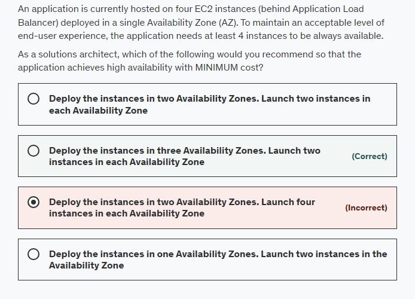

해설:

정답 B.

올바른 옵션은 세 가용 영역에 인스턴스를 배포하고 각 가용 영역에 두 개의 인스턴스를 시작하는 것입니다. 한 AZ가 서비스를 중단하더라도 여전히 4개의 인스턴스를 사용할 수 있으며 응용 프로그램은 허용 가능한 수준의 최종 사용자 경험을 유지할 수 있습니다. 따라서 이 경우 6개의 인스턴스로 고 가용성을 달성할 수 있습니다.

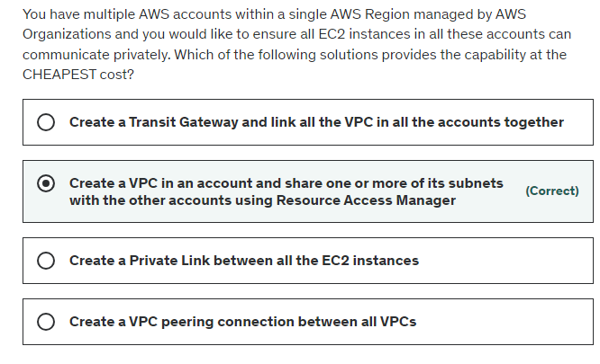

해설:

정답 B.

올바른 해결책은 RAM을 사용하여 VPC 내의 서브넷을 다른 계정과 공유하는 것입니다. AWS Resource Access Manager (RAM)은 여러 AWS 계정 또는 AWS 조직 내에서 AWS 리소스를 쉽고 안전하게 공유할 수 있게 해주는 서비스입니다. RAM을 사용하여 AWS Transit Gateways, 서브넷, AWS License Manager 구성 및 Amazon Route 53 Resolver 규칙 리소스를 공유할 수 있습니다. RAM을 사용하면 여러 계정에서 중복 리소스를 만들 필요가 없어져 모든 소유한 계정에서 이러한 리소스를 관리하는 운영 부담이 감소합니다. 여러 계정 환경에서 중앙에서 리소스를 만들고 RAM을 사용하여 이러한 리소스를 세 단계로 여러 계정과 공유할 수 있습니다: 리소스 공유 생성, 리소스 지정, 계정 지정. RAM은 별도의 비용 없이 제공됩니다.

올바른 해결책은 RAM을 사용하여 VPC 내의 서브넷을 공유하는 것입니다. 이렇게 하면 모든 EC2 인스턴스가 동일한 VPC에 배포되고 있지만 서로 다른 계정에서도 쉽게 통신할 수 있습니다.


해설:

정답 C.

여기서 제공된 정책 문서에서 다음 스니펫을 고려해보겠습니다.

```json
"Condition": {
    "IpAddress": {
        "aws:SourceIp": "34.50.31.0/24"
    }
}
```

이 조건에서의 `aws:SourceIp`는 항상 API 호출자의 IP를 나타냅니다. 이는 예를 들어 온프레미스 인프라의 공용 IP에서만 특정 AWS API로의 액세스를 제한하려는 경우에 매우 유용합니다.

다음은 Elastic IP 주소, Private IP 주소 및 Public IP 주소에 대한 개요입니다.

- **Elastic IP 주소:** Elastic IP 주소는 동적 클라우드 컴퓨팅을 위해 설계된 정적 IPv4 주소입니다. Elastic IP 주소는 AWS 계정과 연결됩니다. Elastic IP 주소를 사용하면 인스턴스 또는 소프트웨어의 장애를 빠르게 다른 인스턴스로 주소를 다시 매핑하여 가리킬 수 있습니다.

- **Private IP 주소:** Private IPv4 주소는 인터넷을 통해 접근할 수 없는 IP 주소입니다. 동일한 VPC 내의 인스턴스 간 통신에 사용할 수 있습니다.

- **Public IP 주소:** Public IP 주소는 인터넷에서 접근 가능한 IPv4 주소입니다. 이러한 주소를 사용하면 인스턴스와 인터넷 간의 통신에 사용할 수 있습니다.

참고로 `34.50.31.0/24`은 공용 IP 범위이며, 개인 IP 범위가 아닙니다. 개인 IP 범위는 다음과 같습니다.
- `192.168.0.0`에서 `192.168.255.255` (65,536 IP 주소)
- `172.16.0.0`에서 `172.31.255.255` (1,048,576 IP 주소)
- `10.0.0.0`에서 `10.255.255.255` (16,777,216 IP 주소)

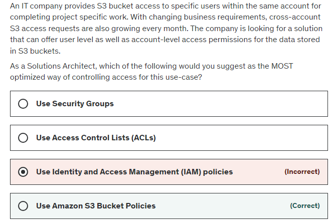

해설:

정답 D.

Amazon S3 버킷 정책은 버킷 내 객체에 대한 권한을 효과적으로 관리할 수 있는 강력한 도구입니다. 이러한 정책은 사용자, 그룹 또는 버킷 자체에 첨부할 수 있어 Amazon S3 리소스에 대한 중앙 집중식 액세스 제어를 제공합니다.

Amazon S3의 버킷 정책을 사용하면 특정 리소스에 대한 특정 작업에 대한 권한을 부여하거나 거부할 수 있습니다. 이를 통해 객체에 대한 액세스 및 수행할 수 있는 작업을 정밀하게 제어할 수 있습니다.

또한 버킷 정책에서 조건을 사용하여 액세스 제어를 더 세분화할 수 있습니다. 조건은 요청 시간, SSL 사용 여부, 요청자의 IP 주소 또는 요청을 하는 클라이언트 응용 프로그램과 같은 다양한 요소를 기반으로 할 수 있습니다. 정책 키를 사용하여 이러한 조건을 지정하여 특정 요구 사항에 따라 액세스 제어를 맞춤화할 수 있습니다.

요약하면 Amazon S3 버킷 정책은 S3 버킷 내 객체에 대한 액세스 제어를 정의하고 강화하는 유연하고 견고한 메커니즘을 제공하여 다양한 조건에 기반한 보안 및 사용자 정의를 제공합니다.

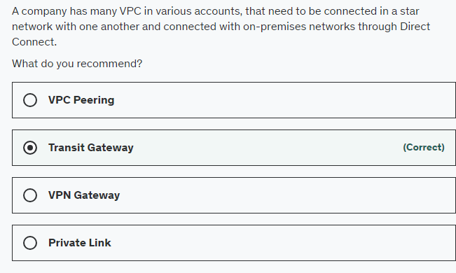

해설:

정답 B.

AWS Transit Gateway는 고객이 Amazon Virtual Private Clouds (VPC) 및 온프레미스 네트워크를 단일 게이트웨이에 연결할 수 있는 서비스입니다. AWS Transit Gateway를 사용하면 중앙 게이트웨이에서 각 Amazon VPC, 온프레미스 데이터 센터 또는 네트워크 전체의 원격 사무실로의 단일 연결을 생성하고 관리할 수 있습니다. Transit Gateway는 연결된 모든 네트워크 간에 트래픽이 어떻게 라우팅되는지를 제어하는 허브 역할을 하며 이러한 네트워크는 각각 스포크처럼 작동합니다. 따라서 이는 Transit Gateway에 대한 이상적인 사용 사례입니다.

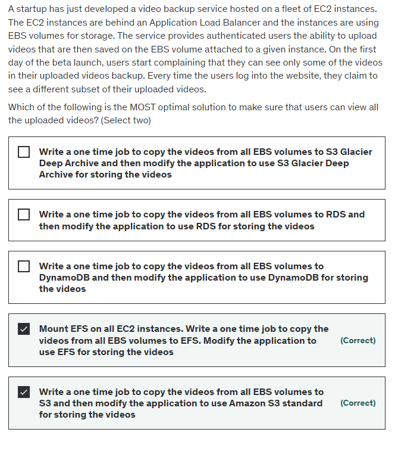

해설:

정답 D, E.

영상을 모든 EBS 볼륨에서 S3로 복사하는 일회성 작업을 작성한 후 애플리케이션을 변경하여 Amazon S3 표준을 사용하여 영상을 저장합니다.

Amazon Elastic Block Store (EBS)는 Amazon Elastic Compute Cloud (EC2)와 함께 사용하기 위해 설계된 쉽고 고성능의 블록 스토리지 서비스로, 어떤 규모에서도 처리량 및 트랜잭션 중심 워크로드에 적합합니다.

Amazon Elastic File System (Amazon EFS)은 AWS 클라우드 서비스 및 온프레미스 리소스와 함께 사용하기 위해 간단하고 확장 가능하며 완전히 관리되는 탄력적인 NFS 파일 시스템을 제공합니다. 자동으로 파일을 추가하고 제거하면서 페타바이트 규모로 필요에 따라 자동으로 확장 및 축소하며 성장을 수용하기 위해 용량을 프로비저닝하고 관리할 필요가 없습니다.

Amazon Simple Storage Service (Amazon S3)는 산업 표준의 확장 가능성, 데이터 가용성, 보안 및 성능을 제공하는 객체 저장 서비스입니다.

EBS 볼륨은 지역적으로 EC2 인스턴스에 연결되므로 업로드된 비디오는 특정 EC2 인스턴스에 바인딩됩니다. 사용자가 로그인할 때마다 다른 인스턴스로 리디렉션되므로 비디오가 여러 EBS 볼륨에 분산되게 됩니다. 올바른 해결책은 사용자 비디오를 저장하기 위해 S3 또는 EFS 중 하나를 사용하는 것입니다.

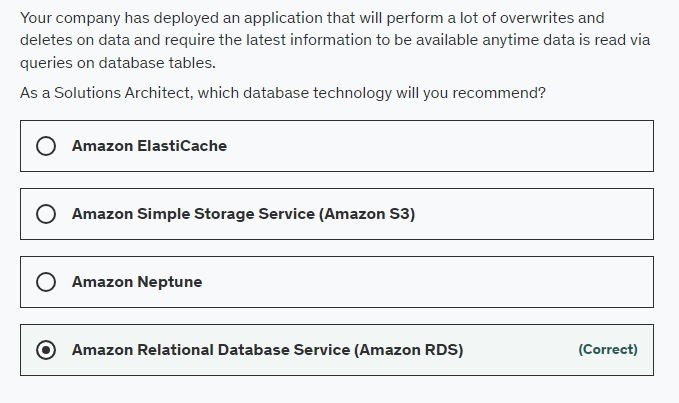

해설:

정답 D.

Amazon Relational Database Service (Amazon RDS) - Amazon Relational Database Service (Amazon RDS)는 클라우드에서 관계형 데이터베이스를 쉽게 설정, 운영 및 확장할 수 있게 해줍니다. 이 서비스는 비용 효율적이고 크기를 조절할 수 있으며, 하드웨어 프로비저닝, 데이터베이스 설정, 패치 및 백업과 같은 시간 소모적인 관리 작업을 자동화합니다. RDS는 항목 잠금이나 모호성 없이 레코드를 만들고, 읽고, 업데이트하며, 삭제할 수 있도록 합니다. 모든 RDS 트랜잭션은 데이터 무결성을 보장하기 위해 ACID(Atomic, Consistent, Isolated, Durable) 준수 여부를 가져야 합니다.

- 원자성(Atomicity): 트랜잭션 전체가 성공적으로 실행되거나 트랜잭션의 일부가 실패하면 전체 트랜잭션이 무효화되어야 합니다.
- 일관성(Consistency): 트랜잭션으로 데이터베이스에 기록된 데이터는 모든 정의된 규칙 및 제약 조건(제약, 캐스케이드 및 트리거 포함)을 준수해야 합니다.
- 격리(Isolation): 동시성 제어를 달성하기 위해 각 트랜잭션이 독립적으로 실행되어야 합니다.
- 내구성(Durability): 트랜잭션이 완료되면 데이터베이스에 대한 모든 변경 사항이 영구적이어야 합니다.

따라서 RDS가 가장 적합합니다.

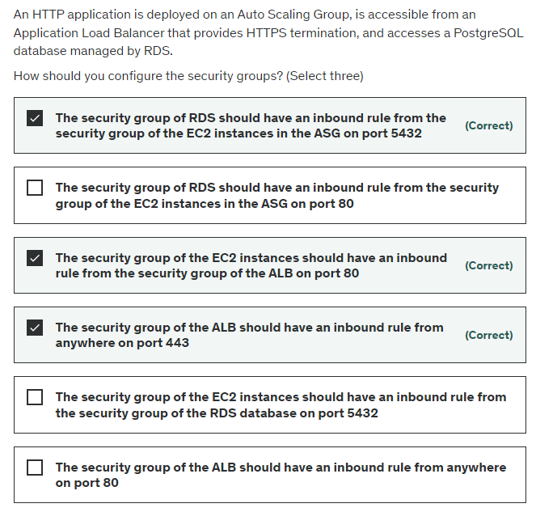

해설:

정답 A, C, D.

RDS의 보안 그룹은 ASG 내의 EC2 인스턴스의 보안 그룹에서 포트 5432에 대한 인바운드 규칙을 가져야 합니다.

EC2 인스턴스의 보안 그룹은 ALB의 보안 그룹에서 포트 80에 대한 인바운드 규칙을 가져야 합니다.

ALB의 보안 그룹은 어디서나(Any)에서 포트 443으로의 인바운드 규칙을 가져야 합니다.

보안 그룹은 하나 이상의 인스턴스에 대한 트래픽을 제어하는 가상 방화벽 역할을 합니다. 인스턴스를 시작할 때 하나 이상의 보안 그룹을 지정할 수 있으며, 그렇지 않으면 기본 보안 그룹을 사용합니다. 각 보안 그룹에 트래픽을 허용하는 규칙을 추가할 수 있습니다. 규칙은 언제든지 수정할 수 있으며, 새로운 규칙은 해당 보안 그룹과 관련된 모든 인스턴스에 자동으로 적용됩니다. 트래픽을 인스턴스에 도달시킬지 여부를 결정할 때는 해당 인스턴스와 관련된 모든 보안 그룹의 모든 규칙을 평가합니다.

포트 번호는 다음과 같이 매핑됩니다:
- PostgreSQL 포트 = 5432
- HTTP 포트 = 80
- HTTPS 포트 = 443

트래픽은 다음과 같이 이동합니다: 클라이언트는 ALB의 포트 443으로 HTTPS 요청을 보냅니다. 이는 다음 규칙에 의해 처리됩니다 - ALB의 보안 그룹은 어디서나(Any)에서 포트 443으로의 인바운드 규칙을 가져야 합니다. 그런 다음 ALB는 요청을 EC2 인스턴스 중 하나로 전달합니다. 이는 다음 규칙에 의해 처리됩니다 - EC2 인스턴스의 보안 그룹은 ALB의 보안 그룹에서 포트 80에 대한 인바운드 규칙을 가져야 합니다. EC2 인스턴스는 더 나아가 RDS에서 관리하는 PostgreSQL 데이터베이스에 포트 5432로 액세스합니다. 이는 다음 규칙에 의해 처리됩니다 - RDS의 보안 그룹은 ASG 내의 EC2 인스턴스의 보안 그룹에서 포트 5432에 대한 인바운드 규칙을 가져야 합니다.

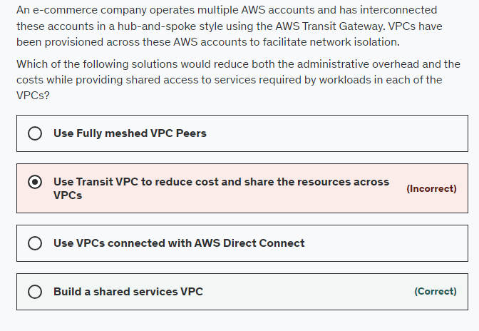

해설:

정답 D.

"공유 서비스 VPC" 구축

AWS Transit Gateway를 사용한 허브-스포크 네트워크를 갖춘 조직을 고려해봅시다. 다양한 AWS 계정에 여러 VPC가 프로비저닝되어 있을 수 있습니다. 이는 네트워크 격리를 용이하게 하거나 위임된 네트워크 관리를 가능하게 하는 데 도움이 될 수 있습니다. 이와 같은 분산된 아키텍처를 배포할 때 인기 있는 접근 방식 중 하나는 각 VPC에서 워크로드가 필요로 하는 서비스에 액세스를 제공하는 "공유 서비스 VPC"를 구축하는 것입니다. 이에는 디렉터리 서비스나 VPC 엔드포인트와 같은 것이 포함될 수 있습니다. 각 VPC에 개별적으로 구축하는 대신 중앙 위치에서 리소스를 공유함으로써 관리 오버헤드와 비용을 줄일 수 있습니다.

중앙 집중식 VPC 엔드포인트 (다중 VPC): https://aws.amazon.com/blogs/architecture/reduce-cost-and-increase-security-with-amazon-vpc-endpoints/

VPC 엔드포인트는 인터넷 게이트웨이, NAT 장치, VPN 연결 또는 AWS Direct Connect 연결이 필요하지 않고 지원되는 AWS 서비스에 VPC를 비공개적으로 연결할 수 있게 해줍니다. 엔드포인트는 가로로 확장 가능하며, 여러 번 사용 가능하며, 고가용성 VPC 구성 요소입니다. 이를 통해 VPC 내의 인스턴스와 서비스 간의 통신이 네트워크 트래픽에 가용성 위험이나 대역폭 제약을 가하지 않고 이루어집니다.

VPC 엔드포인트를 사용하면 Amazon EC2 인스턴스와 AWS 서비스 간의 사설 VPC 리소스 간 통신으로 인한 데이터 전송 요금을 줄일 수 있습니다. VPC 엔드포인트가 구성되지 않은 경우 VPC에서 출발한 AWS 서비스로의 통신은 AWS를 통해 공개 인터넷으로 나가야 합니다. 이 네트워크 경로는 외부 데이터 전송 요금을 발생시킵니다. Amazon EC2에서 인터넷으로 향하는 트래픽에 대한 데이터 전송 요금은 데이터 양에 따라 다르게 적용됩니다. VPC 엔드포인트가 구성된 경우 VPC와 관련된 AWS 서비스 간의 통신은 Amazon 네트워크를 벗어나지 않습니다. 작업 부하가 AWS와의 데이터 양이 많은 전송을 필요로 하는 경우 VPC 엔드포인트를 활용하여 비용을 절감할 수 있습니다.

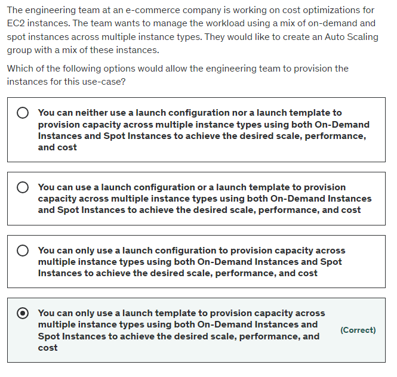

해설:

정답 D.

여러 인스턴스 유형을 사용하여 On-Demand 인스턴스 및 Spot 인스턴스를 모두 활용하여 원하는 규모, 성능 및 비용을 얻기 위해 발전 템플릿을 사용할 수 있습니다. 발전 템플릿은 발전 구성과 유사하며 AMI(Amazon Machine Image) ID, 인스턴스 유형, 키페어, 보안 그룹 및 EC2 인스턴스를 시작하는 데 사용하는 기타 매개변수와 같은 인스턴스 구성 정보를 지정합니다. 또한 발전 템플릿 대신 발전 구성을 정의하면 여러 버전의 템플릿을 보유할 수 있습니다.

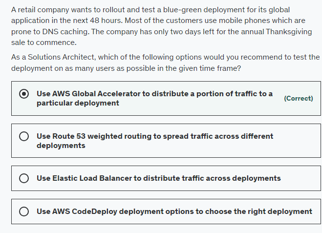

해설:

정답 A.

블루/그린 배포는 두 가지 동일한 환경 간에 트래픽을 이동하여 애플리케이션을 출시하는 기술입니다. "블루"는 현재 실행 중인 버전이고 "그린"은 새로운 버전입니다. 이 배포 유형은 현재 실행 중인 애플리케이션 버전에 영향을 미치지 않고 그린 환경에서 기능을 테스트할 수 있게 합니다. 그린 버전이 정상적으로 작동하는 것으로 확인되면 기존 블루 환경에서 새로운 그린 환경으로 트래픽을 점진적으로 전환할 수 있습니다. 블루/그린 배포는 소프트웨어 배포와 관련된 일반적인 위험을 완화할 수 있습니다. (예: 다운타임 및 롤백 기능)

AWS Global Accelerator를 사용하여 특정 배포에 대한 트래픽의 일부를 분산합니다. AWS Global Accelerator는 AWS 글로벌 네트워크를 통해 트래픽을 최적의 엔드포인트로 보내는 네트워크 레이어 서비스로, 인터넷 애플리케이션의 가용성과 성능을 향상시킵니다. 이는 단일 또는 여러 AWS 지역의 응용 프로그램 로드 밸런서, 네트워크 로드 밸런서, 탄력적인 IP 주소 또는 Amazon EC2 인스턴스와 같은 엔드포인트에 대한 고정된 입구 지점으로 작동하는 두 개의 정적 애니캐스트 IP 주소를 제공합니다.

AWS Global Accelerator는 엔드포인트 그룹의 엔드포인트에 트래픽의 비율을 결정하기 위해 엔드포인트 가중치를 사용하고, 트래픽 다이얼을 사용하여 엔드포인트 그룹(응용 프로그램이 배포된 AWS 지역)에 전송되는 트래픽의 백분율을 제어합니다.

DNS 서비스에 의존하는 것은 블루/그린 배포에 좋은 옵션일 수 있지만, 트래픽을 빠르고 통제된 방식으로 전환해야 하는 유스 케이스에는 적합하지 않을 수 있습니다. 일부 클라이언트 장치 및 인터넷 리졸버는 DNS 응답을 장기간 캐시할 수 있으며, 이는 DNS 서비스의 효율성을 향상시키고 인터넷을 통한 DNS 트래픽을 줄이며 권한 있는 이름 서버 과부하를 방지하여 복원 기술로 작동합니다. 이렇게 하면 블루/그린 배포에서 레코드를 업데이트하거나 라우팅 기본값을 변경하거나 응용 프로그램 오류가 발생할 때 사용자가 업데이트된 IP 주소를 수신하는 데 얼마나 오래 걸릴지 알 수 없는 단점이 있습니다.

AWS Global Accelerator를 사용하면 DNS 캐싱에 영향을 받지 않고 블루와 그린 환경 간에 트래픽을 점진적으로 또는 한 번에 이동시킬 수 있으며 트래픽 다이얼 및 엔드포인트 가중치 변경이 몇 초 내에 효과적입니다.

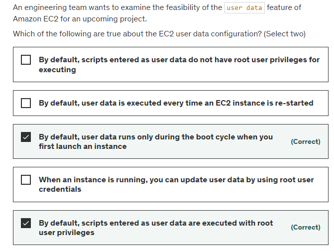

해설:

정답 C, E.

일반적으로 사용자 데이터(User Data)는 Amazon EC2에서 인스턴스를 시작한 후에 공통 자동 구성 작업을 수행하거나 스크립트를 실행하는 데 사용됩니다. Amazon EC2에서 인스턴스를 시작할 때 두 가지 유형의 사용자 데이터를 전달할 수 있습니다. 즉, 셸 스크립트와 클라우드 초기화(cloud-init) 지시문입니다. 또한 이 데이터를 일반 텍스트 또는 파일로 시작 마법사에 전달할 수 있습니다.

기본적으로 사용자 데이터로 입력된 스크립트는 root 사용자 권한으로 실행됩니다. 따라서 스크립트에서는 sudo 명령이 필요하지 않습니다. 생성하는 파일은 기본적으로 root 소유이며, 비-루트 사용자가 파일 액세스 권한을 갖도록하려면 스크립트에서 해당 권한을 수정해야 합니다.

기본적으로 사용자 데이터 및 클라우드 초기화 지시문은 처음 인스턴스를 시작할 때 부트 주기 동안에만 실행됩니다. 사용자 데이터 스크립트 및 클라우드 초기화 지시문이 인스턴스를 다시 시작할 때마다 실행되도록하려면 구성을 업데이트할 수 있습니다.

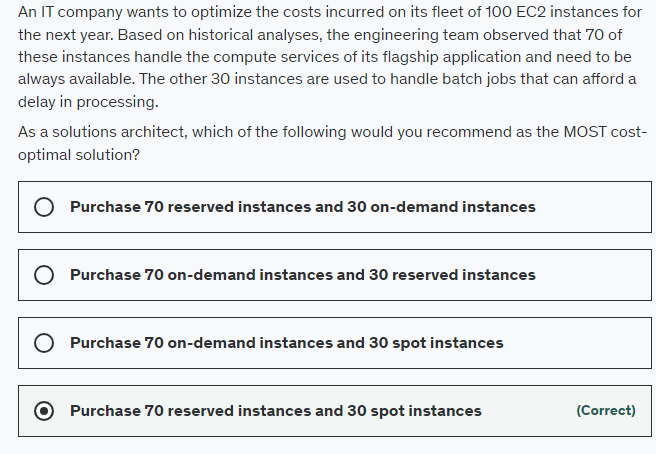

해설:

정답 D.

70개의 예약 인스턴스를 구매하고 30개의 스팟 인스턴스를 구매하십시오.

항상 사용 가능해야 하는 70개의 인스턴스는 1년 동안의 예약 인스턴스로 구매할 수 있습니다. 일괄 작업을 처리하는 데 사용되는 다른 30개의 인스턴스는 스팟 인스턴스로 구매할 수 있습니다. 일부 스팟 인스턴스가 중단되더라도 다른 스팟 인스턴스가 작업을 계속할 수 있습니다.

EC2 인스턴스 유형과 가격 측면에서 다양한 유형에 대한 자세한 개요를 확인하려면 다음을 참조하십시오.

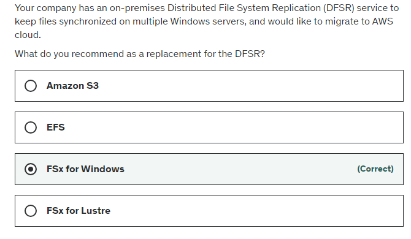

해설:

정답 C.

Amazon FSx for Windows File Server는 산업 표준 서비스 메시지 블록(SMB) 프로토콜을 통해 접근할 수 있는 완전히 관리되고 매우 신뢰성 있는 파일 스토리지를 제공합니다. Windows Server에서 구축되었으며 사용자 할당량, 최종 사용자 파일 복원 및 Microsoft Active Directory (AD) 통합과 같은 다양한 관리 기능을 제공합니다. 분산 파일 시스템 복제(DFSR) 서비스는 여러 서버에서 폴더를 동기화하는 데 사용되는 새로운 다중 마스터 복제 엔진입니다. Amazon FSx는 Microsoft의 분산 파일 시스템(DFS) 사용을 지원하여 최대 수백 PB 크기의 단일 폴더 구조로 공유를 구성할 수 있습니다.

FSx for Windows는 복제 기능을 갖춘 완벽한 분산 파일 시스템으로 Windows에 마운트할 수 있습니다.

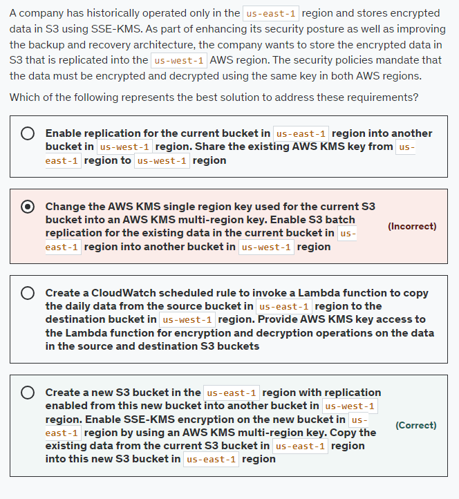

해설:

정답 D.

주어진 사용 사례에 따라 다음 단계를 수행해야 합니다. 먼저 us-east-1 지역에 새로운 S3 버킷을 만들고 이를 us-west-1 지역의 다른 버킷으로 복제 설정합니다. 그런 다음 해당 새 버킷에 AWS KMS 다중 지역 키를 사용하여 SSE-KMS 암호화를 활성화하고 현재 S3 버킷에서 기존 데이터를 새로운 S3 버킷으로 복사합니다.

1. us-east-1 지역에 새로운 S3 버킷 생성:
    - 새로운 S3 버킷을 생성하고 replication을 설정하여 데이터를 us-west-1 지역의 다른 S3 버킷으로 복제합니다.

2. SSE-KMS 암호화 활성화:
    - 새로운 S3 버킷에서 SSE-KMS 암호화를 활성화하고, AWS KMS 다중 지역 키를 사용하여 키를 생성합니다.

3. 기존 데이터 복사:
    - AWS CLI 또는 SDK를 사용하여 현재 S3 버킷의 기존 데이터를 새로운 S3 버킷으로 복사합니다.

이러한 단계를 따르면 데이터가 복제 및 SSE-KMS 암호화되어 안전하게 저장될 것입니다.

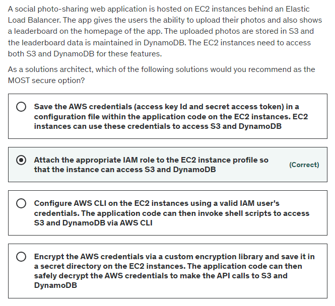

해설:

정답 B.

올바른 IAM 역할을 EC2 인스턴스 프로파일에 연결하여 해당 인스턴스가 S3 및 DynamoDB에 액세스할 수 있도록 해야 합니다. EC2 인스턴스에서 실행되는 애플리케이션은 AWS API 요청에 AWS 자격 증명을 포함해야 합니다. 그러나 개발자가 EC2 인스턴스 내에서 직접 AWS 자격 증명을 저장하고 해당 자격 증명을 사용하여 애플리케이션을 실행하게 할 수 있습니다. 그러나 개발자는 자격 증명을 관리하고 각 인스턴스에 안전하게 자격 증명을 전달하며 자격 증명을 회전할 때마다 각 EC2 인스턴스를 업데이트해야 합니다.

대신 EC2 인스턴스에서 실행되는 응용 프로그램에 대한 일시적인 자격 증명을 관리하기 위해 IAM 역할을 사용해야 합니다. 역할을 사용하면 긴 기간 동안 유지되는 자격 증명(예: 사용자 이름 및 액세스 키 또는 암호)을 EC2 인스턴스에 배포할 필요가 없습니다. 역할은 응용 프로그램이 다른 AWS 리소스에 대한 호출을 수행할 때 사용할 수 있는 일시적인 권한을 제공합니다. EC2 인스턴스를 시작할 때 인스턴스에 연결할 IAM 역할을 지정합니다. 그런 다음 인스턴스에서 실행되는 응용 프로그램은 역할에서 제공하는 일시적인 자격 증명을 사용하여 API 요청에 서명할 수 있습니다. 따라서 이 옵션이 올바릅니다.

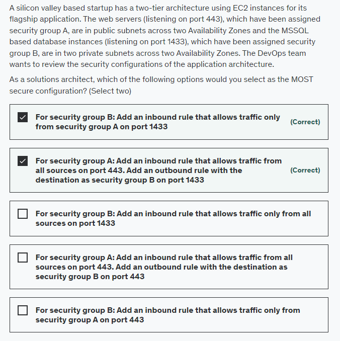

해설:

정답 A, B.

보안 그룹 A에 대한 권장 구성은 다음과 같습니다:

1. 443 포트에서 모든 소스로부터의 트래픽을 허용하는 인바운드 규칙 추가
2. 대상을 보안 그룹 B로 하고 1433 포트로 하는 아웃바운드 규칙 추가

보안 그룹 B에 대한 권장 구성은 다음과 같습니다:

1. 1433 포트에서만 보안 그룹 A로부터의 트래픽을 허용하는 인바운드 규칙 추가

위의 규칙들은 웹 서버가 443 포트에서 HTTPS 프로토콜을 통해 모든 소스로부터의 트래픽을 수신할 수 있도록 보장합니다. 웹 서버는 보안 그룹 B에 있는 MSSQL 서버로 1433 포트에서만 아웃바운드 트래픽을 허용합니다.

또한, MSSQL 서버는 1433 포트에서만 보안 그룹 A에 있는 웹 서버로부터의 트래픽을 수신하도록 보장합니다.

따라서 이러한 구성은 모두 올바릅니다.


해설:

정답 D.

80 예약 인스턴스를 구매합니다. 워크로드 수요에 따라 추가 온디맨드 및 스팟 인스턴스를 프로비저닝하려면 Auto Scaling 그룹과 런치 템플릿을 사용하십시오.

안정적인 워크로드 수요가 80개의 인스턴스인 경우 80개의 예약 인스턴스를 구매하여 비용을 절약할 수 있습니다. 추가 워크로드 수요에 따라 온디맨드 및 스팟 인스턴스의 혼합을 지정하려면 런치 템플릿을 사용하여 Application Load Balancer와 함께 Auto Scaling 그룹을 설정합니다.


