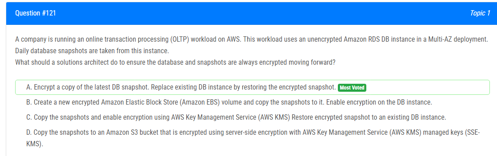

해설:

정답 A.

최신 DB 스냅샷을 암호화하는 것은 보안 향상에 기여합니다.
스냅샷을 복사하고 암호화하는 방법을 선택함으로써 기존 데이터를 유지하면서 보안을 강화할 수 있습니다.
Multi-AZ 배포에서 작업 중인 OLTP 워크로드에서는 데이터의 일시 중단 없이 스냅샷 복원이 가능합니다.

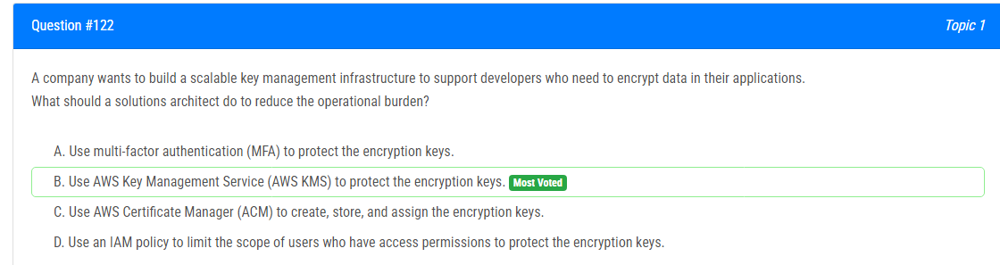

해설:

정답 B.

AWS Key Management Service (AWS KMS)는 클라우드에서 손쉽게 관리되는 키를 생성하고 제어하는 서비스로, 데이터 암호화에 필요한 키를 쉽게 관리할 수 있습니다. 여러 가지 이유로 B가 적절한 답입니다.

관리 용이성: AWS KMS는 키의 생성, 회전, 비활성화 등을 지원하며 키의 수명 주기를 쉽게 관리할 수 있습니다. 이는 운영 부담을 줄일 수 있습니다.

보안 강화: AWS KMS는 안전한 하드웨어 보안 모듈 (HSM)을 사용하여 키를 안전하게 저장하고 관리합니다. 이는 고급 보안 수준을 제공하며, 데이터 보호를 강화합니다.

통합 및 호환성: AWS KMS는 AWS 서비스 및 여러 개발 플랫폼과 통합되어 있어, 다양한 애플리케이션 및 서비스에서 사용하기 용이합니다.

접근 제어: AWS KMS는 AWS Identity and Access Management (IAM)을 통해 액세스를 제어하므로, 키에 대한 액세스를 필요한 사용자에게만 제한할 수 있습니다.

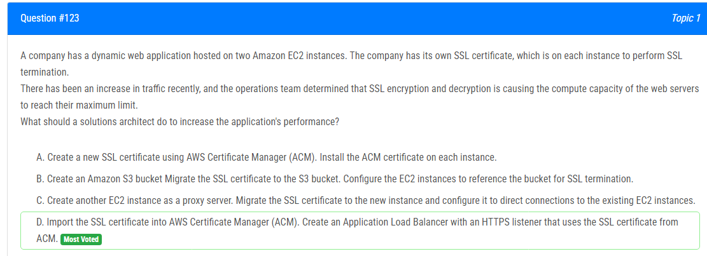

해설:

정답 D.

SSL/TLS 종료의 Offload: ACM에서 제공하는 SSL 인증서와 함께 HTTPS 리스너를 갖는 ALB를 사용하면 SSL/TLS 종료 부담을 EC2 인스턴스에서 로드 밸런서로 오프로드할 수 있습니다. 로드 밸런서는 SSL 종료를 효율적으로 처리할 수 있어 EC2 인스턴스의 계산 부하를 줄입니다.

자동 인증서 관리: ACM은 SSL/TLS 인증서의 자동 갱신 및 관리를 제공합니다. 이로써 SSL 인증서를 개별 EC2 인스턴스에서 수동으로 관리하는 작업을 줄일 수 있습니다.

확장성: ALB는 자동으로 여러 EC2 인스턴스에 들어오는 트래픽을 분산할 수 있어 애플리케이션의 확장성을 향상시킵니다. 개별 인스턴스를 과부하로부터 보호하면서 증가하는 트래픽을 처리할 수 있도록 도와줍니다.

중앙 집중식 인증서 관리: ACM은 SSL 인증서에 대한 중앙 집중식 관리를 제공합니다. 이로써 개별 인스턴스의 구성을 수정하지 않고도 인증서를 관리하고 업데이트하는 작업이 간편해집니다.

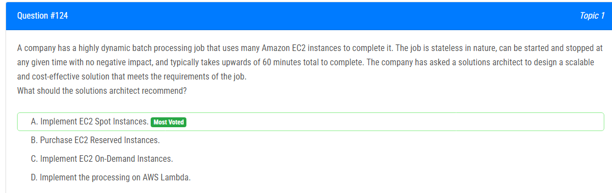

해설:

정답 A.

비용 효율성: EC2 Spot Instances는 예비 용량을 사용하며 온디맨드 가격보다 훨씬 저렴합니다. 배치 처리 작업에서 유동적인 특성을 가지고 있으므로 저렴한 가격으로 인스턴스를 얻을 수 있습니다.

환경의 유연성: Spot Instances는 언제든지 중단될 수 있지만, 배치 처리 작업이 상태가 없고 중단될 때 부정적인 영향이 없다면 이는 이상적입니다. 작업이 중단되면 중단 예고 기간이 제공되며, 적절한 작업 상태 관리를 통해 중단에 대응할 수 있습니다.

스케일링: 배치 처리 작업이 매우 동적이며 스케일링이 필요한 경우, Spot Instances를 사용하여 필요한 용량을 빠르게 확장할 수 있습니다.

시간 제한이 없음: Spot Instances는 필요한 용량을 언제든지 사용할 수 있으며, 특히 작업에 시간 제한이 없는 경우에 적합합니다.

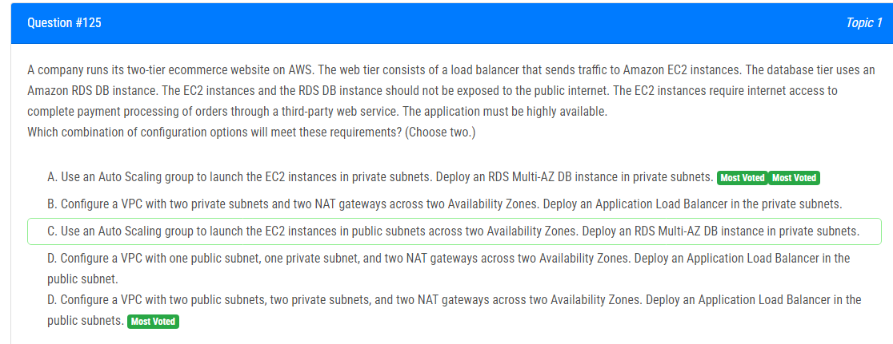

해설:

정답 A, D.

A와 D의 조합이 주어진 요구 사항을 충족시키는 구성 옵션입니다.

- A : 이 옵션은 EC2 인스턴스를 프라이빗 서브넷에서 시작하고, RDS Multi-AZ DB 인스턴스를 또한 프라이빗 서브넷에 배치하는 것입니다. 이로써 외부에서 직접 액세스할 수 없도록 보호됩니다.

- B : 이 옵션은 VPC를 두 개의 퍼블릭 서브넷, 두 개의 프라이빗 서브넷, 두 개의 NAT 게이트웨이로 구성하고, 퍼블릭 서브넷에 Application Load Balancer를 배치합니다. 이로써 외부에서 웹 트래픽이 로드 밸런서를 통해 EC2 인스턴스로 전송되지만, EC2 인스턴스와 RDS DB 인스턴스는 프라이빗 서브넷에 위치하여 외부에서 직접 액세스할 수 없습니다.

이렇게 하면 웹 트래픽은 퍼블릭 서브넷에 있는 로드 밸런서를 통해 EC2 인스턴스로 라우팅되며, 데이터베이스 트래픽은 프라이빗 서브넷에 있는 RDS DB 인스턴스로 라우팅됩니다. 이러한 구성은 보안을 강화하고 필요한 트래픽만 허용하여 요구 사항을 충족시킵니다.

해설:

정답 B.

S3 Glacier Deep Archive 활용: S3 Glacier Deep Archive는 데이터를 매우 저렴한 비용으로 오랫동안 보관할 수 있는 서비스입니다. 이것은 데이터를 2년 후에 전환할 경우에 이상적입니다.

S3 Lifecycle 정책 활용: S3에서는 Lifecycle 정책을 사용하여 객체의 수명 주기를 관리할 수 있습니다. 이를 통해 특정 시점 이후에 데이터를 다른 스토리지 클래스로 자동으로 전환하고 비용을 절약할 수 있습니다.

Immediate Availability for Recent Data: 데이터의 최근 2년은 S3 Standard storage class에 남겨두어야 하며, 이는 높은 가용성과 즉각적인 검색 가능성을 제공합니다.

25-Year Data Retention: S3 Glacier Deep Archive로 데이터를 전환하면 비용을 크게 절감하면서도 25년간의 데이터 보관 요구를 충족할 수 있습니다.

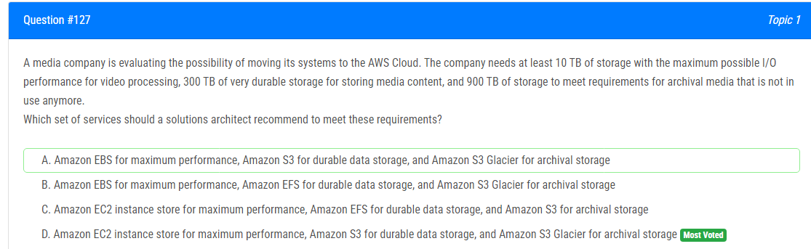

해설:

정답 D.

Amazon EC2 인스턴스 스토어 (Instance Store) for Maximum Performance: Amazon EC2 인스턴스 스토어는 인스턴스에 물리적으로 연결된 저장 공간으로 높은 I/O 성능을 제공합니다. 이는 비디오 처리와 같은 고성능 요구사항에 적합합니다.

Amazon S3 for Durable Data Storage: Amazon S3는 내구성이 높은 객체 스토리지 서비스로, 미디어 콘텐츠를 안전하게 저장하는 데 사용될 수 있습니다. Amazon S3는 내구성과 가용성이 뛰어나며, 데이터에 대한 높은 신뢰성을 제공합니다.

Amazon S3 Glacier for Archival Storage: Amazon S3 Glacier는 저렴한 비용으로 데이터를 아카이브하는 데 사용됩니다. 미디어 회사의 아카이브 데이터를 안전하게 저장하면서도 필요할 때 검색이 가능합니다.

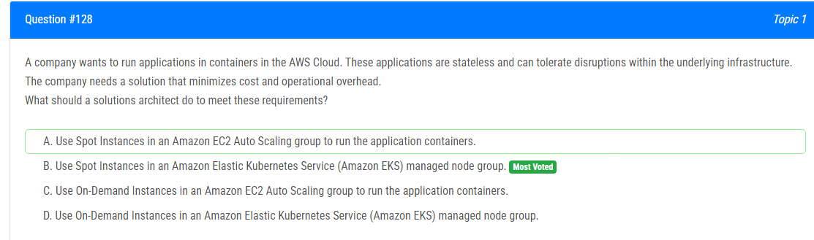

해설:

정답 B.

Spot Instances 활용: Spot Instances는 저렴한 비용으로 가용한 EC2 용량을 활용할 수 있습니다. Stateless하고 인프라의 중단을 허용할 수 있는 상태인 경우에 Spot Instances를 사용하여 비용을 최소화할 수 있습니다.

Amazon EKS 관리형 노드 그룹 활용: Amazon EKS를 사용하면 Kubernetes 클러스터를 쉽게 관리할 수 있습니다. 관리형 노드 그룹을 사용하면 클러스터의 노드 수를 자동으로 조정할 수 있으며, Spot Instances를 사용할 수 있습니다.

운영 부하 최소화: Amazon EKS와 Spot Instances의 조합은 자동 크기 조정 및 저렴한 비용으로 인프라를 활용할 수 있어 운영 부하를 최소화합니다.

컨테이너 기반의 애플리케이션에 적합: Stateless하고 인프라 중단을 허용할 수 있는 애플리케이션은 컨테이너 기반으로 배포하는 것이 이점이 있습니다. Amazon EKS는 Kubernetes를 제공하여 컨테이너 오케스트레이션을 간소화하고 관리를 쉽게 합니다.

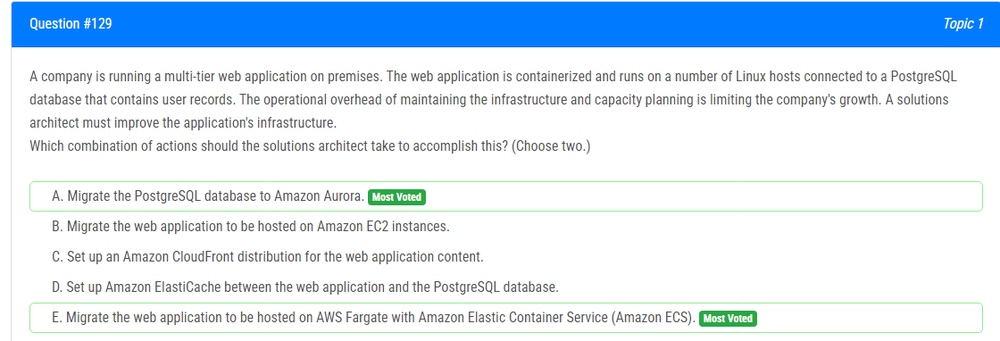

해설:

정답 A, E.

A와 E의 조합이 주어진 시나리오에서 인프라를 개선하는데 가장 효과적입니다.

**A. PostgreSQL 데이터베이스를 Amazon Aurora로 마이그레이션하기:**
- Amazon Aurora는 MySQL 및 PostgreSQL 호환성을 갖춘 관리형 데이터베이스 서비스로, 가장 일반적인 오픈 소스 데이터베이스와 호환되면서 성능과 가용성이 향상됩니다. 이것은 관리 부담을 줄이고 확장성을 높일 수 있는 솔루션입니다.

**E. 웹 애플리케이션을 AWS Fargate 및 Amazon ECS로 마이그레이션하기:**
- AWS Fargate와 Amazon ECS는 컨테이너화된 애플리케이션을 실행하고 관리하기 위한 서비스입니다. Fargate를 사용하면 인프라 관리에서 해방되고, 컨테이너의 배포와 확장이 간단해집니다. 이것은 운영 오버헤드를 줄이고 효율적인 관리를 가능케 합니다.

이러한 접근 방식은 관리형 서비스인 Aurora와 Fargate를 통해 데이터베이스 및 애플리케이션 인프라의 운영 부담을 최소화하면서도 성능과 가용성을 향상시킬 수 있습니다.

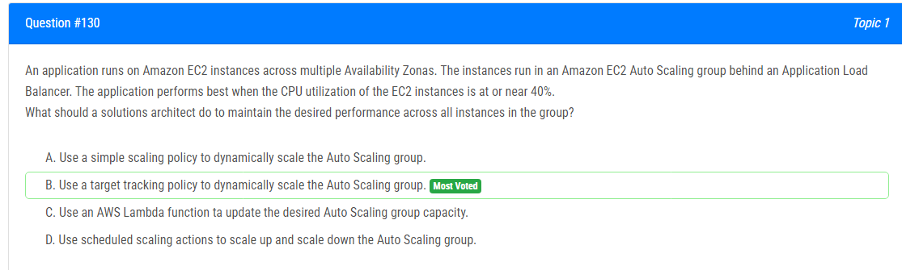

해설:

정답 B.

대상 추적 정책 활용: 대상 추적 정책은 특정 지표에 따라 Auto Scaling 그룹을 조절하는 데 효과적입니다. CPU 사용률이 특정 값(예: 40%)에 도달하도록 대상 추적 정책을 설정하면 Auto Scaling 그룹은 필요한 경우에 인스턴스를 추가하거나 제거하여 원하는 성능을 유지할 수 있습니다.

자동 스케일링 기능: 대상 추적 정책을 사용하면 자동으로 EC2 인스턴스를 확장하거나 축소하여 원하는 대상 값을 유지할 수 있습니다. 이는 애플리케이션이 최적의 성능을 발휘하면서도 불필요한 자원을 소비하지 않도록 합니다.

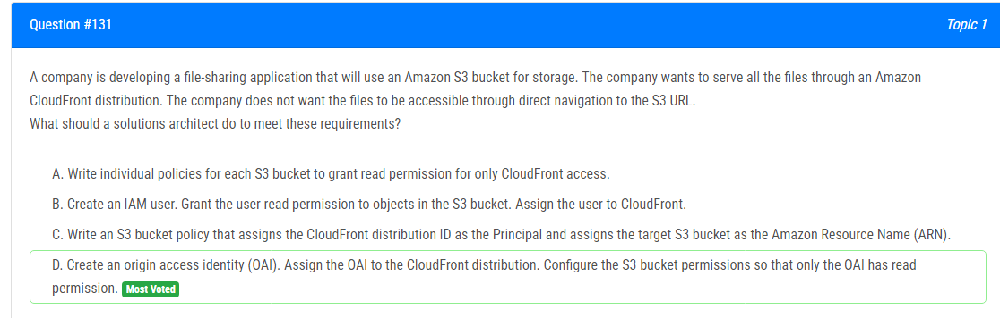

해설:

정답 D.

CloudFront와 S3 통합: 오리진 액세스 식별자(OAI)는 CloudFront 배포와 연결하여 CloudFront에서만 S3 버킷에 액세스할 수 있도록 하는 데 사용됩니다.

강력한 접근 제어: 이 방법을 사용하면 S3 버킷에 대한 직접적인 액세스가 CloudFront를 통하지 않고는 불가능하게 됩니다. 이로써 파일에 대한 액세스를 CloudFront를 통해서만 허용하고 S3 URL로의 직접 액세스를 방지할 수 있습니다.

IAM 사용에 비해 간단하고 효과적: S3 버킷 정책이나 IAM 사용자를 만들어 일일히 권한을 구성하는 것보다 OAI를 사용하는 것이 간단하면서도 효과적인 방법입니다.

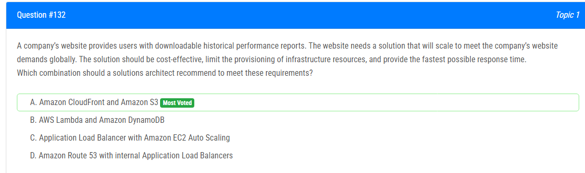

해설:

정답 A.

글로벌 확장 가능성: Amazon CloudFront는 글로벌 콘텐츠 전송 네트워크(CDN)로, 사용자에게 빠른 응답 시간을 제공하는 데 효과적입니다. CloudFront는 여러 엣지 로케이션에 데이터를 캐시하고 사용자가 가장 가까운 엣지 로케이션에서 데이터를 제공하여 응답 시간을 최소화합니다.

비용 효율성 및 인프라 리소스 제한: Amazon S3는 비용 효율적이며 사용자가 데이터를 저장하고 검색할 수 있는 신뢰성 있는 스토리지 서비스입니다. CloudFront는 인프라 리소스를 증가시키지 않고도 전 세계적으로 데이터를 배포하고 캐싱할 수 있기 때문에 비용이 효과적입니다.

최고의 응답 시간: CloudFront를 사용하면 정적 콘텐츠를 가장 가까운 엣지로 전송하여 사용자에게 최고의 응답 시간을 제공할 수 있습니다.

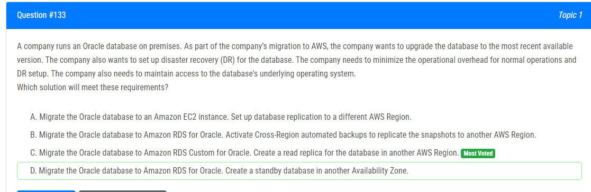

해설:

정답 C.

Amazon RDS Custom for Oracle: 이 옵션은 사용자가 특정 Oracle 데이터베이스 업그레이드 요구 사항을 처리할 수 있도록 하는 맞춤형 마이그레이션 옵션을 제공합니다.

다른 AWS 리전에 읽기 복제본 생성: Amazon RDS에서는 다른 AWS 리전에 대한 읽기 전용 복제본을 생성할 수 있습니다. 이를 통해 복제된 데이터베이스가 다른 지리적 위치에서의 재해 복구에 사용될 수 있습니다.

운영 오버헤드 최소화: Amazon RDS는 관리형 서비스로, 데이터베이스의 운영을 AWS에게 위임하여 운영 오버헤드를 최소화합니다. Amazon RDS는 자동 백업, 소프트웨어 패치, 모니터링 등을 지원합니다.

운영 체제 액세스 유지: Amazon RDS는 데이터베이스 레벨의 관리를 담당하므로 운영 체제 수준의 액세스는 제한적입니다. 그러나 Amazon EC2 인스턴스에 직접 액세스해야 하는 경우 EC2 인스턴스를 활용하면 됩니다.

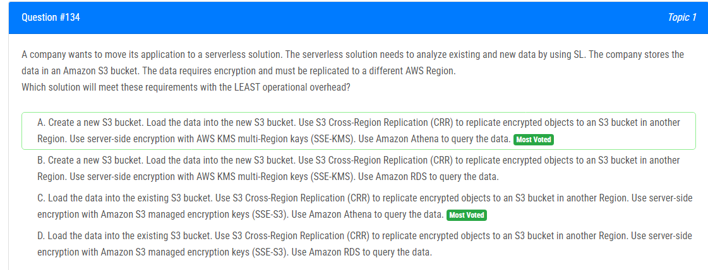

기존 S3 버킷 사용: 새로운 S3 버킷을 생성하는 대신 기존 S3 버킷에 데이터를 로드하여 추가 설정이나 버킷 관리 작업을 피할 수 있습니다.

S3 Cross-Region Replication (CRR) 활용: CRR을 사용하면 데이터를 안전하게 다른 AWS 리전의 S3 버킷으로 복제할 수 있습니다. 이는 DR(Distributed Replication) 요구 사항을 충족하며 데이터를 안전하게 백업할 수 있습니다.

서버 측 암호화 및 AWS KMS 활용: SSE-S3를 사용하여 데이터를 서버 측에서 암호화하면 쉽게 관리되며 안전합니다. Amazon S3는 이를 관리하기 위해 내장된 키를 사용합니다.

Amazon Athena 활용: Athena는 서버리스 쿼리 서비스로, SQL을 사용하여 S3에 저장된 데이터를 간단하게 분석할 수 있습니다.

운영 오버헤드 최소화: Amazon S3, CRR, 및 Amazon Athena는 모두 관리형 서비스로, 데이터의 로딩, 복제, 및 쿼리에 대한 운영 오버헤드를 최소화합니다.

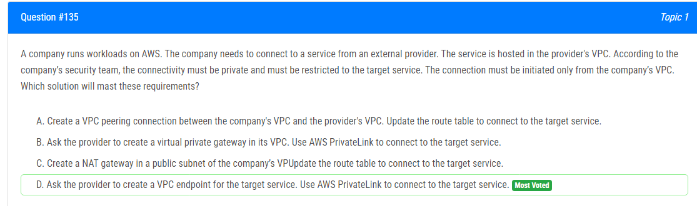

해설:

정답 D.

AWS PrivateLink 활용: AWS PrivateLink는 서비스 제공 업체의 VPC와 안전하고 프라이빗한 링크를 만들어줍니다. 이를 통해 공유 리소스에 대한 네트워크 연결을 보호하고 회사의 VPC에서만 해당 서비스에 연결이 가능하게 합니다.

VPC 엔드포인트 활용: VPC 엔드포인트를 사용하면 외부 서비스에 대한 연결을 프라이빗하게 유지할 수 있습니다. VPC 엔드포인트를 생성하면 데이터가 인터넷을 통해 전송되지 않고, 대신에 AWS 백본 네트워크를 통해 연결이 이루어집니다.

외부에서의 접근 방지: 이 방법을 사용하면 회사의 VPC에서만 대상 서비스에 연결이 가능하게 하므로 외부에서의 접근을 막을 수 있습니다.

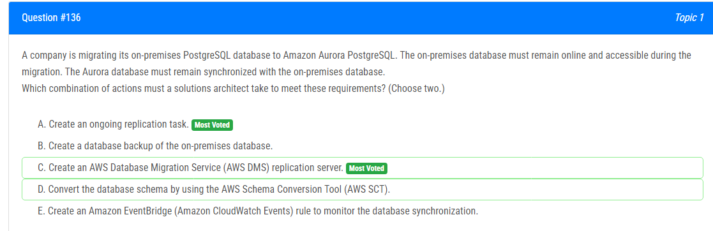

해설:

정답 A, C.

A. 지속적인 복제 작업 생성: Amazon Aurora PostgreSQL은 RDS 서비스 내에서 데이터베이스를 제공하며, Aurora에서 다른 Aurora 인스턴스로의 지속적인 복제 작업을 생성할 수 있습니다. 이를 통해 on-premises PostgreSQL 데이터베이스와의 동기화를 유지하면서 마이그레이션을 수행할 수 있습니다.

C. AWS DMS 복제 서버 생성: AWS Database Migration Service (DMS)는 데이터베이스 간에 실시간 데이터를 이동하고 변환하는 서비스입니다. AWS DMS를 사용하여 on-premises PostgreSQL 데이터베이스에서 Aurora PostgreSQL로의 데이터 마이그레이션을 수행할 수 있습니다. Replication Server를 생성하여 지속적인 데이터 동기화를 유지할 수 있습니다.

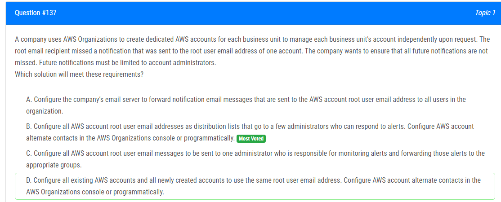

해설:

정답 B.

AWS 계정 대체 연락처: AWS 계정 대체 연락처를 설정하면 경고 및 알림과 관련된 중요한 이메일을 지정된 대체 연락처로도 전송할 수 있습니다. 이것은 예를 들어 긴급한 사항에 대한 관리자에게 직접 알림을 보내는 데 사용될 수 있습니다.

AWS 조직 사용: AWS 조직을 사용하면 AWS 계정 간에 조직을 구성하고 중앙에서 이러한 계정을 관리할 수 있습니다. 각 계정에 대해 대체 연락처를 구성하여 중요한 알림을 적절한 관리자에게 보낼 수 있습니다.

분산된 알림 관리: 알림을 각 계정의 루트 사용자 이메일 주소에서 한 곳으로 집중화하고 이를 적절한 관리자 그룹에게 라우팅하여 알림을 놓치지 않도록 합니다.

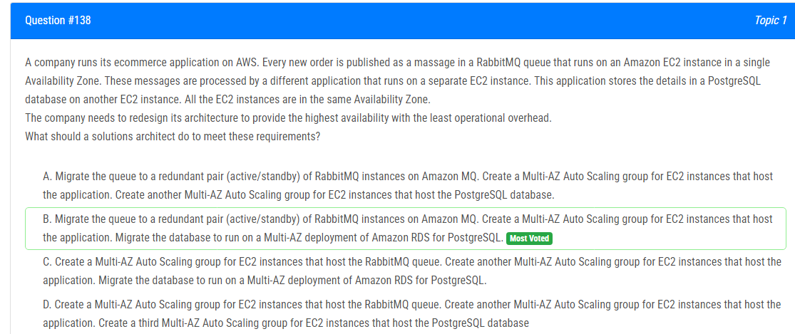

해설:

정답 B.

Amazon MQ의 Active/Standby 구성: RabbitMQ 인스턴스를 Amazon MQ로 마이그레이션하면 Active/Standby와 같은 고가용성 구성을 간단하게 설정할 수 있습니다. 이것은 메시지 큐 서비스의 높은 가용성을 보장합니다.

Amazon RDS for PostgreSQL의 Multi-AZ 배포: PostgreSQL 데이터베이스를 Amazon RDS로 마이그레이션하고 Multi-AZ 배포를 사용하면 자동 장애 복구 및 데이터베이스의 높은 가용성을 얻을 수 있습니다. RDS가 Multi-AZ로 설정되면 데이터베이스 엔진의 가용 영역 간 자동 복제가 활성화됩니다.

Multi-AZ Auto Scaling 그룹: 응용 프로그램과 RabbitMQ 인스턴스를 호스팅하는 EC2 인스턴스에 대한 Multi-AZ Auto Scaling 그룹을 생성하여 애플리케이션 계층에서도 고가용성을 확보합니다. Auto Scaling 그룹을 사용하면 인스턴스 수를 조정하고 장애 시 자동으로 대체할 수 있습니다.

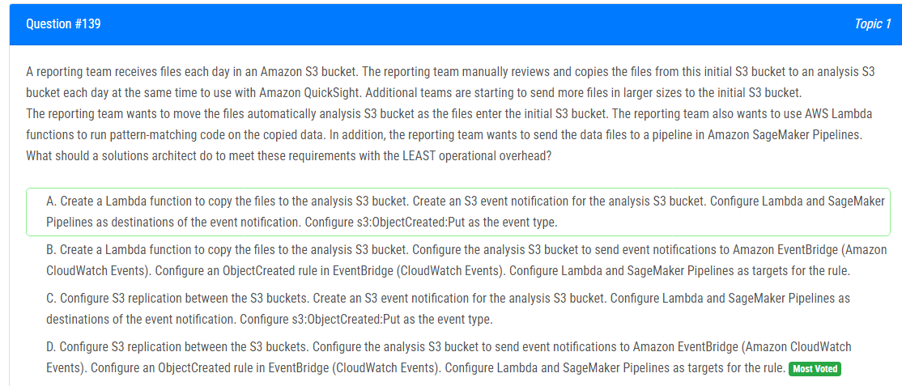

해설:

정답 D.

S3 복제: S3 버킷 간 복제를 사용하면 초기 S3 버킷의 파일이 자동으로 분석 S3 버킷으로 복제됩니다. 이는 수동으로 이동하는 작업을 자동으로 수행하므로 운영 오버헤드를 최소화합니다.

EventBridge (CloudWatch Events): 분석 S3 버킷에서 ObjectCreated 이벤트에 대한 Amazon EventBridge 규칙을 설정하면 파일이 S3 버킷에 업로드될 때 Lambda 함수 및 SageMaker 파이프라인이 자동으로 트리거됩니다.

Lambda 함수 및 SageMaker Pipelines 대상 설정: EventBridge (CloudWatch Events)의 규칙에서 Lambda 함수 및 SageMaker Pipelines를 대상으로 설정하여 이벤트가 발생할 때 실행되도록 구성합니다.

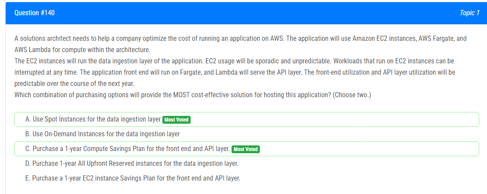

해설:

정답 A, C.

A. 데이터 수집 레이어에 Spot Instances 사용: EC2 인스턴스의 사용이 불규칙하고 예측이 어려운 경우 Spot Instances를 사용하면 더 저렴한 비용으로 인스턴스를 확보할 수 있습니다. Spot Instances는 가용성이 있고 임시적인 용도에 적합하며, 인스턴스가 중단될 수 있음에 유의해야 합니다. 데이터 수집 작업이 중단되어도 무방한 경우에 적합합니다.

C. 프론트엔드 및 API 레이어에 1년간의 Compute Savings Plan 구매: 프론트엔드 및 API 레이어는 사용량이 예측 가능하며, 여기에 대한 1년간의 Compute Savings Plan을 구매하면 예약 인스턴스 또는 사용 계획을 통해 추가적인 할인을 받을 수 있습니다. 이러한 유형의 리소스에 대해 예약 또는 사용 계획을 사용하면 예측 가능한 워크로드에 대한 비용을 최적화할 수 있습니다.

