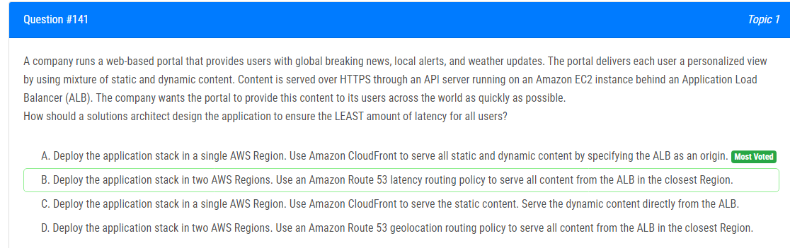

해설:

정답 A.

단일 AWS 지역에 응용 프로그램 스택을 배포하고 Amazon CloudFront를 사용하여 모든 정적 및 동적 콘텐츠를 제공하면, CloudFront 엣지 위치를 통해 사용자에게 최적의 경로로 제공됩니다. CloudFront는 사용자에게 가장 가까운 엣지로 정적 콘텐츠를 캐싱하여 레이턴시를 최소화하고, 동적 콘텐츠는 여전히 ALB에서 제공됩니다. 이로써 사용자는 전 세계 어디에서나 빠르게 콘텐츠에 액세스할 수 있습니다.

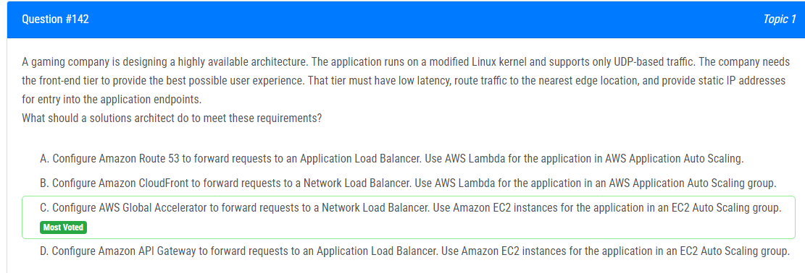

해설:

정답 C.

AWS Global Accelerator를 사용하여 요청을 Network Load Balancer(NLB)로 전달하면, Global Accelerator는 사용자에게 가장 가까운 엣지 위치로 트래픽을 라우팅하여 최소의 레이턴시를 제공합니다. 또한, Global Accelerator는 정적 IP 주소를 제공하여 응용 프로그램 엔드포인트에 대한 안정적인 IP 주소를 유지할 수 있습니다. 이는 사용자 경험을 향상시키는 데 도움이 됩니다.

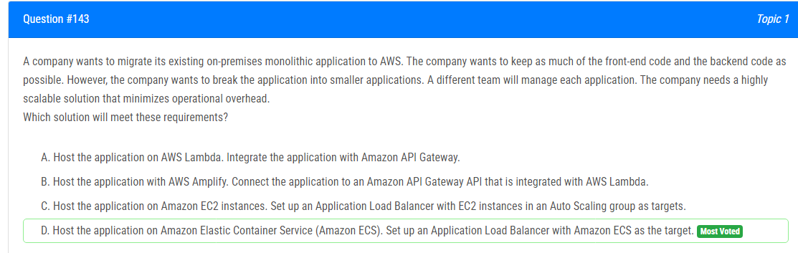

해설:

정답 D.

Amazon Elastic Container Service (Amazon ECS)를 사용하여 응용 프로그램을 호스팅하면, 모놀리식 응용 프로그램을 여러 개의 작은 컨테이너로 분할할 수 있습니다. 이를 통해 각 컨테이너는 다른 팀에 의해 독립적으로 관리될 수 있습니다. 또한, Amazon ECS는 컨테이너 오케스트레이션을 제공하여 응용 프로그램의 확장성을 확보할 수 있습니다.

Application Load Balancer (ALB)를 사용하면 여러 Amazon ECS 컨테이너를 로드 밸런싱하고, Auto Scaling 그룹을 통해 트래픽의 증가에 따라 자동으로 컨테이너를 확장할 수 있습니다.

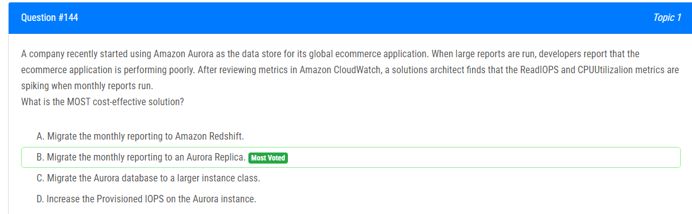

해설:

정답 B.

Aurora Replicas를 사용하여 월간 보고서 쿼리를 처리하면 Aurora의 주 복제본에 대한 부하를 줄일 수 있습니다. Aurora Replicas는 주 복제본에 비동기식으로 복제되므로, 읽기 작업을 처리하는 데 도움이 됩니다. 이는 주 복제본에 대한 부하를 분산시켜 전체 성능을 향상시키는 데 도움이 됩니다.

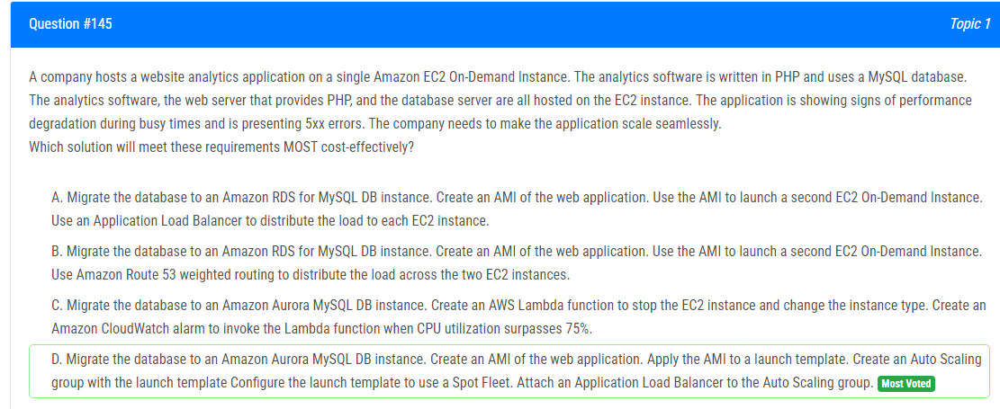

해설:

정답 D.

Amazon Aurora MySQL로 데이터베이스를 마이그레이션하고, Auto Scaling 그룹을 사용하여 EC2 인스턴스를 동적으로 확장하는 것이 비용 효율적인 솔루션일 수 있습니다. Aurora는 확장 가능하며 뛰어난 성능을 제공하므로, 기존의 단일 EC2 인스턴스보다 더 효율적으로 데이터베이스 요청을 처리할 수 있습니다.

Auto Scaling 그룹은 트래픽에 따라 EC2 인스턴스의 수를 자동으로 조절하여 성능을 유지하고 부하를 분산시킵니다. Spot Fleet를 사용하면 비용을 절감할 수 있습니다.

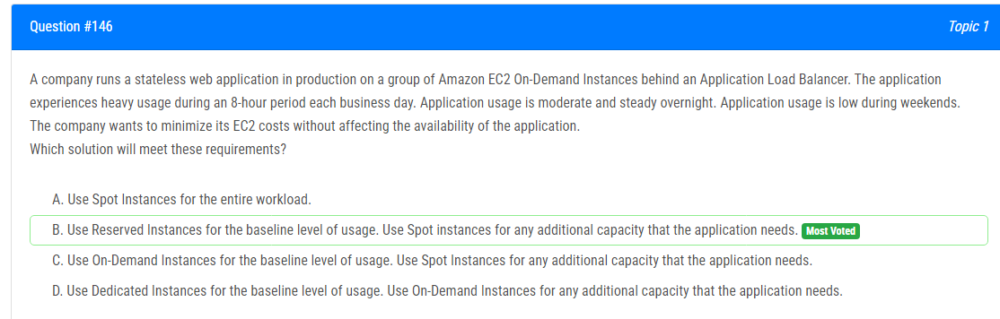

해설:

정답 B.

예약 인스턴스를 사용하여 기본 사용량을 충족시키고, 추가 용량이 필요한 경우 Spot 인스턴스를 사용하는 것이 비용 효율적인 방법일 수 있습니다. Reserved Instances는 약정된 용량을 제공하면서 비용을 절감하는 데 도움이 되고, Spot 인스턴스는 저렴한 가격에 추가 용량을 확보할 수 있습니다. 이것은 애플리케이션 사용량이 상시로 예측 가능한 기준치가 있는 경우에 특히 효과적입니다.

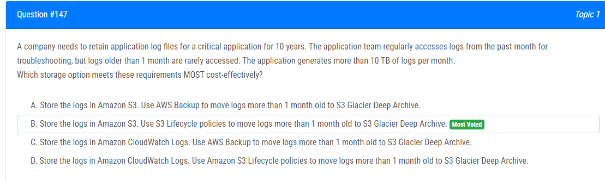

해설:

정답 B.

Amazon S3를 사용하여 로그를 저장하고, S3 Lifecycle 정책을 활용하여 1개월 이상된 로그를 S3 Glacier Deep Archive로 이동하는 것이 가장 비용 효율적입니다. S3 Glacier Deep Archive는 데이터 검색 비용이 높지만 저장 비용이 저렴하며, 오랜 기간 동안 데이터를 보관하는 데 적합합니다.

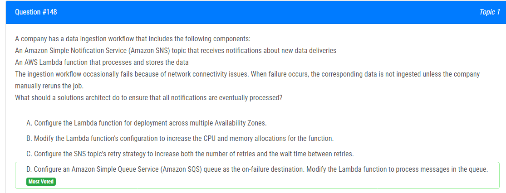

해설:

정답 D.

Amazon Simple Queue Service (Amazon SQS)를 사용하여 데이터 전송 작업을 안전하게 보관할 수 있습니다. SQS는 메시지 큐 서비스로, 데이터 전송에 대한 알림을 SQS 큐에 보내면, Lambda 함수가 큐에서 메시지를 처리할 수 있습니다. SQS는 메시지를 보관하고 재전송하는 기능을 제공하기 때문에, Lambda 함수가 실행되지 않았거나 실패했을 때에도 데이터가 안전하게 보존됩니다. 이 방식으로 데이터 유실을 방지할 수 있습니다.

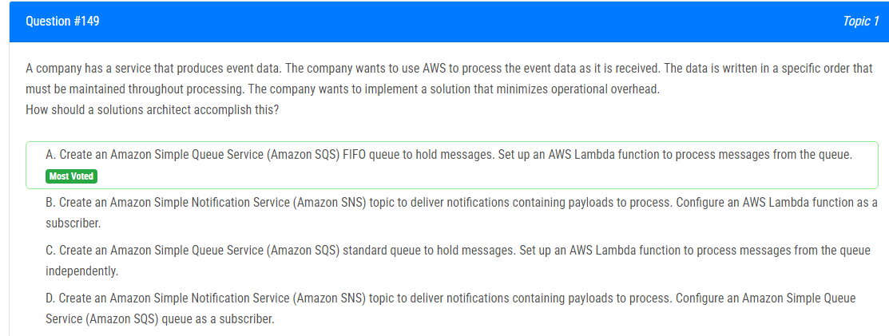

해설:

정답 A.

Amazon SQS FIFO (First-In-First-Out) 큐를 사용하여 메시지의 순서를 유지하면서 메시지를 보관할 수 있습니다. FIFO 큐는 순서대로 메시지를 전달하며, 이를 통해 이벤트 데이터의 특정 순서를 유지할 수 있습니다. AWS Lambda 함수를 사용하여 이 큐에서 메시지를 처리하면서 운영 오버헤드를 최소화할 수 있습니다. Lambda 함수는 필요에 따라 수평적으로 확장 가능하므로 대규모 이벤트 데이터도 효과적으로 처리할 수 있습니다.

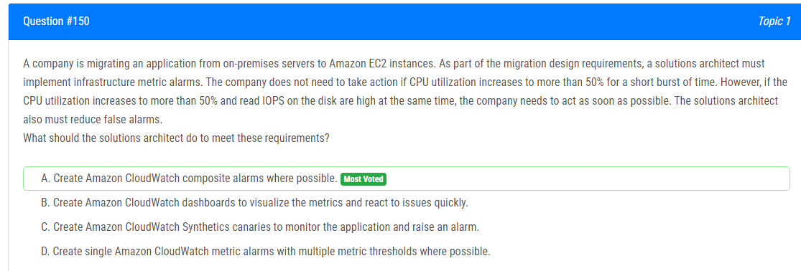

해설:

정답 A.

Amazon CloudWatch composite alarms를 사용하면 여러 메트릭에 대한 단일 알람을 생성할 수 있습니다. 이를 통해 여러 조건을 통합하여 복잡한 경보 로직을 생성할 수 있습니다. CPU 사용률이 50%를 초과하고 동시에 디스크의 읽기 IOPS가 높은 경우에만 경고를 발생시키도록 구성할 수 있습니다. 이는 두 가지 조건이 동시에 충족될 때만 경고가 생성되므로 CPU 사용률만 증가할 때는 경고가 발생하지 않게 할 수 있습니다. 또한, 이러한 복합 알람은 일반적으로 false alarm이 줄어들게 도와줍니다.

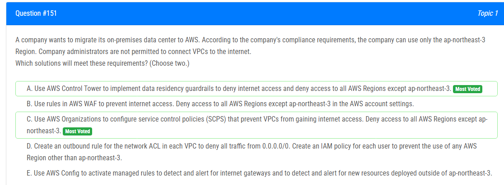

해설:

정답 A, C.

A. AWS Control Tower을 사용하여 데이터 보존 가이드레일을 구현하여 인터넷 액세스를 거부하고 ap-northeast-3 이외의 모든 AWS 지역에 대한 액세스를 거부하는 것이 적절합니다. AWS Control Tower는 AWS 리소스를 구축하고 준수 요구 사항을 준수하도록 도와주는 서비스입니다.

C. AWS Organizations를 사용하여 서비스 제어 정책(SCP)을 구성하여 VPC가 인터넷 액세스를 획득하는 것을 방지하고 ap-northeast-3 이외의 모든 AWS 지역에 대한 액세스를 거부할 수 있습니다. SCP를 사용하면 특정 계정 또는 OU(조직 단위)에 대한 액세스 권한을 제어할 수 있습니다.

이 두 가지 솔루션은 각각 AWS의 서비스를 이용하여 특정 리소스의 동작을 제어하고 AWS 지역에 대한 액세스를 제한하는 방법을 제공합니다.

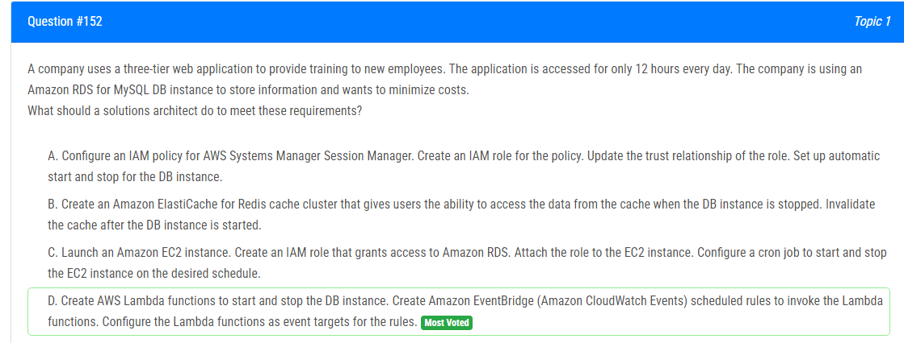

해설:

정답 D.

AWS Lambda 함수를 생성하여 DB 인스턴스를 시작하고 중지하는 데 사용하고, Amazon EventBridge (이전에는 CloudWatch Events) 예약된 규칙을 구성하여 Lambda 함수를 주기적으로 호출합니다. 이렇게하면 매일 정확한 시간에 DB 인스턴스가 시작되고 중지되므로 12시간 동안만 사용할 수 있습니다. 이는 비용을 최소화하고 필요한 시간에만 DB 인스턴스를 활성화할 수 있는 효과적인 방법입니다.

해설:

정답 D.

S3 Lifecycle 정책을 구현하여 S3 Standard에서 S3 Standard-Infrequent Access (S3 Standard-IA)로 객체를 이동하는 것이 좋습니다. 이 정책을 사용하면 특정 기간 동안 액세스되지 않은 객체를 자동으로 더 저렴한 저장 클래스로 이동시킬 수 있습니다. 여기서는 90일 후에 S3 Standard-IA로 이동하여 비용을 절감할 수 있습니다.

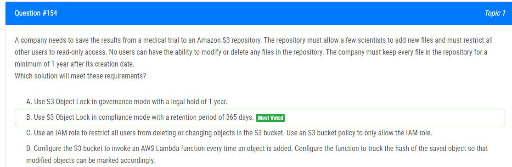

해설:

정답 B.

S3 Object Lock을 컴플라이언스 모드로 구성하고 보존 기간을 365일로 설정합니다. 이렇게 하면 모든 객체에 대해 수정 및 삭제가 방지되며, 보존 기간 동안 변경이 불가능하게 됩니다. 이 모드를 사용하면 법적 규정을 준수하면서 데이터의 안전한 보관을 보장할 수 있습니다.

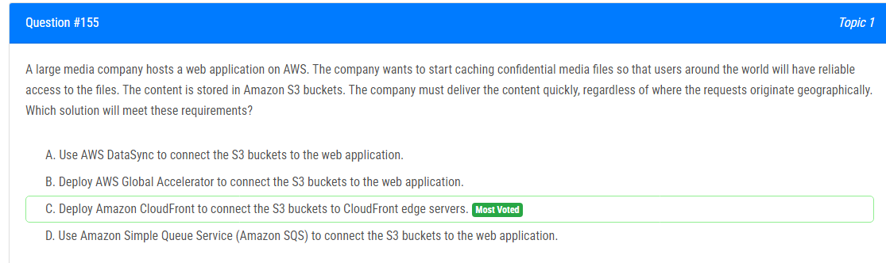

해설:

정답 C.

Amazon CloudFront을 배포하여 S3 버킷을 CloudFront 엣지 서버에 연결합니다. CloudFront는 전 세계 여러 위치에 있는 엣지 로케이션에서 캐시를 제공하여 사용자에게 빠르고 안정적인 액세스를 제공합니다. 이렇게 하면 사용자의 지리적 위치와 관계없이 빠르게 컨텐츠에 액세스할 수 있습니다.

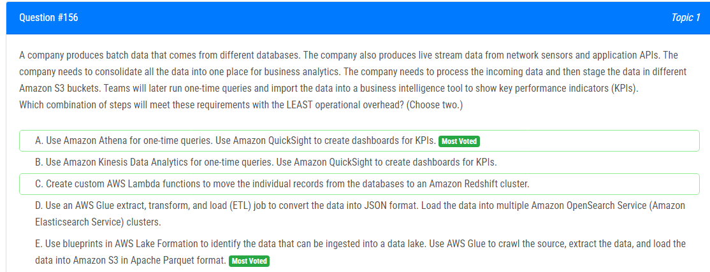

해설:

정답 A, E.

A. Amazon Athena를 사용하여 필요한 one-time 쿼리를 실행하고, Amazon QuickSight를 사용하여 KPI 대시보드를 만들 수 있습니다. Athena는 서버리스 쿼리 서비스로, 데이터를 쉽게 쿼리하고 분석할 수 있습니다. QuickSight는 비주얼 분석 도구로, Athena와 쉽게 통합하여 사용자 친화적인 대시보드를 생성할 수 있습니다.

E. AWS Lake Formation 블루프린트를 사용하여 데이터 레이크에 대한 스키마 및 보안 정책을 정의하고, AWS Glue를 사용하여 데이터를 추출, 변환 및 로드하여 Amazon S3에 Apache Parquet 형식으로 저장합니다. 이는 확장 가능하고 관리 편의성이 뛰어난 데이터 레이크 솔루션을 제공하며, 필요에 따라 더 많은 데이터 소스를 효과적으로 처리할 수 있습니다.

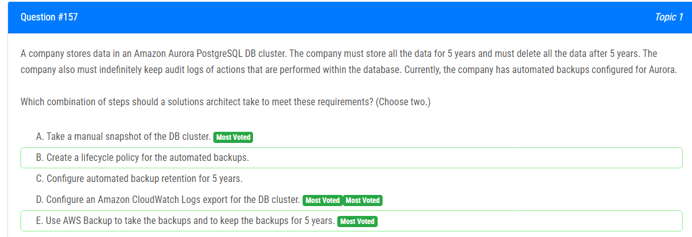

해설:

정답 D, E.

D. Amazon CloudWatch Logs를 사용하여 데이터베이스에서 수행된 작업에 대한 감사 로그를 수집하고 보존하는 것이 적절합니다. CloudWatch Logs export를 구성하여 이러한 로그를 지속적으로 저장하면 데이터베이스 작업에 대한 기록이 오랜 기간에 걸쳐 보존될 수 있습니다.

E. AWS Backup을 사용하여 백업을 수행하고 이를 5년 동안 보존하는 것이 좋습니다. AWS Backup은 데이터베이스의 백업을 간편하게 관리하고, 보존 정책을 설정하여 필요한 기간 동안 데이터를 안전하게 보관할 수 있습니다.

해설:

정답 A.

Amazon CloudFront는 전 세계적인 콘텐츠 전송 네트워크(CDN)를 제공합니다. 이를 사용하면 콘텐츠를 엣지 로케이션에 캐시하여 사용자에게 더 빠르게 제공할 수 있습니다. 실시간 스트리밍 및 온디맨드 비디오 스트리밍에 대한 성능을 최적화하기 위해 CloudFront를 사용할 수 있습니다.

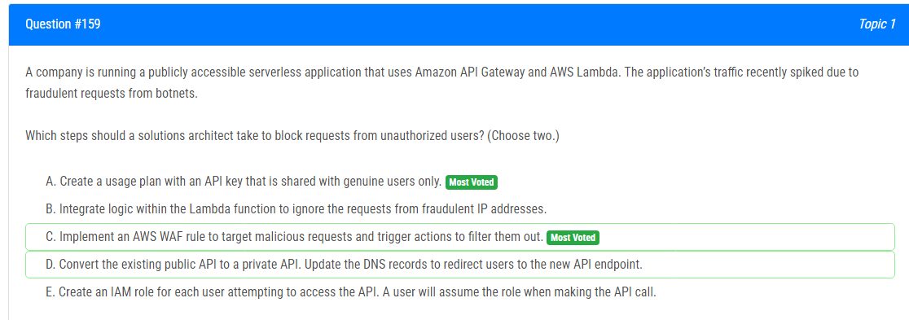

해설:

정답 A, C.

A. 사용자 키를 사용한 사용 계획을 생성하여 실제 사용자와만 공유된 키를 사용하는 것이 좋습니다. 이를 통해 API 사용에 제한을 둘 수 있습니다. 유효한 사용자만이 키를 사용하여 API에 액세스할 수 있게 됩니다.

C. AWS WAF 규칙을 구현하여 악의적인 요청을 대상으로 하고 해당 요청을 걸러내는 조치를 트리거하는 것이 좋습니다. AWS WAF는 웹 응용 프로그램 방화벽으로, 악성 트래픽 및 SQL 삽입, 크로스 사이트 스크립팅(XSS) 등과 같은 보안 위협을 탐지하고 차단할 수 있습니다. 이를 통해 불법적인 요청을 필터링하고 차단할 수 있습니다.

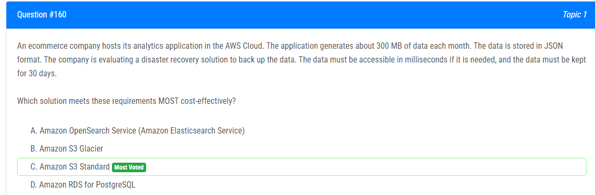

해설:

정답 C.

Amazon S3 Standard을 사용하는 것이 적절합니다. 이 옵션은 데이터를 빠르게 검색하고 필요한 경우에 빠르게 액세스할 수 있도록 보장합니다. 또한 30일 동안 데이터를 안전하게 보관하는 데 필요한 저렴하고 신속한 방법을 제공합니다.

