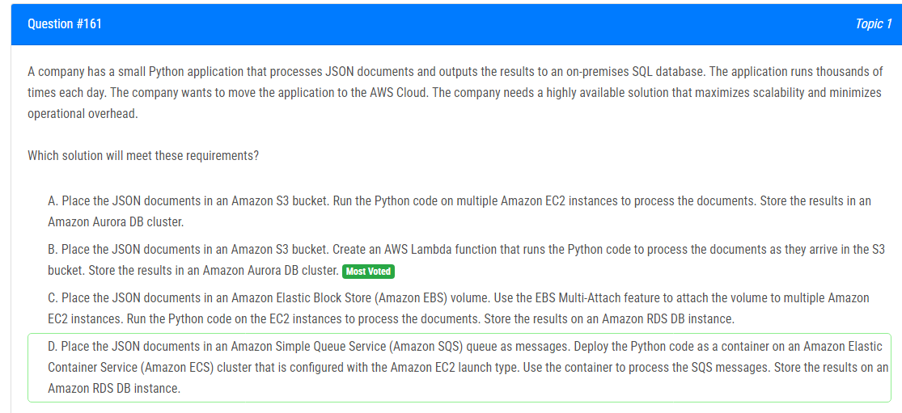

해설:

정답 B.

정답 B의 이유는 다음과 같습니다:

B. JSON 문서를 Amazon S3 버킷에 배치합니다. Python 코드를 실행하여 문서를 처리하는 AWS Lambda 함수를 생성합니다. 결과를 Amazon Aurora DB 클러스터에 저장합니다.

이 솔루션은 다음과 같은 이점을 제공합니다:

1. **고가용성(High Availability):** AWS Lambda 함수는 여러 가용 영역에 걸쳐 자동으로 배포됩니다. 이로써 Lambda 함수의 복제본이 여러 영역에서 실행되므로 고가용성이 확보됩니다.

2. **확장성(Scalability):** AWS Lambda는 서버리스 아키텍처로, 요청에 따라 자동으로 확장되며 수천 번의 실행도 처리할 수 있습니다. 작업 부하에 따라 자동으로 스케일링되므로 확장성이 높아집니다.

3. **운영 오버헤드 최소화(Minimizing Operational Overhead):** 서버리스 아키텍처는 인프라 관리가 필요 없으며, AWS Lambda는 관리형 서비스이므로 서버 관리, 확장성, 백업 등과 같은 운영적인 부담이 최소화됩니다.

4. **간편한 통합 및 이벤트 기반 아키텍처(Event-Driven Architecture):** S3 이벤트 트리거를 사용하여 Lambda 함수를 호출할 수 있습니다. 이는 JSON 문서가 S3 버킷에 업로드될 때 자동으로 Lambda 함수가 실행되는 간단하면서도 효율적인 방식을 제공합니다.

따라서, B는 고가용성과 확장성을 극대화하며 운영 오버헤드를 최소화하는 효과적인 솔루션입니다.

해설:

정답 A.

고성능 파일 시스템 (High-Performance File System): Amazon FSx for Lustre는 고성능 파일 시스템으로, HPC 워크로드에 적합합니다. 특히, 수백 개의 Amazon EC2 Spot Instances에서 실행되는 HPC 워크로드에 필요한 높은 성능을 제공합니다.

Amazon S3 통합 (Integration with Amazon S3): Amazon FSx for Lustre는 Amazon S3와 통합되어 데이터를 Amazon S3에 복사하고 저장할 수 있습니다. 이를 통해 온프레미스 데이터를 장기 보관을 위한 영구적인 스토리지로 복사하고, 모든 EC2 인스턴스에서 처리할 수 있게 됩니다.

유연한 스토리지 관리 (Flexible Storage Management): Amazon S3는 데이터를 안전하게 보관하는 데 사용되며, 필요에 따라 스토리지 계층을 조절할 수 있습니다.

다양한 출력 파일 관리 (Managing Output Files): 수천 개의 출력 파일을 생성하는 HPC 워크로드에 대해 Amazon S3는 다양한 파일을 효과적으로 관리할 수 있습니다.

간편한 통합 및 확장성 (Ease of Integration and Scalability): Amazon FSx for Lustre와 Amazon S3는 AWS의 다른 서비스들과도 쉽게 통합되며, 필요에 따라 쉽게 확장 가능한 서비스입니다.

따라서, Amazon FSx for Lustre과 Amazon S3 통합은 높은 성능의 파일 시스템과 안정적인 데이터 스토리지를 제공하여 HPC 워크로드에 적합한 솔루션입니다.

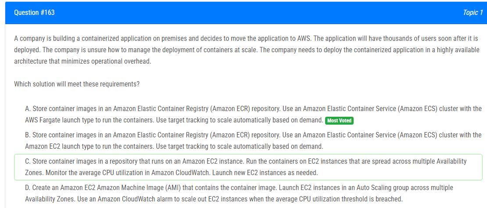

해설:

정답 A.

높은 가용성(High Availability): AWS Fargate는 관리형 서버리스 컴퓨팅 서비스로, 배포가 여러 가용 영역에 걸쳐 자동으로 처리되므로 고가용성이 확보됩니다.

운영 오버헤드 최소화(Minimizing Operational Overhead): Fargate는 서버 관리나 클러스터 설정에 대한 걱정이 없이 컨테이너를 실행할 수 있도록 해 주므로 운영 오버헤드가 최소화됩니다.

자동 확장(Automatic Scaling): 대상 추적을 사용하여 수요에 따라 자동으로 확장하므로, 사용자 증가에 따라 신속하게 대응할 수 있습니다.

간편한 관리와 배포(Easy Management and Deployment): Amazon ECR를 사용하여 컨테이너 이미지를 손쉽게 저장 및 관리할 수 있으며, Fargate를 통한 배포는 간단하면서도 효율적입니다.

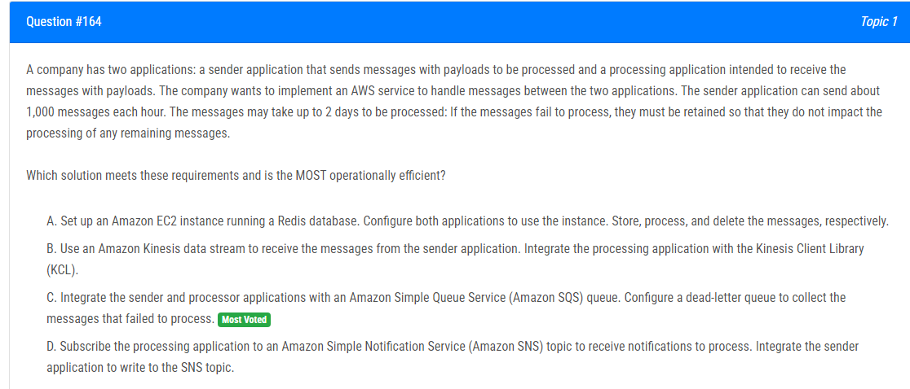

해설:

정답 C.

확장성 및 내구성(Scalability and Durability): Amazon SQS는 고도로 확장 가능하며, 메시지는 보존 기간 동안 안전하게 저장됩니다. 이는 대량의 메시지를 처리하고 실패한 처리를 다루기에 적합합니다.

오류 처리(Error Handling): Amazon SQS는 dead-letter 큐를 지원하여 처리되지 않은 메시지를 수집할 수 있습니다. 이는 메시지 처리 중에 오류가 발생할 경우 메시지를 안전하게 보존하고 나중에 분석 또는 다시 처리할 수 있도록 합니다.

간편한 통합과 관리(Easy Integration and Management): SQS를 사용하면 sender 및 processor 애플리케이션 간의 통합이 쉽고 간편합니다. 또한 AWS Management Console 또는 AWS SDK를 통해 큐를 쉽게 관리할 수 있습니다.

효율적인 메시지 전송(Efficient Message Delivery): SQS는 다양한 전송 및 수신자 속도에 대응할 수 있어서 sender 애플리케이션이 각 시간당 1,000개의 메시지를 효과적으로 처리할 수 있습니다.

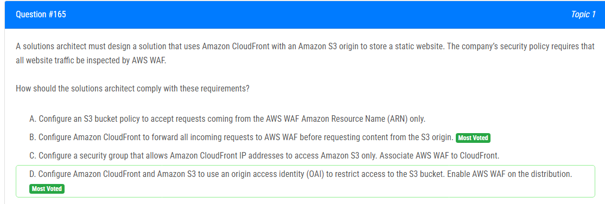

해설:

정답 D.

액세스 제한(Access Restriction): OAI를 사용하여 CloudFront와 S3 간의 통신을 안전하게 유지하면서, 직접적인 S3 액세스를 방지할 수 있습니다. 이를 통해 모든 액세스는 CloudFront를 통해 이루어지므로 AWS WAF로의 트래픽 검사를 보장합니다.

보안 강화(Enhanced Security): AWS WAF를 CloudFront에 활성화하면 모든 웹 트래픽에 대한 보안 검사를 수행할 수 있습니다. 이는 악의적인 웹 공격 및 다양한 보안 위협으로부터 웹 사이트를 보호하는 데 도움이 됩니다.

간편한 구성(Easy Configuration): CloudFront 및 S3에서 OAI 및 AWS WAF를 구성하면 간단한 설정으로 필요한 보안 요구 사항을 충족할 수 있습니다.

비용 효율(Cost Efficiency): CloudFront를 통해 정적 콘텐츠를 캐시하고 AWS WAF를 사용하여 보안을 강화함으로써 비용을 효율적으로 관리할 수 있습니다.

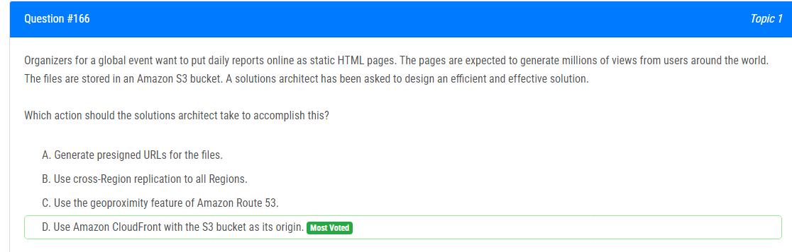

해설:

정답 D.

전 세계적인 배포(Global Distribution): Amazon CloudFront는 전 세계 여러 위치에 있는 엣지 로케이션을 통해 정적 콘텐츠를 효율적으로 전송합니다. 이로 인해 사용자들은 지리적으로 가장 가까운 엣지 로케이션에서 콘텐츠를 받아오게 되어 빠른 로딩 속도를 제공받을 수 있습니다.

캐싱 및 가용성(Caching and Availability): CloudFront는 정적 콘텐츠를 캐싱하여 다수의 사용자에게 빠르게 서비스할 수 있습니다. 또한, S3 버킷이 오리진으로 설정되면 CloudFront는 자동으로 S3에서 오리진을 채워넣어 가용성을 보장합니다.

보안 강화(Enhanced Security): CloudFront는 SSL/TLS를 통한 암호화를 제공하므로 데이터 전송 중에 보안을 강화할 수 있습니다.

비용 효율(Cost Efficiency): CloudFront를 사용하면 월간 사용량에 따라 비용이 부과되며, 전 세계 사용자에게 콘텐츠를 효과적으로 전달하면서 비용을 효율적으로 관리할 수 있습니다.

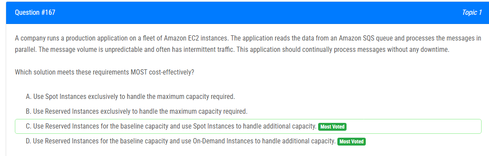

해설:

정답 D.

기본 용량에 대한 예약 인스턴스 (Reserved Instances): 애플리케이션의 기본 처리 용량은 예측 가능하므로 예약 인스턴스를 사용하여 비용을 절감할 수 있습니다. 예약 인스턴스는 특정 인스턴스 유형에 대해 약정 기간 동안 할인을 제공합니다.

높은 트래픽 처리를 위한 온디맨드 인스턴스: 트래픽이 예측할 수 없고 주기적으로 증가하는 경우, 온디맨드 인스턴스를 사용하여 추가 용량을 확보할 수 있습니다. 이는 트래픽 증가에 대응하여 유연하게 스케일 아웃할 수 있게 합니다.

가용성 및 지속적 운영: 예약 인스턴스와 온디맨드 인스턴스를 함께 사용함으로써 언제나 메시지를 처리할 수 있도록 보장할 수 있습니다. 또한, 온디맨드 인스턴스를 통해 필요할 때 신속하게 스케일 아웃하여 메시지 처리에 무중단으로 대응할 수 있습니다.

비용 효율(Cost Efficiency): 기본적인 용량은 예약 인스턴스를 통해 고정 비용으로 관리하고, 예측하지 못한 트래픽의 경우 온디맨드 인스턴스를 사용하여 효율적으로 비용을 관리할 수 있습니다.

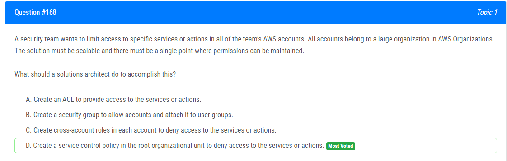

해설:

정답 D.

중앙 집중적인 권한 제어(Centralized Authorization Control): 루트 조직 단위에서 생성한 SCP는 모든 하위 계정에 적용됩니다. 이를 통해 서비스 또는 작업에 대한 액세스를 거부할 수 있어 중앙 집중적인 권한 제어가 가능합니다.

확장성 및 일관성(Scalability and Consistency): SCP는 AWS 조직에서 사용되는 정책으로, 여러 계정에 대한 일관된 권한 관리를 제공합니다. 새로운 계정이 추가되거나 변경이 필요할 때 SCP를 조직 단위에서 업데이트함으로써 확장성과 일관성을 유지할 수 있습니다.

하위 계정에 대한 액세스 제어(Access Control for Sub-Accounts): SCP를 사용하면 특정 서비스 또는 작업에 대한 액세스를 거부할 수 있습니다. 이를 통해 보안 요구 사항을 충족하면서도 유연한 액세스 제어를 구현할 수 있습니다.

단일 지점에서 권한 관리(Single Point of Permission Management): SCP를 루트 조직 단위에서 관리하므로, 단일 지점에서 모든 계정에 대한 권한을 효과적으로 관리할 수 있습니다.

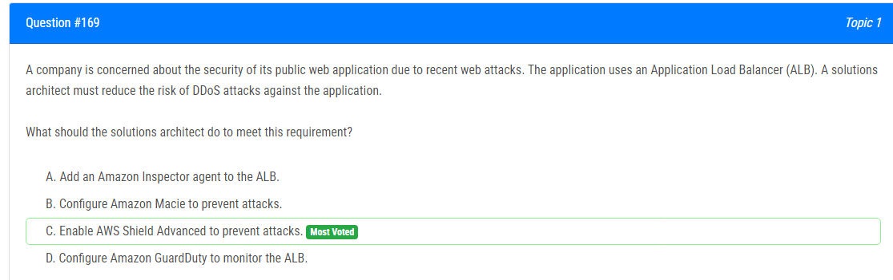

해설:

정답 C.

DDoS 방어(DDoS Protection): AWS Shield Advanced는 분산 거부 서비스 (DDoS) 공격으로부터 애플리케이션을 보호하는 고급 DDoS 방어 서비스를 제공합니다. 네트워크 및 응용 프로그램 계층에서의 공격에 대한 방어가 가능하며, 애플리케이션 로드 밸런서 (ALB)를 비롯한 여러 AWS 서비스에서 지원됩니다.

실시간 모니터링 및 대응(Real-time Monitoring and Response): AWS Shield Advanced는 실시간으로 트래픽을 모니터링하고, 알려진 및 신규 DDoS 공격에 대해 즉각적으로 대응합니다. 이는 애플리케이션의 가용성을 보장하고, 서비스 중단을 방지합니다.

고급 보안 기능(Advanced Security Features): AWS Shield Advanced는 통합된 Web Application Firewall (WAF)와 결합하여 애플리케이션의 취약성 및 악성 트래픽에 대한 심층적인 보호를 제공합니다.

간편한 활성화 및 관리(Easy Activation and Management): AWS Shield Advanced는 간편한 활성화 및 관리를 제공하며, AWS Management Console을 통해 신속하게 설정할 수 있습니다.

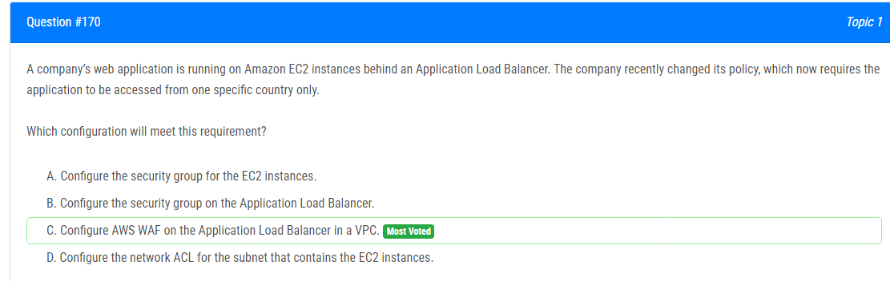

해설:

정답 C.

국가별 액세스 제어(Country-Level Access Control): AWS WAF는 Geo Match 조건을 사용하여 특정 국가에서의 액세스를 제어할 수 있습니다. 이를 통해 특정 국가에서만 웹 애플리케이션에 접근하도록 설정할 수 있습니다.

Application Load Balancer에서의 적용(Applicability on Application Load Balancer): AWS WAF는 Application Load Balancer에서 쉽게 통합되며, 애플리케이션 앞단에서 요청을 필터링할 수 있습니다.

선별적인 액세스 허용(Selective Access Allowance): 특정 국가에서의 액세스를 허용하거나 거부할 수 있기 때문에, 보안 정책을 특정 국가에 맞게 자세히 설정할 수 있습니다.

VPC 내에서의 구성(Configuration within VPC): AWS WAF를 Application Load Balancer에서 구성하면 VPC 내에서만 적용되어 특정 국가에서의 액세스를 VPC 내부에서 제어할 수 있습니다.

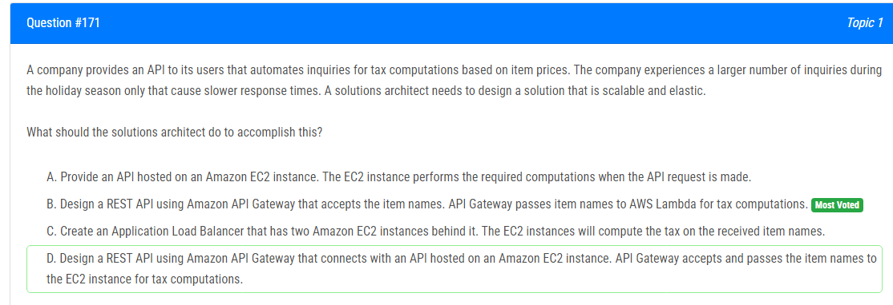

해설:

정답 B.

탄력적이고 확장 가능한 아키텍처(Elastic and Scalable Architecture): Amazon API Gateway와 AWS Lambda를 결합하여 서버리스 아키텍처를 구축합니다. 이는 트래픽이 증가할 때 자동으로 스케일링되므로 성능을 유지하면서도 리소스를 효율적으로 사용할 수 있습니다.

서버리스 컴퓨팅의 이점(Leveraging Serverless Computing): AWS Lambda는 서버리스 함수로 특정 이벤트에 응답하는 데 사용됩니다. 요청이 들어올 때마다 필요한 계산만 수행하므로 효율적인 비용 관리가 가능합니다.

간편한 관리 및 유지보수(Easy Management and Maintenance): 서버리스 아키텍처를 사용하면 인프라 관리 부담이 없으며, 개발자는 코드에 집중할 수 있습니다. AWS Lambda와 Amazon API Gateway는 관리형 서비스이므로 유지보수가 쉽습니다.

HTTP API 제공(HTTP API Offering): Amazon API Gateway는 간편하게 RESTful HTTP API를 구축할 수 있으며, 요청 및 응답의 변환, 보안, 로깅 등의 기능을 제공합니다.

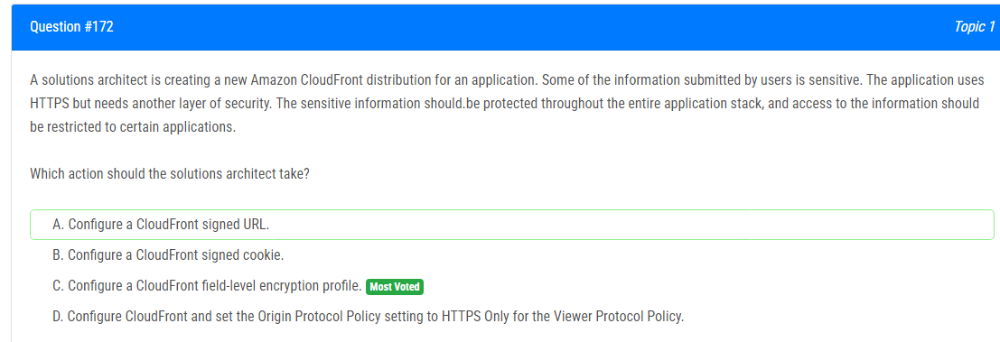

해설:

정답 C.

필드 수준 암호화(Field-Level Encryption): CloudFront 필드 수준 암호화를 사용하면 웹 애플리케이션에서 사용자가 제출한 양식 데이터 중 특정 필드를 암호화할 수 있습니다. 이를 통해 사용자의 민감한 정보를 추가적으로 보호할 수 있습니다.

전체 애플리케이션 스택에서의 보안 강화(Security Throughout the Entire Application Stack): 필드 수준 암호화는 CloudFront 앞에서부터 데이터를 보호합니다. 이는 애플리케이션 스택 전체에서 민감한 정보에 대한 추가적인 보안 계층을 제공합니다.

특정 애플리케이션에서의 접근 제한(Restricted Access to Certain Applications): 필드 수준 암호화를 사용하면 특정 필드에 대한 암호화 및 복호화 권한을 제어할 수 있습니다. 이를 통해 민감한 정보에 접근할 수 있는 애플리케이션을 제한할 수 있습니다.

HTTPS를 통한 전송 보안(Transport Security via HTTPS): HTTPS는 애플리케이션에서 CloudFront로의 데이터 전송을 보호합니다. 필드 수준 암호화는 이러한 전송 중에도 민감한 데이터를 추가적으로 암호화합니다.

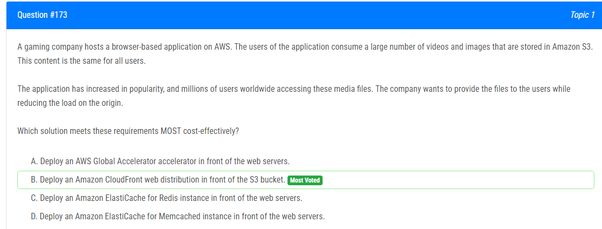

해설:

정답 B.

글로벌 캐싱(Global Caching): Amazon CloudFront은 글로벌 엣지 위치를 통해 콘텐츠를 캐싱하므로 사용자에게 빠르게 전달할 수 있습니다. 사용자가 동일한 미디어 파일에 접근할 때 S3에서 직접 파일을 가져오는 것보다 훨씬 빠른 응답 시간을 제공합니다.

로드 감소(Offloading Load): CloudFront는 오리진 서버(여기서는 S3 버킷)에 대한 요청 수를 줄여줍니다. 이미지 및 비디오와 같은 정적 콘텐츠를 캐싱하고 제공함으로써 원본 서버의 부하를 줄여 성능을 향상시킵니다.

비용 효율(Cost Efficiency): CloudFront는 비용 효율적입니다. 사용자에게 가까운 엣지 위치에서 콘텐츠를 제공함으로써 데이터 전송 비용을 최소화하고, 캐싱된 콘텐츠를 빠르게 제공하여 사용자 경험을 향상시킵니다.

간편한 구성(Easy Configuration): CloudFront를 설정하고 S3 버킷을 오리진으로 지정하는 것은 간단하며, 원하는 설정을 통해 캐시 동작을 세밀하게 제어할 수 있습니다.

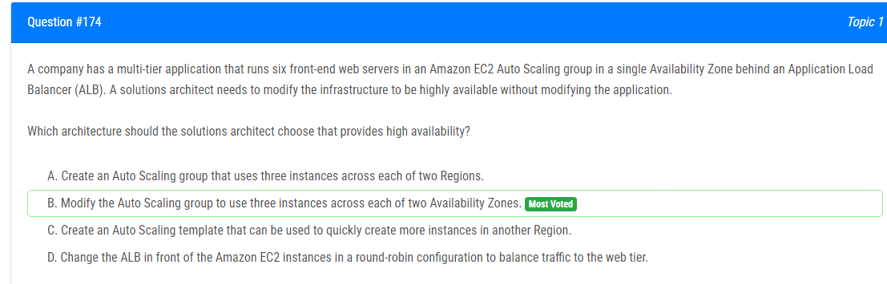

해설:

정답 B.

고가용성(High Availability): 두 개의 가용 영역에 걸쳐 세 개의 인스턴스를 사용하면 단일 가용 영역의 장애로부터 애플리케이션을 보호할 수 있습니다. 다중 가용 영역을 사용하면 가용 영역 중 하나가 문제가 발생하더라도 다른 가용 영역의 인스턴스가 트래픽을 처리할 수 있습니다.

Auto Scaling을 통한 탄력성(Elasticity with Auto Scaling): Auto Scaling을 사용하여 세 개의 인스턴스를 유지하면 트래픽 증가 또는 감소에 따라 자동으로 조정됩니다. 이는 효율적인 자원 사용과 성능 유지에 도움이 됩니다.

애플리케이션 수정 없이 고가용성 구현(Implementing High Availability without Modifying the Application): 주어진 요구 사항에 따라 애플리케이션을 수정하지 않고도 고가용성을 구현할 수 있습니다. Auto Scaling 그룹을 수정하여 두 개의 가용 영역에 인스턴스를 분산 배치할 수 있습니다.

Application Load Balancer 사용(Use of Application Load Balancer): Application Load Balancer를 사용하여 트래픽을 고르게 분산하여 각 인스턴스에 전달할 수 있습니다. 이를 통해 로드 밸런싱과 고가용성을 함께 활용할 수 있습니다.

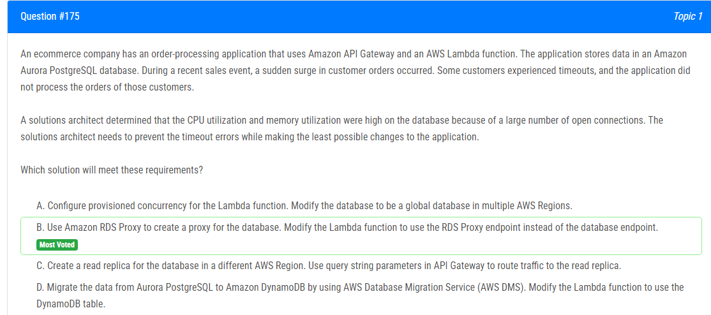

해설:

정답 B.

연결 풀링(Connection Pooling): Amazon RDS Proxy는 연결 풀링을 지원하여 Lambda 함수에서 데이터베이스로의 연결을 최적화합니다. 이를 통해 많은 수의 동시 연결이 발생할 때 성능을 향상시킬 수 있습니다.

타임아웃 및 리소스 최적화(Timeout and Resource Optimization): RDS Proxy를 사용하면 데이터베이스에 대한 연결이 효과적으로 관리되므로 Lambda 함수에서의 타임아웃 및 리소스 사용이 최적화됩니다.

최소한의 응용 프로그램 변경(Minimal Application Changes): 기존 Lambda 함수를 수정하여 RDS Proxy 엔드포인트를 사용하도록 변경하는 것만으로 문제를 해결할 수 있습니다. 이는 응용 프로그램의 최소한의 변경을 필요로 합니다.

스케일링 및 고가용성(Scaling and High Availability): RDS Proxy는 자동 스케일링 및 고가용성을 지원하므로 Lambda 함수와 Aurora PostgreSQL 데이터베이스 간에 안정적인 및 확장 가능한 연결을 제공합니다.

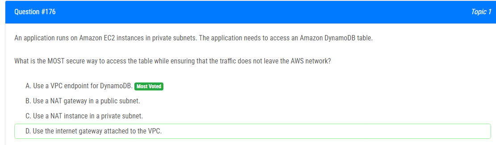

해설:

정답 A.

트래픽이 AWS 네트워크 내에서 처리(Security within AWS Network): VPC 엔드포인트를 사용하면 DynamoDB에 대한 액세스 트래픽이 AWS의 내부 네트워크를 통해 처리됩니다. 이는 트래픽이 AWS의 외부로 노출되지 않아 더 안전한 옵션입니다.

인터넷 노출 회피(Avoidance of Internet Exposure): VPC 엔드포인트를 사용하면 트래픽이 인터넷을 통과하지 않고 직접 DynamoDB와 통신합니다. 이는 보안과 네트워크 경로의 효율성을 유지하면서도 인터넷 노출을 피할 수 있습니다.

간편한 구성 및 관리(Easy Configuration and Management): VPC 엔드포인트는 간편하게 구성할 수 있으며, 관리 및 유지보수에도 용이합니다. 인터넷 노출을 회피하면서도 솔루션을 설정하고 관리하는 데 효율적입니다.

보안 강화(Security Enhancement): VPC 엔드포인트를 사용하면 애플리케이션의 보안이 강화됩니다. 외부로 나가지 않는 트래픽은 특히 보안을 강화할 수 있습니다.

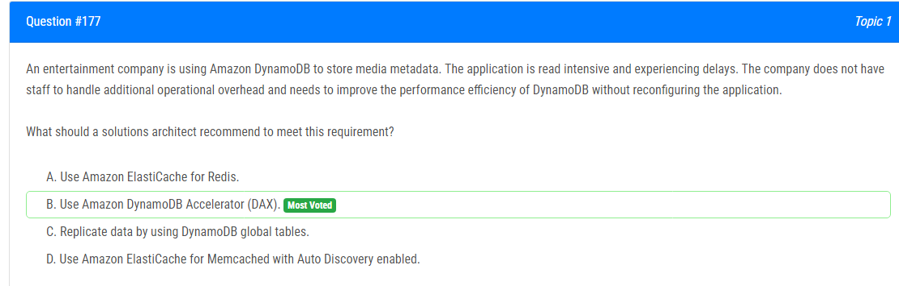

해설:

정답 B.

성능 향상(Performance Improvement): Amazon DynamoDB Accelerator (DAX)는 DynamoDB에 캐시 계층을 추가하여 읽기 성능을 향상시킵니다. DAX는 메모리 내 캐시를 사용하여 읽기 쿼리의 응답 시간을 줄이고 더 빠른 성능을 제공합니다.

응용 프로그램 수정 없이 사용(No Application Modification): DAX는 기존 DynamoDB 읽기 요청을 처리하므로 응용 프로그램을 수정하지 않고도 성능을 향상시킬 수 있습니다. 응용 프로그램에서 DynamoDB API를 호출하는 부분을 DAX 엔드포인트로 변경하면 됩니다.

운영 오버헤드 최소화(Minimal Operational Overhead): DAX는 관리형 서비스로서 운영 및 유지 관리 오버헤드를 최소화합니다. 데이터 캐싱 및 자동 확장과 같은 기능을 제공하여 DynamoDB 성능을 최적화하면서도 운영 복잡성을 감소시킵니다.

DynamoDB와 통합(Integration with DynamoDB): DAX는 DynamoDB와 긴밀하게 통합되어 DynamoDB의 엔드포인트를 대체하거나 보완할 수 있습니다. 이는 기존 DynamoDB 테이블을 유지한 채로 DAX를 도입할 수 있음을 의미합니다.

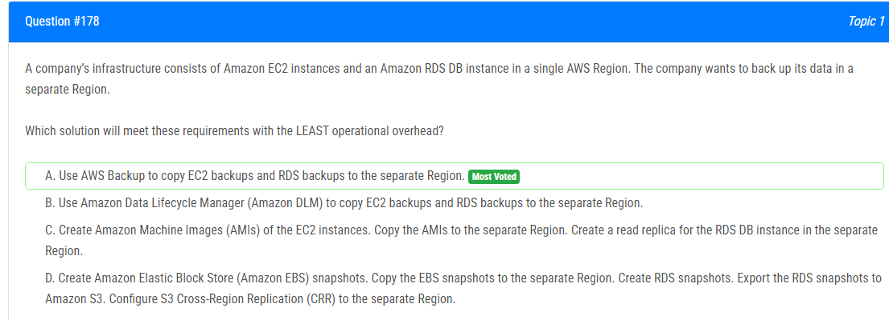

해설:

정답 A.

통합된 백업 솔루션(Unified Backup Solution): AWS Backup은 EC2 인스턴스 및 RDS DB 인스턴스와 같은 여러 AWS 서비스에 대한 통합된 백업 및 복원 솔루션을 제공합니다. 이를 통해 별도의 서비스 없이도 데이터를 별도의 리전으로 복사할 수 있습니다.

운영 오버헤드 최소화(Minimal Operational Overhead): AWS Backup은 관리형 서비스이므로 운영 및 관리 오버헤드가 최소화됩니다. 설정 및 관리가 간편하며 데이터의 복사 및 복원 프로세스를 자동화할 수 있습니다.

EC2 및 RDS 지원(EC2 and RDS Support): AWS Backup은 EC2 인스턴스 및 RDS DB 인스턴스와 같은 다양한 서비스에 대한 지원을 제공하므로 통합된 방식으로 백업을 수행할 수 있습니다.

손쉬운 복원(Easy Restoration): AWS Backup은 통합된 콘솔을 통해 데이터를 복원하는 프로세스를 단순화하므로 필요할 때 복원 작업을 쉽게 수행할 수 있습니다.

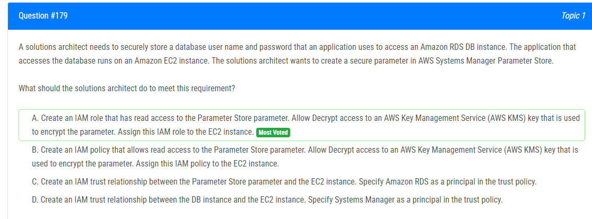

해설:

정답 A.

IAM 역할의 원칙 최소 권한(Principle of Least Privilege): IAM 역할을 통해 EC2 인스턴스에 최소한의 권한을 부여하여 보안을 강화합니다.

암호화 보안(Encryption Security): KMS 키를 사용하여 Parameter Store의 매개 변수를 암호화하면 데이터 보안을 강화할 수 있습니다.

IAM 역할을 통한 EC2 인스턴스 액세스(EC2 Instance Access via IAM Role): IAM 역할을 EC2 인스턴스에 할당하여 EC2 인스턴스가 Parameter Store의 매개 변수에 안전하게 액세스할 수 있습니다.

AWS 서비스 간의 통합(Integration Across AWS Services): IAM 역할을 통한 통합은 AWS 서비스 간의 안전하고 효율적인 통신을 지원합니다.

해설:

정답 B, C

B. AWS Shield Advanced를 Network Load Balancer (NLB)와 함께 사용합니다.

AWS Shield Advanced는 고급 DDoS(분산 서비스 거부) 공격에 대한 강력한 보호를 제공합니다. 이 서비스는 대규모 및 정교한 DDoS 공격을 탐지하고 이에 대응하여 애플리케이션의 가용성을 유지합니다. 특히 NLB를 사용하는 경우, 고급 DDoS 공격에 대비하여 네트워크 레벨에서의 보호가 중요합니다.
C. AWS WAF를 Amazon API Gateway와 함께 사용합니다.

AWS WAF는 Web Application Firewall로서, 웹 응용 프로그램에 대한 일반적인 웹 공격으로부터 보호합니다. SQL injection과 같은 웹 응용 프로그램의 취약성을 이용한 공격을 탐지하고 차단할 수 있습니다. Amazon API Gateway와 함께 사용하면 API에 대한 효과적인 웹 애플리케이션 방화벽을 구축할 수 있습니다.

