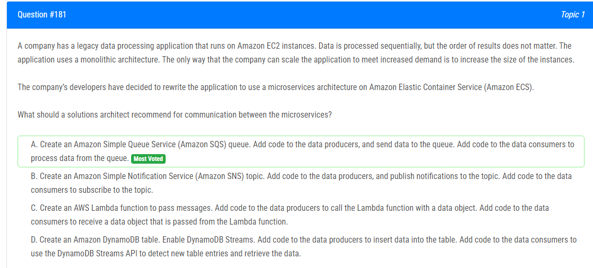

해설:

정답 A.

Microservices 아키텍처에서 효과적인 통신을 위해 비동기 메시징 시스템을 사용하는 것이 일반적입니다. Amazon SQS는 이러한 요구 사항을 충족시키는데, 데이터 생성자는 SQS 큐에 데이터를 보내고, 데이터 소비자는 큐에서 데이터를 비동기적으로 처리할 수 있습니다. 이로써 각각의 마이크로서비스가 독립적으로 확장 가능하며, 순서가 중요하지 않은 경우에도 효과적으로 처리할 수 있습니다.

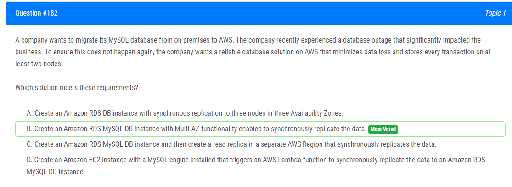

해설:

정답 B.

Multi-AZ (다 가용성 존)을 사용하면 Amazon RDS는 프라이머리 인스턴스와 동일한 데이터베이스의 스탠바이 인스턴스를 다른 가용성 존에 생성합니다. 이로써 프라이머리 인스턴스에 장애가 발생하면 스탠바이 인스턴스가 자동으로 대체되어 가용성을 보장합니다. Multi-AZ 활성화를 통해 데이터는 두 개의 노드에 동기적으로 저장되므로 데이터 손실이 최소화되고 안정적인 데이터베이스 솔루션이 됩니다.

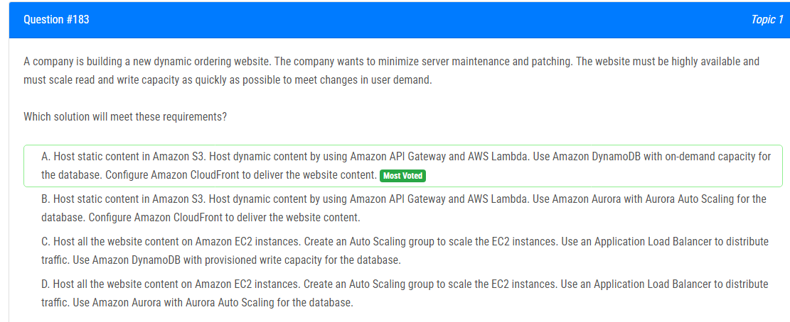

해설:

정답 A.

Amazon S3는 정적 콘텐츠를 효과적으로 호스팅하는데 사용됩니다.
Amazon API Gateway와 AWS Lambda를 사용하여 동적 콘텐츠를 처리하면 서버 유지 보수 및 패치에 대한 걱정을 최소화할 수 있습니다.
Amazon DynamoDB의 온디맨드 용량 모드를 사용하면 트래픽에 따라 자동으로 확장 및 축소되므로 사용자 수요의 변화에 신속하게 대응할 수 있습니다.
Amazon CloudFront를 사용하여 콘텐츠를 전송하면 전 세계의 사용자에게 낮은 지연 시간과 빠른 성능을 제공할 수 있습니다.

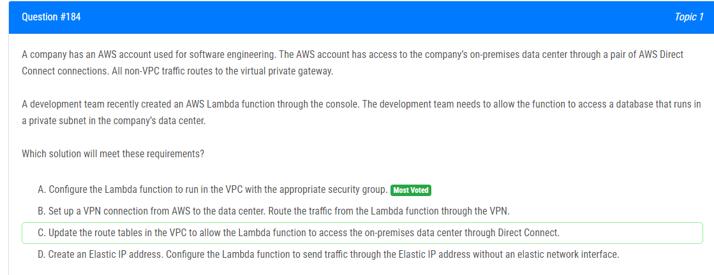

해설:

정답 A.

Lambda 함수를 VPC에 배치하면 함수는 VPC의 네트워크 구성에 액세스할 수 있습니다.
Lambda 함수가 VPC 내에서 실행될 때, 해당 VPC의 보안 그룹 및 네트워크 ACL을 활용하여 트래픽을 제어할 수 있습니다.
이러한 구성을 통해 Lambda 함수는 VPC 내에서 실행되면서 on-premises 데이터 센터의 프라이빗 서브넷에 액세스할 수 있게 됩니다.

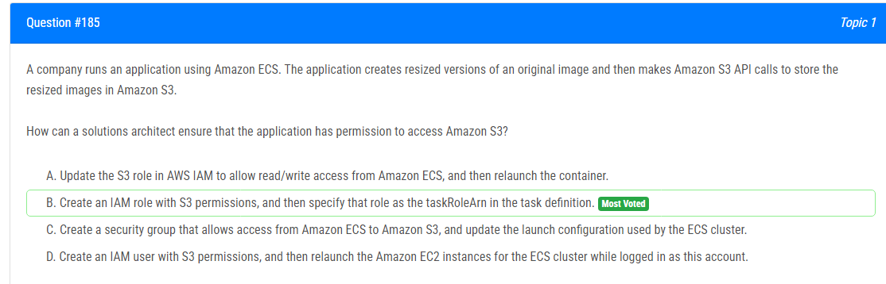

해설:

정답 B.

AM 역할을 사용하여 Amazon ECS 작업이 다른 AWS 리소스에 액세스할 수 있도록 권한을 부여할 수 있습니다.
taskRoleArn은 작업 정의에서 사용되는 IAM 역할의 Amazon Resource Name (ARN)을 지정하는 데 사용됩니다.
작업을 실행하는 동안, 해당 IAM 역할은 작업에서 실행되는 컨테이너에 할당되며, 해당 역할에 부여된 권한을 통해 Amazon S3에 액세스할 수 있게 됩니다.

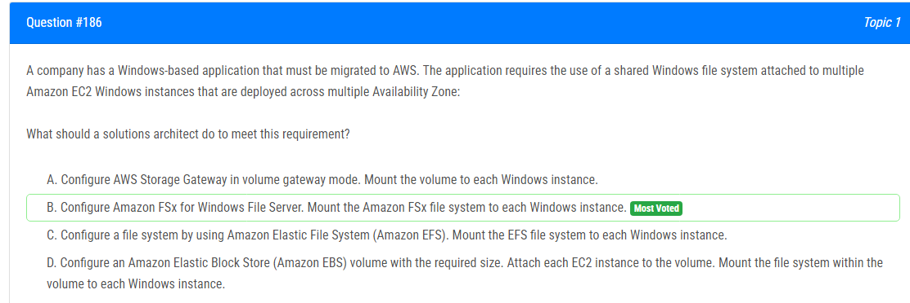

해설:

정답 B.

Amazon FSx for Windows File Server는 완전 관리되는 Windows 호환 파일 시스템 서비스로, 여러 Availability Zone에 걸쳐 가용성을 제공합니다.
Amazon FSx를 사용하면 여러 EC2 Windows 인스턴스가 동일한 파일 시스템을 공유하고 동시에 액세스할 수 있습니다.
다른 옵션들과 비교하여 Amazon FSx는 Windows 환경에 최적화되어 있으며, Windows 응용 프로그램에 적합한 파일 공유 솔루션을 제공합니다.

해설:

정답 A, D.

A. Amazon RDS DB 인스턴스를 Multi-AZ 모드로 생성합니다.

Multi-AZ 모드는 Amazon RDS에서 관리되는 관계형 데이터베이스를 가용성이 높게 유지하는 데 사용됩니다. 여러 가용성 존에 자동으로 스탠바이 복제본을 생성하여 장애 발생 시 자동으로 전환되어 가용성을 제공합니다.
D. Fargate 런치 유형을 사용하여 Amazon ECS 클러스터를 생성합니다.

Amazon Elastic Container Service (Amazon ECS)는 컨테이너 기반 응용 프로그램을 실행하고 관리하는 서비스입니다. Fargate 런치 유형은 서버 인프라에 대한 관리가 필요 없는 컨테이너 배포를 제공하므로 작업을 시작하고 관리하는 데 더 적은 수동 개입이 필요합니다. 이는 자동 확장 및 가용성을 향상시키는 데 도움이 됩니다.

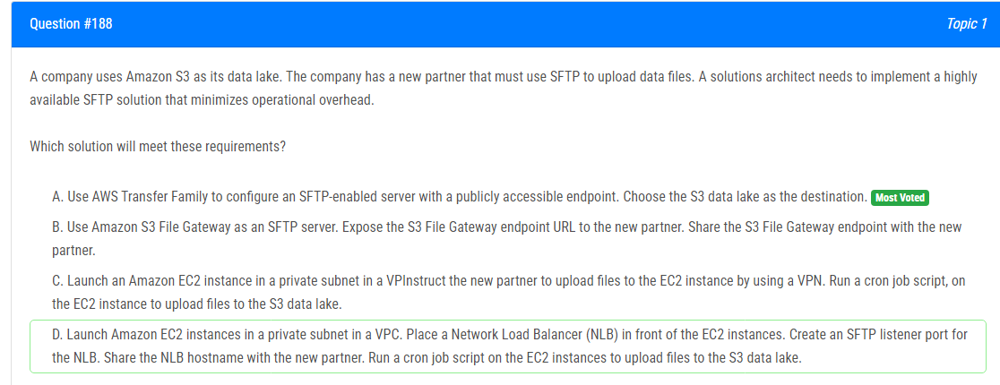

해설:

정답 A.

AWS Transfer Family는 관리형 SFTP (Secure File Transfer Protocol) 서비스를 제공하며, 배포 및 운영 오버헤드를 최소화합니다.
S3를 대상으로 선택하면 업로드된 파일이 S3 데이터 레이크로 직접 전송되므로 데이터 이동이 효율적입니다.
AWS Transfer Family를 사용하면 편리한 관리 및 확장이 가능하며, 자동으로 고가용성을 제공합니다.

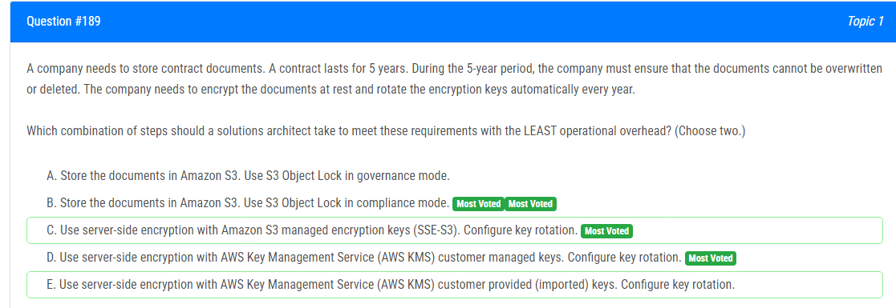

해설:

정답 B, D.

B. Amazon S3에서 문서를 저장하고 S3 Object Lock을 준수 모드(compliance mode)로 사용합니다.

S3 Object Lock을 사용하면 특정 개체에 대한 기록 보존을 강제할 수 있습니다. 준수 모드는 해당 개체의 기간 동안 미래의 모든 삭제 및 덮어쓰기 요청을 거부하므로 데이터의 무결성을 보호합니다.

D. AWS Key Management Service (AWS KMS) 고객 관리 키(customer managed keys)를 사용하여 서버 측 암호화를 구성하고 키 회전을 설정합니다.

AWS KMS는 투명한 키 회전을 지원하며, 고객 관리 키를 사용하여 암호화 키를 주기적으로 회전할 수 있습니다. 이를 통해 보안 강화와 적절한 키 수명 주기를 유지할 수 있습니다.

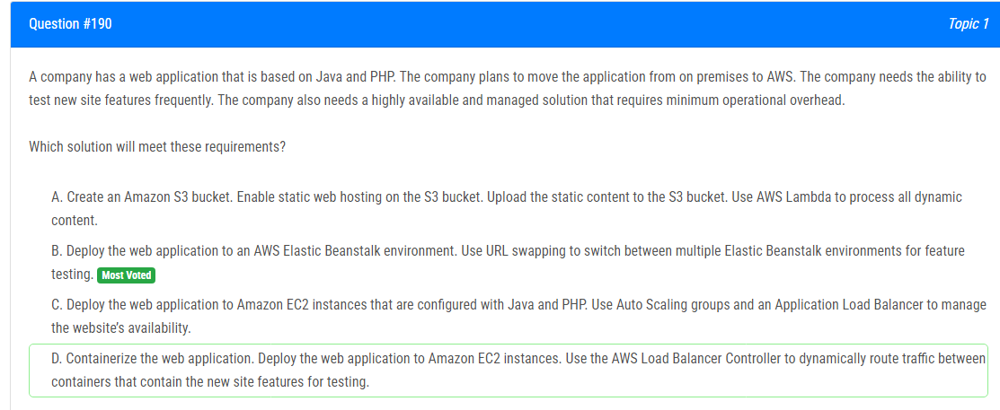

해설:

정답 B.

AWS Elastic Beanstalk는 플랫폼 서비스로, Java 및 PHP와 같은 다양한 환경에서 웹 애플리케이션을 쉽게 배포 및 관리할 수 있습니다.
Elastic Beanstalk 환경을 사용하여 애플리케이션을 배포하면 운영 오버헤드를 최소화하면서 편리하게 확장 및 관리할 수 있습니다.
URL 스와핑을 사용하여 여러 환경 간에 쉽게 전환할 수 있어 새로운 기능을 빠르게 테스트하고 롤백할 수 있습니다.
Elastic Beanstalk는 Auto Scaling과 함께 사용되어 자동으로 확장 및 축소하며 고가용성을 제공합니다.

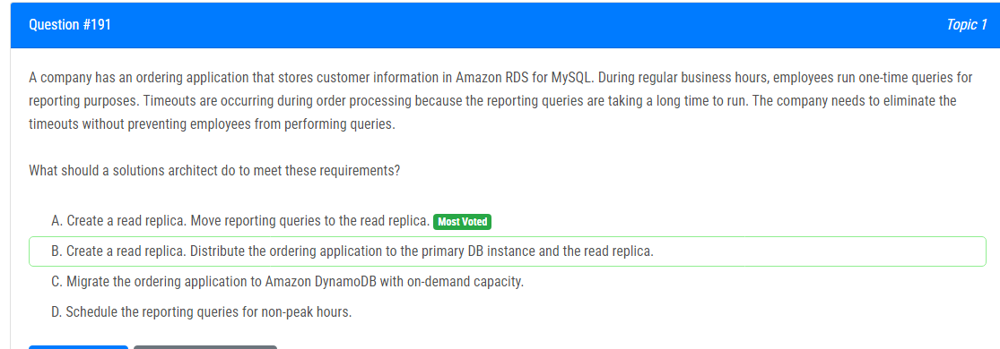

해설:

정답 A.

읽기 복제본을 생성하면 주 DB 인스턴스의 읽기 처리량을 늘릴 수 있습니다.
보고용 쿼리를 읽기 복제본으로 이동하면 주 DB 인스턴스에서의 주문 처리에 영향을 미치지 않으면서 보고용 쿼리의 성능을 향상시킬 수 있습니다.
읽기 복제본을 사용하여 보고용 쿼리를 실행하면 주 DB 인스턴스에 대한 읽기 부하를 줄일 수 있으므로 주문 처리 중에 타임아웃이 발생하는 문제를 해결할 수 있습니다.

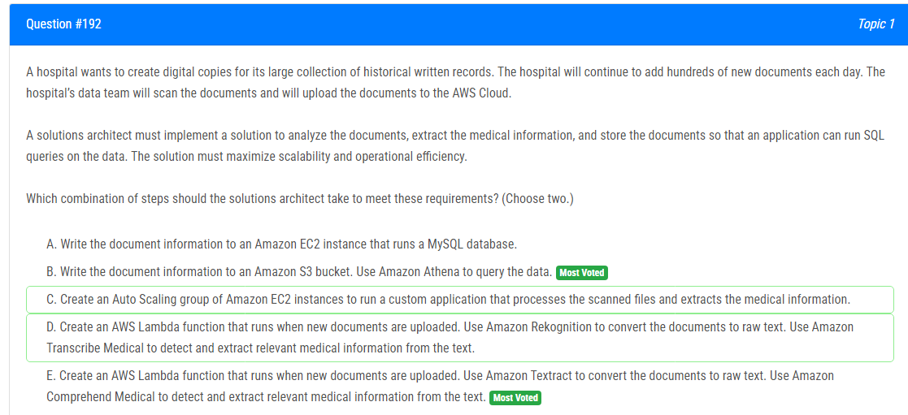

해설:

정답 B, E.

B. 문서 정보를 Amazon S3 버킷에 기록하고, Amazon Athena를 사용하여 데이터에 대한 SQL 쿼리를 실행합니다.

Amazon S3는 대규모 데이터를 저장하고 분석하는 데 이상적인 스토리지 솔루션입니다. Amazon Athena를 사용하면 SQL 쿼리를 사용하여 S3에 저장된 데이터를 쉽게 분석할 수 있습니다.

E. 새 문서가 업로드될 때 실행되는 AWS Lambda 함수를 생성하고, Amazon Textract를 사용하여 문서를 원시 텍스트로 변환하고, Amazon Comprehend Medical를 사용하여 관련 의료 정보를 감지 및 추출합니다.

Textract는 문서 이미지에서 텍스트를 추출하는 데 사용되며, Comprehend Medical는 텍스트에서 의료 관련 정보를 추출하는 데 사용됩니다. Lambda 함수는 서버리스 환경에서 실행되므로 스케일링과 관리가 용이합니다.

해설:

정답 B.

Amazon ElastiCache for Redis는 인메모리 캐싱 솔루션으로, 데이터를 메모리에 저장하여 빠른 읽기 액세스를 가능하게 합니다.
ElastiCache for Redis는 RDS의 읽기 부하를 줄일 수 있도록 데이터베이스 읽기 쿼리의 응답 시간을 크게 개선합니다.
Redis는 RDS 리드 레플리카와 유사한 읽기 전용 복제 기능을 제공하므로, 읽기 작업을 분산시켜 확장성을 향상시킬 수 있습니다.
Amazon RDS read replicas를 추가할 때와 달리 ElastiCache를 사용하면 메모리에서 데이터를 직접 읽기 때문에 빠른 응답 시간을 보장합니다.

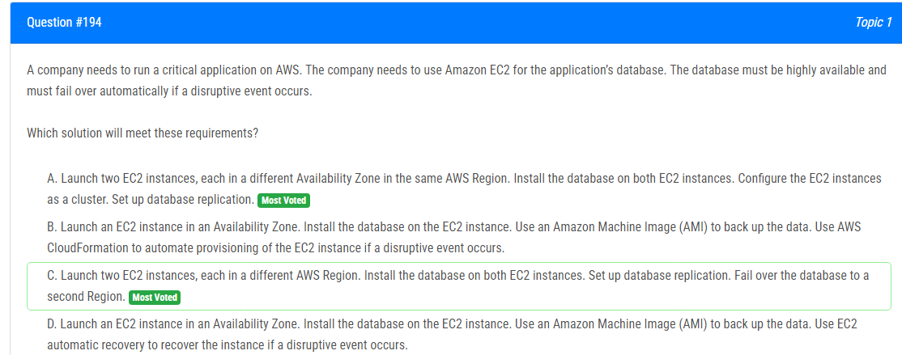

해설:

정답 A.

다른 가용 영역에 위치한 두 EC2 인스턴스를 사용하여 고가용성을 제공할 수 있습니다. 한 가용 영역이 장애가 발생하더라도 다른 가용 영역의 EC2 인스턴스로 자동으로 페일오버됩니다.
클러스터 구성 및 데이터베이스 복제를 통해 데이터베이스의 가용성과 내결함성을 향상시킬 수 있습니다.

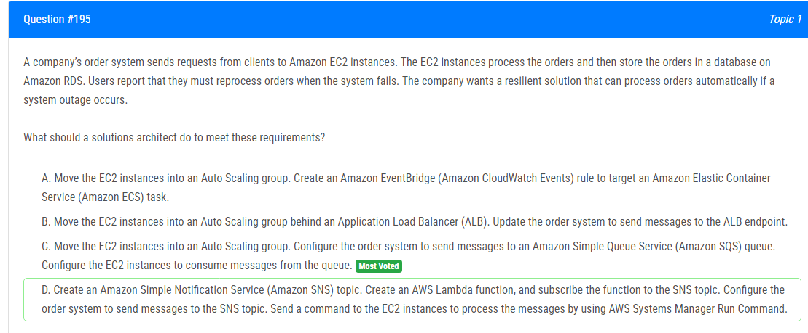

해설:

정답 C.

Amazon SQS는 메시지 기반의 분산 시스템을 제공하며, 메시지는 큐를 통해 안정적으로 전달됩니다.
EC2 인스턴스를 Auto Scaling 그룹으로 관리하면 시스템 장애 시에도 인스턴스가 자동으로 확장되거나 축소될 수 있습니다.
주문 시스템이 SQS 큐에 메시지를 전송하면, 이 메시지를 소비하는 EC2 인스턴스들은 작업을 안전하게 처리할 수 있으며, 시스템 장애 시에도 메시지는 보존되어 나중에 처리됩니다.

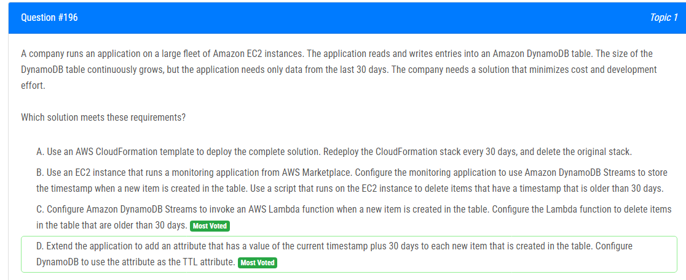

해설:

정답 D.

Amazon DynamoDB에서 Time-To-Live (TTL) 속성을 사용하면 특정 속성 값을 기반으로 항목을 자동으로 삭제할 수 있습니다.
TTL 속성을 사용하면 개발 비용 및 노력이 최소화되며, DynamoDB 자체에서 자동으로 오래된 데이터를 삭제합니다.
CloudFormation 스택을 재배포하거나 EC2 인스턴스를 사용하는 방법에 비해 효율적이며, 비용도 최적화됩니다.

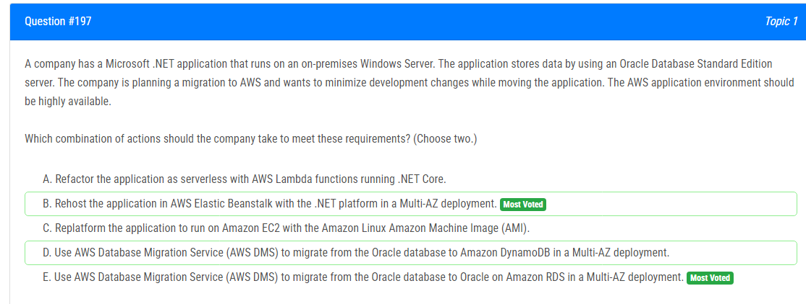

해설:

정답 B, E.

B. .NET 플랫폼을 사용하여 AWS Elastic Beanstalk에 애플리케이션을 재호스팅하고 Multi-AZ 배포를 수행합니다.

Elastic Beanstalk은 관리형 플랫폼으로, 응용 프로그램을 호스팅하고 배포하기 쉽도록 지원합니다. Multi-AZ 배포를 사용하여 고가용성을 달성할 수 있습니다.

E. Oracle 데이터베이스를 Amazon RDS의 Multi-AZ 배포로 마이그레이션하기 위해 AWS Database Migration Service (DMS)를 사용합니다.

Amazon RDS는 관리형 관계형 데이터베이스 서비스로서 Multi-AZ 배포를 통해 고가용성을 제공합니다. AWS DMS를 사용하여 데이터베이스를 마이그레이션하면 최소한의 변경으로 애플리케이션을 AWS로 이동할 수 있습니다.

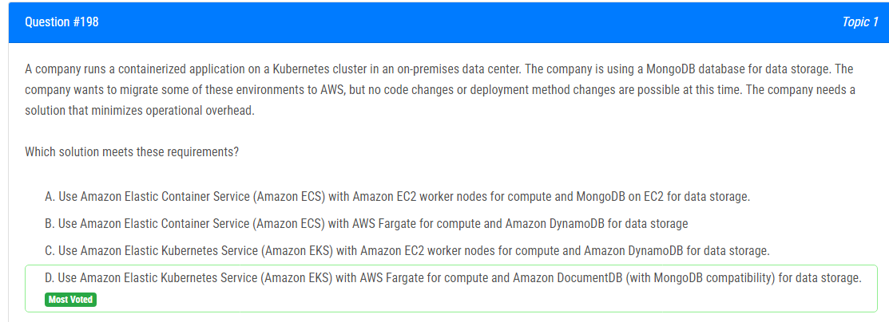

해설:

정답 D.

Amazon EKS 및 AWS Fargate는 Kubernetes 워크로드를 관리하고, 관리 오버헤드를 최소화하며, 기존 컨테이너화된 애플리케이션을 오프프레미스에서 AWS로 쉽게 이동할 수 있도록 지원합니다.
Amazon DocumentDB는 MongoDB와 호환되는 완전 관리형 NoSQL 데이터베이스로서, 기존 MongoDB 애플리케이션을 변경하지 않고도 데이터를 저장하고 검색할 수 있습니다.
Amazon DocumentDB는 관리 오버헤드가 적고, 확장 가능하며, 고가용성을 제공하는 MongoDB 호환 데이터베이스 서비스로서, 운영을 간소화할 수 있습니다.

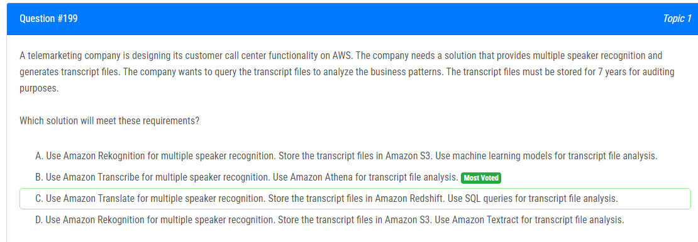

해설:

정답 B.

Amazon Transcribe은 오디오 및 비디오 파일에서 텍스트 트랜스크립트를 생성할 수 있는 서비스로서, 다중 스피커 인식을 지원합니다.
트랜스크립트 파일을 Amazon S3에 저장하여 안정적으로 보존할 수 있습니다. Amazon S3는 비용 효율적이고 확장 가능한 스토리지 솔루션으로, 데이터를 7년 동안 보존하는 데 적합합니다.
Amazon Athena는 S3에 저장된 데이터에 대한 SQL 쿼리를 실행할 수 있는 서비스로서, 비즈니스 패턴 분석에 용이합니다.

해설:

정답 D.

Amazon Cognito 사용자 풀은 사용자 관리를 쉽게 하고 안전하게 사용자 인증 및 권한 부여를 제공하는 완전 관리형 서비스입니다.
Amazon Cognito 사용자 풀 인증자를 API Gateway에 구성하면 요청이 올바른 사용자에게만 전달되며, 개발자가 직접 코드를 작성하지 않아도 됩니다.
Amazon Cognito 사용자 풀은 사용자 인증과 권한 검증에 필요한 모든 것을 관리하므로 운영 오버헤드가 최소화됩니다.

