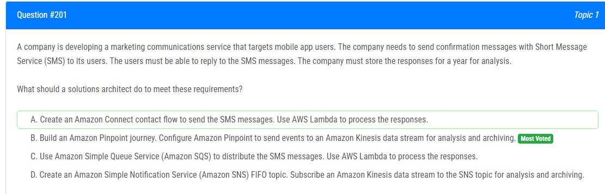

해설:

정답 B.

Amazon Pinpoint을 통한 SMS 메시지 전송: Amazon Pinpoint은 SMS를 포함한 다양한 채널을 통해 대상 지정 메시지를 전송하기 위한 서비스로 설계되었습니다. 개인화 및 예약된 통신을 가능하게 합니다.

Amazon Kinesis를 통한 분석 및 아카이빙: Amazon Pinpoint을 구성하여 이벤트를 Amazon Kinesis 데이터 스트림으로 전송하도록 설정하는 것은 응답을 분석하고 아카이빙하는 데 적합한 선택입니다. Amazon Kinesis는 실시간 데이터 스트리밍 및 처리를 위한 강력한 플랫폼으로, 응답을 실시간으로 수집하고 분석하는 데 이상적입니다.

일년간의 데이터 보존: 선택지에 정확한 데이터 보존 기간이 명시되어 있지 않지만, Amazon Kinesis는 장기간 데이터 저장을 위한 기능을 제공합니다. 장기간의 아카이빙 및 분석에 적합합니다.

확장성과 유연성: Amazon Pinpoint 및 Amazon Kinesis는 다양한 워크로드를 처리할 수 있는 확장 가능한 서비스입니다. 특히 잠재적으로 많은 수의 SMS 메시지 및 응답을 처리해야 하는 마케팅 통신 서비스에서 필요한 유연성을 제공합니다.

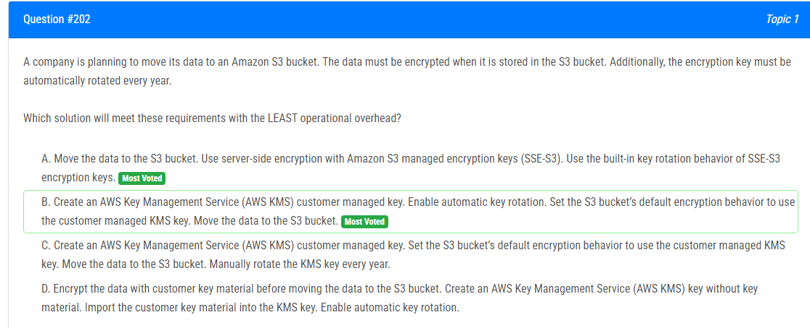

해설:

정답 B.

AWS KMS Customer Managed Key with Automatic Key Rotation: B 옵션에서는 AWS Key Management Service (AWS KMS)를 사용하여 고객이 관리하는 키를 생성하고, 이 키의 자동 키 로테이션을 활성화합니다. 이로써 매년 키가 자동으로 로테이션되므로 보안 강화가 자동으로 이루어집니다.

S3 Bucket의 기본 암호화 동작 설정: S3 버킷의 기본 암호화 동작을 고객이 관리하는 KMS 키로 설정합니다. 이렇게 하면 해당 버킷에 저장되는 모든 데이터가 지정된 KMS 키를 사용하여 암호화됩니다.

자동 키 로테이션 활성화: B 옵션에서는 KMS 키의 자동 키 로테이션을 활성화하므로, 매년 키가 자동으로 갱신되어 데이터의 보안성이 유지됩니다.

비교적 적은 수의 단계로 설정이 가능하며, 주기적인 수동 키 로테이션 없이도 자동으로 보안 강화가 이루어지기 때문에 B 옵션이 가장 적은 운영 오버헤드를 가지며 요구 사항을 충족시킬 것으로 예상됩니다.

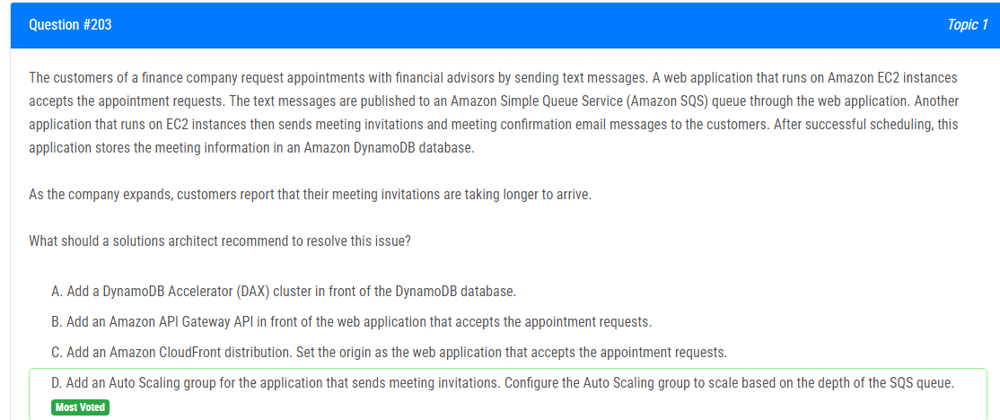

해설:

정답 D.

Auto Scaling Group for Meeting Invitation Application: D 옵션에서는 만남 초대를 전송하는 응용 프로그램을 처리하는 Auto Scaling 그룹을 추가합니다. Auto Scaling 그룹을 사용하면 트래픽이 증가할 때 EC2 인스턴스 수를 자동으로 조정할 수 있습니다.

Scaling Based on SQS Queue Depth: Auto Scaling 그룹을 SQS 큐의 깊이에 따라 스케일링하도록 구성합니다. 이렇게 하면 큐에 대기 중인 메시지가 많아질 때 인스턴스 수를 증가시켜 대기 시간을 줄일 수 있습니다.

Distributed Processing for Meeting Invitations: 이 옵션은 기존 인프라를 최대한 활용하면서 새로운 요청에 효과적으로 대응할 수 있도록 합니다. 큐의 깊이에 따라 자동으로 인스턴스를 추가하면 처리 속도를 높일 수 있습니다.

No Impact on DynamoDB or Email Sending: D 옵션은 DynamoDB와 이메일 전송과 직접적인 관련이 없으므로 이러한 서비스에는 영향을 미치지 않으면서도 만남 초대 메시지를 신속하게 처리할 수 있도록 도움이 됩니다.

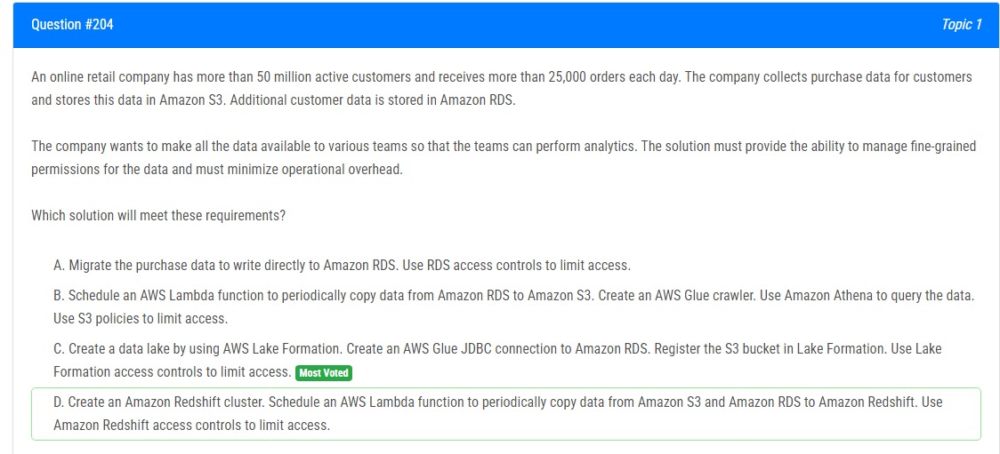

해설:

정답 C.

AWS Lake Formation for Fine-Grained Permissions: C 옵션에서는 AWS Lake Formation을 사용하여 데이터 레이크를 생성합니다. Lake Formation은 데이터에 대한 세부적인 권한을 관리하는 데 사용되며, 이는 각 팀에게 필요한 권한을 제공하고 민감한 데이터에 대한 액세스를 제어할 수 있도록 합니다.

Integration with Amazon RDS and S3: C 옵션에서는 Amazon RDS와 S3를 통합하여 데이터를 수집합니다. Glue JDBC 연결을 사용하여 Amazon RDS와의 연결을 설정하고, S3 버킷을 Lake Formation에 등록하여 데이터를 관리합니다.

Operational Overhead 최소화: C 옵션은 데이터 레이크를 사용하여 데이터를 중앙에서 통합하므로, 데이터 이동이나 변환이 최소화됩니다. 이는 운영 오버헤드를 최소화하면서 효율적인 데이터 관리를 가능케 합니다.

Access Controls Using Lake Formation Policies: Lake Formation을 사용하여 세부적인 액세스 제어를 설정할 수 있습니다. 팀별로 필요한 권한을 할당하고 데이터에 대한 접근을 제한할 수 있습니다.

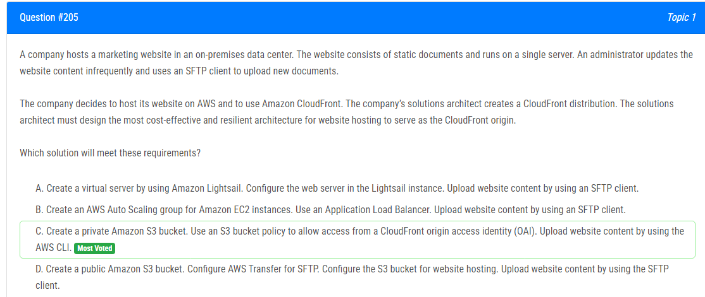

해설:

정답 C.

Private Amazon S3 Bucket: C 옵션에서는 프라이빗 Amazon S3 버킷을 생성합니다. 이로써 직접적인 외부 액세스를 방지하고 데이터를 안전하게 저장할 수 있습니다.

CloudFront Origin Access Identity (OAI): S3 버킷에 대한 액세스를 CloudFront로 제한하기 위해 CloudFront OAI를 사용합니다. 이는 S3 버킷에 직접 액세스할 수 없도록 하고, CloudFront가 유일한 엔드포인트로 동작하도록 합니다.

AWS CLI for Content Upload: AWS CLI를 사용하여 웹 사이트 콘텐츠를 S3 버킷에 업로드할 수 있습니다. 이는 비정기적으로 업데이트되는 정적 문서를 관리하기에 효과적입니다.

Cost-Effective and Resilient: S3는 비용 효율적이며 높은 내구성을 제공합니다. 또한, CloudFront는 글로벌 네트워크를 통해 콘텐츠를 배포하여 사용자에게 낮은 지연 시간과 빠른 로딩 속도를 제공합니다.

Secure Content Delivery: S3 버킷 정책 및 CloudFront OAI를 사용하면 콘텐츠를 안전하게 전송할 수 있습니다.

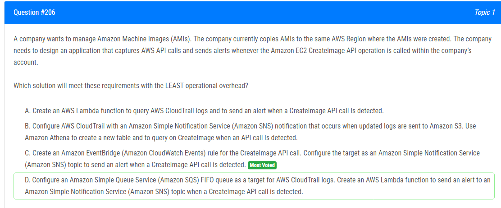

해설:

정답 C.

Amazon EventBridge (CloudWatch Events) Rule for CreateImage API Call: C 옵션에서는 Amazon EventBridge를 사용하여 CreateImage API 호출에 대한 이벤트를 캡처합니다. EventBridge는 클라우드 리소스 간의 이벤트 기반 통합을 가능케 하는 서비스로, 여러 AWS 서비스 간의 이벤트를 캡처하고 처리할 수 있습니다.

Amazon SNS Topic for Alerts: CreateImage API 호출이 감지되면 Amazon SNS 토픽으로 알림을 전송합니다. SNS는 간단하면서도 효과적인 방법으로 알림을 관리할 수 있는 서비스입니다.

Least Operational Overhead: Amazon EventBridge는 효율적이면서도 강력한 이벤트 기반 아키텍처를 제공하며, 설정이 간단하고 유지 관리가 쉽습니다. CloudWatch Events를 사용하여 특정 이벤트에 대한 규칙을 정의하면서 감지된 CreateImage API 호출에 대한 경고를 보낼 수 있습니다.

No Need for Manual Querying: C 옵션에서는 이벤트 규칙을 설정하여 감지된 이벤트에 자동으로 반응하므로, 수동으로 CloudTrail 로그를 쿼리하거나 Athena를 설정할 필요가 없습니다.

해설:

정답 D.

Amazon SQS for Decoupling: D 옵션에서는 Amazon SQS와 Lambda를 사용하여 DynamoDB에 대한 쓰기 작업을 완화합니다. SQS는 메시지 큐 서비스로, 비동기 방식으로 요청을 처리할 수 있습니다. 이를 통해 Lambda 함수가 DynamoDB에 쓰기 작업을 처리하는 동안에도 메시지가 안전하게 큐에 저장되어 있습니다.

Buffering Writes: SQS를 사용하면 Lambda 함수가 DynamoDB에 대한 쓰기 작업을 처리하는 동안 요청이 유실되지 않습니다. SQS 큐에 대기 중인 메시지는 나중에 Lambda 함수에 의해 안전하게 처리됩니다.

Scalability: SQS는 스케일링이 용이하며, 쓰기 트래픽이 증가하더라도 Lambda 함수가 이를 조절하여 DynamoDB에 안정적으로 기록됩니다.

No Impact on Existing Users: 기존 사용자에게는 영향이 없습니다. 새로운 아키텍처가 배포되고 동작하는 동안에도 Lambda 함수와 SQS 큐를 도입하여 요청을 안전하게 처리할 수 있습니다.

해설:

정답 A.

Interface VPC Endpoint for Amazon S3: A 옵션에서는 EC2 인스턴스가 위치한 서브넷에 Amazon S3를 위한 인터페이스 VPC 엔드포인트를 생성합니다. 이 엔드포인트를 통해 EC2 인스턴스는 S3에 직접 연결할 수 있습니다.

Resource Policy on S3 Bucket: 해당 S3 버킷에는 리소스 정책을 추가하여 EC2 인스턴스의 IAM 역할만이 액세스할 수 있도록 설정합니다. 이는 S3 버킷에 대한 액세스를 EC2 인스턴스로 제한하는 역할을 합니다.

No Public Internet Routes: 인터페이스 VPC 엔드포인트를 통해 트래픽이 공용 인터넷 경로를 통하지 않고 직접 연결되므로, 공용 인터넷을 통한 액세스가 차단되어 있습니다.

Secure and Direct Data Transfer: EC2 인스턴스에서 S3로의 직접 연결은 안전하며, 공용 인터넷을 경유하지 않으므로 보안이 강화됩니다.

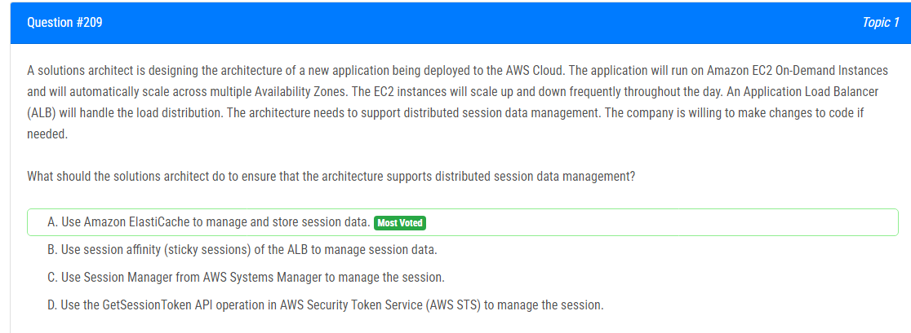

해설:

정답 A.

Amazon ElastiCache for Distributed Session Data Management: Amazon ElastiCache는 분산 캐시 서비스로, 세션 데이터를 효과적으로 저장하고 관리할 수 있습니다. ElastiCache를 사용하면 여러 EC2 인스턴스 간에 세션 데이터를 공유하고 확장할 수 있습니다.

Support for Auto Scaling and Multiple Availability Zones: ElastiCache는 Auto Scaling 및 다중 가용 영역 환경에서도 잘 동작합니다. 이는 EC2 인스턴스가 자동으로 확장 및 축소될 때 세션 데이터에 일관성을 유지하는 데 중요합니다.

Separation of Session Data from EC2 Instances: ElastiCache를 사용하면 세션 데이터가 EC2 인스턴스와 분리되어 있으므로 인스턴스의 확장 또는 축소가 세션 데이터에 영향을 미치지 않습니다.

Scalability and Performance: ElastiCache는 높은 성능과 확장성을 제공하며, 메모리 기반의 저장소를 사용하여 세션 데이터를 빠르게 읽고 쓸 수 있습니다.

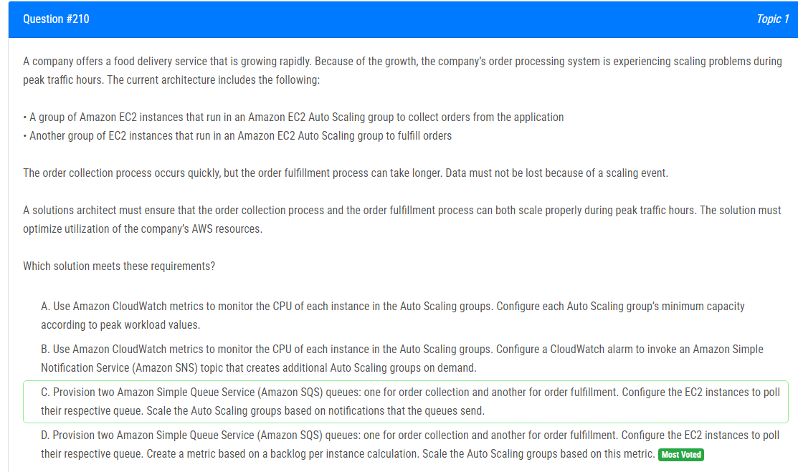

해설:

정답 D.

Amazon SQS for Decoupling: D 옵션에서는 Amazon SQS를 사용하여 주문 수집 및 주문 처리 프로세스를 분리합니다. SQS는 메시지 대기열 서비스로, 주문 수집 및 주문 처리 간의 결합도를 낮추고 각각의 프로세스를 비동기적으로 처리할 수 있습니다.

Backlog Metric for Scaling: D 옵션에서는 각 EC2 인스턴스의 대기열에 대한 지연 메트릭을 생성합니다. 이 메트릭은 인스턴스당 대기열에 쌓인 메시지 수를 측정하고, 이를 기반으로 Auto Scaling 그룹을 스케일링합니다. 이렇게 함으로써 주문 처리 지연에 대응하여 자동으로 스케일 업 또는 스케일 다운이 이루어집니다.

Decoupled Processing: SQS를 사용하여 주문 수집과 주문 처리가 분리되므로, 두 프로세스는 서로의 작업에 대해 몰입할 수 있습니다. 주문 수집 프로세스의 빠른 처리와 주문 처리 프로세스의 비동기 처리는 서로에게 영향을 덜 주면서 확장성을 향상시킵니다.

Avoiding Data Loss: SQS를 통해 메시지 대기열이 데이터를 안전하게 버퍼링하므로, 스케일 업 또는 스케일 다운이 발생해도 데이터 손실이 최소화됩니다.

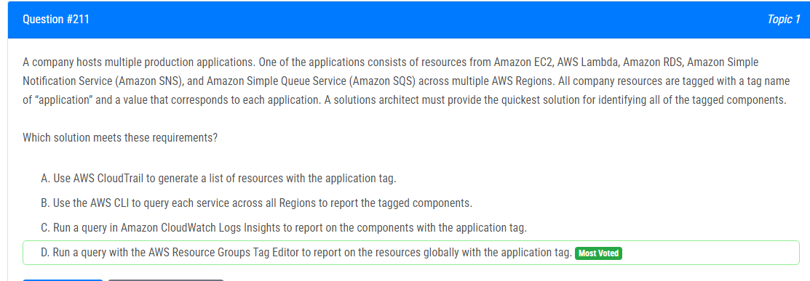

해설:

정답 D.

AWS Resource Groups Tag Editor: D 옵션에서는 AWS Resource Groups Tag Editor를 사용하여 모든 리전에서 효과적으로 태그가 지정된 리소스를 확인합니다. 이 도구를 사용하면 단일 콘솔에서 모든 리전을 대상으로 쿼리를 수행할 수 있습니다.

Global Query for Tagged Resources: AWS Resource Groups Tag Editor를 사용하면 글로벌 쿼리를 수행하여 모든 리전에서 태그가 지정된 리소스를 한 번에 식별할 수 있습니다.

Consistent and Centralized Reporting: AWS Resource Groups Tag Editor를 사용하면 모든 리전의 리소스에 대한 일관된 보고서를 생성할 수 있으며, 중앙 집중화된 방식으로 리소스를 관리할 수 있습니다.

Ease of Use: AWS Resource Groups Tag Editor는 편리한 콘솔 인터페이스를 제공하여 사용자가 쉽게 필요한 정보를 얻을 수 있습니다.

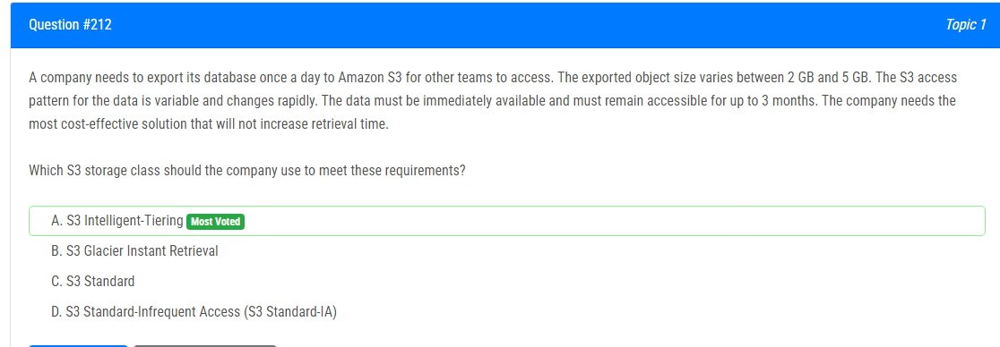

해설:

정답 A.

Variable Access Patterns: S3 Intelligent-Tiering은 객체에 대한 액세스 패턴에 대응하여 자동으로 저렴한 스토리지 클래스로 전환하거나 다시 표준 스토리지 클래스로 전환합니다. 이는 변수 및 빠르게 변화하는 액세스 패턴에 효과적입니다.

Immediate Availability: S3 Intelligent-Tiering은 S3 Standard과 거의 동일한 성능을 제공하며, 데이터는 즉시 사용 가능합니다. 객체가 빈번하게 액세스되면 자동으로 S3 Standard로 전환됩니다.

Cost-Effective: S3 Intelligent-Tiering은 다른 스토리지 클래스와 비교하여 비용이 낮으며, 자동으로 액세스 패턴에 따라 최적의 스토리지 클래스로 이동하여 비용을 최적화합니다.

3-Month Retention: S3 Intelligent-Tiering은 데이터를 최소 30일 동안 보존해야 하며, 30일 후에 자동으로 저렴한 스토리지 클래스로 전환할 수 있습니다. 데이터를 3개월 동안 보존해야 하는 요구 사항을 충족합니다.

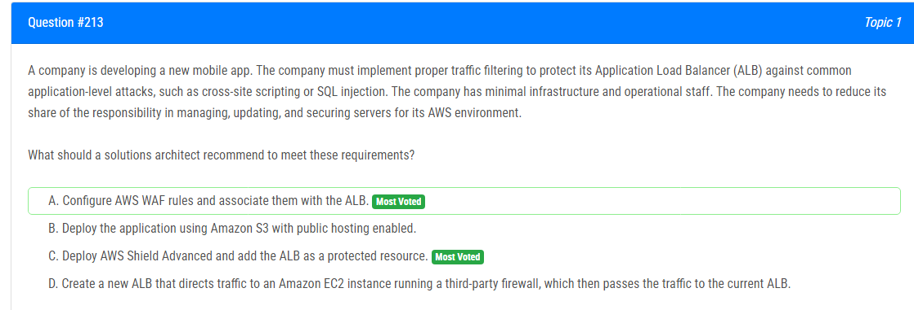

해설:

정답 A.

AWS WAF (Web Application Firewall): AWS WAF는 일반적인 웹 애플리케이션 공격에 대비하여 애플리케이션을 보호하는 웹 애플리케이션 방화벽 서비스입니다. A 옵션에서는 AWS WAF를 사용하여 ALB 앞에서 애플리케이션을 보호할 수 있습니다.

Common Application-Level Attacks: AWS WAF는 여러 유형의 공격, 예를 들어 크로스 사이트 스크립팅 (XSS) 또는 SQL 인젝션과 같은 일반적인 웹 애플리케이션 공격을 탐지하고 차단할 수 있습니다.

Minimal Infrastructure and Operational Staff: AWS WAF는 관리 및 업데이트에 대한 책임을 AWS에게 맡기므로, 인프라 및 운영 스태프의 부담을 최소화합니다.

Integrated with ALB: AWS WAF를 ALB와 연동하여 쉽게 웹 애플리케이션에 보안 정책을 적용할 수 있습니다.

Cost-Effective: AWS WAF는 트래픽에 따라 비용이 청구되므로 특히 사용한 만큼 비용을 지불하게 되어 비용 효율적인 솔루션입니다.

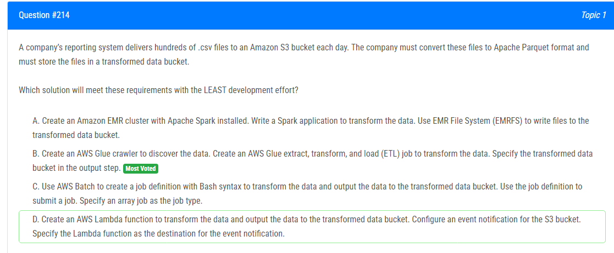

해설:

정답 B.

AWS Glue ETL Job: AWS Glue는 완전 관리형의 ETL (Extract, Transform, Load) 서비스이며, B 옵션에서는 AWS Glue ETL Job을 활용하여 데이터 변환을 수행합니다. Glue는 데이터 변환을 위한 스크립트를 생성하고 관리하는 데 필요한 많은 부분을 처리해주므로 개발 노력을 크게 줄일 수 있습니다.

Glue Crawler: Glue Crawler를 사용하여 S3 버킷에 저장된 CSV 파일을 자동으로 검색하고 스키마를 추출할 수 있습니다.

Transformed Data Bucket Output: Glue ETL Job의 출력 단계에서는 새로운 형식으로 변환된 데이터를 지정된 "transformed data bucket"에 저장할 수 있습니다.

Serverless and Managed Service: AWS Glue는 완전 관리형이며, 서버리스 서비스이므로 별도의 클러스터나 인프라를 프로비저닝할 필요가 없습니다.

Integration with Other AWS Services: AWS Glue는 다른 AWS 서비스와의 통합이 용이하며, S3와의 연동이 간편합니다.

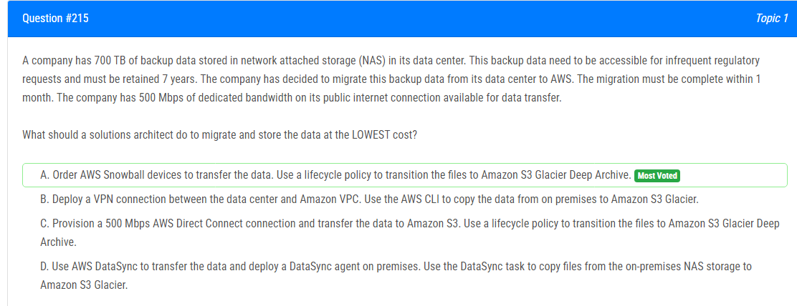

해설:

정답 A.

AWS Snowball for Large Data Transfer: 700 TB의 데이터를 효율적으로 전송하려면 대용량 데이터 전송을 위한 AWS Snowball이 적합합니다. Snowball은 데이터를 안전하게 물리적 장치에 저장하고 AWS로 안전하게 전송할 수 있는 서비스입니다.

Amazon S3 Glacier Deep Archive for Cost Savings: AWS Snowball을 사용하여 전송한 데이터는 Amazon S3에 저장된 후, Amazon S3 Glacier Deep Archive로 전환될 수 있습니다. Amazon S3 Glacier Deep Archive는 데이터를 매우 저렴한 비용으로 장기 보존할 수 있는 스토리지 클래스입니다.

One-Time Data Transfer: Snowball을 사용하면 데이터를 한 번 전송하면 되므로 월 단위로 청구되는 Direct Connect나 VPN에 비해 초기 전송 비용이 더 저렴합니다.

Efficient for Limited Bandwidth: Snowball을 사용하면 데이터 전송을 로컬 장치로 수행하므로 로컬 인터넷 연결 속도에 크게 의존하지 않습니다.

Simplified Management: AWS Snowball은 간단한 작업이며 관리가 용이하며, 큰 대역폭의 네트워크 연결이 필요하지 않습니다.

해설:

정답 B.

B 옵션은 최소한의 노력으로 모든 기존 및 미래 객체에 대한 암호화를 적용하는 가장 효과적인 솔루션으로 보입니다. 이유는 다음과 같습니다:

Default Encryption Settings: B 옵션에서는 S3 버킷에 대한 기본 암호화 설정을 활성화합니다. 이로써 새로 추가되는 모든 객체에 대해 자동으로 서버 측 암호화가 적용됩니다.

S3 Inventory and Batch Operations: S3 Inventory를 사용하여 S3 버킷의 모든 객체에 대한 .csv 파일을 생성하고, 이 파일을 사용하여 S3 Batch Operations 작업을 설정합니다. S3 Batch Operations는 대규모로 작업을 처리할 수 있어, 모든 암호화되지 않은 객체를 대상으로 복사 명령을 실행하여 객체를 새로운 암호화된 객체로 복사할 수 있습니다.

Efficiency and Automation: 이 방법은 자동화되어 있으며, 모든 객체를 일일이 처리할 필요가 없습니다. 기존 객체에 대한 암호화를 놓치는 위험을 최소화하면서도 적은 노력으로 전반적인 작업을 완료할 수 있습니다.

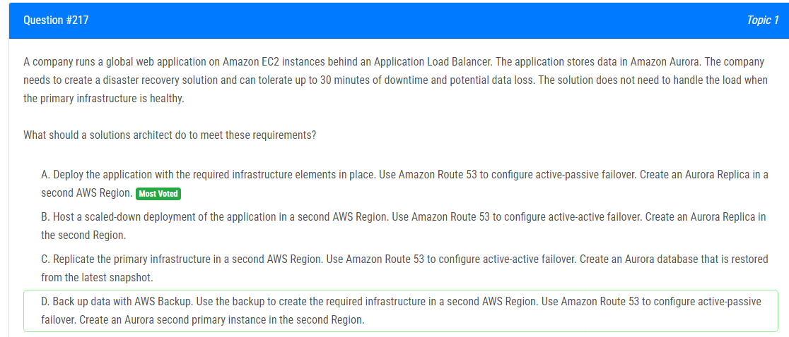

해설:

정답 A.

Active-Passive Failover with Amazon Route 53: A 옵션에서는 Amazon Route 53을 사용하여 활성-비활성(Failover) 구성을 구현합니다. 이는 주(primary) 리전이 비정상인 경우에만 트래픽을 대체 리전으로 전환합니다.

Aurora Replica in Second Region: Aurora는 다중 리전(Across Regions)에 걸쳐 Replicas를 생성할 수 있습니다. A 옵션에서는 두 번째 AWS 리전에 Aurora Replica를 생성하여 데이터의 비동기적 복제를 수행합니다.

Tolerance for 30 Minutes of Downtime and Potential Data Loss: Active-Passive 구성은 주(primary) 리전의 장애 시 30분 이내에 대체 리전으로 전환하여 서비스 중단을 최소화합니다. 그러나 Aurora의 비동기적 복제로 인해 데이터 손실이 예상됩니다.

No Need to Handle Load in the DR State: 문제에서는 DR 상태에서의 부하 처리가 필요하지 않다고 명시되어 있으므로, 비활성 상태일 때는 가동 중인 리전의 부하를 처리할 필요가 없습니다.

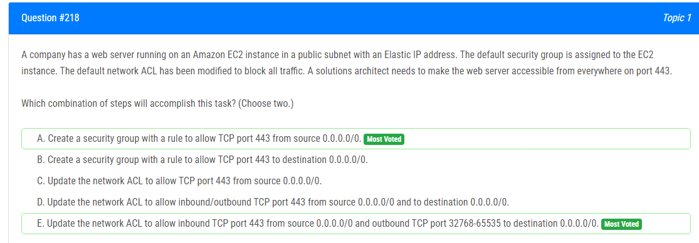

해설:

정답 A, E.

Create a security group with a rule to allow TCP port 443 from source 0.0.0.0/0 (A 옵션): 보안 그룹을 만들고 TCP 포트 443을 모든 소스 (0.0.0.0/0)에서 허용하는 규칙을 추가합니다. 이렇게 하면 웹 서버가 포트 443에서 수신하는 외부 트래픽을 허용합니다.

Update the network ACL to allow inbound TCP port 443 from source 0.0.0.0/0 and outbound TCP port 32768-65535 to destination 0.0.0.0/0 (E 옵션): 네트워크 ACL을 업데이트하여 TCP 포트 443의 인바운드 트래픽을 0.0.0.0/0에서 허용하고, 아웃바운드 트래픽을 0.0.0.0/0으로 보내는 동시에 동적 포트 범위(32768-65535)의 아웃바운드 트래픽도 허용합니다. 이렇게 함으로써 외부에서의 요청 및 서버에서의 응답이 모두 허용됩니다.

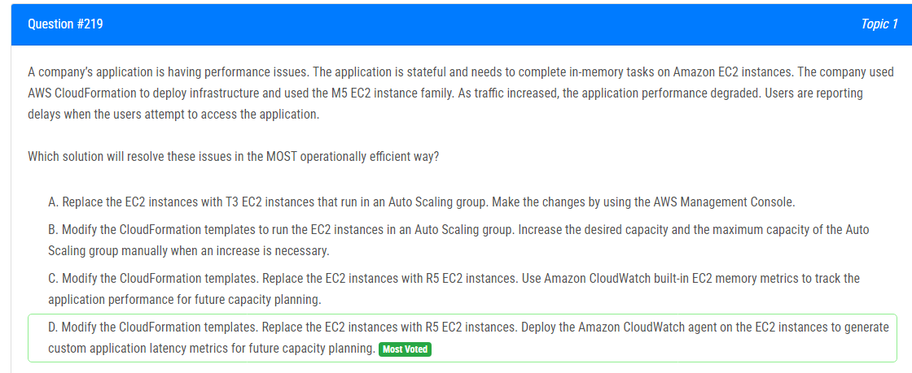

해설:

정답 D.

Replace with R5 EC2 Instances: M5 인스턴스는 범용용途로 설계되어 있으며, 메모리 집약적인 작업을 위한 최적화가 부족할 수 있습니다. R5 인스턴스는 메모리 최적화된 인스턴스 패밀리로, 애플리케이션의 성능을 향상시킬 수 있습니다.

Deploy Amazon CloudWatch Agent for Custom Metrics (D 옵션): CloudWatch Agent를 사용하여 EC2 인스턴스에 대한 사용자 지정 응용 프로그램 지연 시간 메트릭을 생성합니다. 이렇게 함으로써 애플리케이션의 성능을 실시간으로 모니터링하고 미래의 용량 계획에 활용할 수 있습니다.

CloudFormation Template Modification (D 옵션): CloudFormation 템플릿을 수정하여 인스턴스를 R5로 교체합니다. 이를 통해 클라우드 인프라를 코드로 관리할 수 있습니다.

Operational Efficiency: CloudWatch를 활용하여 성능 지표를 측정하고 모니터링하므로, 성능 문제를 식별하고 미리 예방할 수 있습니다. 또한 CloudFormation을 통한 템플릿 수정은 인프라 변경을 반복 가능하게 하여 운영 효율성을 높입니다.

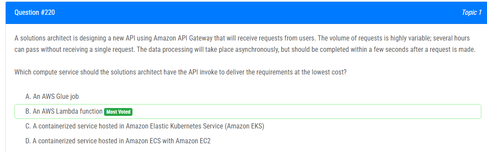

해설:

정답 B.

Event-Driven and Asynchronous: AWS Lambda는 이벤트 기반 및 비동기적으로 작동합니다. API Gateway에서 Lambda 함수를 호출하면 Lambda 함수가 필요한 데이터 처리를 비동기적으로 수행할 수 있습니다.

Auto-Scaling: Lambda는 자동으로 스케일링되므로, API에 대한 요청이 증가할 때 즉시 처리할 수 있습니다. 또한, 비활성 기간 동안 비용이 발생하지 않습니다.

Low Operational Overhead: Lambda 함수는 서버리스로 관리되기 때문에 운영 오버헤드가 낮습니다. 서버 관리, 확장 및 보안에 대한 걱정이 없이도 효율적으로 사용할 수 있습니다.

Short-Lived and Cost-Effective: Lambda 함수는 짧은 실행 시간 동안만 비용이 청구되므로, 사용자 요청에 대한 빠른 응답이 가능하면서도 비용을 최소화할 수 있습니다.

