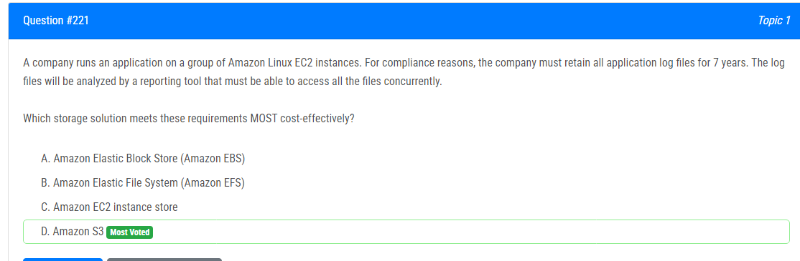

해설:

정답 D.

Cost-Effective Storage: Amazon S3는 비용 효과적인 스토리지 솔루션으로, 데이터를 장기 보관하는 데 매우 효과적입니다.

Durability and Availability: S3는 데이터의 내구성과 가용성을 보장합니다. 데이터는 여러 AZ(Availability Zones)에 걸쳐 자동으로 복제되어 손실을 방지하며, 필요할 때 언제든지 접근할 수 있습니다.

Concurrent Access: 여러 EC2 인스턴스 및 도구에서 동시에 접근할 수 있는 S3 버킷을 구성할 수 있습니다. 따라서 보고 도구가 모든 로그 파일에 동시에 액세스할 수 있습니다.

Lifecycle Policies: S3에서는 로그 파일과 같은 데이터의 수명 주기 정책을 사용하여 자동으로 이러한 데이터를 일정 기간 동안 보관한 다음 필요에 따라 다른 스토리지 클래스로 이동할 수 있습니다.

Simple Management: S3는 관리가 간편하며 AWS Management Console, AWS CLI, SDK 등 다양한 도구를 통해 쉽게 사용할 수 있습니다.

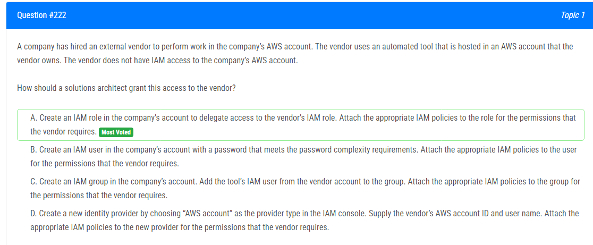

해설:

정답 A.

Cross-Account IAM Role: A에서는 외부 벤더가 보유한 AWS 계정에서 IAM 역할을 생성하여, 해당 역할을 통해 회사의 AWS 계정에 대한 액세스를 위임할 수 있습니다.

Least Privilege: IAM 역할을 생성하면 벤더에게 필요한 최소한의 권한만 부여할 수 있습니다. 이를 통해 보안을 강화하고 원치 않는 액세스를 방지할 수 있습니다.

Temporary Security Credentials: IAM 역할을 통한 액세스를 사용하면 벤더가 일시적인 보안 자격 증명을 얻어서 회사의 AWS 리소스에 접근할 수 있습니다. 이러한 일시적인 자격 증명은 보안을 강화하고 권한 부여를 더욱 효과적으로 관리할 수 있게 합니다.

Delegated Administration: 회사는 벤더가 어떤 권한을 부여받을지 제어할 수 있으며, 필요한 경우 언제든지 IAM 역할의 권한을 수정할 수 있습니다.

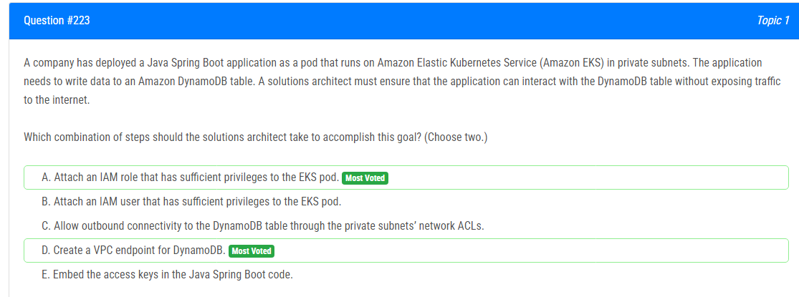

해설:

정답 A, D.

Attach an IAM role that has sufficient privileges to the EKS pod (A 옵션):

IAM 역할은 EKS pod에서 필요한 AWS 서비스와의 상호 작용을 위한 권한을 부여하는 데 사용됩니다.
애플리케이션에는 IAM 역할이 필요하며, 필요한 DynamoDB 작업을 수행할 수 있는 IAM 정책이 연결되어 있어야 합니다.
Create a VPC endpoint for DynamoDB (D 옵션):

VPC 엔드포인트를 생성하여 EKS pod에서 DynamoDB에 프라이빗하게 액세스할 수 있습니다.
VPC 엔드포인트는 인터넷을 통하지 않고도 AWS 서비스와 통신할 수 있는 경로를 제공하므로 보안성이 향상됩니다.

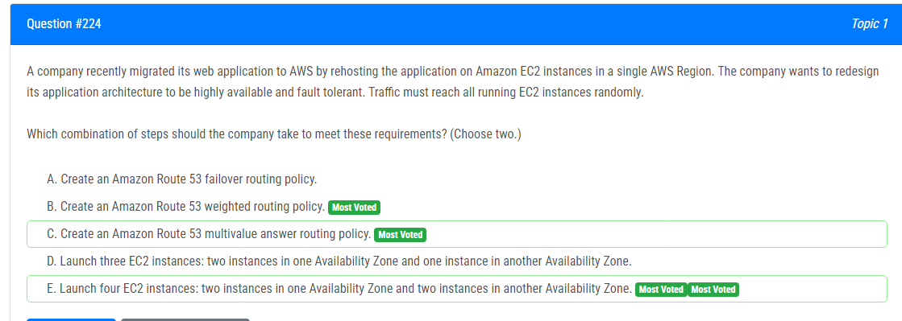

해설:

정답 C, E.

Create an Amazon Route 53 multivalue answer routing policy (C 옵션):

Multivalue Answer 방식은 여러 값의 응답 중에서 임의로 선택하여 트래픽을 분산하는 방식입니다.
다양한 IP 주소를 제공하는 다양한 EC2 인스턴스를 가리키는 레코드를 만들어, 트래픽이 모든 실행 중인 EC2 인스턴스로 무작위로 분산될 수 있도록 설정합니다.

Launch four EC2 instances: two instances in one Availability Zone and two instances in another Availability Zone (E 옵션):

여러 가용 영역에 인스턴스를 배치하여 고가용성을 확보하고 장애 허용성을 향상시킵니다.
두 가용 영역에 각각 두 개의 EC2 인스턴스를 배치하여, 하나의 가용 영역이 장애가 발생하더라도 다른 가용 영역의 인스턴스로 트래픽이 유도됩니다.

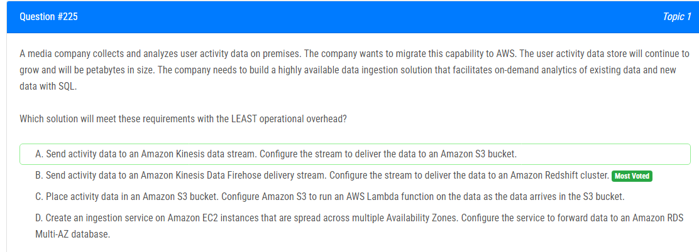

해설:

정답 B.

Amazon Kinesis Data Firehose는 간단하게 설정하고 데이터를 다양한 대상으로 전송하는 데 사용됩니다.
Amazon Redshift는 데이터 웨어하우스로서 SQL 쿼리를 지원하며, 대량의 데이터를 처리하고 분석하는 데 최적화되어 있습니다.
이 옵션을 선택하면 Kinesis Data Firehose를 통해 데이터를 Amazon Redshift로 전송하므로 데이터 인계 및 분석에 대한 운영 오버헤드가 최소화됩니다.
Amazon Redshift는 확장성이 높고 고성능의 분석을 제공하며, Multi-AZ 옵션을 통해 고가용성을 확보할 수 있습니다.

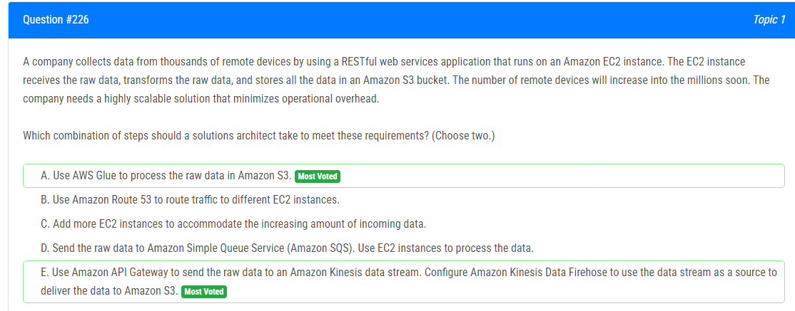

해설:

정답 A, E.

Use AWS Glue to process the raw data in Amazon S3 (A 옵션):

AWS Glue는 완전 관리형 ETL(Extract, Transform, Load) 서비스로, 데이터의 추출, 변환 및 적재 작업을 자동화합니다.
Glue를 사용하면 대규모의 데이터 처리 및 변환을 쉽게 확장할 수 있으며, 서버리스 아키텍처로 관리 오버헤드가 최소화됩니다.

Use Amazon API Gateway to send the raw data to an Amazon Kinesis data stream. Configure Amazon Kinesis Data Firehose to use the data stream as a source to deliver the data to Amazon S3 (E 옵션):

Amazon API Gateway는 RESTful 웹 서비스를 쉽게 생성, 배포 및 유지할 수 있는 완전 관리형 서비스입니다.
Amazon Kinesis Data Firehose는 스트리밍 데이터를 수집하고 전송하는 서비스로, 데이터를 Amazon S3에 효율적으로 전달할 수 있습니다.
이 방식은 서버리스 아키텍처로, EC2 인스턴스의 관리 오버헤드를 최소화하면서 필요한 확장성을 제공합니다.

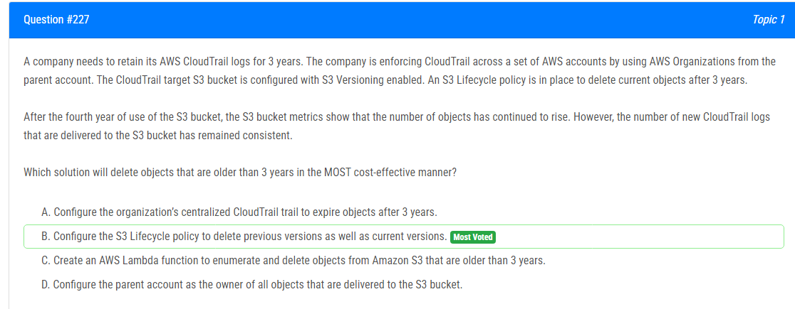

해설:

정답 B.

S3 버킷 라이프사이클 정책을 사용하면 특정 기간 이후에 오래된 객체를 자동으로 삭제할 수 있습니다.
정책을 통해 버전 관리를 사용하면 이전 버전도 삭제할 수 있습니다.
이 옵션을 선택하면 라이프사이클 정책에 따라 3년 이상 된 객체 및 이전 버전이 자동으로 삭제되므로 비용이 절감됩니다.

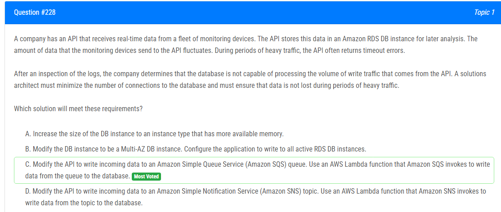

해설:

정답 C.

Amazon SQS를 사용하여 트래픽 제어: API에서 들어오는 데이터를 Amazon SQS 대기열로 전송함으로써, 데이터베이스에 직접적인 쓰기 트래픽을 완화할 수 있습니다.
SQS는 대량의 데이터를 처리하는 데 효과적이며, 대기열을 통해 데이터베이스에 일괄 처리할 수 있습니다.

AWS Lambda로 비동기적 데이터 쓰기: Amazon SQS 대기열에 대한 트리거로 AWS Lambda 함수를 구성하여 데이터베이스에 대한 비동기적인 쓰기를 수행할 수 있습니다.
Lambda 함수는 큐에서 메시지를 받아와 데이터베이스에 쓰기 작업을 수행합니다.

다양한 이점: SQS를 통한 비동기 데이터 쓰기는 데이터베이스에 직접적인 부하를 제거하므로 API는 데이터 쓰기 작업이 완료될 때까지 대기하지 않아도 됩니다.
Lambda 함수는 필요한 리소스만 할당되므로 효율적인 확장이 가능합니다.

다중 Lambda 인스턴스: Lambda 함수는 요청당 하나가 아니라 여러 인스턴스가 병렬로 실행될 수 있으므로 대량의 데이터를 효과적으로 처리할 수 있습니다.

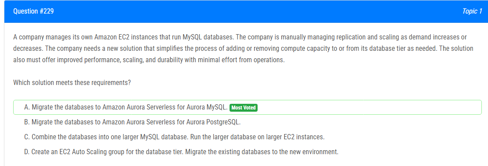

해설:

정답 A.

자동 스케일링 용량: Aurora Serverless는 실제 사용에 기반하여 데이터베이스 용량을 자동으로 조정합니다. 실제 사용에 따라 컴퓨팅 용량을 확장하거나 축소하며, 비활동 기간 동안 일시 중지하여 개선된 비용 효율성을 제공합니다.
관리의 용이성: Aurora Serverless는 자동으로 스케일링 및 복제를 처리함으로써 데이터베이스 관리를 간편화합니다. 이는 회사의 운영 부담을 줄입니다.
성능: Aurora는 고성능 및 내구성을 제공하는 완전히 관리되는 관계형 데이터베이스 서비스입니다. Aurora Serverless는 수요에 따라 성능을 최적화하여 효율적인 리소스 활용을 보장합니다.
내구성: Aurora는 여러 가용 영역 간에 데이터를 복제하여 높은 내구성을 제공합니다. 이는 데이터가 장애에 견딜 수 있도록 합니다.
최소한의 노력: 회사는 Aurora의 관리 기능을 활용하여 자동 백업, 소프트웨어 패치 및 스케일링과 같은 기능을 최소한의 노력으로 얻을 수 있습니다.

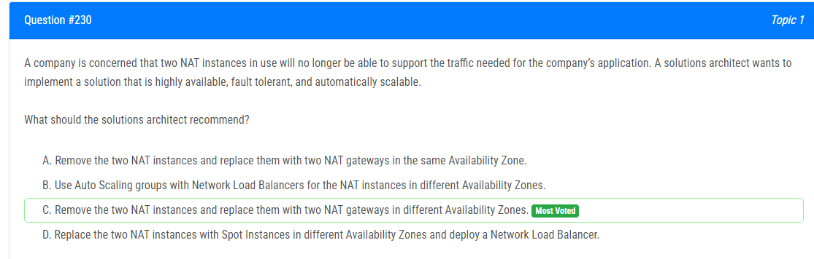

해설:

정답 C.

고가용성 및 내결함성: NAT 게이트웨이는 AWS에서 관리되는 서비스이며, 여러 가용 영역에 걸쳐 자동으로 고가용성 및 내결함성을 제공합니다. 가용 영역 간에 게이트웨이가 존재하므로 하나의 가용 영역에서 장애가 발생하더라도 다른 가용 영역에서 NAT 기능이 계속 작동할 수 있습니다.
자동 확장: NAT 게이트웨이는 자동으로 스케일되므로 트래픽 증가에 따라 필요한 대로 처리됩니다. 이는 Auto Scaling의 수동 구성 및 관리가 필요하지 않습니다.
간소화된 관리: NAT 게이트웨이는 AWS에서 제공하는 완전 관리형 서비스로, 사용자가 관리할 필요가 없습니다. 따라서 운영 부담이 감소합니다.

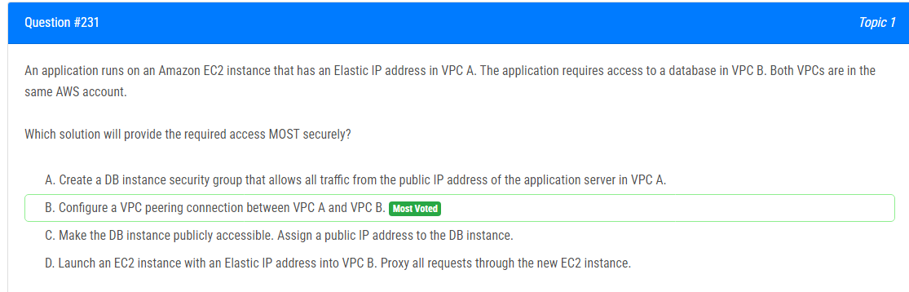

해설:

정답 B.

보안: VPC 피어링 연결은 두 VPC 간의 안전한 연결을 제공합니다. 트래픽은 AWS 백본 네트워크를 통해 전송되며, 피어링 연결이 설정되어 있으면 두 VPC 간의 내부 IP 주소로 트래픽이 라우팅됩니다.

AWS 리소스 간 직접 통신: VPC 피어링을 사용하면 두 VPC 간에 직접 통신이 가능해집니다. 이를 통해 EC2 인스턴스가 Elastic IP를 사용하여 VPC A에서 DB 인스턴스로 안전하게 액세스할 수 있습니다.

Public IP 피해: VPC 피어링을 통해 보안 그룹 규칙을 통해 필요한 트래픽만을 허용하면서, 퍼블릭 IP 주소나 외부 통신을 사용하지 않고도 데이터베이스에 접근할 수 있습니다.

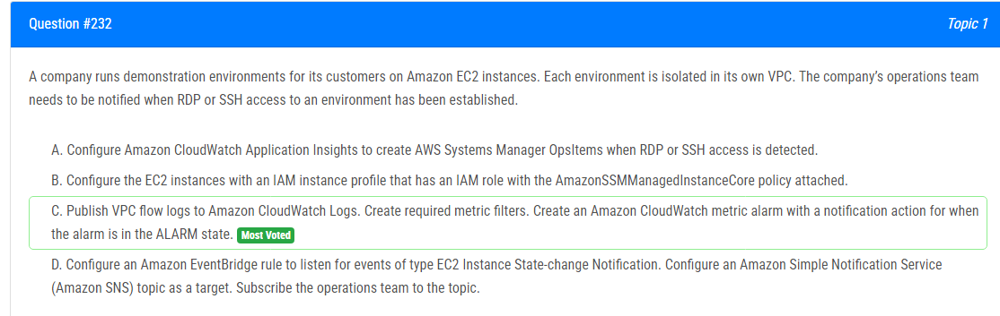

해설:

정답 C.

VPC 플로우 로그: VPC 플로우 로그를 Amazon CloudWatch Logs에 게시함으로써 VPC 내 네트워크 인터페이스를 통한 IP 트래픽에 관한 정보를 얻을 수 있습니다. 이는 Linux 인스턴스의 경우 SSH 및 Windows 인스턴스의 경우 RDP 연결과 관련된 정보를 포함합니다.

메트릭 필터: CloudWatch Logs에 대한 메트릭 필터를 만들어 로그에서 특정 정보를 추출할 수 있습니다. 여기에서는 RDP 및 SSH 연결을 식별하기 위한 필터를 만들 것입니다.

CloudWatch 메트릭 알람: 메트릭 필터를 구축한 후 해당 필터를 기반으로 CloudWatch 메트릭 알람을 설정할 수 있습니다. 예를 들어 RDP 또는 SSH 연결이 특정 임계값에 도달했을 때 경보 상태로 전환되는 알람을 만들 수 있습니다.

알림 작업: CloudWatch 메트릭 알람은 경보 상태로 전환될 때 (예: 특정 RDP 또는 SSH 연결 임계값이 초과될 때) 알림 작업(예: 운영 팀에게 알림 전송)을 수행하도록 구성할 수 있습니다.

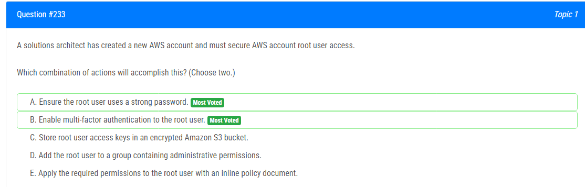

해설:

정답 A, B.

A. 루트 사용자에게 강력한 암호 사용: 루트 사용자에게 강력한 암호를 설정하여 계정에 대한 물리적인 보안을 강화합니다.

B. 루트 사용자에게 다중 인자 인증 (MFA) 활성화: 루트 사용자에 대한 다중 인자 인증을 활성화하면 비밀번호 외에도 추가적인 인증 요소를 제공하여 계정 보안을 향상시킵니다. MFA를 사용하면 보안이 강화되고, 루트 사용자의 계정에 대한 무단 액세스를 방지하는 데 도움이 됩니다.

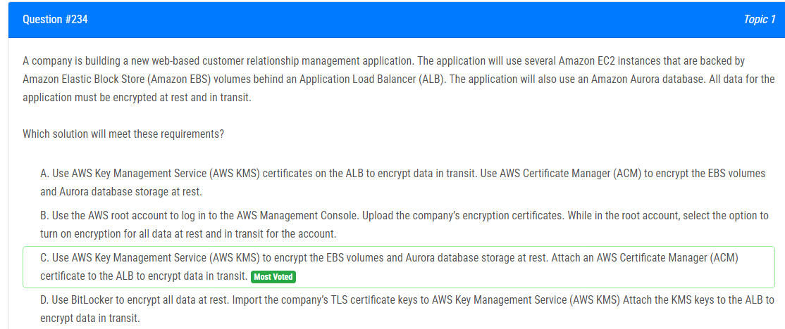

해설:

정답 C.

AWS KMS로 EBS 볼륨 및 Aurora 데이터베이스 저장 공간 암호화: AWS KMS는 통합 키 관리 서비스로, EBS 볼륨과 Aurora 데이터베이스의 저장 공간을 안전하게 암호화할 수 있습니다. 키를 사용자가 관리하거나 AWS가 자동으로 생성하게 할 수 있습니다.

AWS Certificate Manager (ACM) 인증서를 ALB에 연결하여 전송 중인 데이터 암호화: ACM은 SSL/TLS 인증서를 생성, 제어 및 유지 관리하는 데 사용되며, ALB와 함께 사용할 수 있습니다. ALB에 ACM 인증서를 연결하여 웹 애플리케이션의 데이터를 전송 중에 안전하게 암호화할 수 있습니다.

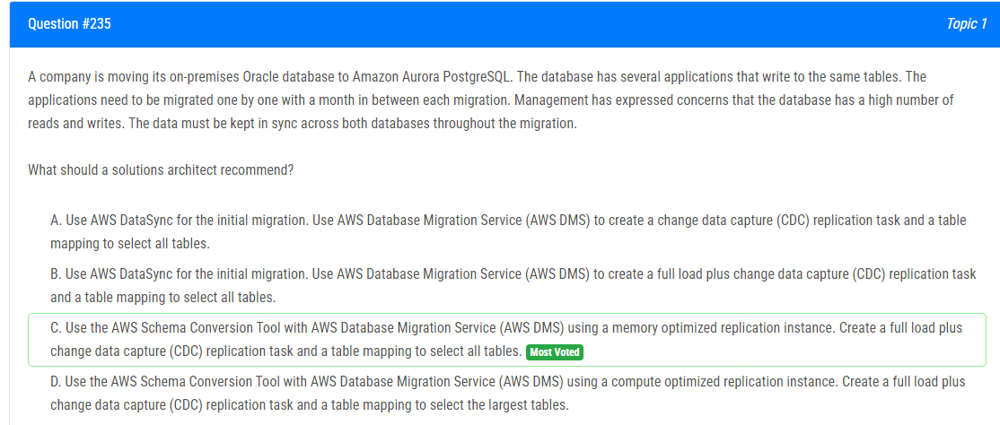

해설:

정답 C.

AWS Schema Conversion Tool (SCT) 사용: SCT는 Oracle 스키마를 Aurora PostgreSQL 스키마로 변환하는 데 사용됩니다. SCT를 사용하면 데이터 타입, 제약 조건 및 인덱스와 같은 스키마 요소들이 적절히 매핑되어 Aurora PostgreSQL과 호환됩니다.

AWS Database Migration Service (DMS) 사용: DMS를 사용하여 데이터를 안정적으로 마이그레이션하고 변경 데이터 캡처 (CDC) 기능을 활용할 수 있습니다. CDC를 사용하면 초기 전체 로드 후 변경 사항만 적용하여 대량의 데이터를 안정적으로 동기화할 수 있습니다.

메모리 최적화된 복제 인스턴스 사용: 변경 데이터 캡처 (CDC) 및 테이블 복제와 관련된 작업에 대한 성능 향상을 위해 메모리 최적화된 복제 인스턴스를 선택합니다.

모든 테이블을 선택하는 테이블 매핑 사용: 모든 테이블을 선택하여 모든 응용 프로그램이 마이그레이션될 때까지 데이터를 동기화합니다.

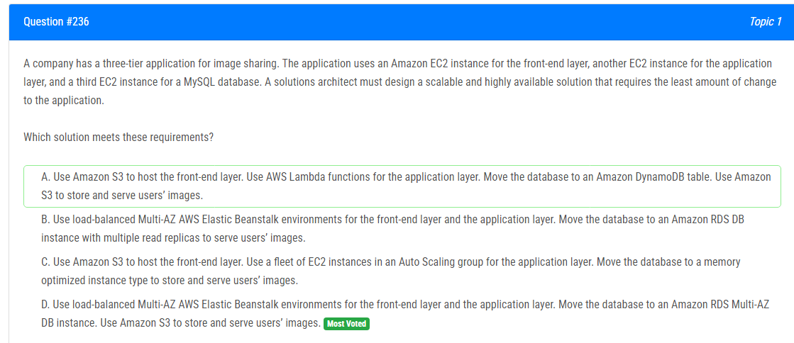

해설:

정답 D.

로드 밸런스된 Multi-AZ AWS Elastic Beanstalk 환경 사용: 이를 통해 프론트엔드 및 응용 프로그램 계층이 자동으로 관리되며, 고가용성을 제공합니다. Multi-AZ 구성을 사용하여 가용 영역 간에 자동 복제를 활용할 수 있습니다.

Amazon RDS Multi-AZ DB 인스턴스 사용: Amazon RDS를 사용하여 데이터베이스를 관리하면 관리적 오버헤드가 감소하고 자동 백업, 스냅샷, 자동 복제 및 Multi-AZ 배포와 같은 기능을 활용할 수 있습니다. 이로써 데이터베이스의 고가용성과 내구성이 향상됩니다.

Amazon S3를 사용하여 이미지 저장 및 제공: Amazon S3는 이미지 및 정적 파일과 같은 객체를 안전하게 저장하고 빠르게 제공하는 데 이상적입니다. 분산된 데이터를 처리하고 고객에게 안정적으로 서비스를 제공할 수 있습니다.

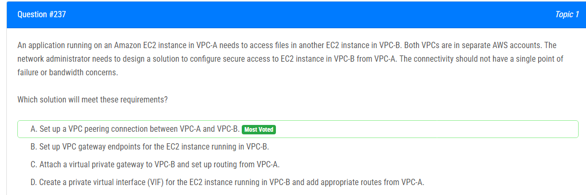

해설:

정답 A.

VPC 피어링 연결: VPC-A와 VPC-B 간에 VPC 피어링 연결을 설정하면 두 VPC 간에 네트워크 트래픽을 안전하게 전송할 수 있습니다. VPC 피어링은 단일 지점 장애를 피하면서도 안전하게 트래픽을 전송할 수 있는 간단하고 효과적인 방법을 제공합니다.

Bandwidth 우려 미미: VPC 피어링은 내부 AWS 네트워크를 통해 이루어지므로 대역폭에 대한 특별한 우려가 없습니다. VPC 피어링은 안정적이며 확장 가능한 솔루션을 제공합니다.

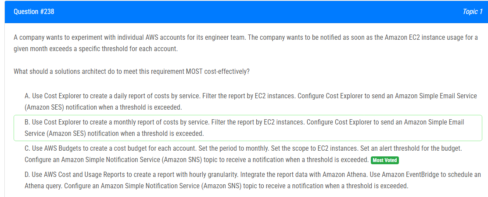

해설:

정답 C.

AWS Budgets 활용: AWS Budgets는 비용을 모니터링하고 비용이 특정 임계값을 초과할 때 경고를 생성하는 데 사용됩니다. 각 AWS 계정에 대한 별도의 예산을 설정하여 EC2 인스턴스 사용량을 모니터링할 수 있습니다.

단기 및 장기적인 알림: AWS Budgets는 사용량이 달성되거나 초과될 때 알림을 생성하므로 사용자는 즉시 예산을 초과하는지 여부를 알 수 있습니다.

AWS SNS 통합: AWS Budgets는 알림을 생성할 때 Amazon SNS (Simple Notification Service) 토픽과 통합됩니다. 이를 통해 민감한 정보를 안전하게 통지할 수 있습니다.

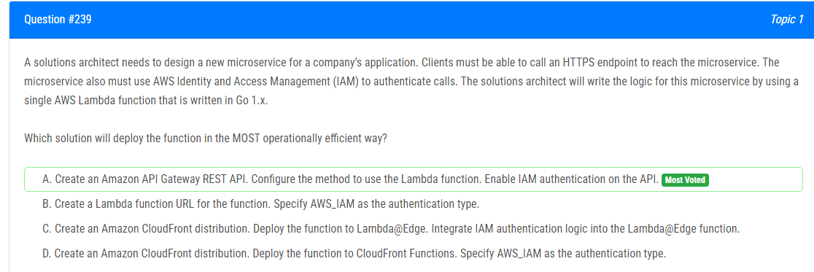

해설:

정답 A.

IAM Authentication 지원: Amazon API Gateway는 클라이언트가 호출할 수 있는 외부 HTTPS 엔드포인트를 제공하며, API Gateway를 통해 IAM authentication을 쉽게 구현할 수 있습니다.

관리 용이성: Amazon API Gateway는 API 버전 관리, 접근 제어, 사용자 인증, 스로틀링 등의 기능을 제공하여 API를 쉽게 관리할 수 있게 합니다.

Lambda 통합: Lambda 함수를 API Gateway에 직접 통합하여 간단한 구성을 통해 서버리스 함수를 호출할 수 있습니다.

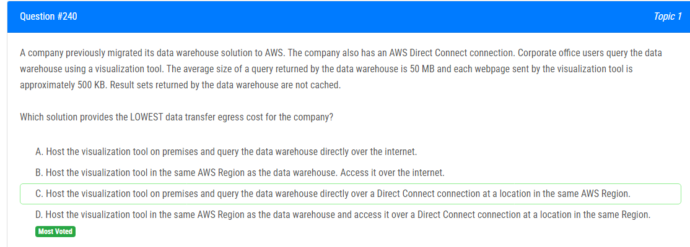

해설:

정답 D.

동일한 AWS 리전 내에서 호스팅: 데이터 웨어하우스와 시각화 도구를 동일한 AWS 리전에 호스팅함으로써 AWS 내의 데이터 전송에 대한 비용이 크게 절감됩니다. 데이터 전송 비용은 AWS 리전 간이 아닌 리전 내에서 발생하는 경우가 더 저렴합니다.

AWS Direct Connect 사용: Direct Connect를 사용하면 데이터 웨어하우스 및 시각화 도구 간의 연결이 안정적이고 직접적으로 이루어집니다. 이로써 데이터 웨어하우스 쿼리 결과를 효율적으로 전송할 수 있습니다.

