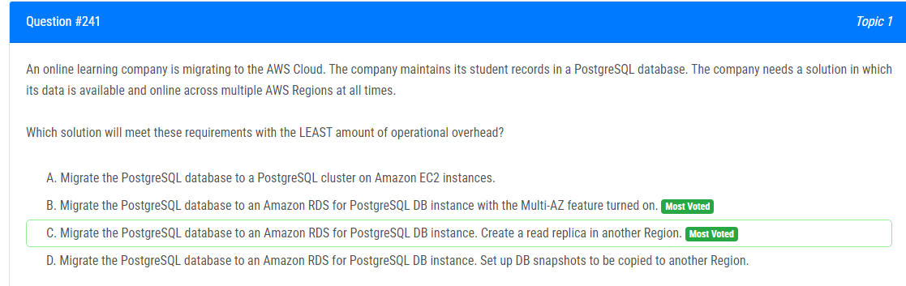

해설:

정답 C.

정답 C인 이유는 Amazon RDS for PostgreSQL의 Multi-AZ 옵션을 사용하여 여러 AWS 지역 간에 데이터를 실시간으로 사용 가능하게 만들 수 있기 때문입니다. Multi-AZ 옵션은 주 데이터베이스 인스턴스에 대한 자동 장애 조치(Failover) 및 복제를 제공합니다.

선택지 C에서는 Amazon RDS for PostgreSQL을 사용하고, 다른 지역에 읽기 전용 복제본(read replica)을 생성합니다. 이는 데이터베이스의 가용성을 높이고, 사용자들이 다양한 지역에서 항상 접근할 수 있도록 합니다. 이러한 방법은 운영 오버헤드를 최소화하면서 안정적이고 효과적인 멀티 리전 아키텍처를 제공합니다.

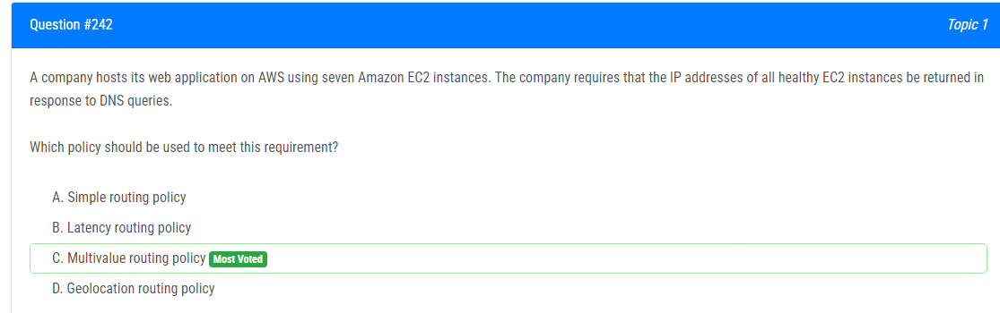

해설:

정답 C.

정답 C인 이유는 다중값(Multivalue) 라우팅 정책을 사용하면 모든 건강한 Amazon EC2 인스턴스의 IP 주소가 DNS 쿼리에 응답으로 반환됩니다. 이는 여러 값 중에서 무작위로 선택하거나 모든 값을 반환하는 방식으로 동작합니다.

다중값 라우팅 정책은 특히 여러 건강한 엔드포인트 간에 트래픽을 분산하고, 고가용성 및 내결함성을 제공하는 데 유용합니다. 이는 웹 애플리케이션을 운영할 때 여러 EC2 인스턴스에서 호스팅하는 경우 모든 건강한 인스턴스에 대한 IP 주소를 반환하여 트래픽을 분산시키는 데 적합합니다.

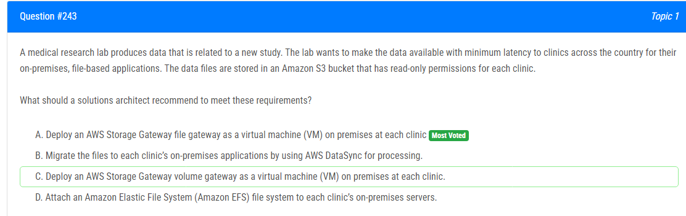

해설:

정답 A.

Read-only Permissions for Each Clinic: 파일 게이트웨이는 Amazon S3 버킷의 데이터에 대한 읽기 전용 권한을 가지며, 클리닉 각각에 대한 별도의 권한을 구성할 수 있습니다. 이는 각 클리닉이 데이터를 읽을 수 있지만 쓸 수 없도록 제한할 수 있습니다.

Minimum Latency: 파일 게이트웨이는 데이터를 캐시하여 온프레미스에서 빠르게 액세스할 수 있도록 지원합니다. 이렇게 하면 데이터에 대한 최소한의 지연으로 파일 기반 응용 프로그램에 액세스할 수 있습니다.

Scalability: 파일 게이트웨이는 필요에 따라 스케일 아웃할 수 있어 여러 클리닉 간에 확장성을 제공합니다.

AWS Native Service: AWS Storage Gateway는 AWS의 네이티브 서비스로서 AWS 환경에서의 통합을 용이하게 합니다.

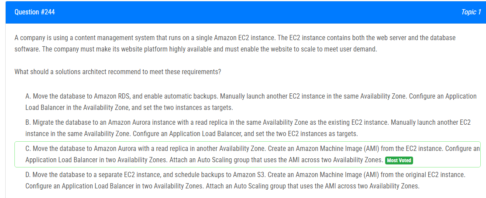

해설:

정답 C.

Amazon Aurora with Cross-Region Replication: Amazon Aurora은 뛰어난 성능과 확장성을 제공하는 관리형 데이터베이스 서비스입니다. 선택지 C에서는 Amazon Aurora를 사용하고, 다른 가용 영역에 읽기 전용 복제본을 생성하여 데이터베이스의 가용성을 높입니다.

High Availability with Auto Scaling: EC2 인스턴스에 대한 AMI를 생성하고, 두 가용 영역에 걸쳐 Application Load Balancer를 구성하며, AMI를 사용하는 Auto Scaling 그룹을 생성합니다. 이렇게 하면 웹 서버 부분에서도 고가용성 및 스케일링이 가능해집니다. Auto Scaling은 트래픽 증가 또는 감소에 따라 인스턴스를 자동으로 조정하여 효율적인 자원 사용을 도와줍니다.

Fault Tolerance: 다른 가용 영역에 읽기 전용 복제본을 두면, 한 가용 영역에서의 장애가 발생해도 다른 가용 영역의 데이터베이스를 사용할 수 있어 전체 시스템에 대한 장애 허용성을 제공합니다.

Scalability: Auto Scaling을 통한 EC2 인스턴스의 자동 조정은 트래픽 증가에 대응하여 웹 서버의 수를 확장하거나 트래픽 감소에 따라 자원을 줄일 수 있도록 합니다.

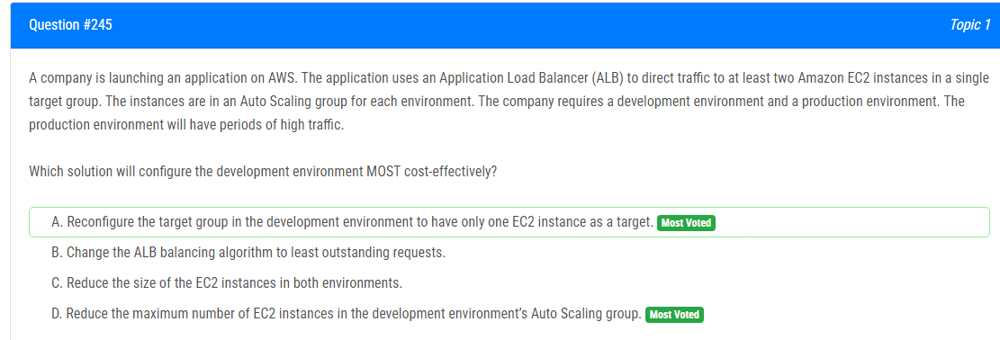

해설:

정답 D.

개발 환경에서의 최소 인스턴스 수 감소: 개발 환경은 일반적으로 프로덕션 환경보다 훨씬 적은 트래픽을 처리해야 합니다. 따라서 최소 인스턴스 수를 줄이면 비용을 절감할 수 있습니다.

Auto Scaling의 조정: 개발 환경에서는 Auto Scaling 그룹의 최대 인스턴스 수를 줄이면, 인스턴스의 최대 수가 감소하므로 더 적은 수의 EC2 인스턴스가 운영되게 됩니다. 이는 트래픽이 상대적으로 낮은 환경에서 자원을 효율적으로 사용하는 데 도움이 됩니다.

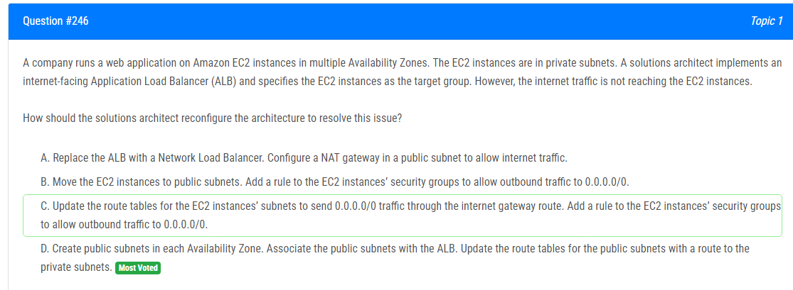

해설:

정답 D.

Public Subnets for ALB: 인터넷 트래픽이 EC2 인스턴스로 도달하려면, Application Load Balancer (ALB)가 인터넷에 노출되어야 합니다. 따라서 각 Availability Zone에 대해 공개 서브넷을 생성하고 이를 ALB에 연결하는 것이 중요합니다.

Private Subnets for EC2 Instances: EC2 인스턴스를 외부에 노출하지 않고 액세스를 제한하기 위해, EC2 인스턴스는 여전히 프라이빗 서브넷에 두어야 합니다.

Route Tables Configuration: 공개 서브넷을 생성하고 연결한 후, 해당 서브넷의 라우팅 테이블을 인터넷 게이트웨이로의 경로로 업데이트합니다. 이렇게 하면 ALB가 트래픽을 받아오고, ALB는 다시 프라이빗 서브넷의 EC2 인스턴스로 트래픽을 라우팅할 수 있게 됩니다.

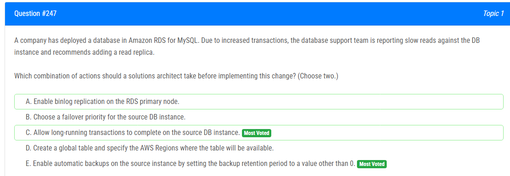

해설:

정답 C, E.

정답 C: source DB 인스턴스에서 장기 실행 중인 트랜잭션을 완료하는 것은 새로운 읽기 레플리카를 생성하기 전에 데이터 일관성을 유지하는 데 도움이 됩니다. 긴 트랜잭션이 존재할 경우 레플리카를 생성하면 해당 트랜잭션이 레플리카로 복제되어 성능 이슈를 야기할 수 있습니다.

정답 E: 읽기 레플리카를 생성하기 전에 소스 인스턴스에서 자동 백업을 활성화하는 것이 좋습니다. 이렇게 하면 읽기 레플리카가 생성된 후에도 데이터의 손실을 방지할 수 있습니다. 읽기 레플리카를 생성하면 기존 데이터베이스의 복제본이 만들어지므로, 이 복제본에 대한 백업이 중요합니다.

따라서 올바른 조치는 C와 E입니다.

해설:

정답 D.

Entire System Scalability: Amazon Simple Queue Service (SQS)를 사용하여 작업 요청을 대기열에 보내는 것은 시스템의 확장성을 향상시키는 좋은 방법입니다. SQS는 큐 크기에 따라 자동으로 EC2 Auto Scaling 그룹을 조정할 수 있도록 설정할 수 있습니다.

Decoupling Components: SQS를 사용하면 요청을 처리하는 EC2 인스턴스와 요청을 생성하는 소비자 간의 결합을 해제할 수 있습니다. 이것은 안정성을 향상시키고, EC2 인스턴스가 100% CPU 사용량에 도달하는 것을 방지하는 데 도움이 됩니다.

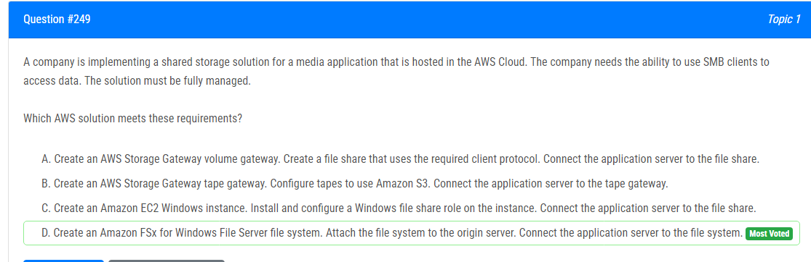

해설:

정답 D.

Fully Managed Solution: Amazon FSx for Windows File Server는 완전히 관리되는 파일 시스템 서비스로, 사용자가 직접 파일 서버를 설정하거나 관리할 필요가 없습니다.

SMB Protocol Support: Amazon FSx는 SMB 프로토콜을 완전히 지원합니다. 이는 Windows 기반의 클라이언트가 데이터에 액세스하기 위해 사용하는 프로토콜입니다.

Ease of Integration: Amazon FSx는 AWS 내에서 쉽게 통합되며, 필요한 클라이언트 프로토콜을 지원하여 응용 프로그램 서버와의 통합이 간편합니다.

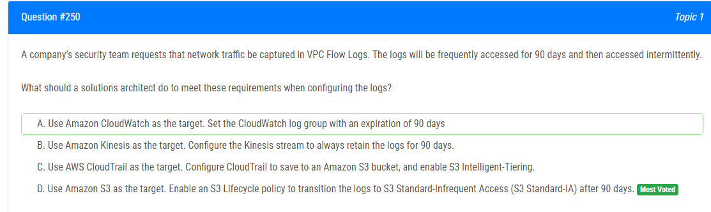

해설:

정답 D.

S3 as the Target: VPC Flow Logs를 Amazon S3에 저장하는 것은 효과적이고 일반적인 방법입니다. S3는 안전하게 데이터를 저장하고 필요에 따라 검색할 수 있는 확장 가능한 스토리지 서비스를 제공합니다.

S3 Lifecycle Policy: Amazon S3 Lifecycle 정책을 활성화하여 로그를 90일 동안 S3 Standard로 유지한 후, 자동으로 S3 Standard-Infrequent Access (S3 Standard-IA)로 이동합니다. 이는 더 낮은 비용으로 데이터를 보관하는 데 도움이 됩니다.

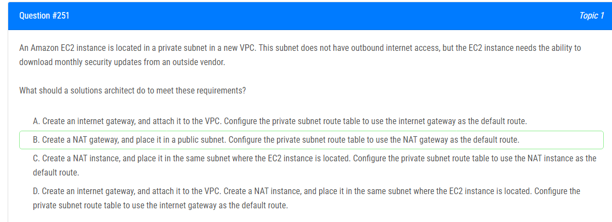

해설:

정답 B.

NAT Gateway for Outbound Internet Access: NAT (Network Address Translation) gateway는 특정 서브넷 내의 인스턴스들이 인터넷으로 나가는 트래픽을 지원하는 데 사용됩니다. 이 경우, EC2 인스턴스는 외부 벤더에서 월간 보안 업데이트를 다운로드해야 하므로 NAT gateway를 사용하여 인터넷으로의 외부 액세스를 허용해야 합니다.

Private Subnet Configuration: EC2 인스턴스가 있는 프라이빗 서브넷의 라우팅 테이블을 수정하여 기본 경로로 NAT gateway를 사용하도록 구성합니다. 이렇게 하면 EC2 인스턴스는 NAT gateway를 통해 인터넷에 연결할 수 있게 됩니다.

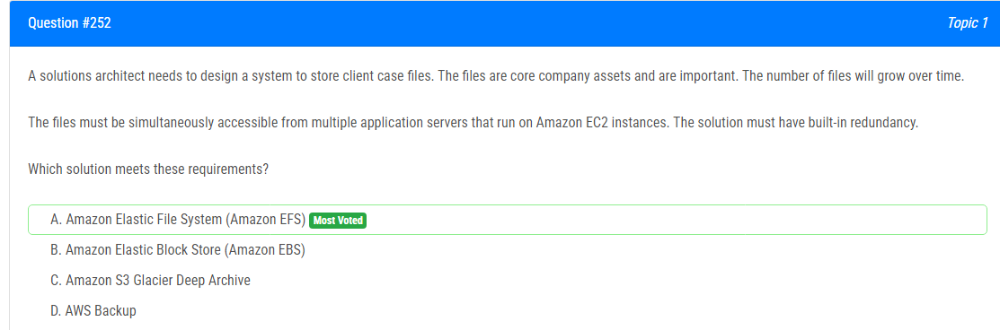

해설:

정답 A.

Simultaneous Access: Amazon EFS는 여러 EC2 인스턴스에서 동시에 파일에 액세스할 수 있는 완전 관리형 파일 스토리지 서비스입니다. 여러 애플리케이션 서버에서 동시에 파일에 접근할 수 있기 때문에 이러한 요구 사항을 충족시키는 데 이상적입니다.

Built-in Redundancy: Amazon EFS는 기본적으로 여러 가용 영역에 걸쳐 데이터를 자동으로 복제하여 내결함성을 제공합니다. 이는 데이터의 안전성과 가용성을 보장하며, 장애가 발생해도 데이터에 손실이나 중단이 발생하지 않습니다.

Scalability: 파일의 수가 시간과 함께 증가할 때 Amazon EFS는 스케일링이 필요한 상황에서 유연하게 대응할 수 있습니다.

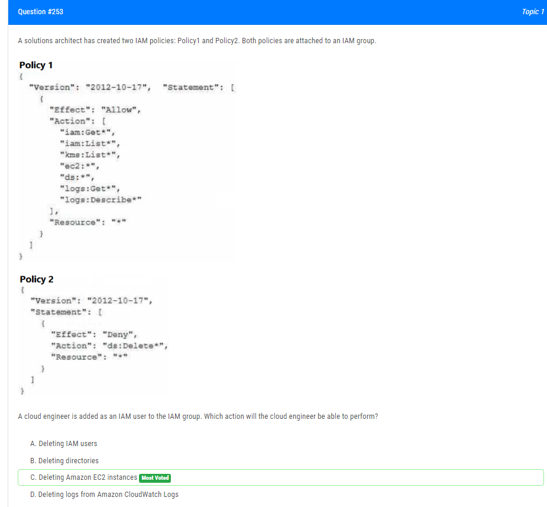

해설:

정답 C.

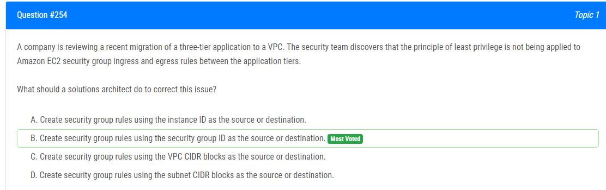

해설:

정답 B.

Security Group ID as a Source or Destination: EC2 보안 그룹 ID를 사용하면 보안 그룹 간에 교류할 수 있습니다. 이는 보안 그룹을 사용하여 두 티어 간의 트래픽을 허용하는 데 최소 권한 원칙을 적용하는 데 유용합니다. 각 보안 그룹은 해당하는 서비스 또는 역할을 나타내므로, 특정 보안 그룹 간에만 필요한 트래픽이 허용됩니다.

Principle of Least Privilege: 보안 그룹 ID를 사용하면 최소한의 허용 규칙만 정의하여 최소 권한 원칙을 준수할 수 있습니다. 서비스 간의 정확한 통신을 허용하며, 불필요한 트래픽을 차단할 수 있습니다.

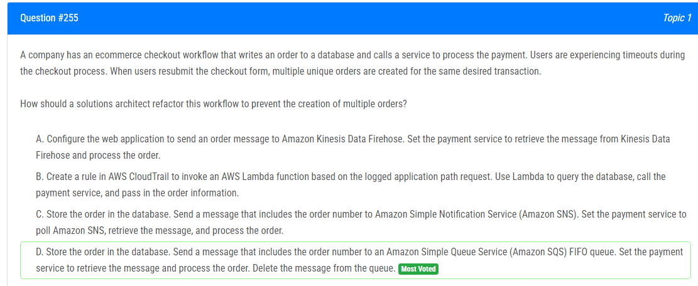

해설:

정답 D.

Amazon SQS FIFO Queue: Amazon SQS FIFO (First-In-First-Out) 큐는 메시지의 정확한 순서를 보장하므로 동일한 주문에 대한 중복 처리를 방지할 수 있습니다. 이를 통해 한 번에 하나의 주문만 처리되도록 보장할 수 있습니다.

Message Acknowledgment: 처리된 메시지는 명시적으로 삭제됩니다. 이로써 한 번 처리된 주문은 두 번 이상 처리되지 않습니다.

Scalability: Amazon SQS는 분산 아키텍처로 설계되어 있어 고가용성과 확장성을 제공합니다. 대용량 트래픽에서도 안정적으로 동작할 수 있습니다.

Decoupling Components: 주문을 데이터베이스에 저장하고 메시지 큐에 전송함으로써 시스템의 유연성이 향상되고, 주문 처리와 결제 처리가 독립적으로 작동할 수 있습니다.

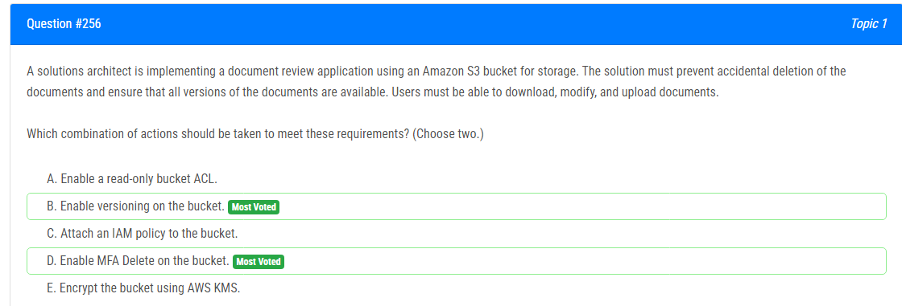

해설:

정답 B, D.

Enable Versioning (B): 버전 관리를 활성화하면 동일한 키(객체 이름)에 대한 여러 버전의 객체를 보존할 수 있습니다. 이는 실수로 삭제된 경우에도 이전 버전을 복원할 수 있게 해줍니다. 또한 모든 수정은 새로운 버전으로 저장되므로 문서의 수정 이력을 추적할 수 있습니다.

Enable MFA Delete (D): MFA Delete를 활성화하면 삭제 요청에 추가적인 Multi-Factor Authentication (MFA)가 필요하므로, 실수로 인한 문서 삭제를 방지할 수 있습니다. 이는 보안을 강화하고 민감한 데이터의 손실을 방지하는 데 도움이 됩니다.

해설:

정답 A.

Amazon CloudWatch Metric Stream (A): Amazon CloudWatch Metric Streams를 사용하여 EC2 Auto Scaling 이벤트의 상태 데이터를 수집할 수 있습니다. 이 데이터를 실시간으로 Amazon Kinesis Data Firehose에 전송하여 처리하고, 그 결과를 Amazon S3에 저장할 수 있습니다.

Serverless Solution: Amazon Kinesis Data Firehose와 Amazon S3는 fully managed 서비스이며 서버리스 아키텍처에 적합합니다. 데이터 처리, 저장, 및 관리에 대한 모든 책임을 AWS가 갖고 있으므로 별도의 서버 관리가 필요하지 않습니다.

Near-Real-Time Updates: Amazon Kinesis Data Firehose는 데이터를 실시간으로 처리하고 Amazon S3에 전달할 수 있으므로, EC2 Auto Scaling 이벤트에 대한 업데이트를 거의 실시간으로 제공할 수 있습니다.

No Impact on EC2 Instance Launch Speed: Amazon CloudWatch Metric Streams 및 Amazon Kinesis Data Firehose는 분리된 서비스이며, EC2 Auto Scaling 이벤트의 수집 및 전송이 EC2 인스턴스 시작 속도에 영향을 미치지 않습니다.

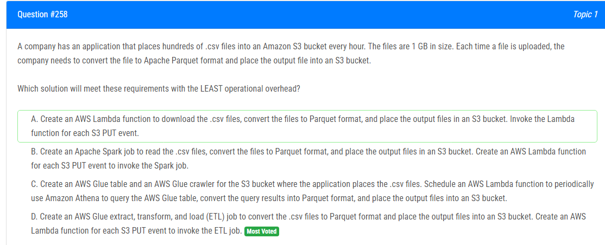

해설:

정답 D.

AWS Glue ETL Job (D): AWS Glue는 완전관리형 ETL 서비스로, 대규모 데이터 세트의 변환 작업을 수행하는 데 최적화되어 있습니다. .csv 파일을 Apache Parquet으로 변환하는 데 사용할 수 있습니다.

Lambda Function for S3 PUT Event: S3 PUT 이벤트에 대한 AWS Lambda 함수를 사용하여 파일이 업로드될 때마다 ETL Job을 트리거할 수 있습니다. 이는 실시간으로 변환이 가능하며, 추가적인 모니터링 또는 스케줄링이 필요하지 않습니다.

Least Operational Overhead: AWS Glue ETL Job은 완전 관리되기 때문에 관리 오버헤드가 적습니다. 일괄 처리 및 스케줄링에 대한 걱정 없이 데이터 변환을 처리할 수 있습니다.

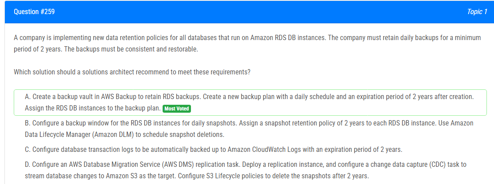

해설:

정답 A.

AWS Backup (A): AWS Backup은 통합된 백업 서비스로, 여러 AWS 서비스의 백업을 쉽게 관리할 수 있습니다. RDS DB 인스턴스에 대한 백업을 위한 별도의 "백업 보관소"를 생성하여 일일 스케줄과 2년의 보관 기간을 설정할 수 있습니다.

Backup Plan with Daily Schedule (A): 새로운 백업 계획을 생성하여 매일 실행되도록 일정을 설정하고, 백업 생성 후 2년 동안 보관할 수 있습니다.

Consistent and Restorable Backups (A): AWS Backup는 RDS DB 인스턴스에 대한 일관된 백업을 제공하며, 필요할 때 이러한 백업에서 복원할 수 있습니다.

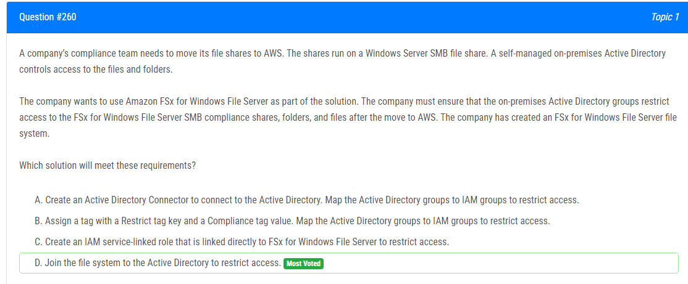

해설:

정답 D.

Join the File System to Active Directory (D): Amazon FSx for Windows File Server를 Active Directory에 조인하여 기존의 온프레미스 Active Directory 구조를 활용할 수 있습니다. 이는 기존 그룹 및 사용자 계정을 그대로 사용하여 파일 및 폴더에 대한 액세스를 통제할 수 있도록 해줍니다.

Access Control through Active Directory Groups: 온프레미스 Active Directory에 정의된 그룹을 사용하여 파일 시스템에 대한 액세스를 제어할 수 있습니다. FSx for Windows File Server는 Active Directory와 통합되어 있으므로, 사용자 및 그룹 계정은 동일한 방식으로 관리됩니다.