해설:

정답 A, C.

A. Amazon CloudFront을 구성하여 콘텐츠의 여러 버전을 캐시하도록 하는 것은 전 세계적인 고객에게 서비스하는 데 효과적일 수 있습니다. CloudFront은 전 세계의 엣지 로케이션에 데이터를 캐시하여 사용자에게 빠르고 안정적인 콘텐츠 전송을 제공할 수 있습니다.

C. Lambda@Edge 함수를 구성하여 User-Agent 헤더를 기반으로 사용자에게 특정 객체를 보내는 것은 디바이스별로 콘텐츠를 다르게 제공하는 데 유용할 수 있습니다. 이를 통해 클라이언트 디바이스에 따라 적합한 콘텐츠를 동적으로 선택할 수 있습니다.

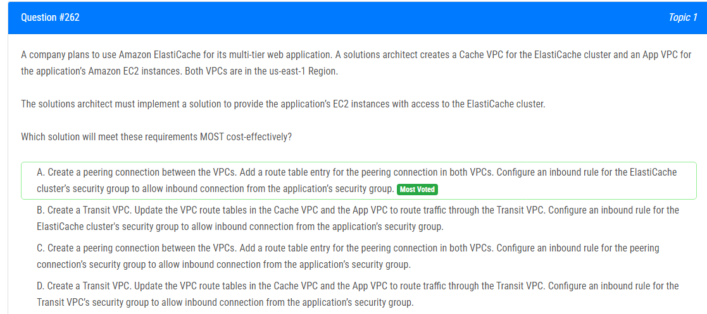

해설:

정답 A.

A는 ElastiCache 클러스터와 애플리케이션의 EC2 인스턴스 간의 통신을 설정하는 가장 비용 효율적인 방법입니다.

A. VPC 간에 피어링 연결을 생성하여 트래픽을 라우팅하고, 두 VPC의 라우팅 테이블에 피어링 연결을 위한 라우팅 항목을 추가합니다. 그런 다음 ElastiCache 클러스터의 보안 그룹에 대한 인바운드 규칙을 구성하여 애플리케이션의 보안 그룹으로부터의 인바운드 연결을 허용합니다.

이 방법은 트랜지트 VPC를 구성하지 않고도 요구 사항을 충족시키며 비용을 절약할 수 있습니다.

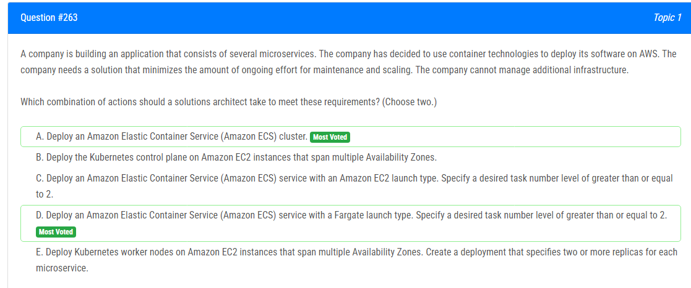

해설:

정답 A, D.

A. Amazon Elastic Container Service (Amazon ECS) 클러스터를 배포하는 것은 유지 보수 및 확장성에 대한 노력을 최소화하는 데 도움이 될 수 있습니다. ECS는 관리형 컨테이너 오케스트레이션 서비스로, 클러스터를 쉽게 프로비저닝하고 관리할 수 있습니다.

D. Amazon ECS 서비스를 Fargate 런치 타입으로 배포하는 것이 더 많은 유연성을 제공하며 관리 작업을 최소화합니다. Fargate는 서버리스 컨테이너 인프라로, 사용자는 인스턴스나 클러스터를 직접 관리하지 않아도 됩니다. 따라서 관리에 대한 부담이 줄어듭니다.

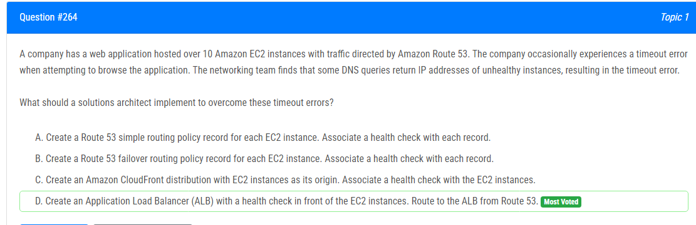

해설:

정답 D.

D는 Application Load Balancer (ALB)를 사용하여 문제를 해결하는 가장 적절한 옵션입니다.

D. Application Load Balancer (ALB)를 생성하여 Route 53에서 트래픽을 ALB로 라우팅하는 것이 좋습니다. ALB는 트래픽을 여러 EC2 인스턴스로 분산시키고, 각 인스턴스에 대한 건강 검사(health check)를 수행할 수 있습니다. 이를 통해 건강하지 않은 EC2 인스턴스는 트래픽에서 제외되고, 건강한 인스턴스로만 트래픽이 전달되므로 timeout 오류를 최소화할 수 있습니다.

다른 옵션들과 비교하여 ALB는 효과적인 로드 밸런싱과 건강 검사 기능을 제공하면서도 구성이 비교적 간단합니다.

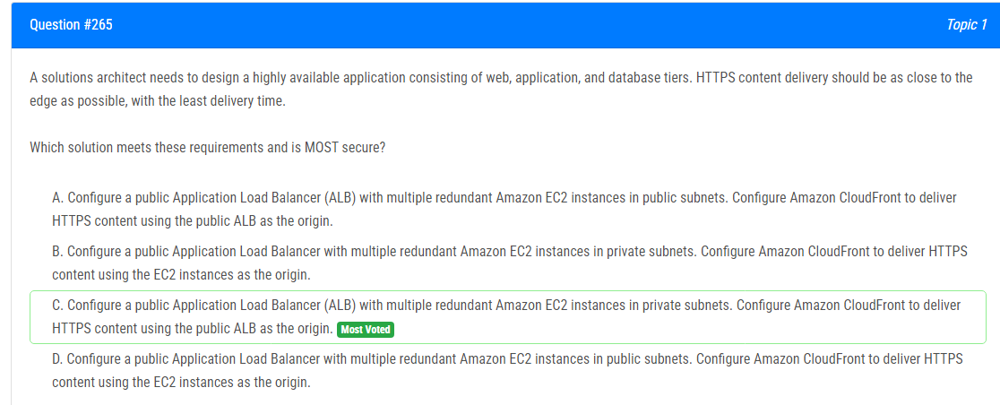

해설:

정답 C.

C. 공용 Application Load Balancer (ALB)를 구성하고, 여러 중복 Amazon EC2 인스턴스를 사설 서브넷에 두어 보안을 강화합니다. Amazon CloudFront를 구성하여 공용 ALB를 오리진으로 사용하여 HTTPS 콘텐츠를 전달합니다.

이 방법은 보안을 강화하면서도 CloudFront를 사용하여 콘텐츠를 엣지에 가깝게 전달하므로 최소한의 전송 시간을 제공합니다. 중요한 데이터가 사설 서브넷에 위치하므로 외부에서 직접 액세스하기 어려우며, ALB와 CloudFront의 조합은 안정적이고 확장 가능한 아키텍처를 제공합니다.

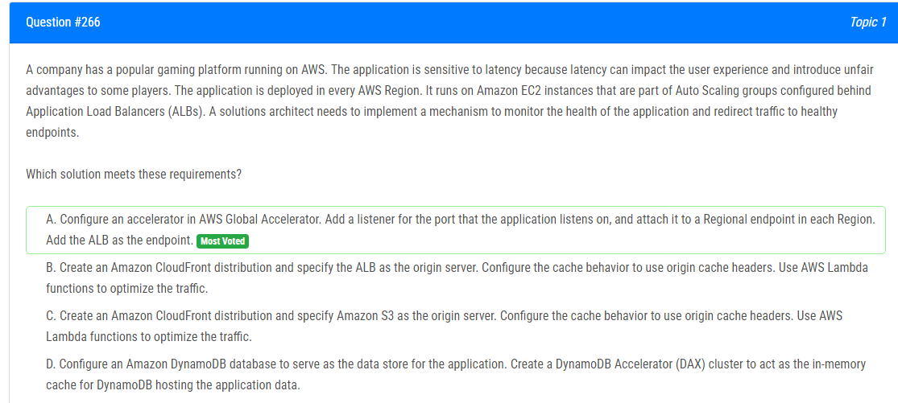

해설:

정답 A.

A. AWS Global Accelerator에서 가속기를 구성하여 요구 사항을 충족합니다. 각 지역에 대해 리전 엔드포인트를 추가하고, 애플리케이션이 수신 대기 중인 포트에 대한 리스너를 추가합니다. 각 리전에서 ALB를 엔드포인트로 추가합니다.

이 방법은 전 세계적으로 균형 잡힌 로드 및 지연 시간 감소를 위해 AWS Global Accelerator를 사용합니다. Global Accelerator는 사용자들을 가장 가까운 리전으로 라우팅하고, 해당 리전에서 가장 건강한 ALB로 트래픽을 리디렉션하여 최상의 사용자 경험을 제공합니다.

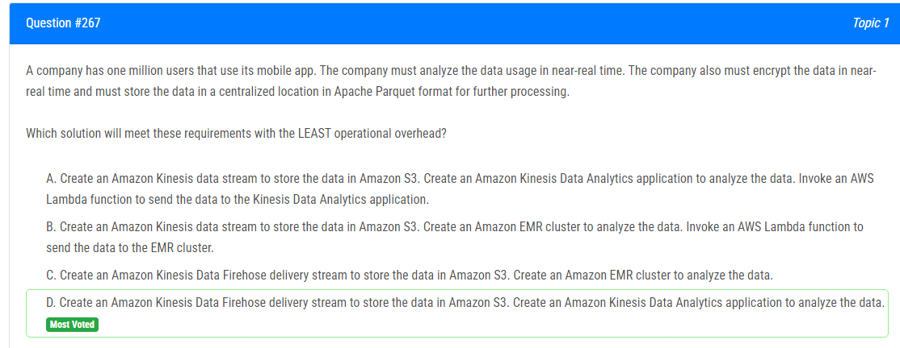

D. Amazon Kinesis Data Firehose 전송 스트림을 생성하여 데이터를 Amazon S3에 저장합니다. 또한 Amazon Kinesis Data Analytics 애플리케이션을 생성하여 데이터를 분석합니다. Kinesis Data Analytics는 스트리밍 데이터를 실시간으로 처리하고, 결과를 저장 및 분석에 사용할 수 있도록 합니다.

이 솔루션은 Lambda 함수나 EMR 클러스터를 관리할 필요가 없으며, Kinesis Data Firehose는 데이터를 실시간으로 S3로 전달하는 데 용이한 서비스입니다. 데이터는 Apache Parquet 형식으로 S3에 저장되어 나중에 처리를 위해 중앙 집중식으로 보관됩니다.

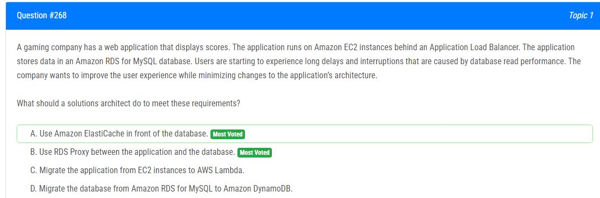

해설:

정답 B.

연결 관리 개선: RDS Proxy는 연결 풀링, 장애 조치(failover) 관리 등을 통해 데이터베이스 연결을 효과적으로 관리합니다. 이로써 응용 프로그램은 더욱 효율적으로 데이터베이스와 통신할 수 있습니다.

성능 향상: RDS Proxy를 통해 응용 프로그램은 데이터베이스와의 연결을 효과적으로 관리하므로 데이터베이스 부하를 줄일 수 있습니다. 이는 응용 프로그램의 성능을 향상시키고, 따라서 사용자 경험을 개선할 수 있습니다.

최소한의 응용 프로그램 변경: RDS Proxy 도입은 일반적으로 응용 프로그램 코드에 대한 최소한의 변경을 요구합니다. 따라서 응용 프로그램 아키텍처를 변경하는데 필요한 작업이 적습니다.

Amazon RDS와 통합: RDS Proxy는 Amazon RDS와 강력하게 통합되어 있어 쉽게 배포하고 구성할 수 있습니다.

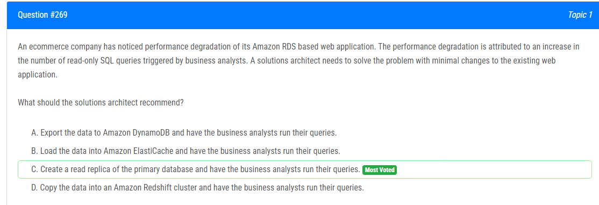

해설:

정답 C.

Amazon RDS에서는 기본 데이터베이스에 대한 읽기 전용 복제본을 생성할 수 있습니다.
읽기 전용 복제본은 주로 읽기 쿼리를 처리하고 기본 데이터베이스의 부하를 줄이는 데 사용됩니다.
비즈니스 애널리스트들은 읽기 전용 복제본에서 쿼리를 실행하여 기본 데이터베이스에 대한 부하를 줄일 수 있습니다.

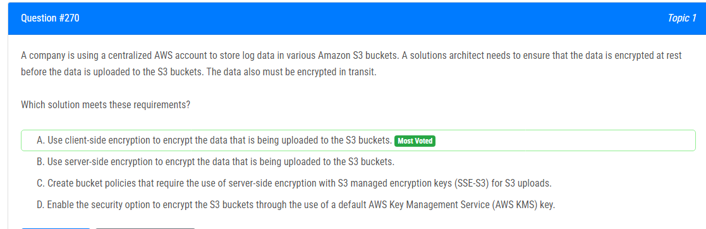

해설:

정답 A.

클라이언트 측 암호화를 사용하면 데이터는 클라이언트 측에서 암호화되어 S3에 업로드되기 전에 이미 암호화됩니다.
클라이언트 측 암호화를 통해 데이터는 암호화된 채로 전송되므로 데이터의 이동 중에도 안전합니다.
업로드된 데이터는 S3에서 저장될 때도 암호화된 상태로 유지됩니다.

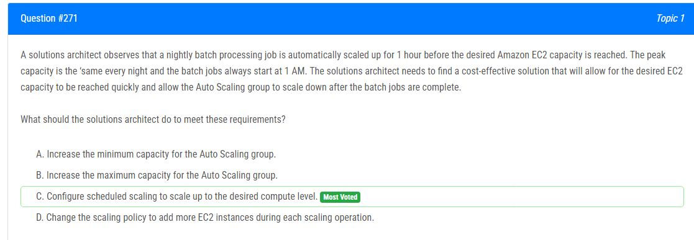

해설:

정답 C.

스케줄링된 스케일링을 구성하여 원하는 시간에 Auto Scaling 그룹의 크기를 빠르게 조정합니다. 이렇게 하면 매일 1 AM에 배치 작업이 시작되기 전에 필요한 EC2 용량을 미리 확장할 수 있습니다.
스케줄링된 스케일링은 일관된 패턴을 따르는 작업에 이상적이며, 자동으로 필요한 인스턴스를 시작 및 종료할 수 있습니다.

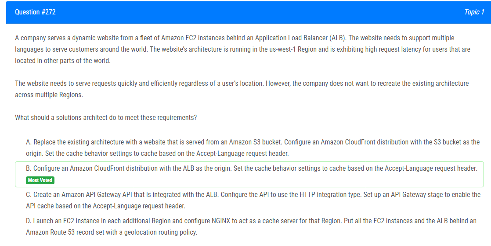

해설:

정답 B.

기존 아키텍처를 여러 리전으로 복제하지 않으면서, CloudFront를 사용하여 글로벌 배포를 구성합니다.
CloudFront는 콘텐츠 전송 네트워크(CDN)로, 전 세계의 엣지 로케이션에 데이터를 캐시하고 전송하여 지연 시간을 최소화합니다.
ALB를 CloudFront의 오리진으로 사용하면 서버의 응답을 캐시하고, Accept-Language 헤더를 기반으로 캐시를 제어할 수 있습니다.

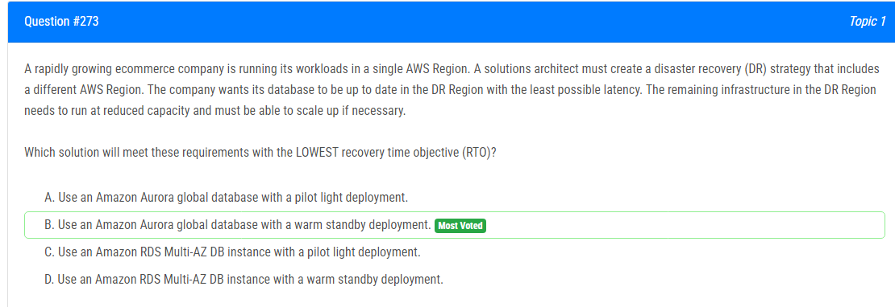

해설:

정답 B.

Amazon Aurora 글로벌 데이터베이스는 다른 리전에 복제된 동기식 복제본을 제공합니다.
웜 스탠바이 배포를 사용하면 DR 리전에서 필요한 부분의 인프라를 미리 확보하여 빠른 스케일업이 가능합니다.
데이터베이스가 복제되기 때문에 DR 리전에서의 최소한의 지연으로 가장 최신의 데이터를 보장할 수 있습니다.

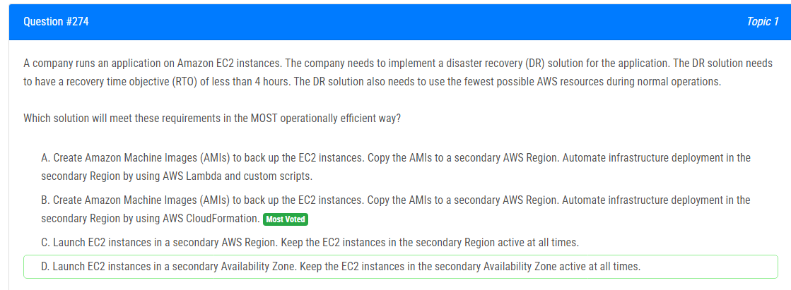

해설:

정답 B.

EC2 인스턴스를 백업하는 가장 효율적인 방법은 AMIs를 생성하고 이를 다른 리전으로 복사하는 것입니다.
AWS CloudFormation은 리소스 배포 및 관리에 용이한 서비스이며, 이를 활용하여 자동으로 복제된 인프라를 생성할 수 있습니다.
CloudFormation 스택을 사용하면 복잡한 인프라를 정의하고 관리할 수 있으며, DR 시나리오에서의 복원 작업을 자동화하는 데 도움이 됩니다.

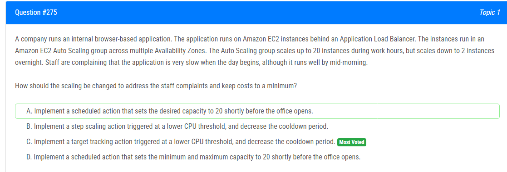

해설:

정답 C.

Target Tracking Scaling은 지정된 지표(여기서는 CPU 사용률)를 유지하도록 Auto Scaling을 조정하는 데 효과적입니다.
낮은 CPU 임계값에서 Auto Scaling을 트리거하면 사용자가 필요로 하는 용량을 더 빠르게 확장할 수 있습니다.
Cooldown 기간을 줄여서 더 빠른 조정이 가능하게 합니다.

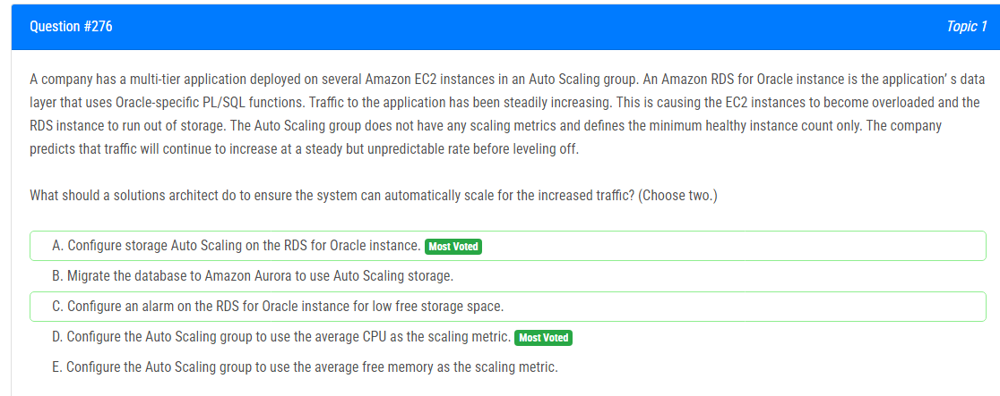

해설:

정답 A, D.

A. RDS for Oracle 인스턴스에 스토리지 Auto Scaling 구성

스토리지 Auto Scaling을 사용하면 RDS 인스턴스의 스토리지 크기를 자동으로 조절할 수 있습니다. 이는 예측할 수 없는 트래픽 증가에 효과적입니다.

D. Auto Scaling 그룹에 평균 CPU 사용률을 스케일링 메트릭으로 구성

EC2 인스턴스의 CPU 사용률은 트래픽 증가에 따라 확장 또는 축소될 수 있는 유용한 메트릭입니다. 평균 CPU 사용률을 사용하면 트래픽에 대한 실시간 반응이 가능합니다.

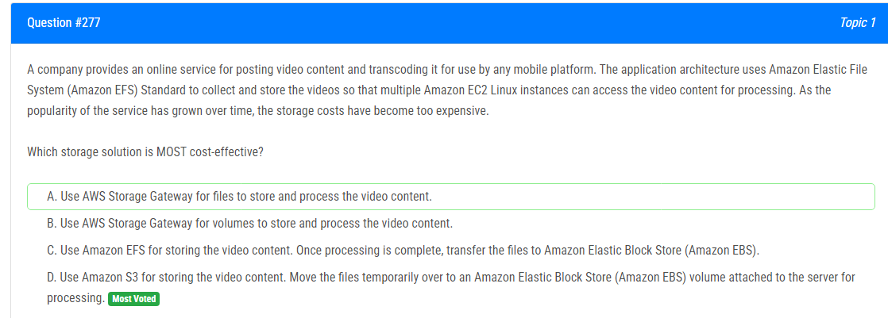

해설:

정답 D.

Amazon S3는 비용 효율적이고 확장 가능한 객체 스토리지로, 비디오 컨텐츠를 안정적으로 저장하는 데 적합합니다.
처리가 필요한 경우 Amazon EBS를 사용하여 일시적으로 파일을 가져와 처리하고, 처리가 완료되면 다시 Amazon S3로 이동시킵니다.

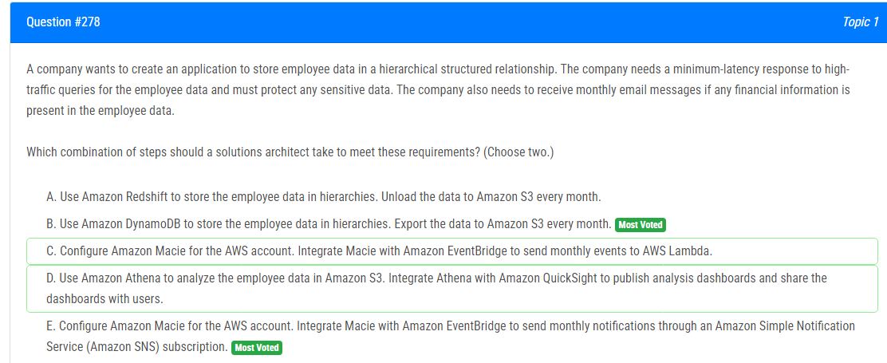

해설:

정답 B, E.

B. Amazon DynamoDB를 사용하여 직원 데이터 저장 및 S3로의 내보내기

DynamoDB는 빠르고 확장 가능한 NoSQL 데이터베이스로, 계층적 구조의 데이터를 저장하는 데 적합합니다.
매월 데이터를 Amazon S3로 내보내면서 S3를 활용하여 데이터의 장기 보관 및 분석이 가능합니다.

E. Amazon Macie 및 Amazon EventBridge를 사용하여 민감한 데이터 감지 및 알림

Amazon Macie를 사용하여 민감한 데이터를 식별하고, 이를 Amazon EventBridge에 통합하여 주기적 이벤트를 트리거합니다.
이벤트는 Amazon SNS를 통해 알림을 생성하고, 매월 민감한 금융 정보가 발견되면 해당 알림을 수신합니다.

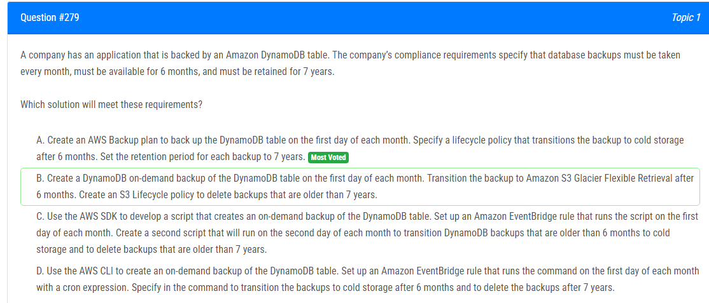

해설:

정답 A.

AWS Backup 계획을 생성하여 DynamoDB 테이블을 월별로 백업할 수 있습니다.
라이프사이클 정책을 구성하여 백업을 6개월 후에는 cold storage로 전환하고, 보존 기간을 7년으로 설정하여 오랫동안 보관합니다.

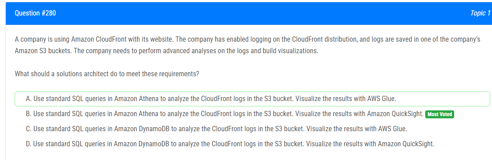

해설:

정답 B.

Amazon Athena는 S3에 저장된 데이터에 대해 SQL 쿼리를 실행할 수 있는 서비스로, CloudFront 로그를 분석하는 데 사용될 수 있습니다.
Amazon QuickSight는 Athena와 통합되어 Athena 쿼리 결과를 시각화하고 인사이트를 얻을 수 있도록 지원합니다.

