해설:

정답 A.

Amazon RDS에서 Multi-AZ 배포를 활성화하면 주 DB 인스턴스와 동일한 데이터베이스의 스탠바이 복제본이 다른 가용 영역에 자동으로 생성됩니다. 이렇게 하면 주 DB 인스턴스에 장애가 발생했을 때 스탠바이 복제본이 자동으로 활성화되어 서비스 중단 없이 계속 운영될 수 있습니다. Multi-AZ 배포를 사용하면 RPO를 거의 0으로 줄일 수 있으며, 이는 회사의 1초 미만의 RPO 요구 사항을 충족하는 데 도움이 됩니다.

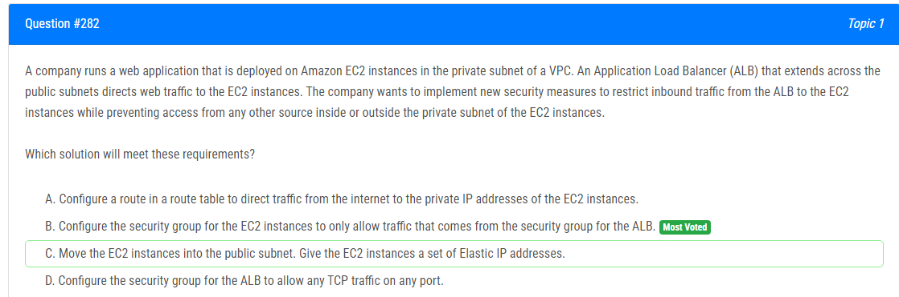

해설:

정답 B.

ALB의 보안 그룹은 허용해야 하는 트래픽을 명시적으로 지정할 수 있습니다. 다른 보안 그룹, 특히 EC2 인스턴스의 보안 그룹을 참조하여 필요한 트래픽만을 허용하도록 설정할 수 있습니다.

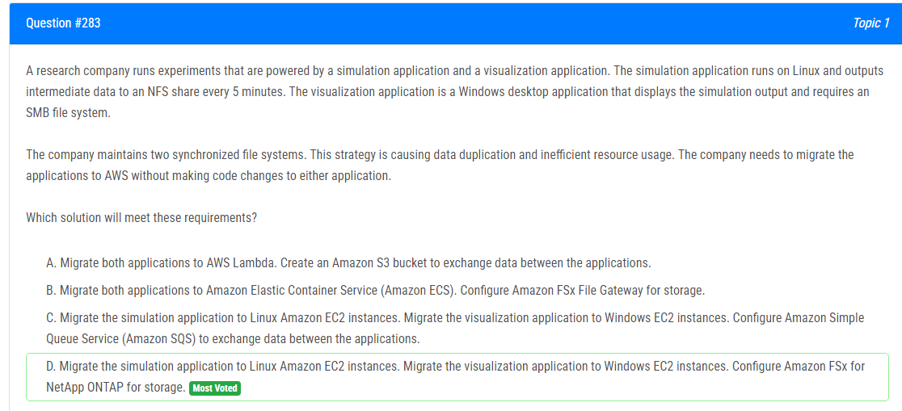

해설:

정답 D.

File System Compatibility: Amazon FSx for NetApp ONTAP은 NFS와 SMB 프로토콜을 모두 지원합니다. 따라서 Linux에서 실행되는 시뮬레이션 응용 프로그램은 NFS 프로토콜을 통해 Amazon FSx에 접근할 수 있고, Windows에서 실행되는 시각화 응용 프로그램은 SMB 프로토콜을 통해 동일한 파일 시스템에 액세스할 수 있습니다.

No Code Changes: 두 응용 프로그램에 코드 변경이 필요하지 않습니다. 기존 응용 프로그램은 NFS 및 SMB를 계속 사용하면서 AWS에서 호스팅될 수 있습니다.

Centralized Storage: Amazon FSx for NetApp ONTAP은 중앙 집중식 스토리지를 제공하므로 데이터 중복이 줄어들고 효율적인 리소스 사용이 가능합니다.

Managed Service: Amazon FSx는 관리형 서비스이므로 관리 작업을 최소화하고 안정적인 스토리지 솔루션을 제공합니다.

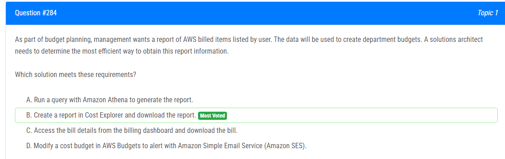

해설:

정답 B.

Cost Explorer의 간편성: Cost Explorer는 직관적이며 사용하기 쉬운 도구로 AWS 비용 및 사용률 데이터에 대한 시각적인 분석을 제공합니다. 필요한 보고서를 쉽게 생성하고 사용자별로 필터링할 수 있습니다.

다운로드 옵션: Cost Explorer에서 생성한 보고서를 다운로드하여 로컬 시스템에 저장할 수 있습니다. 이로써 보고서를 필요한 형식으로 사용자에게 제공하거나 부서 예산을 작성하는 데 활용할 수 있습니다.

정확한 사용자 정보: Cost Explorer는 AWS 사용자에 따른 비용 정보를 제공하므로 부서 예산을 작성할 때 정확한 사용자별 비용 정보를 얻을 수 있습니다.

시간대 및 기간 필터링: Cost Explorer에서는 특정 시간대 및 기간에 대한 비용을 확인할 수 있으며, 이는 정확한 예산 계획을 도와줍니다.

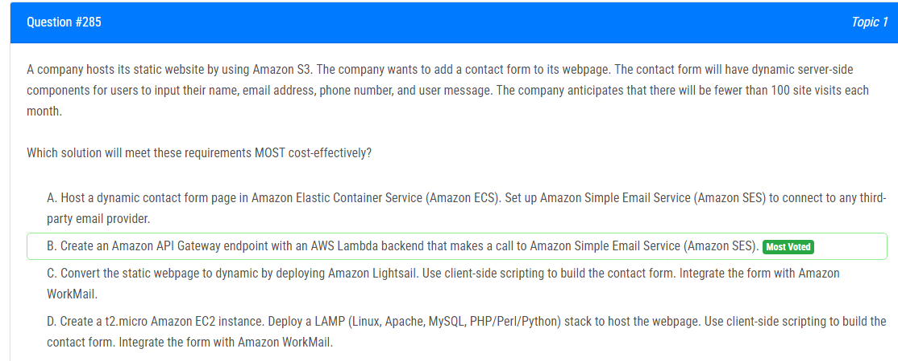

해설:

정답 B.

Low Traffic: 예상 월간 사이트 방문이 100회 미만이므로, 일반적인 웹 호스팅보다는 서버리스 아키텍처가 더 비용 효율적입니다.

Serverless Architecture: AWS Lambda는 사용량에 따라 비용이 청구되므로 트래픽이 적을 때는 더 저렴합니다. EC2 인스턴스를 항상 실행할 필요가 없습니다.

Scalability: Lambda는 자동으로 스케일링되므로 트래픽이 예상을 초과하더라도 성능에 영향을 덜 받습니다.

API Gateway Integration: Amazon API Gateway를 사용하면 간단하게 RESTful API를 만들 수 있으며, AWS Lambda와 쉽게 통합할 수 있습니다.

Simplicity and Maintenance: Lambda를 사용하면 서버 관리 없이 코드를 실행할 수 있으며, 코드를 업데이트하거나 유지 보수할 때 훨씬 간편합니다.

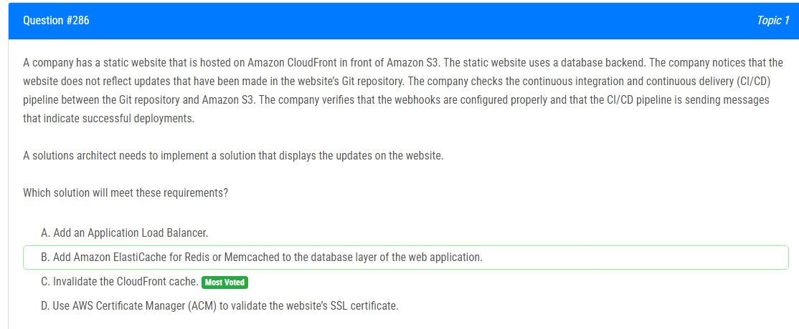

해설:

정답 C.

Static Website Hosted on S3: 정적 웹사이트는 Amazon S3에서 호스팅되고 있으며, 이는 CloudFront의 오리진(Origin)으로 사용됩니다.

Git Repository Updates Not Reflected: Git 리포지토리의 업데이트가 웹사이트에 반영되지 않고 있는데, 이는 CloudFront 캐시로 인해 이전 버전의 콘텐츠가 여전히 서빙되고 있기 때문일 수 있습니다.

CloudFront Cache Invalidation: CloudFront 캐시를 무효화하면 캐시된 콘텐츠가 최신 데이터로 갱신됩니다. 이는 캐시된 콘텐츠를 즉시 무효화하고 새로운 요청이 발생할 때 다시 S3에서 데이터를 가져오도록 합니다.

Webhooks and CI/CD Pipeline Configurations Checked: 문제는 CI/CD 파이프라인에서 나오는 성공적인 배포 메시지 및 웹훅 설정에는 문제가 없다고 확인되었으므로 이는 캐시 이슈로 생각됩니다.

CloudFront 캐시 무효화를 통해 최신 내용을 효과적으로 반영할 수 있으며, 이는 Git 리포지토리에서의 변경 사항이 즉시 웹사이트에 반영되도록 보장합니다.

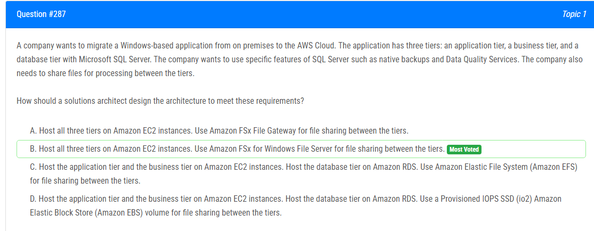

해설:

정답 B.

Windows-Based Application: Windows 기반 애플리케이션을 호스팅하려면 Amazon EC2 인스턴스가 필요합니다. 따라서 EC2 인스턴스를 사용하여 각 티어를 호스팅하는 것이 타당합니다.

SQL Server Features: Amazon RDS를 사용하지 않고 EC2 인스턴스에 직접 SQL Server를 설치하면 원하는 특정 기능을 활용할 수 있습니다. 이 경우 네이티브 백업 및 Data Quality Services를 포함할 수 있습니다.

File Sharing between Tiers: Amazon FSx for Windows File Server는 Windows 환경에서 파일 공유를 제공하는 완전 관리형 서비스입니다. 다양한 티어 간 파일 공유에 사용할 수 있으며, 이는 애플리케이션, 비즈니스, 데이터베이스 티어 간의 데이터 교환을 효과적으로 지원합니다.

Alternative to Shared Storage: Amazon FSx for Windows File Server는 Amazon EFS와 비교하여 Windows 환경에서 파일 공유에 더 적합한 서비스입니다.

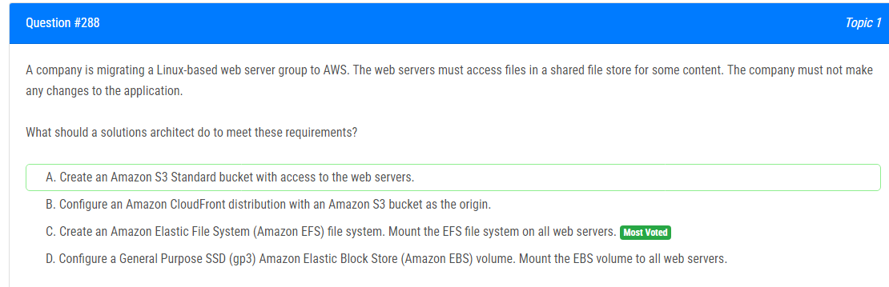

해설:

정답 C.

Shared File Store for Content: Amazon EFS는 여러 EC2 인스턴스에서 동시에 마운트되어 공유 파일 스토어를 제공합니다. 모든 웹 서버에서 동시에 파일에 액세스할 수 있습니다.

Linux-Based Web Servers: Amazon EFS는 Linux 기반 파일 시스템이기 때문에 Linux 웹 서버와 호환성이 뛰어납니다.

No Application Changes Required: Amazon EFS를 사용하면 기존 애플리케이션을 변경하지 않고도 공유 파일 시스템에 쉽게 액세스할 수 있습니다.

Elasticity and Scalability: Amazon EFS는 신축성이 뛰어나며 자동으로 확장되기 때문에 웹 서버의 수를 조정하더라도 파일 시스템은 필요한 만큼 자동으로 조정됩니다.

Managed Service: Amazon EFS는 완전 관리형 서비스로 파일 시스템의 설정, 유지 관리, 백업 등을 자동으로 관리해줍니다.

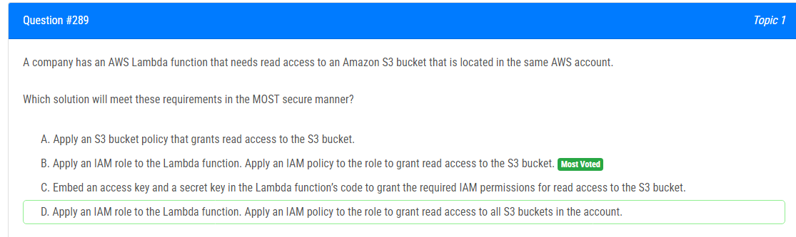

해설:

정답 B.

IAM Roles for AWS Lambda: Lambda 함수에 IAM 역할을 사용하면 필요한 권한을 정의하고 Lambda 함수가 해당 역할을 가진다면 권한이 자동으로 부여됩니다.

Least Privilege Principle: IAM 정책은 최소 권한의 원칙에 따라 구성되어야 합니다. 역할을 사용하여 특정 S3 버킷에 대한 읽기 액세스를 부여하면 필요한 최소한의 권한만을 부여할 수 있습니다.

IAM Policies vs. Embedded Credentials: IAM 정책을 사용하는 것은 자격 증명(액세스 키 및 비밀 키)을 코드에 포함시키는 것보다 더 안전합니다. 자격 증명을 코드에 포함시키면 보안상의 위험이 크게 증가하며, 이러한 방법은 보안 최고의 실천 방법이 아닙니다.

Scoped Access: 역할을 사용하여 특정 S3 버킷에 대한 읽기 액세스를 부여하면 다른 S3 버킷에 대한 액세스가 허용되지 않으므로 범위를 정확하게 제한할 수 있습니다.

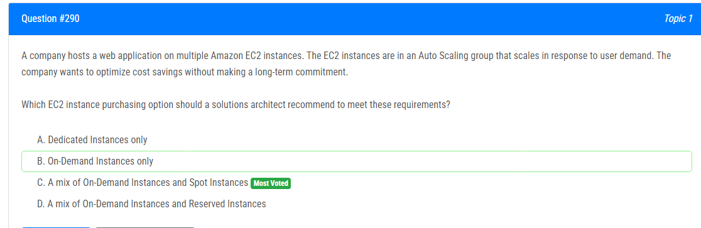

해설:

정답 C.

On-Demand Instances: 사용자 수요에 따라 EC2 인스턴스가 자동으로 스케일 인/아웃되는 Auto Scaling 그룹에서는 On-Demand 인스턴스를 사용할 수 있습니다. 이는 가격이 높지만 즉시 사용 가능하며 예측 불가능한 트래픽 변동에 대비할 수 있습니다.

Spot Instances: Spot 인스턴스는 낮은 가격으로 제공되지만 언제든지 종료될 수 있습니다. 따라서 안정성이나 지속적인 워크로드에 사용되기보다는 일시적인 처리나 비 중요한 워크로드에 적합합니다. 하지만 중요한 작업을 위해 Spot 인스턴스를 사용할 경우 중단될 가능성에 대한 대비책이 필요합니다.

비용 최적화: 온디맨드 인스턴스의 높은 가격과 Spot 인스턴스의 낮은 가격을 조합함으로써 실시간 트래픽에 대한 대응력을 높이면서도 비용을 최적화할 수 있습니다.

Auto Scaling Benefits: Auto Scaling을 통해 온디맨드 및 스팟 인스턴스를 조합하면 트래픽 변동에 대응하면서도 필요한 인스턴스 수를 최소한으로 유지할 수 있습니다.

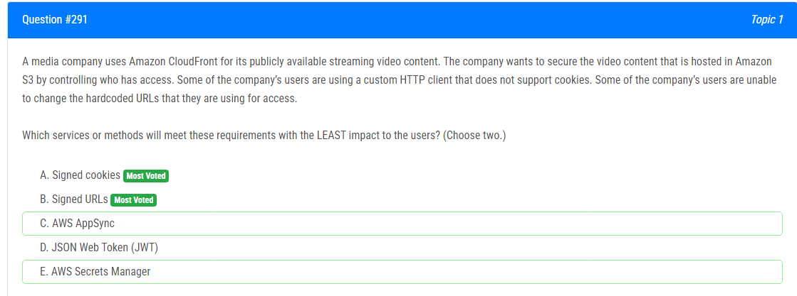

해설:

정답 A, B.

Signed Cookies (A): Signed cookies를 사용하면 CloudFront에서 생성한 서명이 있는 쿠키를 사용하여 사용자의 요청을 인증할 수 있습니다. 이는 사용자의 브라우저가 쿠키를 지원하는 한, 기존 HTTP 클라이언트 및 브라우저와의 호환성이 높습니다.

Signed URLs (B): Signed URLs는 요청의 서명이 있는 URL을 통해 액세스를 허용하므로, 쿠키를 사용하지 않는 HTTP 클라이언트도 사용 가능합니다. URL에 서명이 포함되어 있으므로 URL 자체가 인증 정보를 제공합니다.

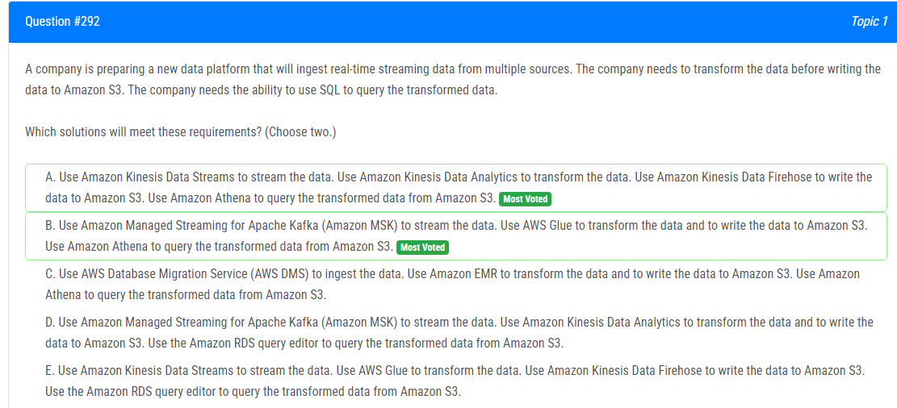

해설:

정답 A, B.

Amazon Kinesis Data Streams (A), Amazon MSK (B): 데이터 스트리밍에 사용되며, 실시간 데이터를 처리하는 데 적합합니다.

Amazon Kinesis Data Analytics (A), AWS Glue (B): 데이터를 변환하고 가공하는 데 사용되며, SQL 쿼리를 작성하여 데이터를 처리할 수 있습니다.

Amazon Kinesis Data Firehose (A): 변환된 데이터를 쉽게 Amazon S3에 쓸 수 있도록 지원합니다.

Amazon Athena (A, B): SQL 쿼리를 사용하여 Amazon S3에 저장된 데이터를 쉽게 조회할 수 있습니다.

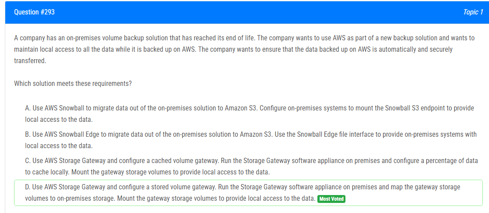

해설:

정답 D.

Stored Volume Gateway: 저장된 볼륨 게이트웨이는 전체 데이터 세트를 S3에 저장하면서 로컬 캐시를 제공합니다. 이것은 온프레미스에서 로컬 액세스를 제공하는 데 유용합니다.

On-Premises Local Access: 게이트웨이 스토리지 볼륨은 온프레미스 저장소에 매핑되어 로컬 액세스를 제공하므로 데이터에 로컬로 접근할 수 있습니다.

AWS Storage Gateway: Storage Gateway는 온프레미스 환경과 AWS 클라우드 간에 데이터를 효율적으로 이동할 수 있도록 해주는 관리형 서비스입니다.

Automatic and Secure Transfer: Storage Gateway는 데이터를 안전하게 전송하고 관리하며, AWS와의 연동을 통해 효율적으로 백업 솔루션을 제공합니다.

해설:

정답 B.

VPC Endpoint for Amazon S3: 게이트웨이 VPC 엔드포인트를 사용하면 EC2 인스턴스가 Amazon S3에 직접 액세스할 수 있습니다. 이를 통해 트래픽이 인터넷을 통하지 않고 VPC 내에서 안전하게 전송됩니다.

Private Connectivity: 게이트웨이 VPC 엔드포인트를 사용하면 EC2 인스턴스가 S3 버킷과의 통신에 VPC의 내부 네트워크만 사용하게 됩니다. 인터넷을 경유하지 않으므로 트래픽이 더 안전하고 프라이빗한 환경에서 전송됩니다.

No NAT Gateway or VPN Needed: 게이트웨이 VPC 엔드포인트를 사용하면 NAT 게이트웨이나 VPN을 설정할 필요가 없어집니다. 이는 더 간편하고 비용 효율적인 솔루션을 제공합니다.

Simplified DNS Resolution: Amazon S3에 대한 엔드포인트를 설정하면 EC2 인스턴스는 표준 DNS를 사용하여 S3 버킷에 액세스할 수 있습니다.

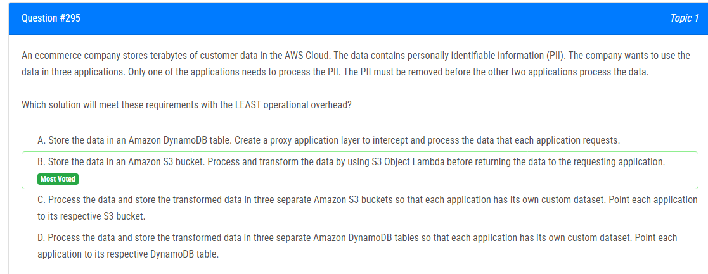

해설:

정답 B.

S3 Object Lambda: S3 Object Lambda를 사용하면 데이터에 대한 필요에 따라 변환을 적용하여 반환할 수 있습니다. 이를 통해 PII가 제거된 데이터를 반환하거나 특정 애플리케이션에 맞게 데이터를 가공할 수 있습니다.

Separation of Concerns: 각 애플리케이션이 개별적으로 PII를 처리하거나 처리하지 않도록 하여 데이터를 사용하는 각 애플리케이션이 독립적으로 운영되도록 할 수 있습니다.

Operational Overhead 최소화: S3 Object Lambda는 데이터 처리 및 변환에 필요한 모든 로직을 적용하고 반환하기 때문에 중간 애플리케이션 레이어를 구현할 필요가 없습니다. 이로 인해 운영 오버헤드가 최소화됩니다.

S3의 다양한 기능 활용: S3는 데이터 저장, 보안, 백업, 검색 등 다양한 기능을 제공하므로 효과적으로 데이터를 관리할 수 있습니다.

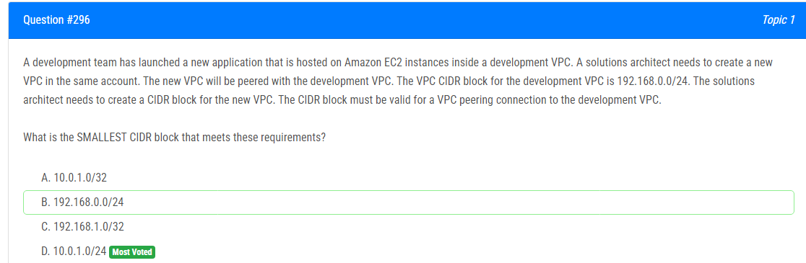

해설:

정답 D.

D. 개발 VPC와 피어링 연결을 설정하기 위해서는 새로운 VPC의 CIDR 블록이 개발 VPC의 CIDR 블록과 겹치지 않아야 합니다. 또한, 피어링 연결을 위해서는 CIDR 블록이 최소한 하나의 IP 주소를 가지고 있어야 합니다.

따라서 D. 10.0.1.0/24가 가장 작은 CIDR 블록이면서도 개발 VPC와 겹치지 않는 유효한 옵션입니다.

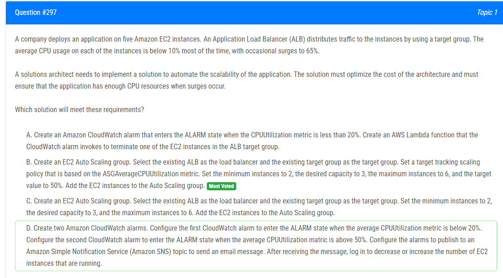

해설:

정답 B.

Target Tracking Scaling Policy: Target tracking scaling policy를 사용하면 특정 CPU 사용률을 유지할 수 있습니다. ASGAverageCPUUtilization 메트릭을 기반으로 설정하면 CPU 사용률이 50%로 유지되도록 조정할 수 있습니다.

Min, Desired, Max Capacity 설정: 최소 인스턴스 수를 2로 설정하여 항상 최소한의 인스턴스가 활성 상태로 유지됩니다. 원하는 용량을 3으로 설정하여 추가로 필요한 경우 자동으로 인스턴스가 생성됩니다. 최대 인스턴스 수를 6으로 설정하여 비정상적으로 높은 트래픽 또는 부하가 있는 경우 스케일 아웃이 발생할 수 있습니다.

최적화된 비용: Target tracking policy를 사용하면 CPU 사용률이 원하는 값으로 자동 조정되므로 항상 최적의 인스턴스 수를 유지할 수 있습니다. 이는 비용을 최적화하는 데 도움이 됩니다.

간편한 구성: EC2 Auto Scaling은 필요한 인프라를 관리하는 데 도움이 되며, Target Tracking Scaling Policy를 사용하면 구성이 간단하고 효과적입니다.

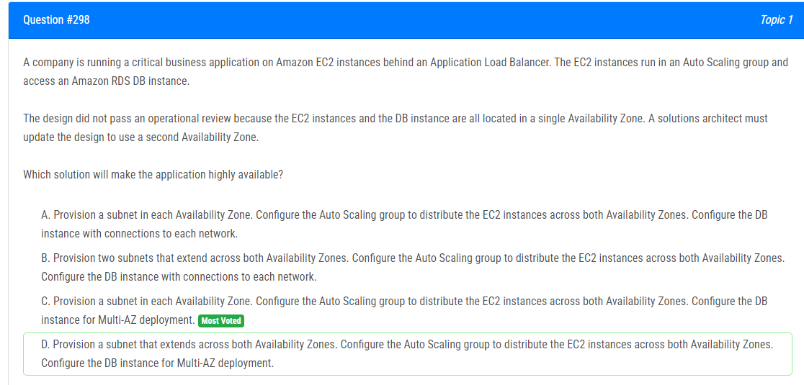

해설:

정답 C.

Subnets in Each Availability Zone: 각 Availability Zone에 서브넷을 생성하여 EC2 인스턴스와 RDS DB 인스턴스가 여러 가용 영역에 분산되어 위치하도록 합니다.

Auto Scaling Group across Both Availability Zones: Auto Scaling 그룹을 사용하여 EC2 인스턴스를 여러 가용 영역에 분산하여 고가용성을 확보합니다. 이를 통해 특정 가용 영역의 장애로부터 어플리케이션을 보호할 수 있습니다.

Multi-AZ Deployment for RDS: RDS DB 인스턴스를 Multi-AZ 배포로 구성하여 데이터베이스의 고가용성을 확보합니다. Multi-AZ 배포는 데이터베이스 인스턴스를 여러 가용 영역에 자동으로 복제함으로써 장애 발생 시에도 데이터베이스에 대한 지속적인 액세스를 보장합니다.

Operational Resilience: 여러 가용 영역에 걸쳐 서브넷 및 인스턴스를 분산 배치하는 것은 장애에 대한 복원력을 강화하고 운영적인 신뢰성을 향상시킵니다.

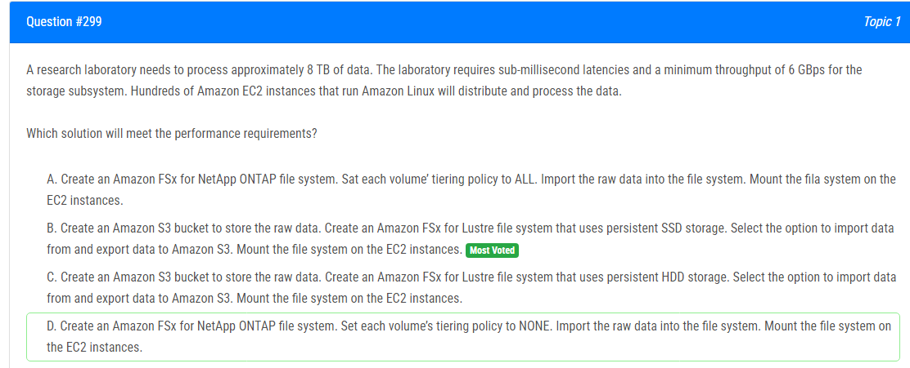

해설:

정답 B.

Amazon S3 for Storing Raw Data: 대규모 데이터를 저장하기에 이상적인 Amazon S3 버킷을 사용하여 원시 데이터를 저장합니다. S3는 데이터를 안정적으로 저장하고 높은 내구성을 제공하며, 필요할 때 쉽게 액세스할 수 있습니다.

Amazon FSx for Lustre with Persistent SSD Storage: Amazon FSx for Lustre 파일 시스템은 초당 수밀리초의 지연 시간과 6 GBps 이상의 최소 처리량을 제공할 수 있습니다. 이를 위해 영구적인 SSD 스토리지를 사용하는 것이 필요합니다.

Import and Export Data between S3 and FSx for Lustre: Amazon FSx for Lustre를 사용하여 S3와의 데이터 이동을 효율적으로 관리할 수 있습니다. 이를 통해 데이터를 Amazon S3에서 FSx for Lustre로 쉽게 가져오고 처리된 결과를 다시 Amazon S3로 내보낼 수 있습니다.

EC2 Instances for Distributed Processing: 수백 개의 Amazon EC2 인스턴스를 사용하여 데이터를 분산 처리할 수 있습니다. 이러한 인스턴스는 Amazon FSx for Lustre 파일 시스템을 마운트하여 데이터에 액세스하고 처리할 수 있습니다.

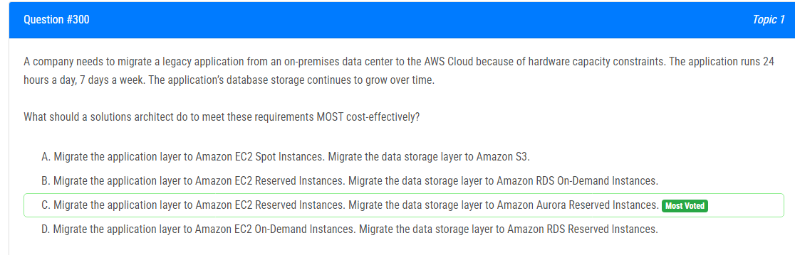

해설:

정답 C.

EC2 Reserved Instances: 예약 인스턴스는 긴 기간 동안 실행되는 애플리케이션에 적합합니다. 예약 인스턴스를 사용하면 특정 인스턴스 유형에 대해 미리 지불하고 할당량을 예약하여 비용을 절감할 수 있습니다.

Amazon Aurora Reserved Instances: Aurora는 관리형 데이터베이스 서비스로, 데이터베이스 스토리지의 증가에 대응할 수 있는 확장성을 제공합니다. 예약 인스턴스를 사용하면 데이터베이스 인스턴스에 대한 비용을 낮추고 예산을 효율적으로 사용할 수 있습니다.

비용 효율적인 마이그레이션: 예약 인스턴스를 사용하여 실행 중인 애플리케이션과 데이터베이스에 대한 비용을 낮추면서 안정적으로 마이그레이션할 수 있습니다.

관리형 서비스 활용: Amazon Aurora는 관리형 데이터베이스 서비스로서 데이터베이스 업그레이드, 유지 관리, 백업 등의 작업을 자동으로 처리해주므로 관리 부담이 줄어듭니다.

