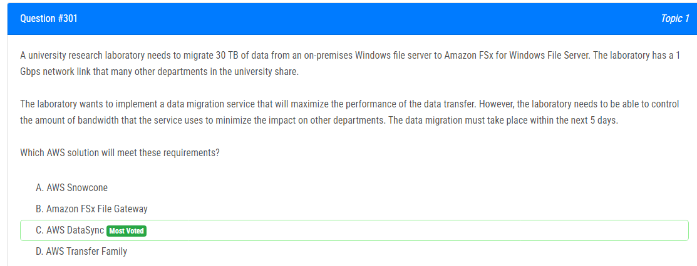

해설:

정답 C.

데이터 이전 성능 최적화: AWS DataSync는 대량의 데이터를 빠르게 이전할 수 있도록 설계되었습니다. 병렬 처리 및 네트워크 대역폭을 최대한 활용하여 최적의 성능을 제공합니다.

대역폭 제어: AWS DataSync는 대역폭 제어 기능을 제공하여 다른 부서에 미치는 영향을 최소화할 수 있습니다. 이를 통해 데이터 이전 작업이 네트워크에서 사용할 수 있는 대역폭을 제한하여 다른 부서의 네트워크 활동에 영향을 미치지 않습니다.

Amazon FSx와의 통합: AWS DataSync는 Amazon FSx와 직접 통합되어 있으므로, 데이터를 쉽게 Amazon FSx로 이전할 수 있습니다.

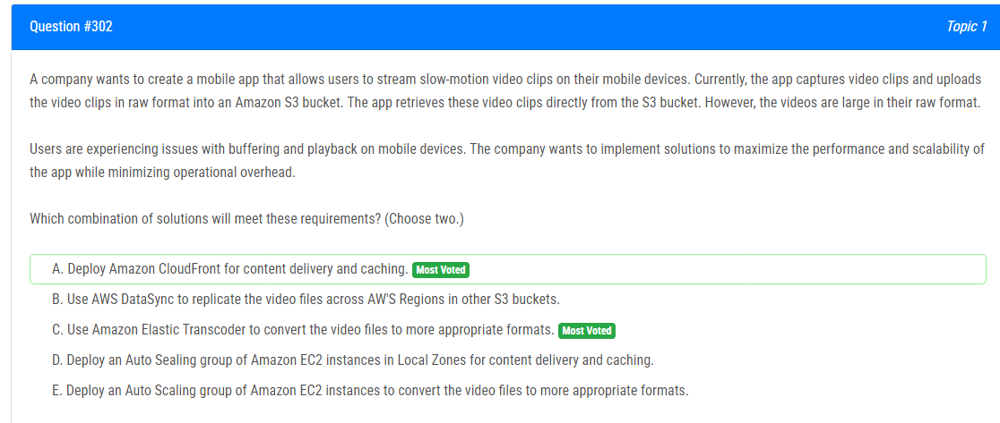

해설:

정답 A.

Amazon CloudFront을 사용하여 콘텐츠 전달 및 캐싱: Amazon CloudFront은 성능을 최적화하고 사용자 경험을 향상시키는 데 도움이 됩니다. CloudFront를 사용하면 전 세계의 사용자에게 더 빠른 전송 속도를 제공할 수 있으며, 요청된 콘텐츠를 엣지 위치에서 캐시하여 다시 요청할 필요 없이 동영상을 더 빠르게 제공할 수 있습니다.

Amazon Elastic Transcoder를 사용하여 비디오 파일 변환: Amazon Elastic Transcoder를 사용하면 원본 비디오 파일을 모바일 장치에서 재생할 수 있는 적절한 형식으로 변환할 수 있습니다. 이렇게 하면 모바일 장치에서 동영상을 스트리밍하는 데 필요한 대역폭을 줄이고, 사용자가 더 빠르게 비디오를 로드하고 재생할 수 있습니다.

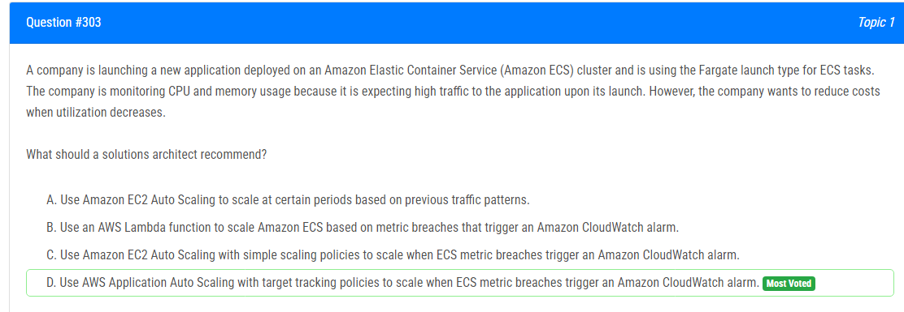

해설:

정답 D.

AWS Application Auto Scaling을 사용하여 대상 추적 정책을 구현하는 것이 적절합니다. Fargate를 사용하는 경우 ECS 태스크를 자동으로 확장 및 축소하기 위해 이 기능을 활용할 수 있습니다. 대상 추적 정책을 설정하면 사용자가 지정한 대상 지표를 유지하기 위해 자동으로 스케일링됩니다. 이는 예를 들어 CPU 및 메모리 사용률과 같은 ECS 메트릭에 기반할 수 있습니다. 또한 Amazon CloudWatch 알람을 트리거하여 메트릭 이벤트를 기반으로 스케일링되도록 할 수 있습니다.

이러한 설정은 트래픽이 증가할 때 자동으로 태스크를 확장하여 성능을 유지하고, 트래픽이 감소할 때는 자동으로 태스크를 축소하여 비용을 절감할 수 있도록 해줍니다. AWS Application Auto Scaling을 사용하면 이러한 작업을 자동화하고 효율적으로 운영할 수 있습니다.

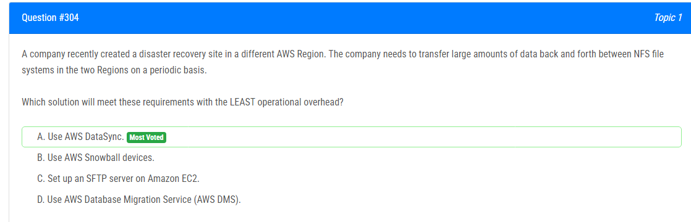

해설:

정답 A.

AWS DataSync를 사용하는 것이 운영 오버헤드를 최소화하는 데 가장 적합합니다. AWS DataSync는 대량의 데이터를 안전하고 신속하게 AWS 서비스 및 온프레미스 스토리지 간에 전송할 수 있는 완전 관리형 데이터 전송 서비스입니다. NFS 파일 시스템 간 데이터 이전을 지원하며, 자동화된 프로세스를 제공하여 데이터 이전을 간단하게 만듭니다. 또한 대역폭 사용량을 제어할 수 있으므로 다른 리전 간의 데이터 이전이 다른 서비스에 미치는 영향을 최소화할 수 있습니다.

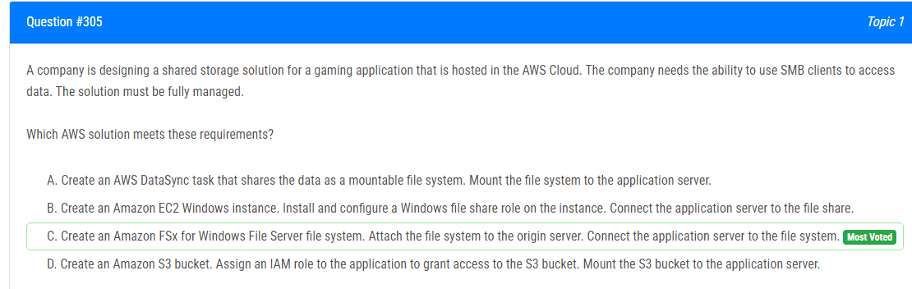

해설:

정답 C.

Amazon FSx for Windows File Server 파일 시스템을 생성하는 것이 가장 적합합니다. Amazon FSx는 완전히 관리되는 파일 스토리지 서비스이며, Windows 파일 서버를 호스팅하고 SMB 클라이언트를 통해 데이터에 액세스할 수 있는 기능을 제공합니다. 이를 통해 게임 응용 프로그램에서 SMB 클라이언트를 사용하여 데이터에 액세스할 수 있습니다.

Amazon FSx를 사용하면 AWS에서 관리되는 완전 관리형 서비스를 활용할 수 있으므로 관리 오버헤드가 줄어듭니다. 또한 데이터 동기화, 백업 및 보안 기능을 제공하여 데이터 관리를 단순화할 수 있습니다.

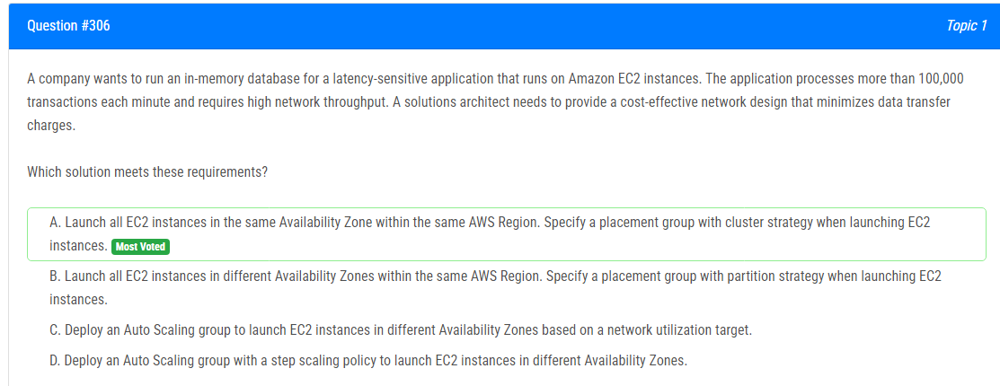

해설:

정답 A.

동일한 AWS 리전 내의 동일한 가용 영역에 모든 EC2 인스턴스를 시작하고, EC2 인스턴스를 시작할 때 클러스터 전략을 사용하여 배치 그룹을 지정합니다.

이것은 네트워크 레이턴시를 최소화하고 고성능 네트워크를 활용하여 트랜잭션 처리량을 최적화하는 데 도움이 됩니다. 클러스터 전략을 사용하면 EC2 인스턴스가 가능한 한 가까이 배치되므로 네트워크 레이턴시가 줄어들고 트랜잭션 처리량이 향상됩니다. 또한 동일한 가용 영역 내에서 데이터 전송 비용이 추가로 부과되지 않으므로 데이터 전송 요금을 최소화할 수 있습니다.

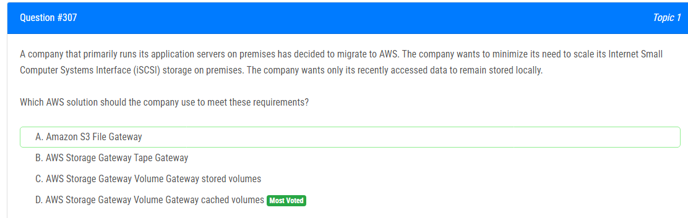

해설:

정답 D.

AWS Storage Gateway 볼륨 게이트웨이 캐시된 볼륨을 사용하는 것이 가장 적절합니다. 이 옵션을 선택하면 최근에 액세스한 데이터만 로컬로 유지됩니다. 일반적으로 캐시된 볼륨은 가장 최근에 액세스한 데이터의 로컬 복사본을 저장하고, 나머지 데이터는 AWS 클라우드에 저장됩니다.

이를 통해 회사는 로컬 스토리지에 필요한 데이터의 양을 최소화하고, 필요할 때마다 필요한 데이터에 대한 액세스를 보장할 수 있습니다. 또한 이 방법은 데이터의 AWS 클라우드로의 영구적인 백업을 보장하여 데이터 손실을 방지합니다.

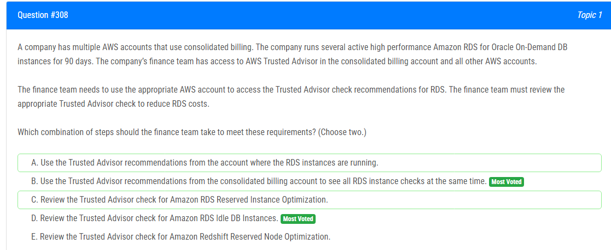

해설:

정답 B, D.

B. 모든 AWS 계정이 결합된 청구 계정으로 액세스하는 것이 가장 효율적입니다. 결합된 청구 계정의 Trusted Advisor는 모든 연결된 계정의 상태를 종합적으로 확인할 수 있습니다. 따라서 이 방법을 통해 모든 RDS 인스턴스의 Trusted Advisor 권장 사항을 한 곳에서 확인할 수 있습니다.

D. Amazon RDS Idle DB Instances의 Trusted Advisor 검사를 검토하는 것이 중요합니다. 이 체크는 사용되지 않는 또는 휴면 중인 RDS 인스턴스를 식별하여 비용을 절감할 수 있는 기회를 제공합니다. 따라서 이 체크를 통해 RDS 비용을 최적화할 수 있습니다.

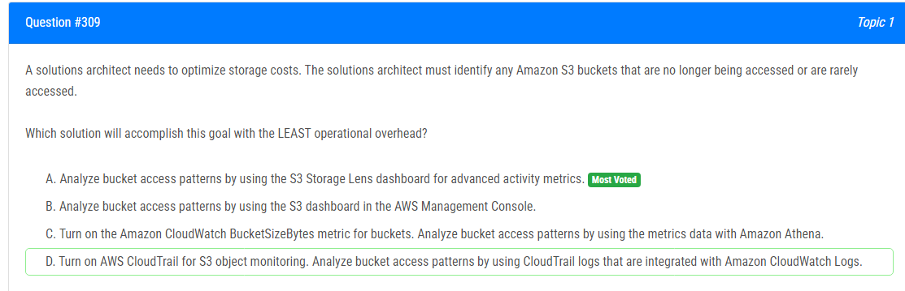

해설:

정답 A.

S3 Storage Lens 대시보드를 사용하여 버킷의 고급 활동 메트릭을 분석하는 것이 가장 적은 운영 오버헤드를 가집니다. S3 Storage Lens는 S3 버킷의 활동 및 액세스 패턴에 대한 종합적인 비즈니스 지표를 제공합니다. 이를 통해 버킷이 얼마나 자주 액세스되고 있는지, 어떤 유형의 액세스 패턴이 있는지 등을 신속하게 파악할 수 있습니다.

기존 S3 대시보드를 사용하는 것보다 S3 Storage Lens는 더 많은 고급 분석 및 비즈니스 지표를 제공하여 버킷 액세스 패턴을 더 잘 이해할 수 있습니다. 이를 통해 버킷을 더 효율적으로 최적화하여 비용을 절감할 수 있습니다.

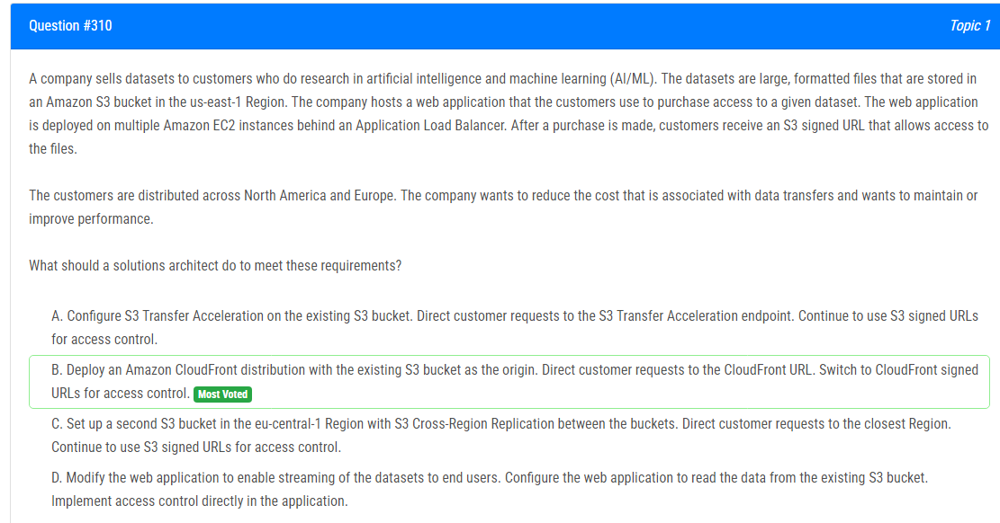

해설:

정답 B.

기존 S3 버킷을 오리진으로 하는 Amazon CloudFront 배포물을 배포하는 것이 가장 적절합니다. CloudFront를 사용하면 정적 콘텐츠를 전 세계적으로 배포하여 최종 사용자에게 더 빠르고 안정적인 액세스를 제공할 수 있습니다. CloudFront 엣지 위치는 북미 및 유럽에 광범위하게 분포되어 있으므로 최종 사용자에게 더 가까운 엣지로부터 콘텐츠를 제공할 수 있습니다. 이는 데이터 전송 비용을 줄이고 성능을 향상시키는 데 도움이 됩니다.

또한 CloudFront 서명된 URL을 사용하여 액세스 제어를 관리할 수 있습니다. 이를 통해 액세스 제어를 더욱 견고하게 관리하고 데이터 보안을 강화할 수 있습니다.

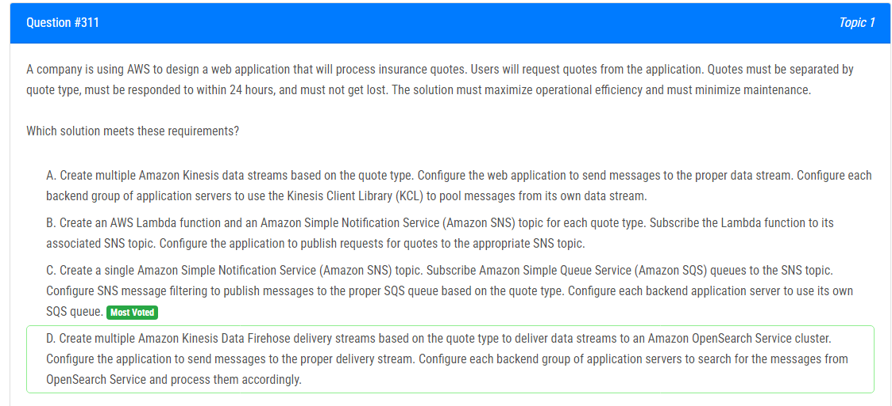

해설:

정답 C.

여러 Amazon SQS 대기열을 생성하고, 이를 Amazon SNS 주제에 구독합니다. Amazon SNS 메시지 필터링을 구성하여 각 대기열이 해당하는 견적 유형에 대한 메시지를 수신하도록합니다. 각 백엔드 응용 프로그램 서버를 각각의 SQS 대기열에 구성합니다.

이러한 구성은 견적 유형별로 견적을 분리하고, 메시지가 유실되지 않도록 보장합니다. 또한 Amazon SQS 및 Amazon SNS는 관리 오버헤드가 적으며, 운영 효율성을 극대화하고 유지 관리를 최소화하는 데 도움이 됩니다.

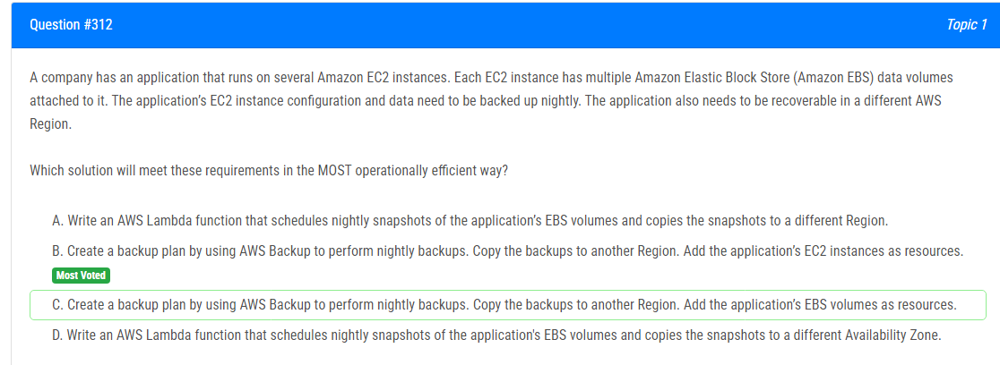

해설:

정답 B.

AWS Backup를 사용하여 백업 계획을 만들고, 이를 통해 밤마다 백업을 수행합니다. 백업은 다른 리전으로 복사되도록 구성됩니다. EC2 인스턴스를 리소스로 추가하여 백업을 수행할 수 있습니다.

이 방법은 가장 운영적으로 효율적입니다. AWS Backup는 관리 오버헤드를 최소화하고 백업 프로세스를 자동화하여 운영 효율성을 극대화합니다. 또한 AWS Backup를 사용하면 여러 리전으로의 백업 복사를 간편하게 구성할 수 있으므로, 애플리케이션의 복구 가능성을 보장할 수 있습니다.

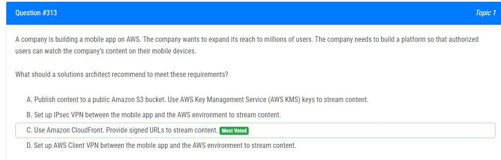

해설:

정답 C.

Amazon CloudFront를 사용하여 콘텐츠를 전송하는 것이 가장 적절합니다. CloudFront는 전 세계의 엣지 로케이션을 통해 안정적이고 빠른 콘텐츠 전송을 제공합니다. 사용자가 콘텐츠에 액세스할 때 CloudFront는 해당 콘텐츠를 가장 가까운 엣지 로케이션에서 제공하여 지연 시간을 최소화하고 사용자 경험을 향상시킵니다.

또한, CloudFront 서명된 URL을 사용하여 콘텐츠에 액세스를 제어할 수 있습니다. 이를 통해 콘텐츠에 대한 액세스를 제한하고 보안을 강화할 수 있습니다.

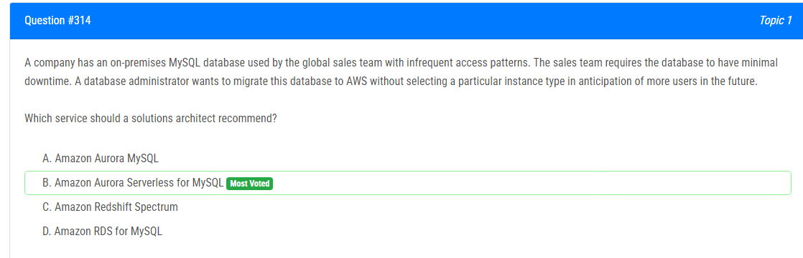

해설:

정답 B.

Amazon Aurora Serverless for MySQL을 추천해야 합니다. Amazon Aurora Serverless는 데이터베이스 사용량에 따라 자동으로 크기가 조정되므로 예측할 수 없는 또는 변동적인 작업 부하에 적합합니다. 또한 이 서비스는 사용자에게 특정 인스턴스 유형을 선택할 필요가 없으며, 데이터베이스의 최소한의 다운타임을 보장합니다.

Amazon Aurora Serverless를 사용하면 데이터베이스 관리 오버헤드를 최소화하고, 향후 더 많은 사용자가 발생할 경우에도 자동으로 조정될 수 있습니다. 이러한 이유로 Amazon Aurora Serverless를 선택하여 전역 영업 팀의 데이터베이스를 마이그레이션하는 것이 가장 적절합니다.

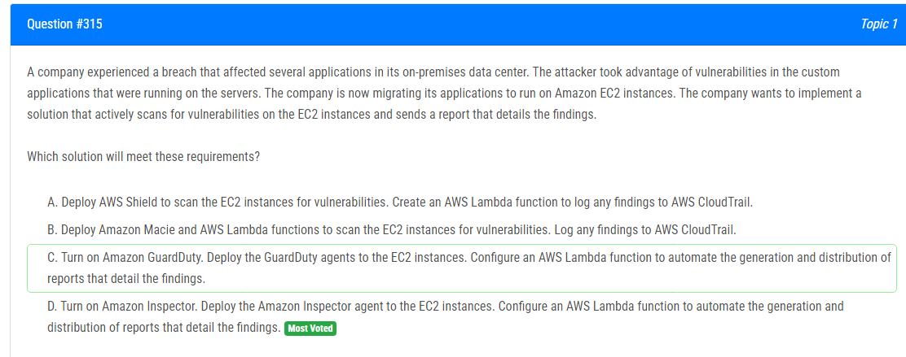

해설:

정답 D.

Amazon Inspector를 사용하여 EC2 인스턴스에 취약점을 스캔하는 것이 가장 적절합니다. Amazon Inspector는 EC2 인스턴스에 에이전트를 배포하여 애플리케이션 및 운영 체제의 보안 구성을 평가하고 취약점을 검색합니다. 이를 통해 보안 문제를 빠르게 식별하고 조치할 수 있습니다.

또한 Amazon Inspector는 스캔 결과를 자동으로 보고하여 보고서를 생성하고 배포하는 데 사용할 수 있습니다. 이를 위해 Amazon Inspector는 AWS Lambda 함수와 통합되어 있으며, 스캔 결과를 분석하여 자동으로 보고서를 생성하고 필요한 대응 조치를 취할 수 있습니다.

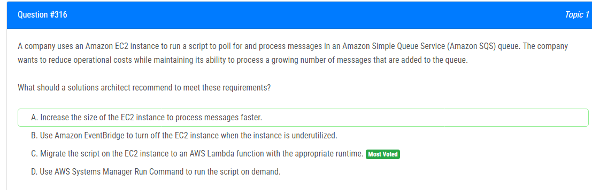

해설:

정답 C.

EC2 인스턴스에서 실행 중인 스크립트를 AWS Lambda 함수로 마이그레이션하는 것이 가장 적절합니다. AWS Lambda는 서버리스 컴퓨팅 서비스로, 특정 이벤트에 대해 코드를 실행할 수 있습니다. 따라서 SQS 큐에 새 메시지가 추가될 때마다 Lambda 함수가 트리거되어 스크립트를 실행할 수 있습니다.

AWS Lambda는 사용된 컴퓨팅 리소스에만 비용을 청구하므로, 메시지 처리량이 증가함에 따라 비용도 증가합니다. 또한 AWS Lambda는 자동으로 확장되므로 크기를 조절하거나 관리할 필요가 없습니다. 이는 운영 비용을 줄이고 효율성을 극대화하는 데 도움이 됩니다.

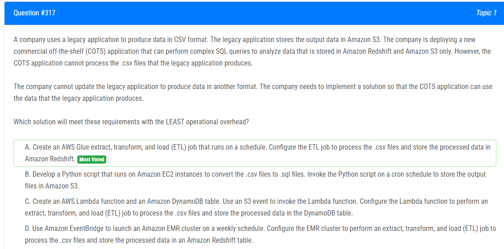

해설:

정답 A.

AWS Glue를 사용하여 스케줄에 따라 실행되는 추출, 변환 및 로드(ETL) 작업을 생성합니다. 이 작업을 구성하여 .csv 파일을 처리하고 처리된 데이터를 Amazon Redshift에 저장합니다. 이 방법은 데이터 변환 및 로드를 자동화하며, 운영 오버헤드를 최소화하면서 COTS 애플리케이션에서 데이터를 사용할 수 있도록 합니다.

이 방법은 운영 오버헤드가 적으며, 데이터 처리 및 변환을 자동화하여 효율적으로 처리할 수 있습니다. 또한 AWS Glue는 스케줄에 따라 자동으로 실행되므로 수동 개입이 필요하지 않습니다.

해설:

정답 A, D.

A. AWS CloudTrail을 활성화하고 감사에 사용합니다. CloudTrail은 AWS 리소스에 대한 API 호출을 기록하고 이벤트를 로그로 기록하여 리소스의 인벤토리 및 구성 변경을 추적할 수 있습니다.

D. AWS Config를 활성화하고 감사 및 규정 준수 목적을 위한 규칙을 생성합니다. AWS Config는 리소스 구성을 지속적으로 모니터링하고 변경 사항을 기록하여 인벤토리 및 구성 변경을 추적하고, 규정 준수를 검증하는 데 사용됩니다.

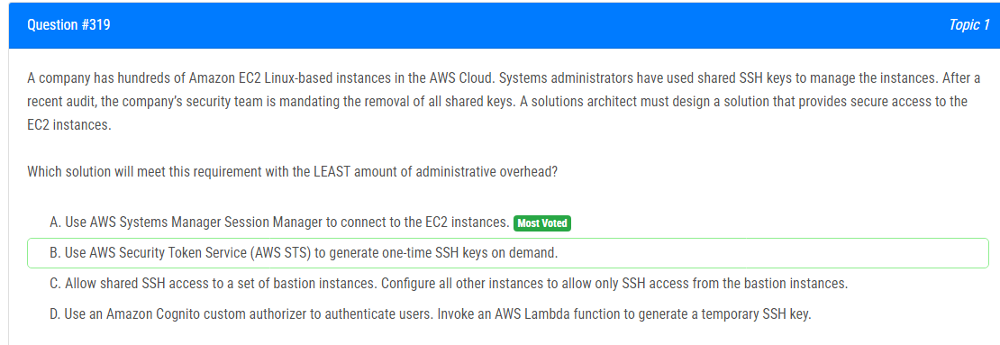

해설:

정답 A.

AWS Systems Manager Session Manager를 사용하여 EC2 인스턴스에 연결합니다. Session Manager를 사용하면 SSH 키 관리가 필요하지 않으며, 인스턴스에 대한 보안 접근을 제공하는 데 필요한 인프라를 관리하는 데 필요한 관리 오버헤드가 최소화됩니다. Systems Manager는 IAM 권한을 사용하여 인스턴스에 대한 접근을 제어하고, 인증 및 권한 부여를 관리합니다.

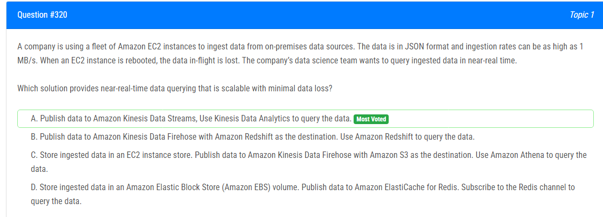

해설:

정답 A.

Amazon Kinesis Data Streams에 데이터를 게시하고, Kinesis Data Analytics를 사용하여 데이터를 쿼리합니다. Kinesis Data Streams는 실시간 데이터 스트리밍 서비스로, 고성능 및 확장성을 제공합니다. 이를 통해 데이터 사이즈가 1 MB/s로 높은 인풋 레이트를 처리할 수 있으며, EC2 인스턴스가 다시 부팅될 때도 데이터 손실이 최소화됩니다. 또한 Kinesis Data Analytics를 사용하여 데이터를 실시간으로 쿼리할 수 있으므로, 데이터 과학팀이 거의 실시간으로 데이터에 대한 질의를 수행할 수 있습니다.