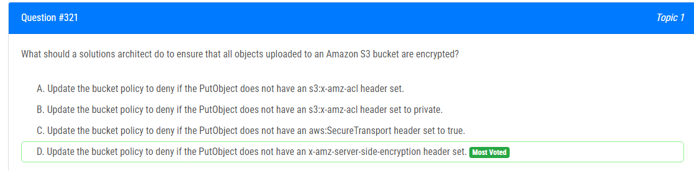

해설:

정답 D.

Amazon S3에서 객체를 업로드할 때 객체가 서버 측 암호화로 암호화되도록 강제하려면 서버 측 암호화를 활성화하는 것이 좋습니다. 이것은 보안상의 이유로 권장되는 사항입니다. PutObject 요청에 x-amz-server-side-encryption 헤더가 없는 경우를 거부하는 것은 이러한 보안 요구 사항을 강제화하는 방법 중 하나입니다.

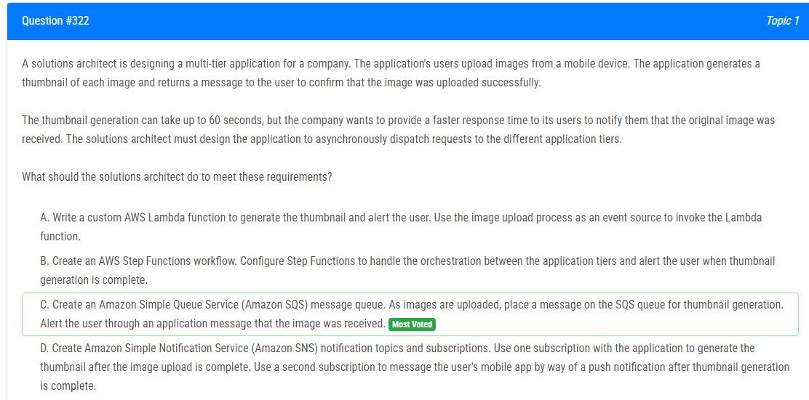

해설:

정답 C.

Amazon SQS는 비동기적으로 메시지를 보내고 받는 서비스이므로 이미지 업로드 후에 즉시 사용자에게 응답을 반환할 수 있습니다.
이미지 업로드 후에는 즉시 사용자에게 응답할 수 있으며, 이후에는 이미지 처리 작업을 수행할 수 있습니다.
이러한 방식으로 요청을 분리함으로써 응답 시간을 줄일 수 있고, 이미지 처리 작업이 긴 시간이 걸릴 경우에도 사용자에게 즉시 응답할 수 있습니다.

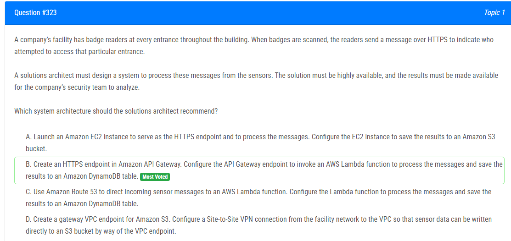

해설:

정답 B.

Amazon API Gateway는 매우 확장 가능하고 가용성이 높은 서비스이므로 많은 양의 메시지를 처리할 수 있습니다.
AWS Lambda는 서버리스 컴퓨팅 서비스로, 자동으로 확장되고 관리되므로 운영 부담이 적습니다.
Amazon DynamoDB는 빠른 속도로 대규모 데이터를 저장하고 검색할 수 있는 NoSQL 데이터베이스이므로 센서 메시지 결과를 저장하는 데 적합합니다.
이 아키텍처는 서버리스 및 관리가 적은 서비스를 사용하여 구현되므로 운영 및 유지 관리 부담이 줄어들고, 높은 가용성을 제공합니다.

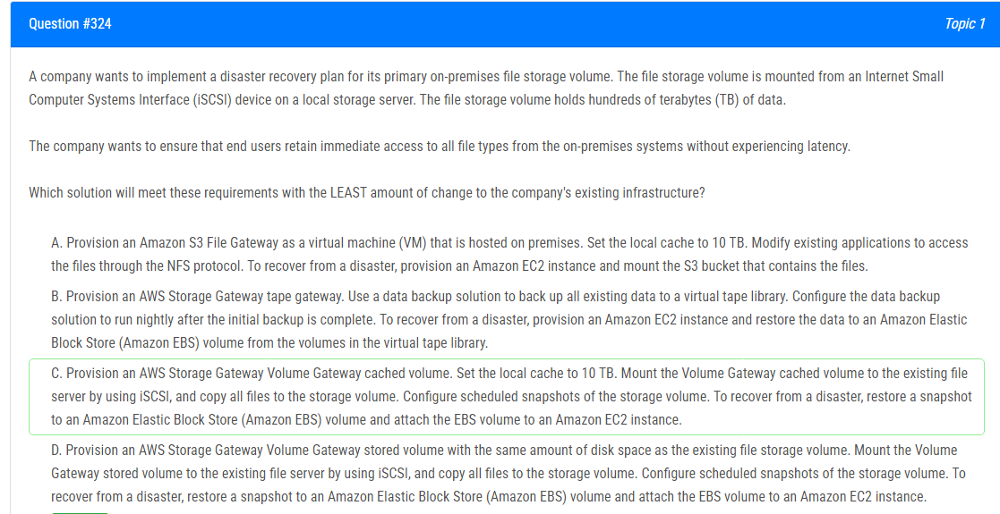

해설:

정답 D.

기존 인프라의 변경을 최소화하기 위해 AWS Storage Gateway를 사용하여 온프레미스 환경과의 통합을 지원합니다.
Volume Gateway stored volume은 기존 파일 서버의 iSCSI 디스크로 마운트되어 기존 인프라와의 호환성을 유지하면서 데이터를 안전하게 백업할 수 있습니다.
예약된 스냅숏은 데이터의 정기적인 백업을 보장하며, 재해 발생 시 데이터를 신속하게 복구할 수 있습니다.

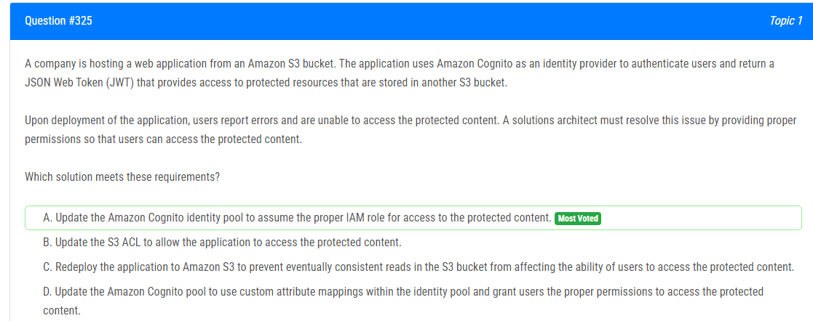

해설:

정답 A.

Amazon Cognito를 사용하여 사용자를 인증하고 JWT를 제공하는 경우, 해당 사용자에게 액세스 권한을 부여할 수 있도록 적절한 IAM 역할을 가정해야 합니다.
IAM 역할을 통해 사용자는 보호된 콘텐츠에 대한 액세스를 할 수 있으며, 이를 통해 인증 및 권한 부여 메커니즘이 통합됩니다.
이 방법을 사용하면 사용자는 인증 후 보호된 콘텐츠에 대한 액세스를 신속하게 얻을 수 있습니다.

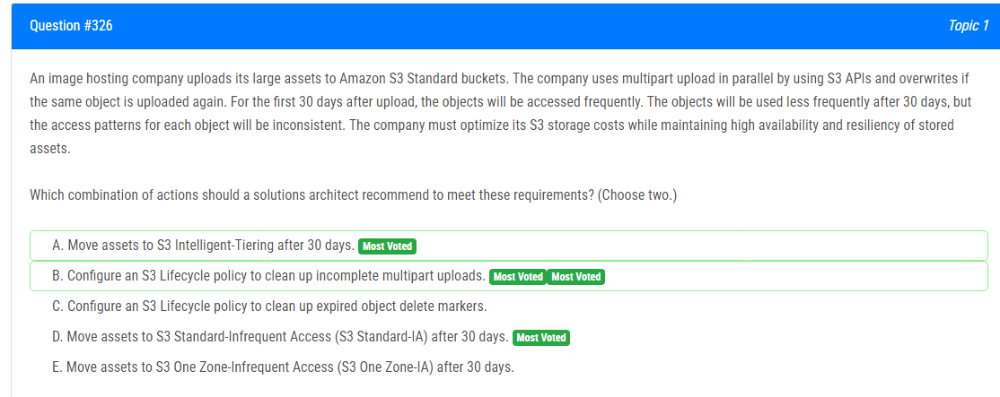

해설:

정답 A, B.

A. 30일 이후에 S3 Intelligent-Tiering으로 자산을 이동합니다.

S3 Intelligent-Tiering은 자주 액세스되는 객체에 대한 비용을 최적화하기 위해 사용될 수 있습니다. 초기 30일 동안 자주 액세스되는 객체를 유지하고, 그 이후에는 액세스 패턴이 불규칙하게 될 수 있으므로 S3 Intelligent-Tiering을 사용하여 비용을 절감할 수 있습니다.

B. S3 수명주기 정책을 구성하여 불완전한 멀티파트 업로드를 정리합니다.

불완전한 멀티파트 업로드를 정리함으로써 불필요한 공간을 절약할 수 있습니다. 이는 비용을 절감하는데 도움이 됩니다.

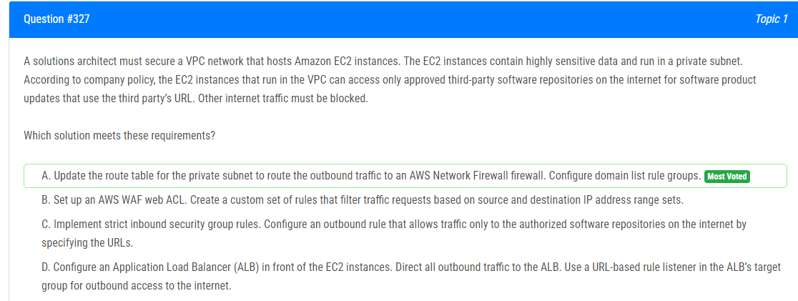

해설:

정답 A.

AWS Network Firewall은 고급 방화벽 서비스로서, 네트워크 트래픽을 검사하고 필터링하여 보안을 강화할 수 있습니다.
도메인 목록 규칙 그룹을 구성하여 특정 URL 또는 도메인만 허용하도록 설정할 수 있습니다. 이는 허가된 서드파티 소프트웨어 저장소에 대한 액세스만 허용하고 다른 인터넷 트래픽은 차단할 수 있습니다.
이 방법을 사용하면 VPC 내의 EC2 인스턴스가 허가된 URL을 통해 소프트웨어 업데이트를 받을 수 있지만, 다른 인터넷 트래픽은 차단되어 보안이 강화됩니다.

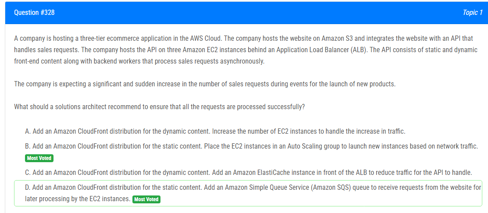

해설:

정답 D.

Amazon SQS를 사용하여 웹 사이트에서의 요청을 대기열로 보내면 요청이 안정적으로 처리되고 처리량을 조절할 수 있습니다. 이는 서버의 과부하를 방지하고 대량의 요청을 처리하기에 적합합니다.
정적 콘텐츠에 대한 Amazon CloudFront 배포를 추가하여 웹 사이트의 로딩 시간을 최적화하고 사용자 경험을 향상시킬 수 있습니다.
Auto Scaling은 네트워크 트래픽에 따라 EC2 인스턴스를 자동으로 확장하지만, 이러한 급격한 트래픽 증가에 대응하기에는 대기 시간이 소요될 수 있습니다. Amazon SQS를 사용하면 효율적으로 대규모 트래픽을 처리할 수 있습니다.

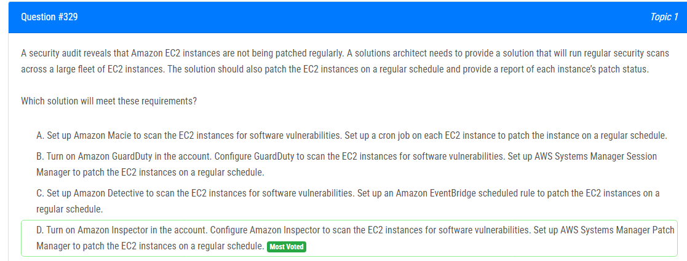

해설:

정답 D.

Amazon Inspector는 EC2 인스턴스의 소프트웨어 취약점을 자동으로 검사하는 서비스입니다. 따라서 정기적인 보안 스캔을 위한 이상적인 도구입니다.
AWS Systems Manager Patch Manager는 EC2 인스턴스에 대한 패치 관리를 자동화하는 서비스입니다. 이를 사용하여 정기적으로 보안 패치를 적용할 수 있습니다.
이러한 조합은 EC2 인스턴스의 보안을 유지하고 관리하기 위한 효과적인 솔루션을 제공합니다.

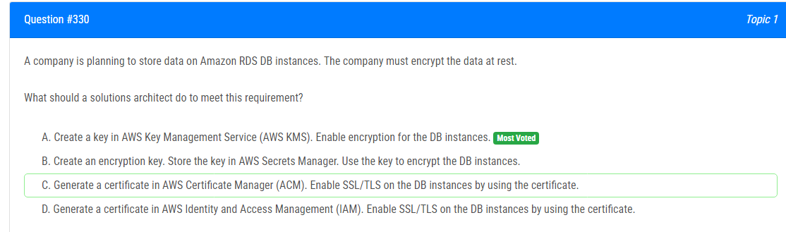

해설:

정답 A.

Amazon RDS에서 데이터를 암호화하려면 AWS KMS를 사용하여 키를 생성하고 이를 사용하여 데이터를 암호화해야 합니다.
AWS KMS는 데이터를 안전하게 암호화하고 관리할 수 있는 완전 관리형 서비스입니다.
RDS 인스턴스를 생성할 때 암호화 옵션을 선택하고 해당 인스턴스에 대해 사용할 AWS KMS 키를 지정하여 데이터를 암호화할 수 있습니다.

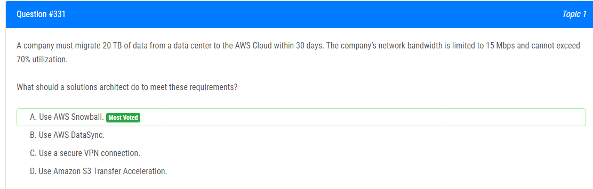

해설:

정답 A.

대량의 데이터 이동: AWS Snowball은 대량의 데이터를 오프라인으로 전송할 수 있습니다. 이는 네트워크 대역폭을 사용하지 않으며, 이동 중에 네트워크 대역폭에 의존하지 않습니다.

빠른 속도: AWS Snowball은 대량의 데이터를 빠르게 전송할 수 있습니다. 데이터 이동 속도는 특정 요구 사항에 따라 다르지만, 일반적으로 네트워크 전송 속도보다 빠릅니다.

네트워크 대역폭 제한: 네트워크 대역폭이 제한되어 있고, 사용량이 70%를 넘지 못하는 경우, AWS Snowball은 네트워크 대역폭을 사용하지 않으므로 제한 사항에 영향을 주지 않습니다.

시간 제한: 30일 안에 20 TB의 데이터를 이동해야 하므로, 네트워크 대역폭을 통한 전송으로는 시간이 부족할 수 있습니다. AWS Snowball을 사용하면 빠르고 안정적으로 데이터를 이동할 수 있습니다.

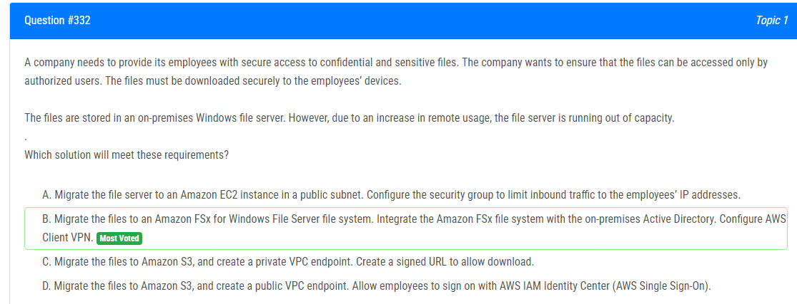

해설:

정답 B.

Amazon FSx for Windows File Server: 이 솔루션은 온프레미스 Windows 파일 서버에서 AWS로의 파일 마이그레이션을 허용합니다. 이는 기존 인프라를 클라우드로 확장할 수 있게 합니다.

Active Directory 통합: Amazon FSx는 온프레미스 Active Directory와 통합하여 사용자 인증 및 권한 관리를 쉽게 할 수 있습니다. 이는 회사의 기존 인증 및 권한 관리 시스템과의 호환성을 보장합니다.

AWS Client VPN: AWS Client VPN을 사용하여 직원들이 안전하고 보안된 방법으로 파일에 접근할 수 있습니다. 이는 외부에서 내부 리소스에 대한 접속을 안전하게 관리합니다.

안전한 다운로드: 클라우드 기반의 파일 시스템에서 파일을 다운로드하는 과정은 보안적으로 안전한 방식으로 이루어질 수 있습니다.

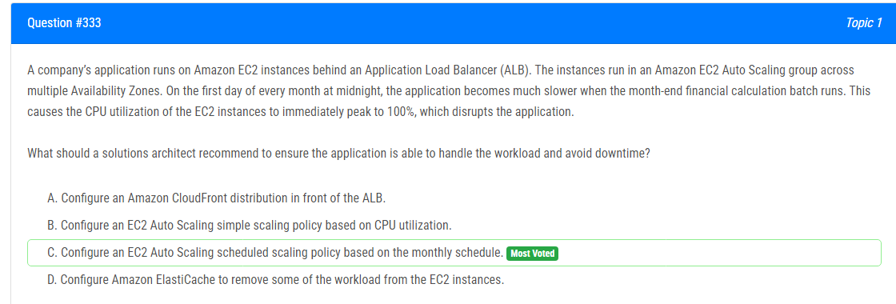

해설:

정답 C.

월말 재무 계산 일에 대비하여 EC2 Auto Scaling 스케줄링 정책을 구성하여 자동으로 인스턴스 수를 조정할 수 있기 때문입니다. 매월 첫째 날 자정에 애플리케이션의 부하가 증가하고 CPU 사용률이 100%로 증가하므로 이러한 예측 가능한 부하 변동에 대응하기 위해 스케줄링 정책을 사용하는 것이 바람직합니다. 이렇게 하면 매월 첫째 날 자정에 자동으로 인스턴스 수가 증가하여 워크로드를 처리할 수 있습니다.
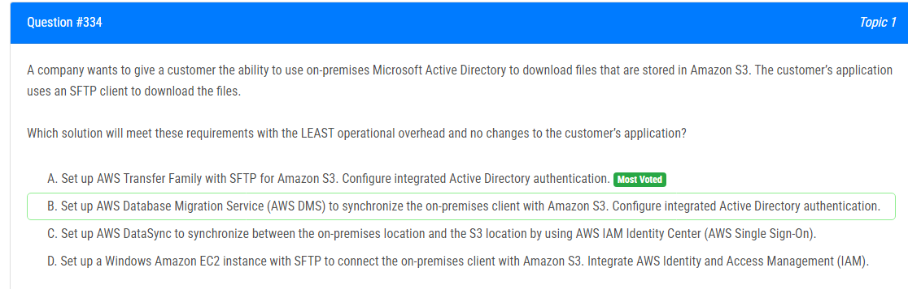

해설:

정답 A.

AWS Transfer Family with SFTP for Amazon S3: 이 솔루션은 SFTP 클라이언트가 Amazon S3에 저장된 파일에 접근할 수 있도록 합니다. 이는 고객의 애플리케이션에 변경을 요구하지 않고, 기존의 SFTP 클라이언트를 계속 사용할 수 있도록 합니다.

통합된 Active Directory 인증: AWS Transfer Family는 통합된 Active Directory 인증을 지원합니다. 이는 고객이 기존의 온프레미스 Microsoft Active Directory를 사용하여 인증할 수 있음을 의미합니다.

운영 오버헤드 최소화: AWS Transfer Family를 사용하면 관리 및 운영 오버헤드를 최소화할 수 있습니다. 완전 관리형 서비스이므로 AWS가 백그라운드에서 서비스를 관리하고 유지보수를 수행합니다.

고객 애플리케이션 변경 없음: 고객의 애플리케이션에 변경을 요구하지 않고도 원하는 작업을 수행할 수 있습니다. 즉, 기존의 SFTP 클라이언트를 그대로 사용할 수 있습니다.

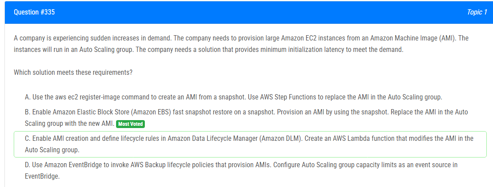

해설:

정답 B.

Amazon Elastic Block Store (EBS) 빠른 스냅샷 복원: 이 옵션은 스냅샷을 빠르게 복원하여 AMI를 프로비저닝하는 데 유용합니다. 이는 초기화 지연 시간을 최소화하여 요구 사항을 충족하는 데 도움이 됩니다.

Auto Scaling 그룹에서 AMI 교체: 새로운 AMI로 Auto Scaling 그룹의 AMI를 교체함으로써 대규모 EC2 인스턴스를 프로비저닝할 수 있습니다. 이것은 확장 가능성과 빠른 대응성을 제공하여 요구 사항을 충족하는 데 도움이 됩니다.

요구 사항 충족을 위한 최적화된 솔루션: 이 솔루션은 초기화 지연 시간을 최소화하여 급증하는 수요를 충족하는 데 필요한 것입니다. 또한 Auto Scaling 그룹을 사용하여 수요에 따라 인스턴스를 동적으로 조정할 수 있습니다.

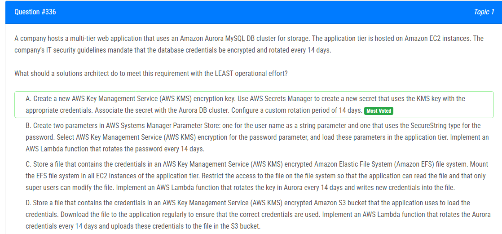

해설:

정답 A.

AWS Secrets Manager 사용: AWS Secrets Manager는 민감한 정보를 안전하게 저장하고 관리할 수 있는 서비스입니다. 이를 사용하여 데이터베이스 자격 증명을 저장하면 자격 증명이 암호화되고 안전하게 보호됩니다.

AWS KMS 키 사용: AWS KMS는 암호화 키를 생성, 관리 및 제어할 수 있는 서비스입니다. 새로운 KMS 암호화 키를 생성하여 이를 사용하여 자격 증명을 암호화하면 데이터 보안이 강화됩니다.

자격 증명 회전 설정: AWS Secrets Manager를 사용하여 14일마다 자동으로 자격 증명을 회전시킬 수 있습니다. 이는 보안 정책을 준수하는 데 필요한 자격 증명 회전을 자동화하므로 운영 오버헤드를 최소화할 수 있습니다.

운영 오버헤드 최소화: AWS Secrets Manager를 사용하면 자격 증명의 암호화, 보호 및 회전을 쉽게 수행할 수 있습니다. 따라서 운영 오버헤드가 최소화됩니다.

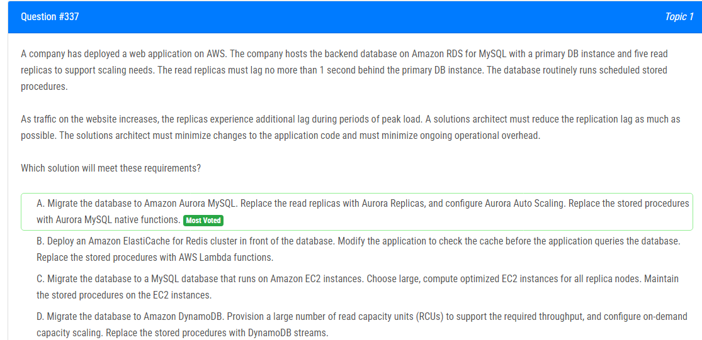

해설:

정답 A.

Amazon Aurora MySQL으로의 마이그레이션: Amazon Aurora는 높은 성능과 가용성을 제공하는 관리형 관계형 데이터베이스 서비스입니다. MySQL과의 호환성을 유지하면서도 향상된 성능과 확장성을 제공합니다.

Aurora Replicas 및 Aurora Auto Scaling 사용: Aurora Replicas는 Amazon Aurora의 읽기 전용 복제본입니다. Aurora Auto Scaling은 읽기 전용 인스턴스의 수를 자동으로 조정하여 트래픽 증가에 대응할 수 있습니다.

Stored Procedures 대신 Aurora MySQL 네이티브 함수 사용: Aurora MySQL은 MySQL과 호환되는 네이티브 함수를 제공하므로 기존의 Stored Procedures를 이를 사용하여 대체할 수 있습니다. 이는 Aurora의 성능을 최적화하고 레플리케이션 지연을 줄이는 데 도움이 됩니다.

최소한의 애플리케이션 코드 변경 및 운영 오버헤드 최소화: Aurora로의 마이그레이션은 기존 애플리케이션 코드 변경을 최소화하면서도 데이터베이스 성능을 향상시키는 데 도움이 됩니다. 또한 Aurora Auto Scaling을 사용하여 읽기 전용 인스턴스를 자동으로 확장하므로 운영 오버헤드도 최소화됩니다.

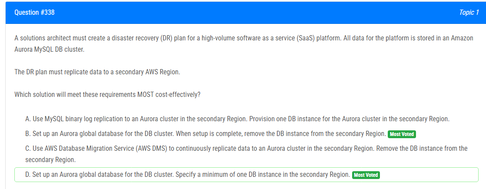

해설:

정답 B.

Aurora Global Database 설정: Aurora Global Database는 다중 AWS 리전 간에 데이터를 자동으로 복제하여 고가용성과 내구성을 제공하는 기능입니다. 이를 활용하여 데이터를 보다 신속하고 안전하게 다른 리전으로 복제할 수 있습니다.

비용 효율적: Aurora Global Database를 사용하면 데이터를 자동으로 복제하므로 별도의 데이터 복제 메커니즘이나 리소스를 프로비저닝할 필요가 없습니다. 이는 비용을 절감하는 데 도움이 됩니다.

최소한의 구성: Aurora Global Database를 설정하는 것은 간단하며, 추가적인 리전 내 DB 인스턴스나 복제 구성을 설정할 필요가 없습니다. 따라서 운영 및 유지 관리의 복잡성을 줄이고, 비용을 최소화할 수 있습니다.

고가용성 및 내구성 보장: Aurora Global Database는 다중 리전 간 데이터 복제를 지원하여, 주요 리전에서의 장애나 문제 발생 시에도 데이터의 가용성과 내구성을 보장합니다.

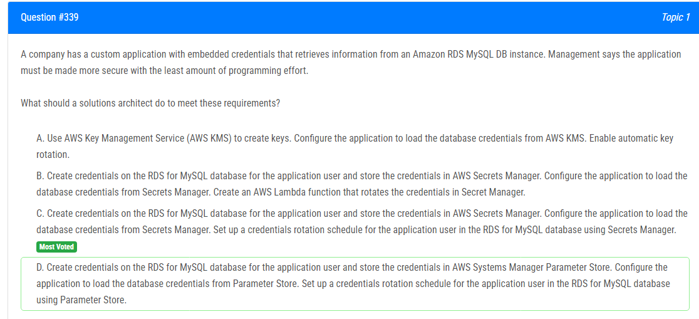

해설:

정답 C.

AWS Secrets Manager 사용: AWS Secrets Manager는 민감한 정보를 안전하게 저장하고 관리하는 데 사용되는 서비스입니다. 애플리케이션에서 AWS Secrets Manager를 사용하여 RDS MySQL 데이터베이스 자격 증명을 안전하게 저장할 수 있습니다.

자격 증명 회전 설정: AWS Secrets Manager를 사용하여 RDS MySQL 데이터베이스 자격 증명의 회전을 설정할 수 있습니다. 이를 통해 자격 증명의 보안을 유지하면서도 보안 정책을 준수할 수 있습니다.

프로그래밍 노력 최소화: AWS Secrets Manager를 사용하면 애플리케이션 코드를 거의 변경하지 않고도 데이터베이스 자격 증명을 관리하고 회전할 수 있습니다. 이는 프로그래밍 노력을 최소화하는 데 도움이 됩니다.

보안 향상: AWS Secrets Manager는 자격 증명을 안전하게 저장하고 암호화하여 보안을 향상시킵니다. 또한 자격 증명의 회전을 통해 보안을 강화할 수 있습니다.

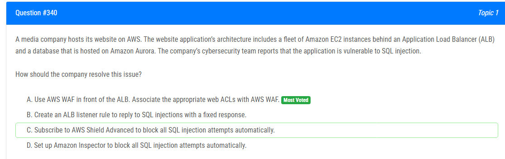

해설:

정답 A.

AWS WAF (Web Application Firewall) 사용: AWS WAF는 웹 애플리케이션에 대한 보안을 강화하는 데 사용되는 서비스로, 애플리케이션의 공격에 대한 보호를 제공합니다. SQL 인젝션과 같은 공격을 감지하고 차단할 수 있습니다.

적절한 웹 ACL (웹 애플리케이션 방화벽 정책) 연결: 웹 ACL은 특정 유형의 공격을 감지하고 차단하기 위한 규칙 세트를 제공합니다. 적절한 웹 ACL을 AWS WAF와 연결하여 SQL 인젝션과 같은 공격을 탐지하고 차단할 수 있습니다.

ALB 앞에 AWS WAF 배치: Application Load Balancer (ALB) 앞에 AWS WAF를 배치함으로써 모든 애플리케이션 트래픽을 필터링할 수 있습니다. 이는 모든 인바운드 요청에 대한 보안을 강화하는 데 도움이 됩니다.

가장 쉬운 방법: SQL 인젝션과 같은 보안 취약점을 해결하는 가장 쉽고 효율적인 방법 중 하나는 AWS WAF를 사용하는 것입니다. 이를 통해 공격을 감지하고 차단할 수 있으며, 추가적인 개발 또는 구성 변경이 필요하지 않습니다.

