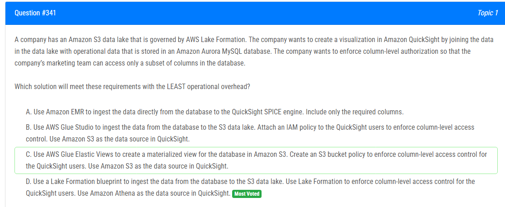

해설:

정답 D.

Lake Formation을 활용한 데이터 이동 및 보안: Lake Formation은 데이터 이동 및 보안을 쉽게 관리할 수 있는 AWS 서비스입니다. Lake Formation을 사용하여 Amazon S3 데이터 레이크로 데이터를 이동하고, 열 수준의 액세스 제어를 적용할 수 있습니다.

최소한의 운영 오버헤드: Lake Formation을 사용하면 데이터 이동 및 보안 설정을 간단하게 구성할 수 있습니다. 또한 Lake Formation의 블루프린트를 사용하여 Aurora MySQL 데이터베이스에서 데이터를 Amazon S3 데이터 레이크로 이동하는 것은 운영 오버헤드를 최소화하는 데 도움이 됩니다.

QuickSight와의 통합: Lake Formation을 통해 데이터를 Amazon S3 데이터 레이크로 이동하면, QuickSight에서 쉽게 데이터에 액세스할 수 있습니다. 또한 Lake Formation을 사용하여 열 수준의 액세스 제어를 적용하여 마케팅 팀이 필요한 열에만 액세스할 수 있도록 보안을 강화할 수 있습니다.

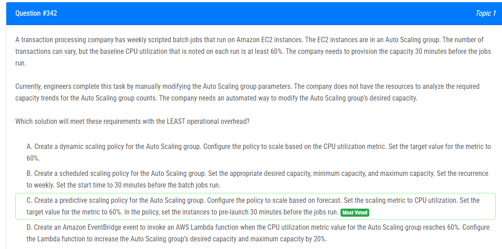

해설:

정답 C.

예측 스케일링 정책 사용: 예측 스케일링은 기존의 트래픽 패턴을 기반으로 향후 용량 요구를 예측합니다. 이는 요구 사항을 자동으로 파악하고 조정하는 데 효과적입니다.

CPU 사용률 메트릭 사용: CPU 사용률은 이러한 배치 작업에 매우 중요한 메트릭이므로 CPU 사용률에 따라 스케일링을 수행하는 것이 합리적입니다.

CPU 사용률 대상값 설정: 기본 CPU 사용률이 60%로 설정되어 있으므로 이 값을 대상으로 예측 스케일링 정책을 구성하여 해당 기간 동안 인스턴스 수를 예측적으로 조정합니다.

인스턴스 사전 실행 설정: 작업 실행 30분 전에 인스턴스를 사전 실행하여 필요한 처리 능력을 보장합니다.

운영 오버헤드 최소화: 예측 스케일링을 사용하면 자동으로 용량을 조정할 수 있으므로 운영 오버헤드가 최소화됩니다.

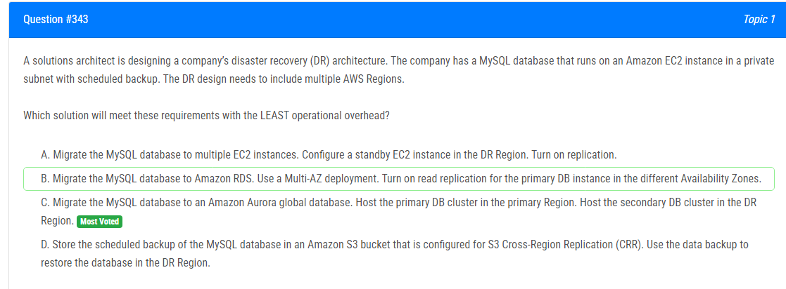

해설:

정답 C.

Amazon Aurora Global Database 사용: Amazon Aurora Global Database는 다중 리전 간에 데이터를 자동으로 복제하여 고가용성과 내구성을 제공합니다. 이를 통해 데이터베이스의 DR 요구 사항을 간단히 충족할 수 있습니다.

프라이머리 및 세컨더리 DB 클러스터: 프라이머리 DB 클러스터를 본래의 리전에 호스팅하고, 세컨더리 DB 클러스터를 DR 리전에 호스팅하여 데이터의 신속하고 안전한 복제를 보장합니다.

운영 오버헤드 최소화: Aurora Global Database를 사용하면 데이터베이스의 다중 리전 복제를 쉽게 설정할 수 있으며, 자동으로 관리되므로 운영 오버헤드가 최소화됩니다.

고가용성 및 내구성 보장: Aurora Global Database는 데이터의 다중 리전 복제를 지원하여, 주요 리전에서의 장애나 문제 발생 시에도 데이터의 가용성과 내구성을 보장합니다.

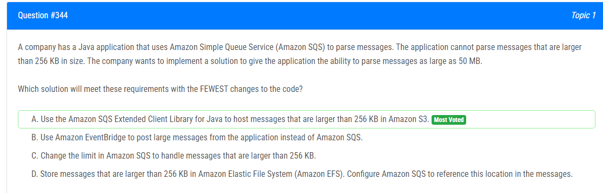

해설:

정답 A.

Amazon SQS Extended Client Library for Java 사용: 이 라이브러리는 Amazon SQS에 메시지를 저장할 때 크기 제한을 초과하는 메시지를 Amazon S3에 저장할 수 있게 해줍니다. 따라서 메시지의 크기를 256 KB에서 50 MB로 확장하는 데 필요한 변경 사항이 최소화됩니다.

기존 코드의 변경 최소화: 기존 Java 애플리케이션은 이미 Amazon SQS를 사용하고 있으며, Amazon SQS Extended Client Library를 사용하여 큰 메시지를 처리할 수 있도록 쉽게 업데이트할 수 있습니다. 이렇게 하면 기존 코드에 대한 변경이 최소화됩니다.

Amazon S3를 활용한 큰 메시지 저장: 큰 메시지를 Amazon S3에 저장함으로써 Amazon SQS의 메시지 크기 제한을 우회할 수 있습니다. 이는 대용량 메시지 처리를 가능케 하며, Amazon S3의 내구성과 확장성을 활용할 수 있습니다.

확장성 및 내구성 보장: Amazon S3는 대용량 데이터를 안전하게 저장하고 확장 가능한 서비스를 제공합니다. 따라서 애플리케이션이 대규모 데이터를 처리해야 하는 경우에도 신뢰할 수 있는 솔루션을 제공합니다.

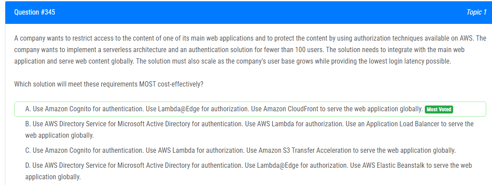

해설:

정답 A.

Amazon Cognito를 사용한 인증: Amazon Cognito는 서버리스 애플리케이션에 적합한 인증 및 사용자 관리 솔루션입니다. 최대 100명의 사용자를 처리하는 데 완벽하게 적합하며, 비용 효율적인 방법으로 인증을 처리할 수 있습니다.

Lambda@Edge를 사용한 인가: Lambda@Edge를 사용하여 클라이언트의 요청에 따라 인가를 수행할 수 있습니다. 이는 전 세계적으로 분산된 Amazon CloudFront 엣지 위치에서 실행되므로 저렴하면서도 로그인 지연 시간을 최소화할 수 있습니다.

Amazon CloudFront를 사용한 글로벌 서비스: Amazon CloudFront는 정적 및 동적 콘텐츠를 전 세계적으로 배포하기 위한 CDN(Content Delivery Network)입니다. CloudFront를 사용하여 웹 애플리케이션을 빠르고 안정적으로 제공할 수 있습니다.

비용 효율적인 서버리스 아키텍처: Amazon Cognito 및 Lambda@Edge는 사용량에 따라 비용이 청구되며, 최대 100명의 사용자를 처리하는 데는 매우 저렴합니다. 또한 서버리스 아키텍처를 사용하므로 관리 오버헤드도 최소화됩니다.

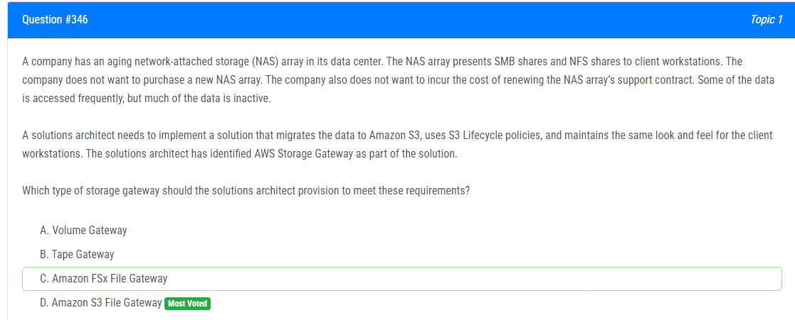

해설:

정답 D.

Amazon S3 파일 게이트웨이는 NAS 파일 공유를 Amazon S3로 연결하는데 사용됩니다. 이를 통해 클라이언트 워크스테이션은 여전히 SMB 및 NFS 프로토콜을 사용하여 데이터에 액세스할 수 있습니다. 이는 기존 NAS와 유사한 사용자 경험을 제공하며, 동시에 데이터를 Amazon S3로 이동하여 비용을 절감하고 스토리지 관리를 단순화합니다.

Amazon S3 파일 게이트웨이를 사용하면 데이터의 일부 또는 전체를 Amazon S3로 마이그레이션할 수 있습니다. 또한 S3 Lifecycle 정책을 사용하여 데이터를 자동으로 관리할 수 있습니다. 자주 액세스되는 데이터는 S3에 지속적으로 저장되고, 비활성 데이터는 자동으로 Amazon S3 Glacier 또는 S3 Glacier Deep Archive로 이동하여 비용을 절감할 수 있습니다.

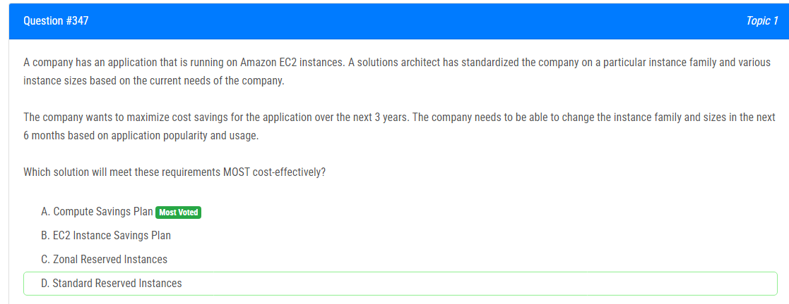

해설:

정답 A.

Compute Savings Plan은 예측 가능한 또는 예측할 수 없는 워크로드에 대한 온 디맨드 가격을 지불하는 대신 고정 할인을 제공합니다. 이는 예약 인스턴스와는 달리 특정 인스턴스 유형, 크기 또는 가용 영역에 바인딩되지 않으므로 유연성이 더 큽니다.

이 회사의 경우 애플리케이션의 인기 및 사용률이 변할 수 있다고 명시되어 있으므로, 인스턴스 패밀리 및 크기를 6개월마다 조정할 수 있는 유연성이 필요합니다. Compute Savings Plan은 이러한 변경 가능성을 고려하여 최대 3년 동안 예약을 보장합니다. 또한 향후 인스턴스 패밀리 및 크기 변경에 대한 유연성을 제공하여 비용을 최적화할 수 있습니다.

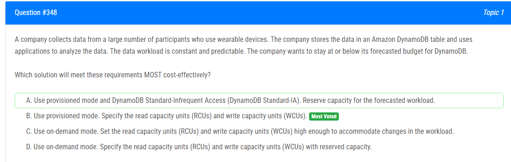

해설:

정답 B.

예측 가능한 워크로드: 문제에서는 데이터 워크로드가 "constant and predictable"하다고 명시되어 있습니다. 따라서 프로비저닝 모드를 사용하여 예측 가능한 워크로드에 대해 읽기 및 쓰기 용량 단위를 명시하는 것이 합리적입니다.

비용 효율성: 프로비저닝 모드는 온디맨드 모드보다 비용 효율적입니다. 예측 가능한 워크로드에 대해 예약된 용량 단위를 지정함으로써 비용을 관리할 수 있습니다.

예산 안정화: 프로비저닝 모드를 사용하여 읽기 및 쓰기 용량 단위를 명시함으로써 회사는 예산을 안정화시킬 수 있습니다. 예측된 워크로드를 기반으로 용량을 예약하여 예산을 초과하지 않도록 조절할 수 있습니다.

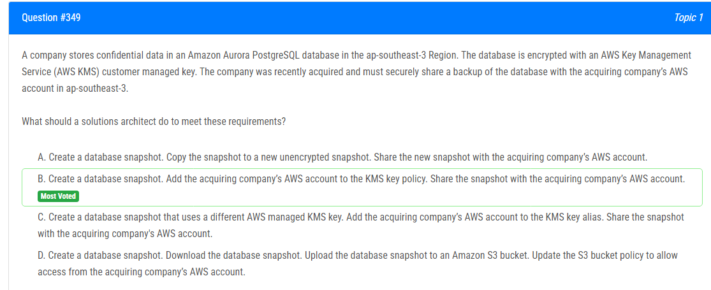

해설:

정답 B.

AWS KMS Customer Managed Key 사용: 데이터베이스가 AWS KMS 고객 관리 키(CMK)로 암호화되어 있습니다. 이는 고객이 직접 키를 관리하고 접근 권한을 제어할 수 있음을 의미합니다.

스냅샷 공유: 데이터베이스 스냅샷은 다른 AWS 계정과 공유할 수 있습니다. 스냅샷을 공유함으로써, 데이터베이스의 보안된 복사본을 취득한 회사의 AWS 계정으로 전송할 수 있습니다.

KMS 키 정책 업데이트: 데이터베이스 스냅샷에 접근할 수 있도록 하려면, 특정 AWS 계정에 대한 KMS 키 정책을 업데이트해야 합니다. 이를 통해 데이터베이스 스냅샷을 공유할 수 있습니다.

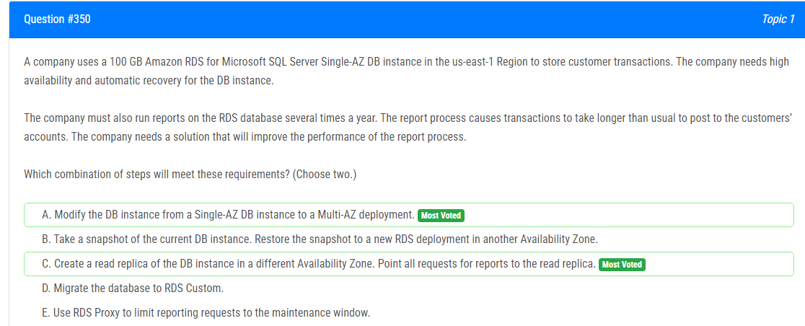

해설:

정답 A, C.

A. 단일 가용 영역(Single-AZ)에서 멀티 가용 영역(Multi-AZ)으로 변경: 이는 고가용성과 자동 복구를 제공합니다. 단일 가용 영역의 경우 장애가 발생할 경우 인스턴스가 다운될 수 있지만, 멀티 가용 영역에서는 다른 가용 영역에 자동 재생성됩니다. 이를 통해 RDS 인스턴스의 신뢰성과 가용성이 향상됩니다.

C. 다른 가용 영역에 읽기 전용 복제본 생성: 보고서 요청을 읽기 전용 복제본으로 보내면 주 DB 인스턴스의 부하를 줄일 수 있습니다. 주 DB 인스턴스는 주로 트랜잭션 처리를 담당하고, 읽기 전용 복제본은 보고서 작성 등의 읽기 작업을 처리합니다. 이를 통해 보고서 작성 작업이 주 트랜잭션에 영향을 미치는 것을 방지하고, 보고서 처리 성능을 향상시킬 수 있습니다.

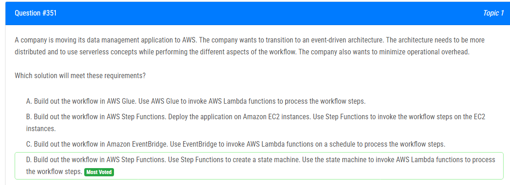

해설:

정답 D.

AWS Lambda 함수 호출: Step Functions 상태 머신을 사용하여 워크플로우의 각 단계에서 AWS Lambda 함수를 호출할 수 있습니다. 이는 서버리스 아키텍처를 활용하여 각 단계를 효율적으로 처리하고, 분산된 아키텍처를 달성할 수 있습니다.

최소한의 운영 오버헤드: Step Functions는 관리형 서비스이므로 사용자는 인프라 관리나 확장에 대해 걱정할 필요가 없습니다. 또한 AWS Lambda와의 통합을 통해 서버 관리 및 스케일링도 자동으로 처리됩니다. 이는 운영 오버헤드를 최소화하면서도 분산된 이벤트 기반 아키텍처를 구축하는 데 이상적입니다.

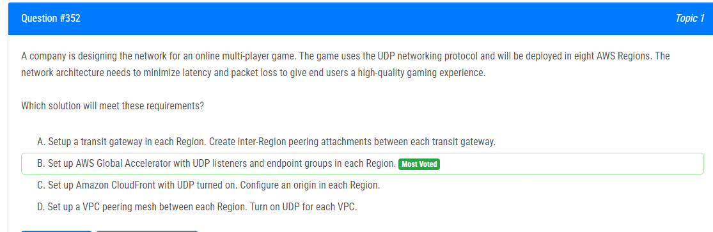

해설:

정답 B.

AWS Global Accelerator 설정: AWS Global Accelerator는 여러 AWS 리전에서 엔드포인트 그룹을 지원하며, 네트워크 트래픽을 최적 경로를 통해 사용자에게 빠르고 안정적으로 전달합니다. UDP 리스너 및 각 리전의 엔드포인트 그룹을 구성하여 멀티 플레이어 게임을 여러 리전에 배포할 때 높은 품질의 게임 경험을 제공할 수 있습니다.

지연 시간 및 패킷 손실 최소화: AWS Global Accelerator는 엔드 사용자와의 가장 가까운 AWS 엣지 위치를 자동으로 선택하여 지연 시간을 최소화하고 패킷 손실을 줄여줍니다. 또한 각 리전의 엔드포인트 그룹을 통해 게임 트래픽이 해당 리전으로 라우팅되므로, 지연 시간과 패킷 손실을 최소화하는 데 도움이 됩니다.

전역 배포: AWS Global Accelerator는 글로벌 배포를 지원하므로 게임을 여러 AWS 리전에 배포하더라도 사용자는 더 높은 품질의 게임 경험을 얻을 수 있습니다.

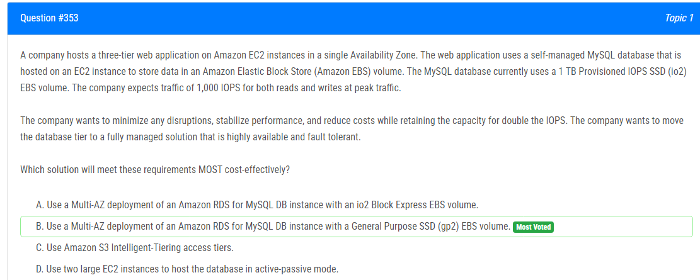

해설:

정답 B.

Amazon RDS for MySQL Multi-AZ 배포: Amazon RDS는 관리형 서비스로, 자동 백업, 복원, 장애 조치 및 확장을 지원하여 안정성과 가용성을 향상시킵니다. Multi-AZ 배포를 선택하면 주 데이터베이스와 스탠바이(복제본)가 서로 다른 가용 영역에 호스팅되어 장애 조치(Failover)가 자동으로 처리됩니다.

General Purpose SSD (gp2) EBS 볼륨 사용: gp2 EBS 볼륨은 비용 효율적인 옵션으로, 다양한 IOPS 요구 사항을 지원합니다. MySQL 데이터베이스의 경우, 1,000 IOPS의 예상 트래픽을 처리하기에 충분할 것으로 예상됩니다. 또한, gp2 볼륨은 자동으로 성능을 조절하여 요구 사항에 따라 적응할 수 있습니다.

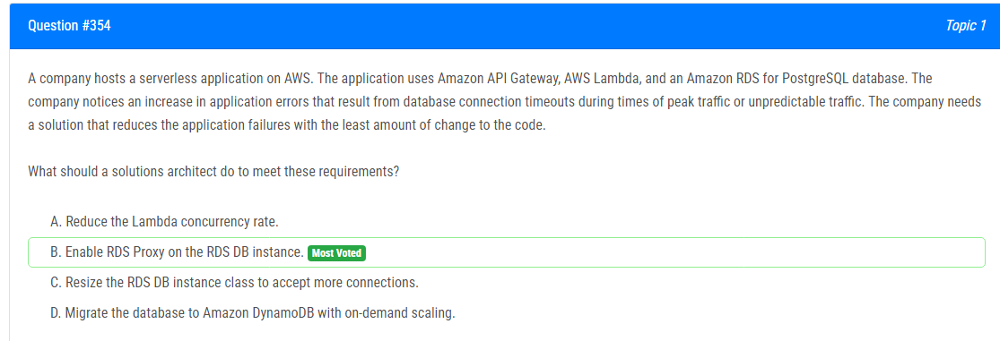

해설:

정답 B.

RDS Proxy를 활성화: RDS Proxy는 서버리스 응용 프로그램의 데이터베이스 연결 관리를 용이하게 합니다. RDS Proxy를 사용하면 Lambda 함수가 RDS 데이터베이스에 대한 효율적인 연결 관리를 자동으로 처리하고, 연결 풀링을 제공하여 연결 오버헤드를 줄입니다. 이는 응용 프로그램의 데이터베이스 연결 타임아웃 문제를 해결하는 데 도움이 됩니다.

Lambda 함수에서 RDS Proxy를 사용하도록 설정하는 것만으로도 코드 변경을 최소화하면서 데이터베이스 연결 관리를 개선할 수 있습니다. 이렇게 함으로써 응용 프로그램의 성능과 신뢰성이 향상됩니다.

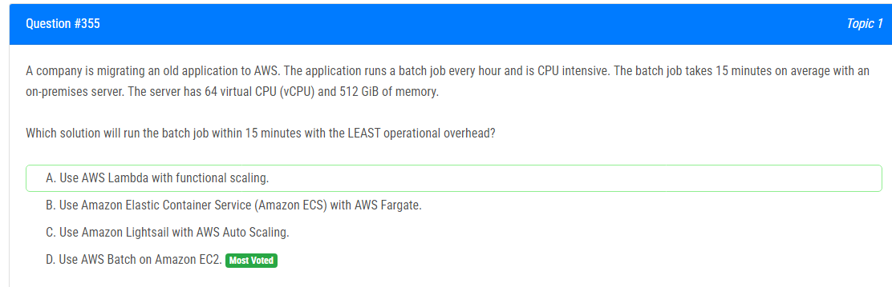

해설:

정답 D.

AWS Batch on Amazon EC2 사용: AWS Batch는 일괄 작업을 처리하기 위한 관리형 서비스로, 매우 CPU 집약적인 작업을 처리하는 데 적합합니다. Amazon EC2 인스턴스를 기반으로 하며, 사용자는 작업에 필요한 CPU 및 메모리 리소스를 정의할 수 있습니다.

최소한의 운영 오버헤드: AWS Batch는 관리형 서비스로, 작업을 실행하는 데 필요한 인프라 관리를 AWS가 자동으로 처리합니다. 사용자는 작업을 정의하고 요구 사항을 설정한 후에만 해당 작업을 실행하기만 하면 됩니다. 이는 운영 오버헤드를 최소화하는 데 도움이 됩니다.

Amazon EC2 인스턴스 활용: AWS Batch를 사용하여 매우 CPU 집약적인 작업을 처리할 때는 Amazon EC2 인스턴스를 활용할 수 있습니다. 이를 통해 이전의 64 vCPU와 512 GiB RAM을 갖춘 온프레미스 서버와 유사한 또는 더 높은 성능의 인스턴스를 선택하여 배치 작업을 처리할 수 있습니다.

해설:

정답 B.

30일 후에 데이터 객체를 S3 Standard-Infrequent Access (S3 Standard-IA)로 이동: S3 Standard-IA는 데이터를 자주 액세스하지 않는 경우에 적합한 옵션입니다. 데이터 객체가 30일 이상 액세스되지 않는다는 조건에 따라, 이러한 데이터를 S3 Standard-IA로 이동하여 저장 비용을 절감할 수 있습니다. 동시에 데이터에 대한 즉각적인 액세스와 높은 가용성 및 내구성이 유지됩니다.

저장 비용 절감: S3 Standard-IA는 S3 Standard와 비교하여 더 낮은 비용을 제공하며, 자주 액세스되지 않는 데이터에 대해 최적화되어 있습니다. 따라서, 데이터가 자주 액세스되지 않는 경우에는 S3 Standard-IA를 사용하여 저장 비용을 최소화할 수 있습니다.

동일한 고가용성 및 내구성: S3 Standard-IA는 S3 Standard와 동일한 고가용성 및 내구성을 제공합니다. 따라서 데이터 객체를 S3 Standard-IA로 이동하더라도, 이전에 보장되었던 고가용성과 내구성이 그대로 유지됩니다.

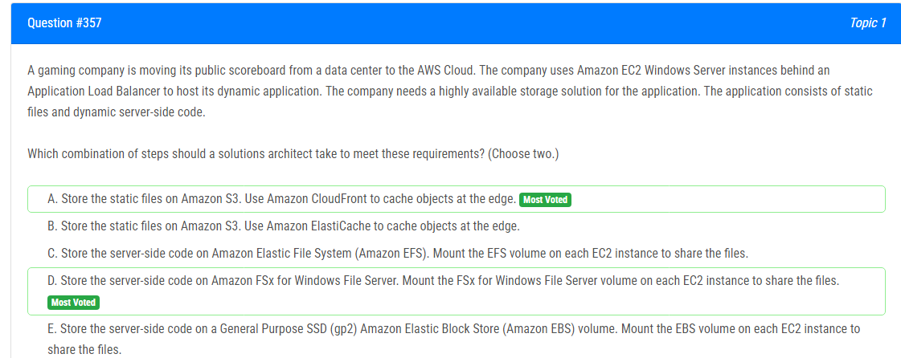

해설:

정답 A, D.

A. 정적 파일을 Amazon S3에 저장 및 Amazon CloudFront를 사용하여 에지 캐싱: 정적 파일을 Amazon S3에 저장하여 높은 내구성과 가용성을 제공할 수 있습니다. Amazon CloudFront를 사용하여 정적 파일을 에지 위치에 캐싱함으로써 사용자에게 빠른 액세스를 제공할 수 있습니다. 이는 정적 파일의 가용성과 성능을 향상시키는 데 도움이 됩니다.

D. 서버 측 코드를 Amazon FSx for Windows File Server에 저장 및 마운트: 서버 측 코드를 Amazon FSx for Windows File Server에 저장하고 각 EC2 인스턴스에 FSx 볼륨을 마운트하여 파일을 공유할 수 있습니다. FSx는 Windows 환경에서 파일 시스템을 제공하므로 Windows Server 인스턴스와 호환성이 높으며, 고가용성과 내구성을 제공합니다.

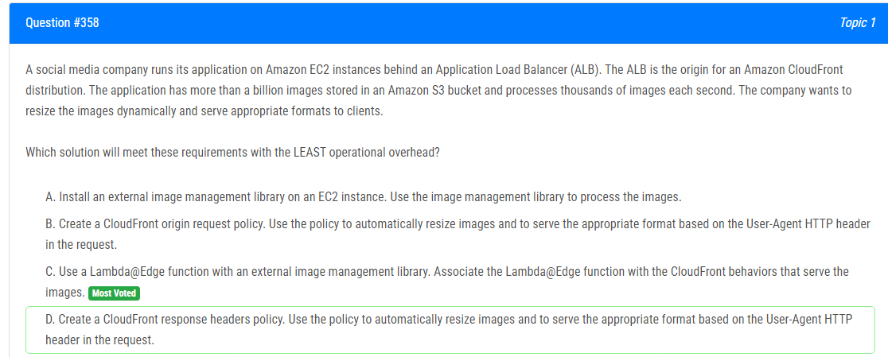

해설:

정답 C.

최소한의 운영 오버헤드: Lambda@Edge를 사용하면 서버를 프로비저닝하거나 관리할 필요가 없으므로 운영 오버헤드를 최소화할 수 있습니다. 또한 이미지 처리를 자동화하여 운영 및 유지 관리의 복잡성을 줄일 수 있습니다.

CloudFront와의 통합: Lambda@Edge 함수를 CloudFront 배포에 연결하여 이미지 처리를 필요로 하는 요청을 즉시 처리할 수 있습니다. 이를 통해 이미지 처리 및 전달 속도를 향상시키고 사용자 경험을 향상시킬 수 있습니다.

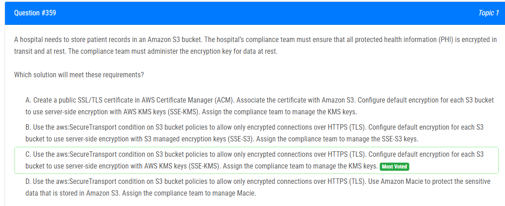

해설:

정답 C.

AWS KMS 키를 사용한 서버 측 암호화: Amazon S3의 각 버킷에 대해 기본 암호화를 설정하여 AWS KMS 키(SSE-KMS)를 사용하여 서버 측 암호화를 활성화합니다. 이를 통해 데이터가 안전하게 암호화되어 안전하게 저장됩니다.

암호화 키 관리: AWS KMS 키를 사용하여 데이터를 암호화하면, 해당 키를 사용하여 암호를 관리할 수 있습니다. 이 경우, 준수 팀이 암호화 키를 관리하고 제어할 수 있습니다.

SSL/TLS를 통한 데이터 전송 보안: S3 버킷 정책에서 aws:SecureTransport 조건을 사용하여 암호화된 연결을 요청하는 클라이언트에게만 액세스를 허용할 수 있습니다. 이를 통해 데이터가 안전하게 전송됩니다.

최적의 보안 및 준수: 이 솔루션은 데이터의 암호화를 보장하면서도 암호화 키를 효과적으로 관리하고 데이터 전송을 보호하여 준수 요구 사항을 완벽하게 충족시킵니다.

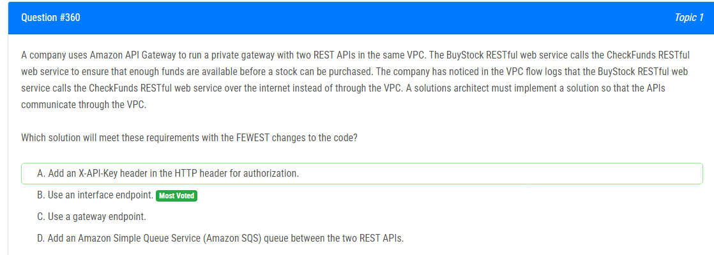

해설:

정답 B.

인터페이스 엔드포인트 사용: 인터페이스 엔드포인트를 사용하여 Amazon API Gateway에서 호스팅되는 REST API 간에 VPC 내에서 통신할 수 있습니다. 이를 통해 외부 인터넷을 통해 통신하는 것이 아니라 VPC 내에서 안전하게 통신할 수 있습니다.

