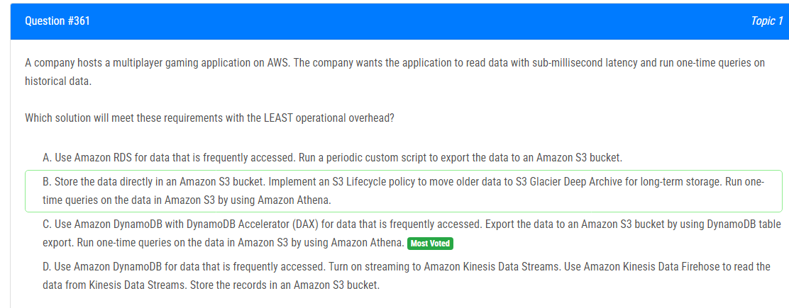

해설:

정답 C.

Amazon DynamoDB with DynamoDB Accelerator (DAX)는 데이터에 서브밀리초 레이턴시로 액세스하는 데 이상적입니다. 이것은 응용 프로그램이 빠르게 데이터에 액세스할 수 있게 해줍니다.
DynamoDB 테이블 내보내기를 통해 데이터를 주기적으로 Amazon S3 버킷으로 내보낼 수 있습니다. 이렇게 하면 데이터를 보관하고 필요할 때 Amazon Athena를 사용하여 일회성 쿼리를 실행할 수 있습니다.
이러한 솔루션은 AWS의 관리형 서비스를 활용하므로 운영 오버헤드가 상대적으로 적습니다. 특히 Amazon DynamoDB와 Amazon S3는 관리형 서비스이므로 데이터 관리 및 확장을 위한 작업이 크게 줄어듭니다.

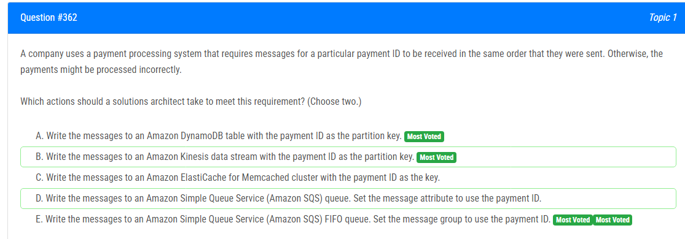

해설:

정답 B, E.

B. Amazon Kinesis 데이터 스트림에 메시지를 작성하면 파티션 키를 결정할 수 있습니다. 특정 결제 ID를 파티션 키로 사용하면 해당 결제 ID에 대한 메시지는 동일한 파티션으로 라우팅되어 순서가 보장됩니다.

E. Amazon SQS FIFO(Fist-In-First-Out) 큐를 사용하면 메시지를 보낸 순서대로 메시지가 처리됩니다. 메시지 그룹을 결제 ID로 설정하면 특정 결제 ID에 대한 메시지는 동일한 메시지 그룹으로 처리되어 순서가 보장됩니다.

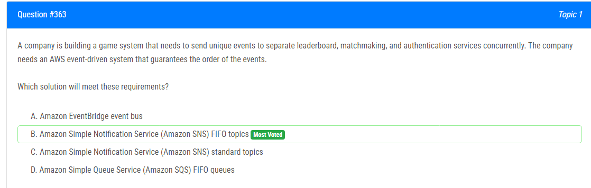

해설:

정답 B.

Amazon SNS FIFO(Fist-In-First-Out) 토픽을 사용하면 이벤트를 발행할 수 있습니다. 이는 각각의 고유한 이벤트를 서로 다른 리더보드, 매치메이킹 및 인증 서비스에 동시에 보낼 수 있게 해줍니다. FIFO 토픽을 사용하면 이벤트가 발생한 순서대로 메시지가 보장되므로 이벤트의 순서가 유지됩니다. 이는 이벤트가 각 서비스에서 정확한 순서로 처리되도록 보장합니다.

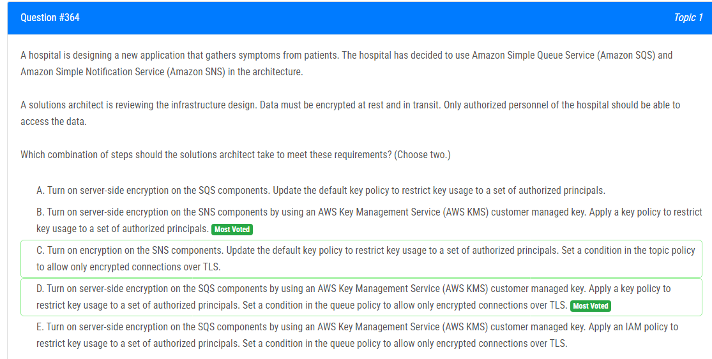

해설:

정답 B, D.

B. Amazon SNS 컴포넌트에 서버 측 암호화를 활성화하고 AWS Key Management Service (AWS KMS) 고객 관리 키를 사용하여 암호화를 수행합니다. 그런 다음 키 정책을 적용하여 키 사용을 허용하는 권한이 있는 사용자를 제한합니다.

D. Amazon SQS 컴포넌트에 서버 측 암호화를 활성화하고 AWS Key Management Service (AWS KMS) 고객 관리 키를 사용하여 암호화를 수행합니다. 그런 다음 키 정책을 적용하여 키 사용을 허용하는 권한이 있는 사용자를 제한하고, 큐 정책에서 암호화된 TLS 연결만 허용하도록 설정합니다.

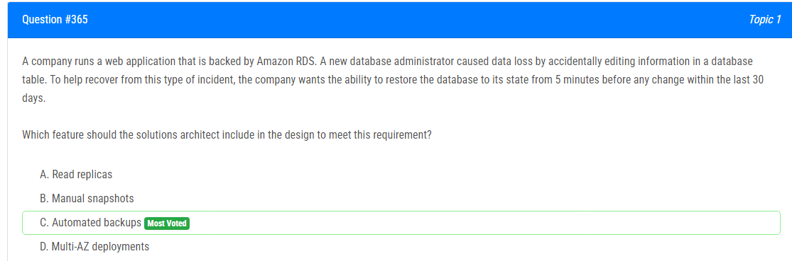

해설:

정답 C.

자동 백업: Amazon RDS의 자동 백업 기능을 사용하면 일정 간격으로 데이터베이스의 스냅샷이 생성됩니다. 이러한 스냅샷은 데이터 손실이 발생한 시점 이전의 데이터 상태를 복원하는 데 사용될 수 있습니다. 자동 백업은 주로 데이터베이스의 일관성과 지속성을 보장하기 위해 사용되며, 이 경우 30일 동안 5분 이전의 모든 변경 사항으로 데이터베이스를 복원할 수 있습니다. 따라서 이것은 데이터 손실 사고로부터 회복하는 데 필수적인 요소입니다.

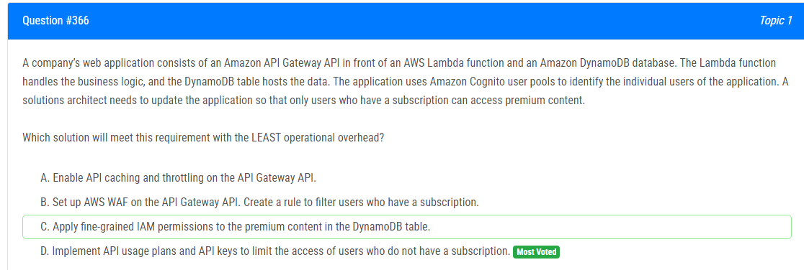

해설:

정답 D.

API 사용 계획과 API 키를 구현하면 사용자가 구독하지 않은 경우에만 액세스를 제한할 수 있습니다. 이것은 비구독자의 액세스를 제한하는 간단하고 효과적인 방법입니다. 사용자가 프리미엄 콘텐츠에 액세스하려면 구독을 구입해야 합니다. 이렇게 하면 애플리케이션 코드나 인프라를 변경할 필요 없이 구독자만이 프리미엄 콘텐츠에 액세스할 수 있습니다.

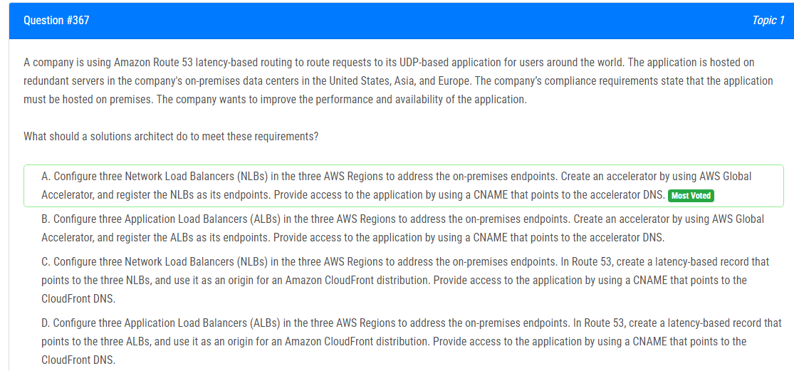

해설:

정답 A.

이 솔루션은 AWS Global Accelerator를 사용하여 전 세계 사용자에 대한 최적의 경로를 제공합니다. 각 지역의 Network Load Balancer(NLB)를 사용하여 온프레미스 엔드포인트를 대상으로 설정하고, 이를 Global Accelerator의 엔드포인트로 등록합니다. 그런 다음 사용자는 Global Accelerator DNS를 통해 CNAME을 사용하여 애플리케이션에 액세스할 수 있습니다. 이를 통해 성능과 가용성이 향상됩니다.

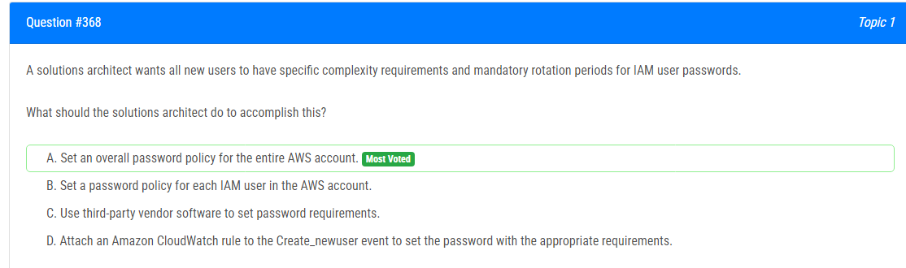

해설:

정답 A.

전체 AWS 계정에 대한 비밀번호 정책을 설정하면 새로운 사용자가 생성될 때 이 정책이 자동으로 적용됩니다. 이렇게 하면 모든 새로운 사용자가 특정 복잡성 요구 사항과 필수적인 로테이션 기간을 가진 비밀번호를 갖도록 강제할 수 있습니다. 이는 운영 오버헤드를 최소화하면서도 보안 요구 사항을 충족시키는 가장 효율적인 방법입니다

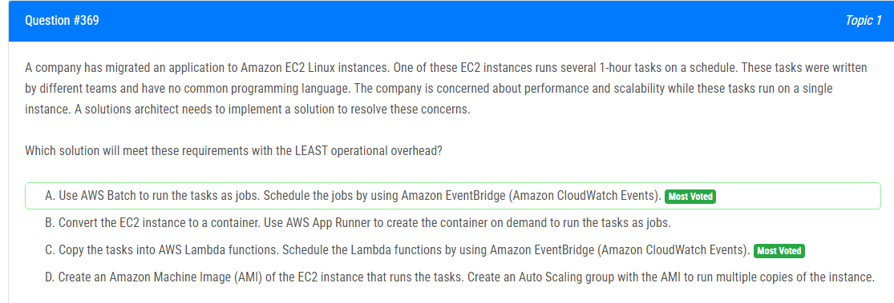

해설:

정답 A.

AWS Batch는 여러 작업을 효율적으로 실행하고 관리할 수 있는 완전 관리형 서비스입니다. Amazon EventBridge를 사용하여 작업을 스케줄링할 수 있으므로 여러 작업을 쉽게 관리할 수 있습니다. 이를 통해 성능과 확장성이 향상되며, 운영 오버헤드가 최소화됩니다.

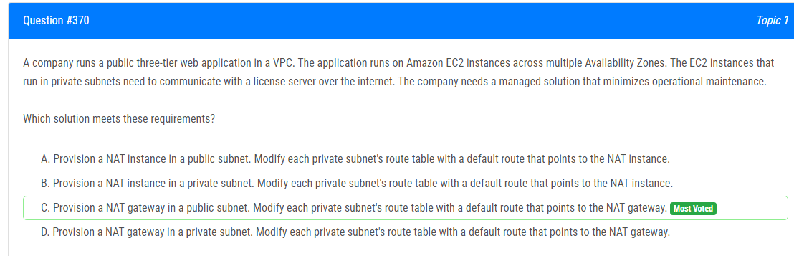

해설:

정답 C.

NAT 게이트웨이는 관리형 서비스로, 특별한 관리나 유지보수 없이 인터넷에 있는 리소스와의 통신을 안전하게 중계합니다. NAT 게이트웨이를 퍼블릭 서브넷에 프로비저닝한 후, 각 프라이빗 서브넷의 라우팅 테이블을 수정하여 디폴트 경로를 NAT 게이트웨이로 지정합니다. 이렇게 하면 프라이빗 서브넷 내의 EC2 인스턴스가 라이선스 서버와의 통신을 위해 인터넷을 통해 NAT 게이트웨이를 경유할 수 있습니다. 이 방법은 관리형 서비스이므로 운영 오버헤드가 적고, EC2 인스턴스와 라이선스 서버 간의 안전한 통신이 보장됩니다.

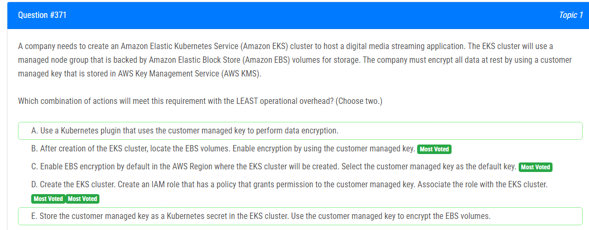

해설:

정답 C, D.

C. AWS KMS에서 고객 관리형 키를 생성하고, 해당 키를 EBS 암호화를 활성화할 때 사용할 기본 키로 지정합니다. 이렇게 하면 새로운 EBS 볼륨이 생성될 때마다 자동으로 해당 키로 암호화됩니다. 이렇게 함으로써 모든 EBS 볼륨이 데이터를 효과적으로 보호하고, 운영 오버헤드가 적습니다.

D. EKS 클러스터를 만든 후에는 해당 클러스터에 연결된 IAM 역할을 생성하여 해당 역할에 AWS KMS 키를 사용할 수 있는 권한을 부여합니다. 이를 통해 EKS 클러스터 내의 서비스 및 워크로드에서 해당 키를 사용하여 데이터를 암호화할 수 있습니다. 이 방법을 사용하면 운영 오버헤드를 최소화하면서 모든 서비스 및 워크로드에 암호화를 적용할 수 있습니다

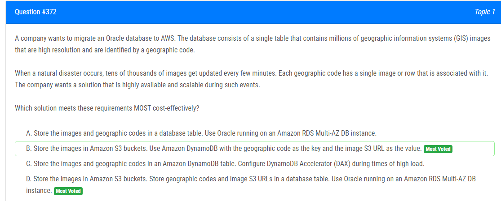

해설:

정답 B.

Amazon S3는 대용량 데이터를 저장하기에 이상적이며, 매우 높은 내구성을 제공합니다. GIS 이미지를 Amazon S3 버킷에 저장하고, 지리적 코드를 키로 사용하여 이미지의 S3 URL을 값으로 DynamoDB에 저장합니다. 이 방법은 비용 효율적이며 확장 가능합니다. 재난 발생 시에는 DynamoDB가 키-값 쌍을 빠르게 읽고 쓸 수 있으므로, 이러한 이벤트에 대비하여 높은 가용성과 확장성을 제공합니다.

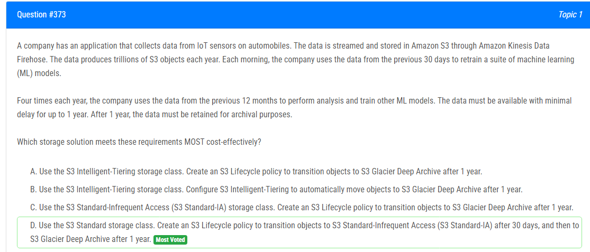

해설:

정답 D.

S3 Standard 스토리지 클래스를 사용하여 데이터를 저장합니다. 데이터를 S3 Standard-IA로 전환하는 S3 Lifecycle 정책을 30일 후에 적용하고, 1년 후에 S3 Glacier Deep Archive로 전환하는 정책을 적용합니다. 이 방법을 사용하면 데이터를 적시에 분석할 수 있으며, 데이터의 접근 빈도에 따라 비용을 절감할 수 있습니다. 또한 S3 Glacier Deep Archive는 저렴한 비용으로 장기 보존에 적합하므로 데이터의 보존 요구 사항을 충족시킬 수 있습니다.

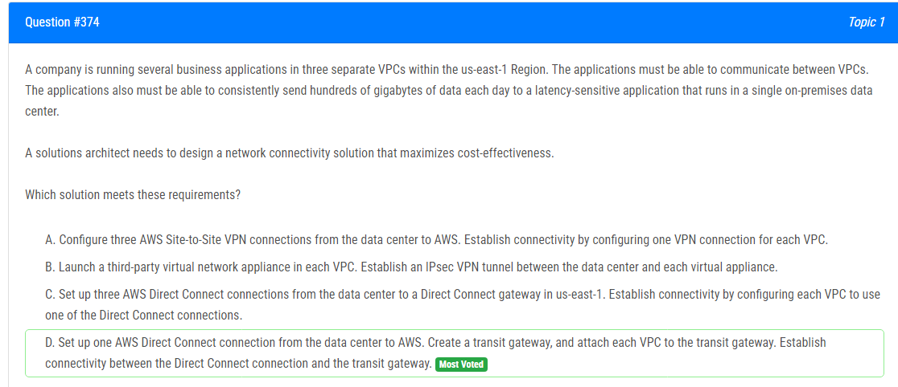

해설:

정답 D.

이 솔루션은 AWS Direct Connect와 AWS Transit Gateway를 사용하여 네트워크 연결성을 구성합니다. Direct Connect 연결을 통해 온프레미스 데이터 센터와 AWS 간에 안정적이고 빠른 연결이 설정됩니다. Transit Gateway는 여러 VPC 간의 통신을 쉽게 관리하고 확장할 수 있는 중앙 집중식 관리 도구로 사용됩니다. 이 방법을 사용하면 여러 VPC 간의 네트워크 통신을 효과적으로 구축하고 데이터 센터로부터의 대용량 데이터 전송을 처리할 수 있습니다. 또한, 네트워크 연결성을 관리하기 위해 하나의 Direct Connect 연결만 필요하므로 비용을 최소화할 수 있습니다.

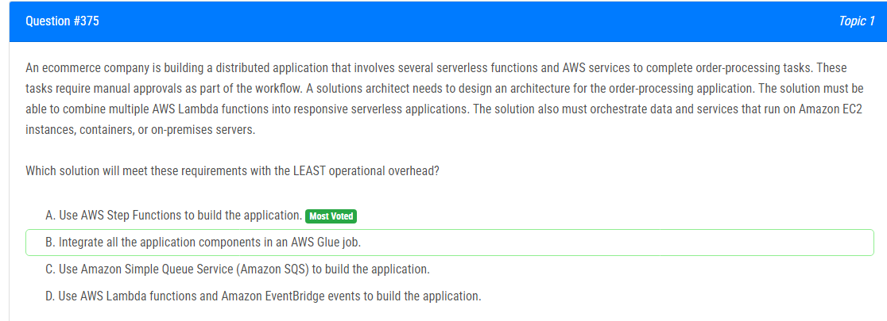

해설:

정답 A.

AWS Step Functions은 서버리스 애플리케이션을 구축하기 위한 효과적인 솔루션입니다. 여러 Lambda 함수를 조합하여 반응성 있는 서버리스 애플리케이션을 만들 수 있습니다. Step Functions은 각 단계에서 수행할 작업을 정의하고, 조건부 분기 및 반복과 같은 로직을 포함할 수 있습니다. 또한, EC2 인스턴스, 컨테이너, 또는 온프레미스 서버와 같은 다양한 환경에서 실행되는 데이터 및 서비스를 조율할 수 있습니다. 이를 통해 운영 오버헤드를 최소화하면서 복잡한 워크플로우를 구축할 수 있습니다.

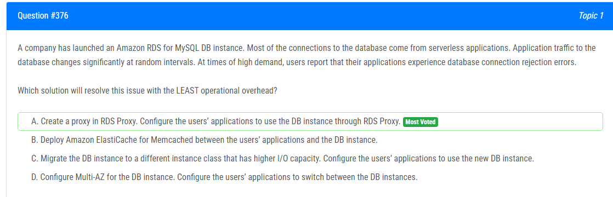

해설:

정답 A.

Amazon RDS Proxy를 생성하여 DB 인스턴스 앞에 프록시를 배치합니다. RDS Proxy를 사용하면 서버리스 애플리케이션과 같은 다중 애플리케이션에서의 데이터베이스 연결을 관리할 수 있습니다. RDS Proxy는 자동으로 커넥션 풀을 관리하고 스케일링이 필요할 때 자동으로 확장합니다. 따라서 애플리케이션 트래픽이 급격히 변동하는 경우에도 DB 인스턴스에서 발생할 수 있는 연결 거부 오류를 최소화할 수 있습니다.

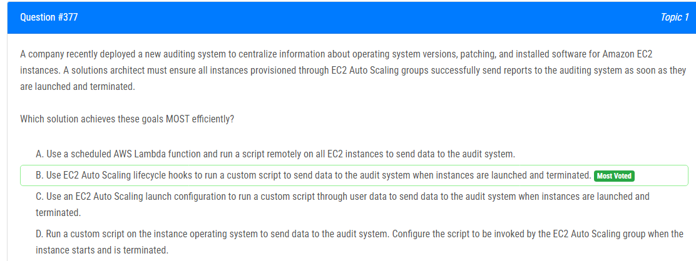

해설:

정답 B.

EC2 Auto Scaling Lifecycle 훅을 사용하여 EC2 인스턴스가 시작 및 종료될 때마다 사용자 정의 스크립트를 실행합니다. 이를 통해 EC2 Auto Scaling 그룹에서 인스턴스가 시작될 때마다 자동으로 오디팅 시스템으로 데이터를 보낼 수 있습니다. 또한 인스턴스가 종료될 때마다 필요한 작업을 수행할 수 있으므로 오디팅 데이터의 완전성을 보장할 수 있습니다. 이는 효율적이고 신뢰할 수 있는 방법입니다.

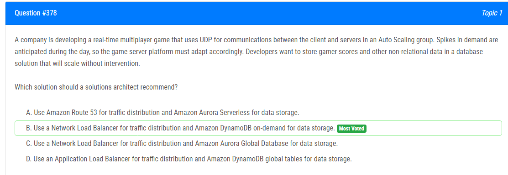

해설:

정답 B.

네트워크 로드 밸런서를 사용하여 트래픽 분산을 수행하고, 데이터 저장에는 Amazon DynamoDB의 온디맨드 용량을 사용합니다. 이러한 구성은 UDP 통신에 적합하며, 트래픽이 급격히 증가할 때 자동으로 조정됩니다. DynamoDB의 온디맨드 용량을 사용하면 읽기 및 쓰기 용량을 프로비저닝할 필요 없이 필요한 용량에 따라 자동으로 확장되므로, 운영자의 개입 없이 데이터베이스가 확장될 수 있습니다.

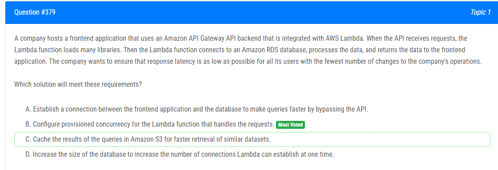

해설:

정답 B.

Lambda 함수에 프로비저닝된 동시성을 구성합니다. 프로비저닝된 동시성을 사용하면 Lambda 함수의 인스턴스를 미리 생성하여 요청을 처리하는 데 필요한 시간을 줄일 수 있습니다. 이는 함수가 라이브 상태로 유지되면서 초기화 및 실행에 소요되는 시간을 단축시켜 응답 지연을 최소화합니다. 또한, Lambda 함수가 자주 호출되는 경우에도 빠른 응답 시간을 보장할 수 있습니다. 이는 회사의 운영에 적은 변경이 필요하며 사용자 경험을 향상시킬 수 있는 효과적인 방법입니다.

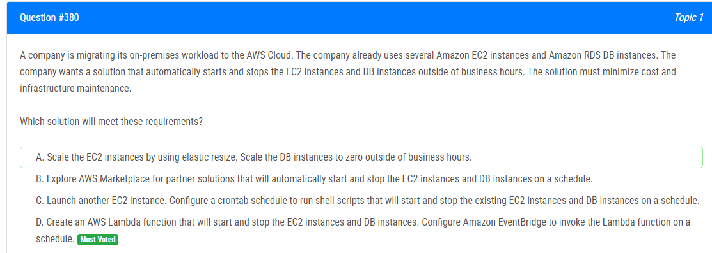

해설:

정답 D.

AWS Lambda 함수를 생성하여 EC2 인스턴스 및 DB 인스턴스를 시작 및 중지합니다. Amazon EventBridge를 사용하여 Lambda 함수를 정기적으로 스케줄링하면 비즈니스 시간 이외의 시간에 자동으로 인스턴스를 시작하고 중지할 수 있습니다. 이 솔루션은 비용과 인프라 유지 관리를 최소화하면서 요구 사항을 충족시키는데 가장 효율적입니다. 또한 AWS Lambda와 EventBridge는 관리가 간편하며 자동화가 용이하여 인프라 운영을 단순화할 수 있습니다.