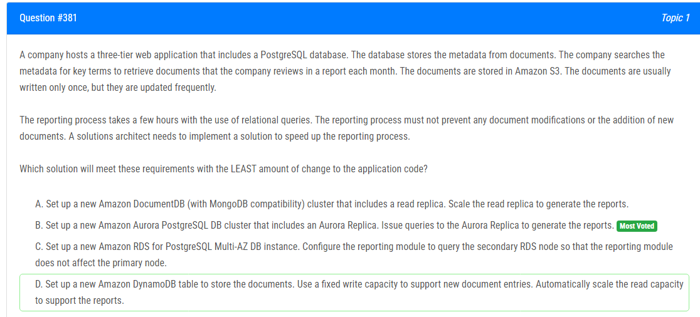

해설:

정답 B.

PostgreSQL 데이터베이스의 Aurora Replica를 활용하여 보고 과정을 가속화할 것을 제안합니다. Aurora는 RDS의 일종으로, PostgreSQL과 호환되는 관계형 데이터베이스입니다. Aurora는 데이터베이스 클러스터의 여러 인스턴스 간에 복제를 자동으로 관리하므로 읽기 전용 복제본을 생성하여 보고서 생성에 사용할 수 있습니다.

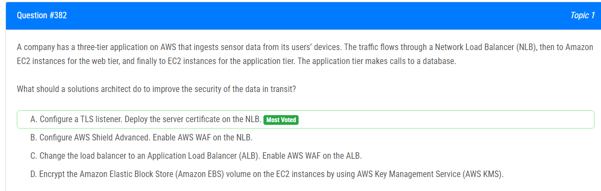

해설:

정답 A.

TLS (Transport Layer Security)를 사용하면 데이터가 전송되는 동안 암호화되므로 중간에서 데이터를 가로채더라도 데이터가 안전하게 유지됩니다. TLS를 구성하여 NLB에 배포된 서버 인증서를 사용하면 클라이언트와 NLB 간의 통신이 암호화됩니다. 이로써 외부에서 네트워크를 통해 데이터를 가로채는 것을 방지하고 데이터의 무결성을 보호할 수 있습니다.

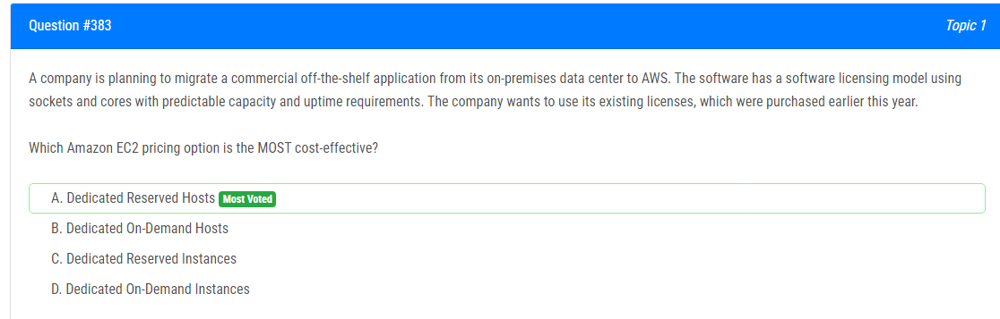

해설:

정답 A.

Dedicated Reserved Hosts (전용 예약 호스트)를 사용하여 가장 비용 효율적인 EC2 가격 옵션을 제안합니다.

전용 예약 호스트는 특정 수의 인스턴스 용량을 예약할 수 있으며, 해당 예약이 할당된 호스트에서 실행됩니다. 이 옵션은 기존의 라이선스 모델을 유지하면서 AWS로의 마이그레이션을 용이하게 합니다.

라이선스 모델이 소켓과 코어를 기반으로 하고 있으므로, 전용 호스트를 예약함으로써 기존 라이선스를 효과적으로 활용할 수 있습니다. 전용 호스트는 인스턴스 수에 관계없이 호스트 단위로 과금되므로, 어떤 호스트에 어떤 타입의 인스턴스를 실행하든지 상관없이 해당 호스트에 대한 예약이 유지됩니다. 이는 용량과 업타임 요구 사항을 예측 가능하게 하고 비용을 최적화할 수 있도록 도와줍니다.

따라서 기존 라이선스를 최대한 활용하며 비용을 절감하기 위해 전용 예약 호스트를 선택하는 것이 가장 현명한 선택입니다.

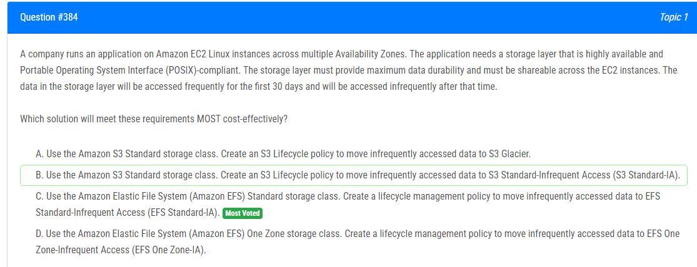

해설:

정답 C.

Amazon Elastic File System (Amazon EFS) 표준 스토리지 클래스를 사용하여 요구 사항을 가장 비용 효율적으로 충족시킬 것을 제안합니다.

Amazon EFS는 POSIX 호환성을 제공하며 여러 가용 영역에 걸쳐 자동으로 데이터를 복제하여 고가용성을 제공합니다. 또한 여러 EC2 인스턴스 간에 파일 시스템을 공유할 수 있어 요구 사항을 충족합니다.

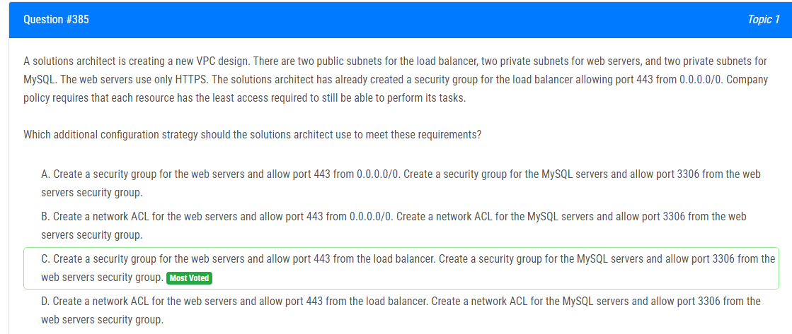

해설:

정답 C.

솔루션 아키텍트가 요구 사항을 충족시키기 위해 추가적인 구성 전략으로 사용해야 할 것을 제안합니다.

웹 서버에 대한 보안 그룹을 생성하고 443 포트를 로드 밸런서에서 허용하는 것은 HTTPS 트래픽이 로드 밸런서를 통해 웹 서버로 전달되도록 보장합니다. 이로써 웹 서버는 필요한 최소한의 액세스만을 가지게 됩니다.

또한 MySQL 서버에 대한 보안 그룹을 생성하고 3306 포트를 웹 서버의 보안 그룹에서 허용하는 것은 웹 서버가 MySQL 데이터베이스에 필요한 액세스만을 할 수 있도록 합니다. 이것은 각 리소스가 수행해야 하는 작업에 필요한 최소한의 액세스를 충족시키며, 보안을 유지할 수 있도록 도와줍니다.

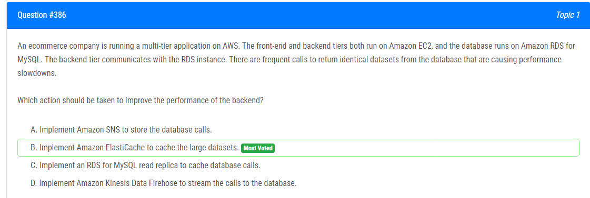

해설:

정답 B.

백엔드의 성능을 향상시키기 위해 대책으로 Amazon ElastiCache를 도입하는 것을 제안합니다.

Amazon ElastiCache는 메모리 내 캐시 서비스로, 대규모 데이터셋을 캐싱하여 데이터베이스 호출을 줄이고 응답 시간을 개선합니다. 빈번한 동일한 데이터셋 호출로 인한 성능 저하를 줄이기 위해 ElastiCache를 사용하여 백엔드에서 반환하는 데이터를 캐시할 수 있습니다.

이 옵션을 선택하면 데이터베이스 호출을 최소화하고 빠른 응답 시간을 유지할 수 있으므로 백엔드 성능이 향상됩니다.

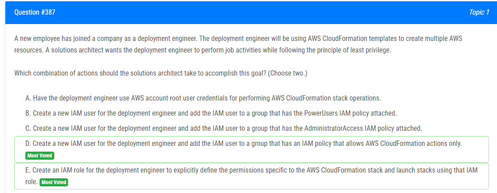

해설:

정답 D, E.

D. 배포 엔지니어를 위해 새 IAM 사용자를 생성하고 해당 IAM 사용자를 AWS CloudFormation 작업만 허용하는 IAM 정책이 부착된 그룹에 추가합니다. 이렇게 하면 배포 엔지니어가 다른 AWS 리소스에 대한 액세스 권한을 부여받지 않고도 CloudFormation 스택을 관리할 수 있습니다.

E. 배포 엔지니어를 위해 IAM 역할을 생성하고 해당 IAM 역할에 AWS CloudFormation 스택 및 관련 리소스에 대한 명시적인 권한을 정의합니다. 이러한 방법을 사용하면 배포 엔지니어가 필요한 리소스에만 액세스할 수 있도록 세밀하게 제어할 수 있습니다.

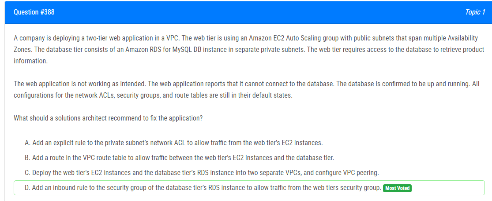

해설:

정답 D.

현재 문제의 원인은 웹 티어의 EC2 인스턴스가 데이터베이스 티어의 RDS 인스턴스에 연결할 수 없는 것입니다. 이는 보안 그룹이나 네트워크 ACL에 의해 차단될 수 있습니다.

보안 그룹은 EC2 인스턴스에 대한 인바운드 및 아웃바운드 트래픽을 제어하는 데 사용됩니다. 따라서 데이터베이스 티어의 RDS 인스턴스의 보안 그룹에 웹 티어의 EC2 인스턴스의 보안 그룹을 소스로 하는 인바운드 규칙을 추가하여 트래픽을 허용해야 합니다. 이렇게 하면 웹 티어의 EC2 인스턴스가 데이터베이스 티어의 RDS 인스턴스로의 연결을 허용합니다.

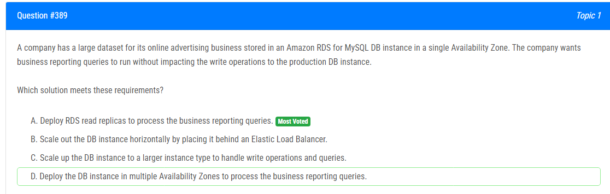

해설:

정답 A.

비즈니스 보고 쿼리를 실행할 때 프로덕션 DB 인스턴스의 쓰기 작업에 영향을 주지 않으면서 요구 사항을 충족하는 솔루션입니다.

RDS의 읽기 복제본을 배포하여 비즈니스 보고 쿼리를 처리하는 것이 가장 적절한 방법입니다. 읽기 복제본은 원본 DB 인스턴스의 읽기 전용 복사본으로, 읽기 작업을 분산하여 읽기 작업이 프로덕션 DB 인스턴스에 직접적으로 영향을 주지 않습니다.

이 방법을 사용하면 비즈니스 보고 쿼리에 대한 성능을 향상시킬 수 있고, 동시에 프로덕션 DB 인스턴스의 쓰기 작업에 영향을 최소화할 수 있습니다.

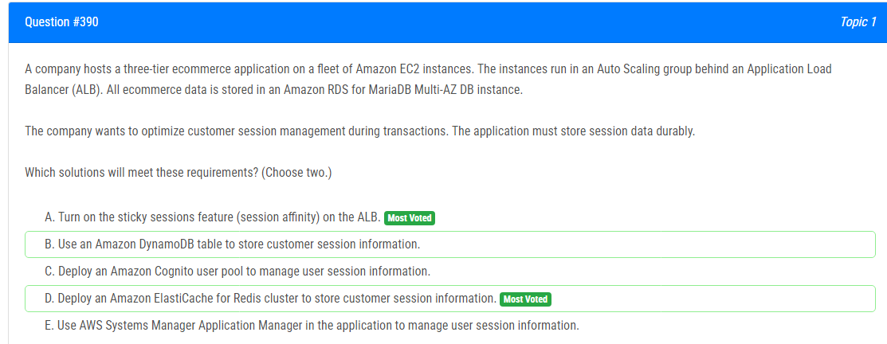

해설:

정답 A, D.

A. ALB의 sticky sessions 기능 (세션 어피니티)을 사용하면 클라이언트의 연결을 특정 인스턴스에 고정시킬 수 있습니다. 이는 특정 클라이언트의 모든 요청이 동일한 인스턴스로 라우팅되어 세션 상태를 유지할 수 있도록 도와줍니다. 따라서 거래 중에 고객 세션 관리를 최적화할 수 있습니다.

D. Amazon ElastiCache for Redis 클러스터를 사용하여 고객 세션 정보를 저장할 수 있습니다. Redis는 메모리 기반의 캐시 및 데이터 구조 저장소로 사용되며, 빠른 읽기 및 쓰기 작업을 제공합니다. 이를 통해 세션 데이터를 지속적으로 유지할 수 있습니다.

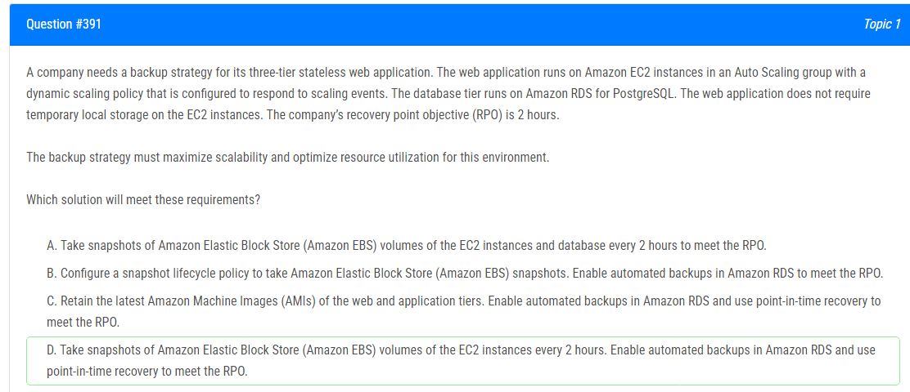

해설:

정답 C.

AMI를 사용하여 웹 및 응용 프로그램 계층의 최신 상태를 유지합니다. 이를 통해 EC2 인스턴스를 쉽게 재구성할 수 있으며, 이는 확장성을 극대화하고 자원 활용을 최적화하는 데 도움이 됩니다.
Amazon RDS의 자동 백업을 활성화하여 데이터베이스의 일관성을 유지하고, 시간대 복구를 사용하여 RPO를 충족합니다. 이를 통해 데이터베이스의 복구 시간을 최소화하고 비즈니스 요구 사항을 충족하는 데 도움이 됩니다.

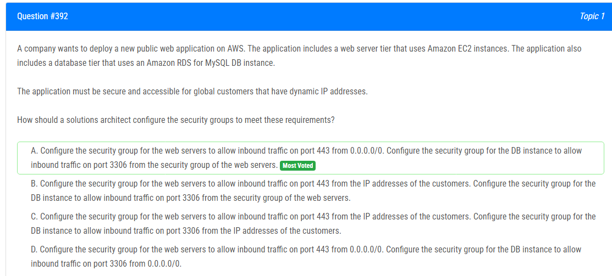

해설:

정답 A.

웹 서버의 보안 그룹을 구성하여 0.0.0.0/0에서 포트 443로의 인바운드 트래픽을 허용합니다. 이렇게 함으로써 전 세계의 모든 고객이 웹 애플리케이션에 접속할 수 있습니다. 또한 DB 인스턴스의 보안 그룹을 구성하여 웹 서버의 보안 그룹에서의 인바운드 트래픽을 허용하고, 이를 통해 웹 서버가 DB에 연결할 수 있습니다. 이 방법을 사용하면 DB에 대한 액세스를 제한하여 보안을 유지할 수 있습니다.

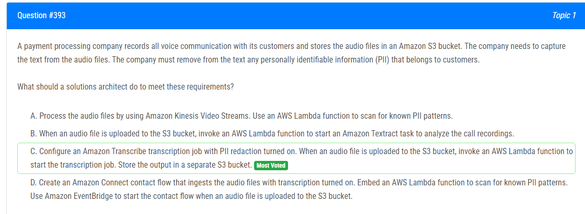

해설:

정답 C.

Amazon Transcribe은 오디오 파일에서 텍스트를 추출하여 자동으로 변환하는 서비스입니다. PII 레드액션(PII Redaction)은 Amazon Transcribe에서 제공하는 기능 중 하나로, PII를 자동으로 감지하고 마스킹 처리할 수 있습니다. 따라서 Amazon Transcribe을 구성하여 PII 레드액션을 사용하여 텍스트를 추출하고, S3 버킷에 오디오 파일이 업로드될 때마다 이를 트리거하여 Transcribe 전사 작업을 시작하는 AWS Lambda 함수를 호출합니다. 그 결과를 별도의 S3 버킷에 저장하여 PII가 마스킹된 텍스트를 안전하게 보관할 수 있습니다.

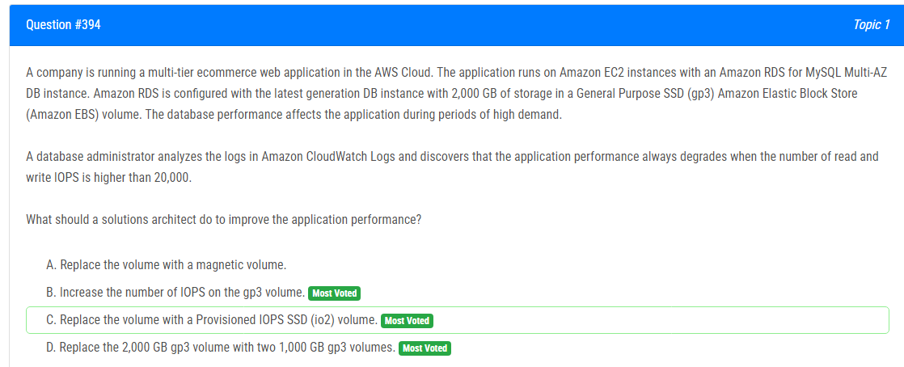

해설:

정답 D.

응용 프로그램 성능이 항상 읽기 및 쓰기 IOPS가 20,000을 초과할 때 저하되는 것으로 나타났습니다. 이러한 경우 기본적으로 Amazon RDS의 스토리지 볼륨은 특정 IOPS 제한이 있을 수 있습니다. 따라서 스토리지 용량을 하나가 아닌 두 개의 볼륨으로 분할하면 IOPS 용량이 두 배가 되므로 응용 프로그램에 필요한 더 많은 IOPS를 제공할 수 있습니다. 이로써 응용 프로그램의 성능을 향상시킬 수 있습니다.

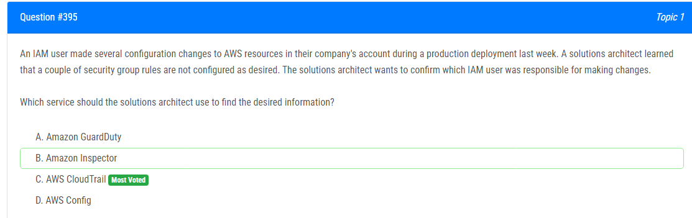

해설:

정답 C.

AWS CloudTrail은 AWS 계정의 활동을 모니터링하고 로깅하는 서비스입니다. 이를 통해 계정 내에서 발생하는 모든 API 호출과 관련된 이벤트를 기록할 수 있습니다. 따라서 IAM 사용자가 AWS 리소스에 대한 구성 변경을 수행한 경우 CloudTrail을 통해 해당 활동을 추적하고 확인할 수 있습니다.

따라서 CloudTrail을 사용하여 변경 내용을 확인하는 것이 가장 적절한 방법입니다. CloudTrail은 AWS 리소스에 대한 변경 이벤트를 자세히 기록하므로 해당 IAM 사용자를 식별할 수 있습니다.

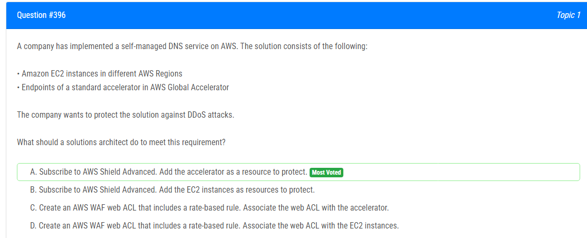

해설:

정답 A.

AWS Shield Advanced를 구독하여 DDoS(분산 서비스 거부) 공격으로부터 솔루션을 보호합니다. AWS Shield Advanced는 고급 DDoS 방어 서비스로, 대규모 및 복잡한 DDoS 공격에 대응하기 위한 고급 기능을 제공합니다. AWS Global Accelerator를 보호하려면 AWS Shield Advanced를 구독한 후 가속기를 보호할 수 있습니다. 이렇게 함으로써 솔루션을 DDoS 공격으로부터 효과적으로 보호할 수 있습니다.

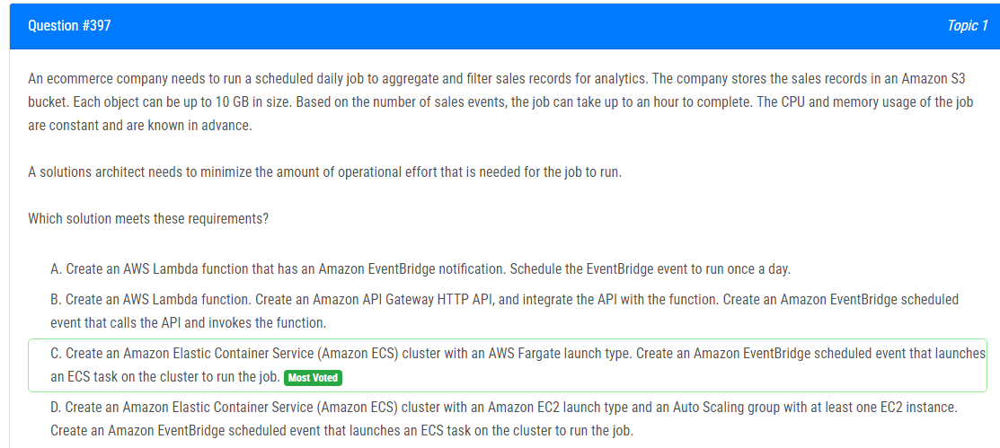

해설:

정답 C.

Amazon ECS 클러스터를 생성하고 AWS Fargate 실행 유형을 사용하여 작업을 실행합니다. 이렇게 하면 EC2 인스턴스를 관리할 필요가 없으므로 운영적인 노력을 최소화할 수 있습니다. Amazon EventBridge 예약 이벤트를 설정하여 일일 작업을 트리거하고 ECS 작업을 클러스터에서 실행할 수 있습니다. 이 방법을 사용하면 일일 작업을 쉽게 관리하고 필요한 리소스를 효율적으로 사용할 수 있습니다.

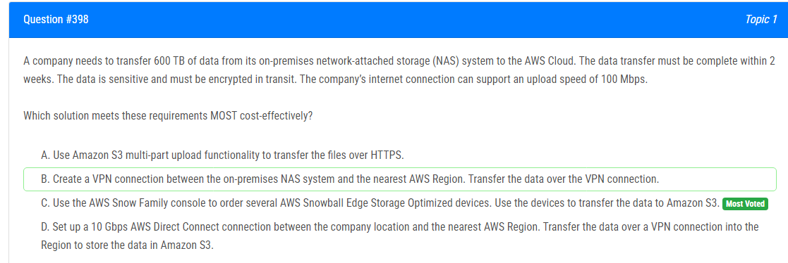

해설:

정답 C.

AWS Snow Family를 사용하여 여러 개의 AWS Snowball Edge Storage Optimized 장치를 주문하여 데이터를 Amazon S3로 전송합니다. Snowball Edge는 대량의 데이터를 안전하게 전송하는 데 이상적인 솔루션입니다. 이 장치는 대용량 데이터를 저장하고 AWS로 안전하게 이동할 수 있습니다. 또한 데이터 전송이 안전하게 암호화되므로 데이터의 보안도 보장됩니다.

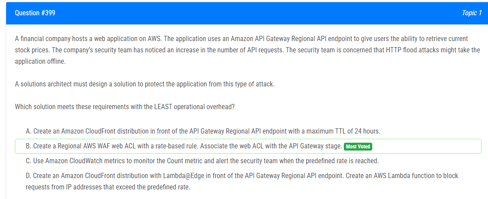

해설:

정답 B.

Regional AWS WAF 웹 ACL을 생성하여 레이트 기반 규칙을 설정합니다. 이렇게 하면 API Gateway 스테이지에 웹 ACL을 연결하여 HTTP flood와 같은 공격을 탐지하고 차단할 수 있습니다. AWS WAF를 사용하여 공격을 감지하고 차단하는 것은 운영 오버헤드를 최소화하면서도 안전하고 효과적인 방법입니다. AWS WAF는 관리 및 설정이 간편하며 실시간으로 공격을 탐지하여 적절한 조치를 취할 수 있습니다.

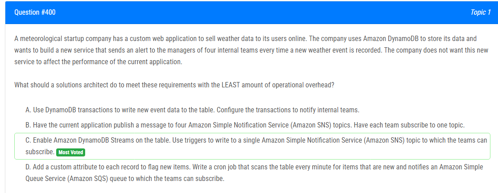

해설:

정답 C.

Amazon DynamoDB 테이블에 Amazon DynamoDB Streams를 활성화합니다. DynamoDB Streams를 사용하여 새 이벤트가 기록될 때마다 이를 감지할 수 있습니다. 이벤트가 발생할 때마다 트리거를 사용하여 Amazon SNS 주제에 메시지를 게시할 수 있습니다. 내부 팀은 이 SNS 주제에 구독하여 새로운 날씨 이벤트에 대한 알림을 받을 수 있습니다.

이 방법은 DynamoDB의 기능을 활용하여 실시간으로 새로운 이벤트를 감지하고, DynamoDB의 트리거를 사용하여 이를 처리하는 데 필요한 작업을 최소화합니다. 또한 Amazon SNS를 사용하여 각 팀이 구독하여 새로운 이벤트에 대한 알림을 쉽게 받을 수 있습니다. 다른 옵션들보다 더 적은 운영 오버헤드를 갖으며 요구 사항을 충족하는 방법입니다.

