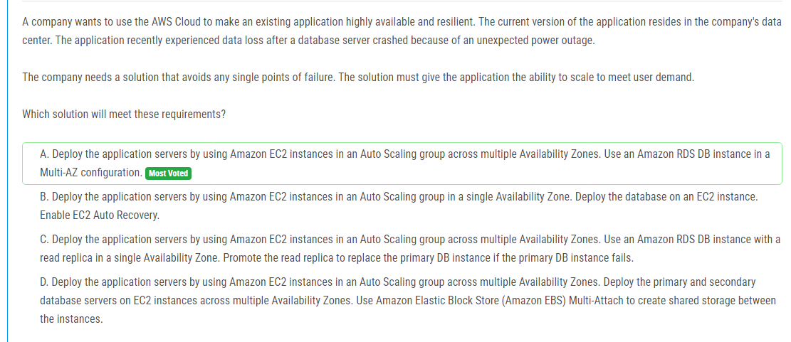

해설:

정답 A.

다중 가용 영역(Availability Zones)을 활용: 애플리케이션 서버를 여러 가용 영역에 걸쳐 Amazon EC2 인스턴스로 배포하여 단일 가용 영역의 장애에도 애플리케이션이 가용성을 유지할 수 있습니다.

Amazon RDS Multi-AZ 구성 사용: Amazon RDS 데이터베이스를 Multi-AZ 구성으로 설정하면 주 데이터베이스와 동기화된 복제본이 다른 가용 영역에 자동으로 생성됩니다. 이는 데이터베이스 서버의 단일 가용 영역 장애에도 데이터 손실이나 서비스 중단 없이 애플리케이션이 계속 작동할 수 있도록 보장합니다.

자동 확장 그룹(Auto Scaling group) 활용: Auto Scaling을 사용하여 애플리케이션 서버를 자동으로 확장하고 축소함으로써 사용자 수요에 따라 자원을 동적으로 조정할 수 있습니다. 이는 사용자 수요가 증가하거나 감소할 때 애플리케이션이 유연하게 대응할 수 있도록 합니다.

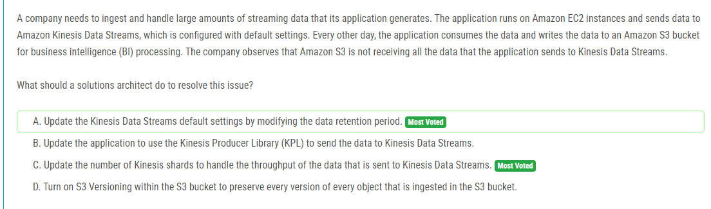

해설:

정답 A.

Amazon Kinesis Data Streams의 기본 설정에서는 데이터 보존 기간이 설정되어 있습니다. 이 기간 동안에만 데이터가 스트림에 유지됩니다. 그러나 문제 설명에 따르면 매일 데이터를 처리하는 동안 Amazon S3가 모든 데이터를 받지 못한다는 것을 관찰했습니다. 이는 아마도 데이터가 스트림에서 너무 빨리 삭제되어 S3로 전송되지 못한 것일 수 있습니다.

따라서 데이터가 S3로 제대로 이동되지 않는 문제를 해결하기 위해서는 Kinesis Data Streams의 기본 설정 중 하나인 데이터 보존 기간을 업데이트하여 스트림에서 데이터를 더 오랫동안 유지하도록 설정해야 합니다. 이렇게 하면 S3로의 데이터 전송이 완료될 때까지 충분한 시간이 확보되어 데이터 유실을 방지할 수 있습니다.

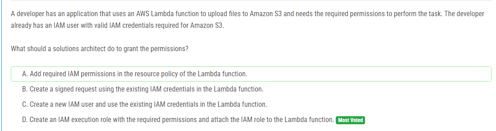

해설:

정답 D.

AWS Lambda 함수가 다른 AWS 서비스(예: Amazon S3)에 액세스해야 할 때는 IAM 역할을 사용하여 필요한 권한을 부여하는 것이 권장됩니다. 이러한 IAM 역할은 AWS 리소스에 대한 권한을 안전하게 제공하며 Lambda 함수를 실행할 때 필요한 권한을 제어합니다.

따라서, 개발자가 Lambda 함수를 사용하여 Amazon S3에 파일을 업로드해야 할 때는 다음 단계를 수행해야 합니다:

필요한 권한을 포함하는 IAM 실행 역할(IAM execution role) 생성: AWS Management Console 또는 AWS CLI를 사용하여 Lambda 함수가 필요로 하는 Amazon S3 작업(예: s3:PutObject)과 같은 필요한 권한을 가진 IAM 실행 역할을 생성합니다.

Lambda 함수에 IAM 실행 역할 할당: Lambda 콘솔 또는 AWS CLI를 사용하여 Lambda 함수에 위에서 생성한 IAM 실행 역할을 할당합니다. 이를 통해 Lambda 함수가 실행될 때 해당 역할의 권한을 이용하여 S3에 업로드를 수행할 수 있습니다.

이렇게 함으로써 Lambda 함수는 IAM 사용자의 보안 자격 증명을 사용하지 않고도 필요한 권한을 가진 역할을 통해 안전하게 S3에 액세스할 수 있습니다.

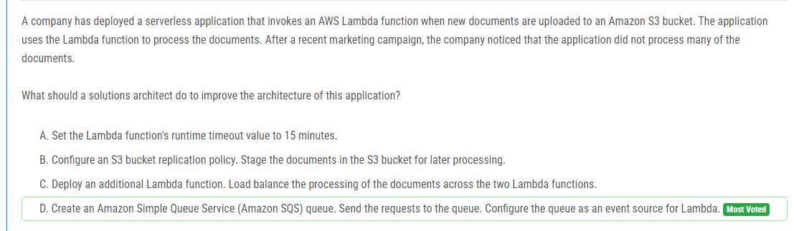

해설:

정답 D.

Amazon SQS 큐 생성: Amazon Simple Queue Service (SQS)를 사용하여 Lambda 함수가 처리해야 할 요청을 대기시킬 수 있는 큐를 생성합니다. 이 큐는 Lambda 함수가 처리할 수 있는 처리량을 초과하는 요청을 처리하기 위해 사용됩니다.

Lambda 함수 구성: Lambda 함수를 구성하여 SQS 큐를 이벤트 소스로 사용하도록 설정합니다. 이렇게 하면 Lambda 함수가 SQS 큐로부터 새로운 요청을 트리거하고 처리할 수 있습니다.

비동기 처리: Lambda 함수는 이제 S3 이벤트가 발생할 때마다 아니라 SQS 큐로부터 이벤트가 전달될 때마다 트리거됩니다. 이렇게 함으로써 Lambda 함수는 모든 문서를 즉시 처리하지 않고도 요청을 큐에서 받아들일 수 있습니다.

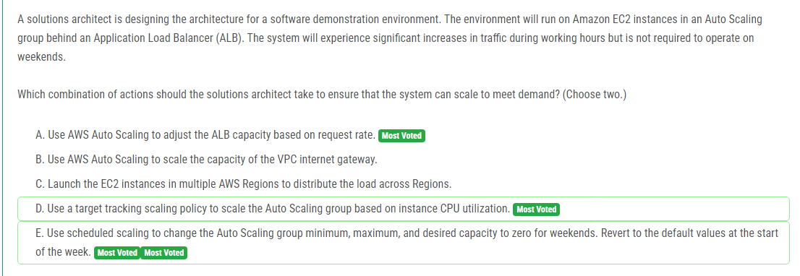

해설:

정답 D, E.

D. 인스턴스 CPU 사용률을 기준으로 하는 대상 추적 스케일링 정책 사용: 이 정책을 사용하면 EC2 인스턴스의 CPU 사용률을 기반으로 Auto Scaling 그룹의 크기를 자동으로 조정할 수 있습니다. 작업 시간에 트래픽이 증가하면 인스턴스의 CPU 사용률이 증가할 가능성이 높으므로 이를 기준으로 스케일링을 조정하는 것이 유용합니다.

E. 주말에 대한 예약된 스케일링 사용: 작업 시간에만 트래픽 증가가 예상되므로, 주말에는 리소스가 낭비되지 않도록 Auto Scaling 그룹의 최소, 최대 및 원하는 용량을 주말에는 0으로 변경하는 예약된 스케일링을 사용할 수 있습니다. 이렇게 하면 주말에는 인스턴스가 중지되어 비용을 절약할 수 있습니다.

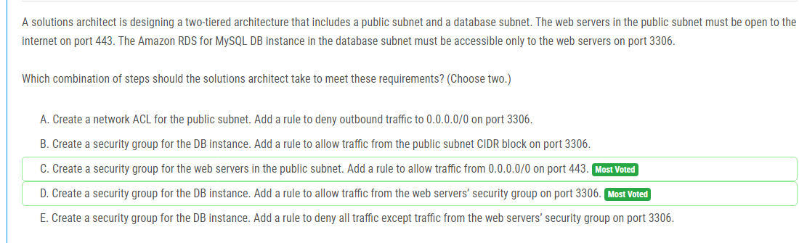

해설:

정답 C, D.

C. Public 서브넷에 대한 보안 그룹 생성: 웹 서버를 호스트하는 public 서브넷에 대한 보안 그룹을 생성하고, 이 보안 그룹에 대한 인바운드 규칙으로 0.0.0.0/0 (인터넷)에서 포트 443을 허용하여 웹 서버가 인터넷으로부터 HTTPS 트래픽을 받을 수 있도록 합니다.

D. 데이터베이스 서브넷에 대한 보안 그룹 생성: 데이터베이스 서브넷에 대한 보안 그룹을 생성하고, 이 보안 그룹에 대한 인바운드 규칙으로 웹 서버의 보안 그룹에서 포트 3306을 허용하여 웹 서버에서만 데이터베이스로의 액세스를 제한합니다.

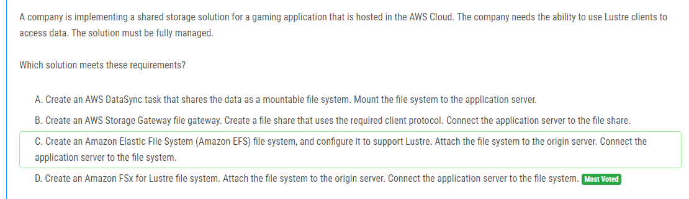

해설:

정답 D.

Amazon FSx for Lustre 파일 시스템 생성: Lustre 클라이언트가 데이터에 액세스할 수 있도록 하는 것이 요구 사항 중 하나입니다. Amazon FSx for Lustre는 Lustre 파일 시스템을 제공하는 완전히 관리되는 서비스로, 고성능 파일 시스템을 신속하게 구성하고 운영할 수 있습니다. 따라서 Amazon FSx for Lustre 파일 시스템을 생성하여 데이터를 저장하고, Lustre 클라이언트를 사용하여 애플리케이션 서버에 연결합니다.

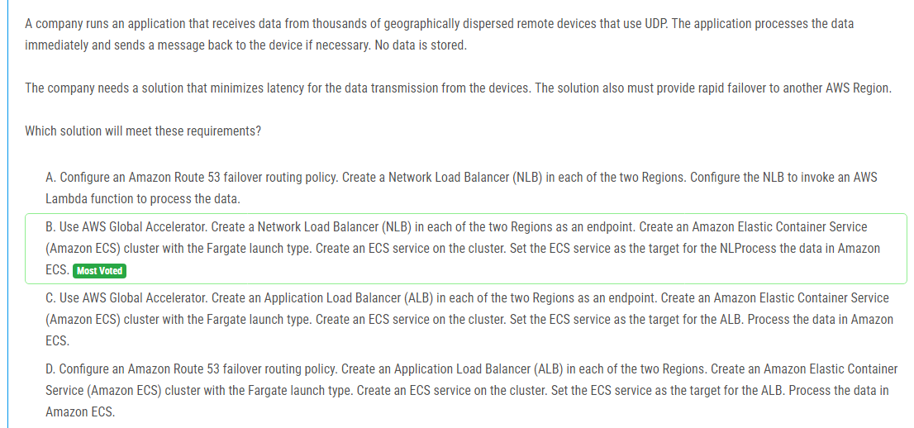

해설:

정답 B.

AWS Global Accelerator를 사용하여 빠른 장애 조치 및 최소한의 지연 시간 확보: AWS Global Accelerator를 사용하면 두 개의 리전 간에 전송되는 UDP 데이터의 지연 시간을 최소화할 수 있습니다. Global Accelerator를 통해 클라이언트의 요청이 최적의 네트워크 경로를 따라 전송됩니다. 또한 Global Accelerator는 고가용성을 제공하므로 한 리전에서 장애가 발생하면 다른 리전으로 트래픽을 자동으로 전환하여 신속한 장애 조치를 할 수 있습니다.

또한, NLB를 사용하여 각 리전에 엔드포인트를 설정하고, 이를 Amazon ECS 클러스터와 연결하여 데이터를 처리하는 데 사용합니다. Amazon ECS는 가변적인 트래픽에 대해 자동으로 확장할 수 있으므로, 어떤 양에도 신속하게 대응할 수 있습니다. 따라서 B가 요구 사항을 충족시키는 가장 적합한 옵션입니다.

해설:

정답 C.

Amazon FSx for Windows File Server로 파일 공유 이전: Amazon FSx for Windows File Server는 Windows 파일 서버의 완전 관리형 서비스로서, 온프레미스 네트워크에 호스팅된 파일 공유를 대체하는 데 이상적입니다. 이 서비스는 높은 내구성과 가용성을 제공하며, 데이터는 여러 AZ에 걸쳐 복제되어 장애 발생 시에도 데이터 손실없이 안전하게 보호됩니다. 또한 FSx는 기존 Windows 기반 애플리케이션과의 시프트없이 통합되므로 마이그레이션 프로세스가 간편해집니다. 따라서 FSx는 이러한 요구 사항을 충족시키는 가장 견고하고 내구성 있는 옵션입니다.

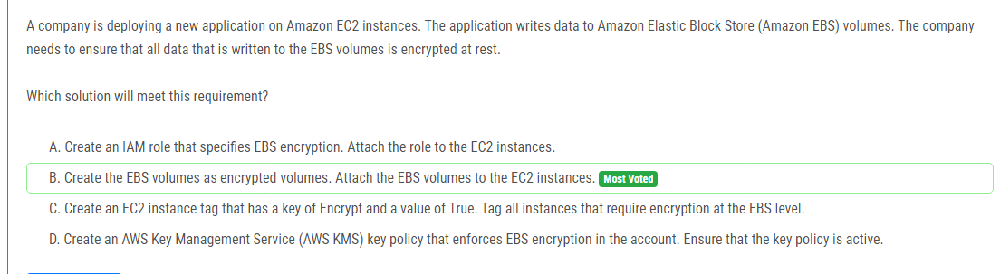

해설:

정답 B.

암호화된 EBS 볼륨 생성: EBS 볼륨을 생성할 때, 암호화를 적용하여 해당 볼륨이 저장되는 모든 데이터가 안전하게 암호화됩니다. 이를 위해 AWS 콘솔이나 AWS CLI 등을 사용하여 EBS 볼륨을 생성할 때 암호화 옵션을 선택하여 암호화된 볼륨을 생성합니다. 이렇게 생성된 암호화된 볼륨을 EC2 인스턴스에 연결하여 데이터를 저장할 수 있습니다.

암호화된 EBS 볼륨을 사용함으로써 모든 데이터가 안전하게 암호화되어 저장되므로 데이터 보안 요구 사항을 충족시킬 수 있습니다.

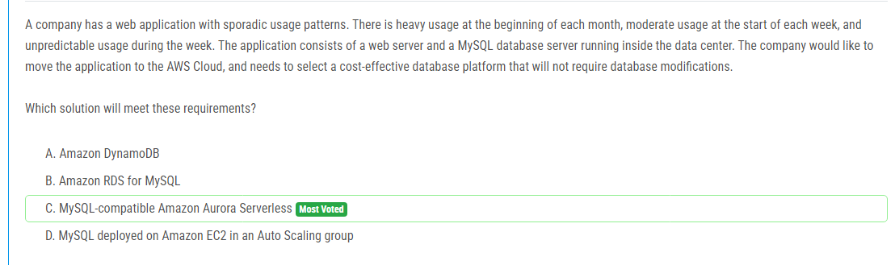

해설:

정답 C.

MySQL 호환 Amazon Aurora Serverless 선택: 이 솔루션은 MySQL과 호환되는 완전 관리형 서비스로서, 기존의 MySQL 데이터베이스와 호환되는 동시에 서버리스 아키텍처를 제공합니다. Aurora Serverless는 사용량에 따라 자동으로 확장 및 축소되므로, 트래픽이 예측할 수 없는 패턴을 보일 때 비용 효율적으로 리소스를 관리할 수 있습니다. 또한 Aurora Serverless는 데이터베이스 수정이 필요하지 않으므로 기존 MySQL 데이터베이스를 AWS로 쉽게 마이그레이션할 수 있습니다.

이 솔루션을 선택하면 비용을 절감하면서도 월 초에는 많은 트래픽을 처리할 수 있고, 주의 시작부터 중간까지는 적절한 리소스를 할당할 수 있으며, 예측할 수 없는 트래픽 변동에도 신속하게 대응할 수 있습니다.

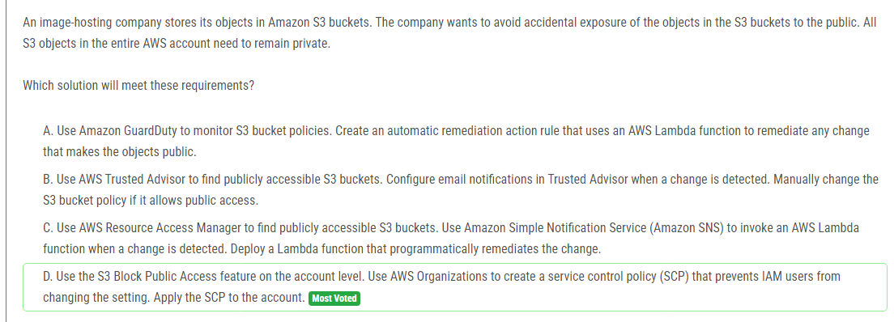

해설:

정답 D.

S3 블록 퍼블릭 액세스 기능 및 AWS 조직의 서비스 제어 정책(SCP) 활용: 이 솔루션은 AWS 계정 전체에 대해 S3 객체의 공개적 노출을 방지하는 데 효과적입니다.

S3 블록 퍼블릭 액세스 기능: 이 기능을 사용하여 계정의 모든 S3 버킷에 대한 공개 액세스를 막을 수 있습니다. 이 옵션은 객체 수준이 아니라 버킷 수준에서 적용되므로 계정 내의 모든 S3 버킷이 자동으로 비공개로 설정됩니다.

AWS 조직 및 서비스 제어 정책(SCP): SCP를 사용하여 IAM 사용자가 S3 블록 퍼블릭 액세스 설정을 변경하는 것을 방지할 수 있습니다. 이 SCP는 모든 계정에 적용되며, IAM 사용자가 해당 계정에서 S3 블록 퍼블릭 액세스 설정을 변경하는 것을 방지합니다.

이렇게 함으로써 모든 S3 객체가 자동으로 비공개로 유지되며, 실수로 객체를 공개로 설정하는 것을 방지할 수 있습니다.

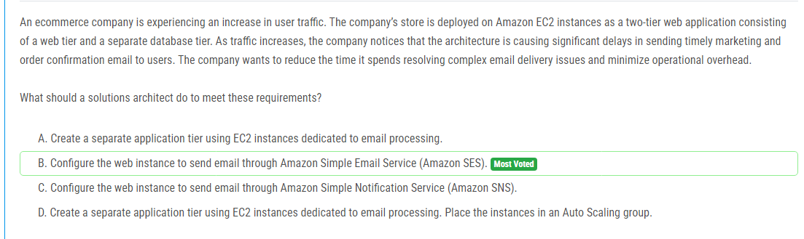

해설:

정답 B.

Amazon SES를 통한 이메일 전송 구성: 이 솔루션은 별도의 이메일 전송 인프라를 구축하지 않고도 이메일 전송 문제를 해결하는 데 효과적입니다. Amazon SES는 신뢰성 높은 이메일 전송 서비스로서, 복잡한 이메일 전송 문제를 해결할 수 있습니다. EC2 웹 인스턴스를 Amazon SES로 구성하여 이메일을 안정적으로 보낼 수 있으며, 이를 통해 이메일 전송 지연을 최소화하고 운영 오버헤드를 줄일 수 있습니다.

이 솔루션은 기존 아키텍처를 변경하지 않고도 문제를 해결할 수 있으며, Amazon SES의 신속한 설정과 사용이 가능하므로 즉시 적용할 수 있습니다.

해설:

정답 B.

Amazon S3 파일 게이트웨이 생성: 이 솔루션은 기존의 네트워크 공유에 대한 변경 없이 AWS 클라우드에 데이터를 안전하게 전송하는 데 가장 적은 관리 오버헤드가 발생합니다. Amazon S3 파일 게이트웨이를 구성하면 네트워크 공유에 대한 AWS S3 버킷의 마운트 포인트를 제공할 수 있습니다. 이를 통해 기존 비즈니스 시스템이 AWS S3에 보고서를 CSV 형식으로 저장하는 동시에 변경 사항이 S3에 실시간으로 전송됩니다. 이는 데이터의 분석을 위해 필요한 빠른 데이터 전송을 보장하면서 관리 오버헤드를 최소화합니다.

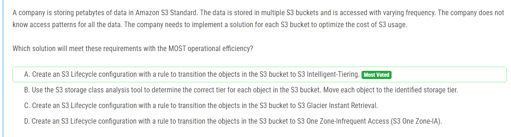

해설:

정답 A.

S3 라이프사이클 구성 및 S3 Intelligent-Tiering 사용: 이 솔루션은 S3 버킷에 대한 비용을 최적화하기 위한 효율적이고 자동화된 방법을 제공합니다. S3 Intelligent-Tiering은 데이터 액세스 패턴을 모니터링하고 자동으로 데이터를 가장 적합한 스토리지 클래스로 이동시킵니다. 이는 자주 액세스되는 데이터에는 S3 Standard 스토리지 클래스를 유지하고, 액세스 빈도가 낮은 데이터에는 S3 Standard-IA 또는 S3 One Zone-IA로 이동하여 비용을 최적화할 수 있습니다.

S3 Intelligent-Tiering을 사용하면 데이터 액세스 패턴에 따라 자동으로 최적의 스토리지 클래스로 이동하므로 관리 작업이 줄어들고 비용을 최적화할 수 있습니다. 이는 대규모 데이터에 대한 비용 효율적인 관리를 위한 가장 효과적인 방법 중 하나입니다.

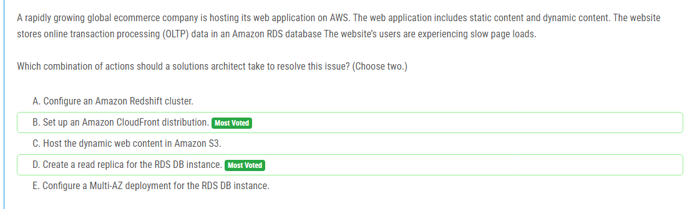

해설:

정답 B, D.

B. Amazon CloudFront 배포 설정: Amazon CloudFront를 사용하여 정적 콘텐츠를 전 세계적으로 배포하고, 사용자가 웹 페이지를 빠르게 로드할 수 있도록 도와줍니다. CloudFront를 사용하면 정적 콘텐츠를 빠르게 전달하여 웹 사이트의 성능을 향상시킬 수 있습니다.

D. RDS DB 인스턴스용 읽기 레플리카 생성: RDS DB 인스턴스에 읽기 전용 레플리카를 생성하여 동적 콘텐츠에 대한 읽기 작업을 분산시킬 수 있습니다. 이는 읽기 작업이 주 DB 인스턴스에 집중되지 않도록 하여 웹 사이트의 성능을 향상시킬 수 있습니다.

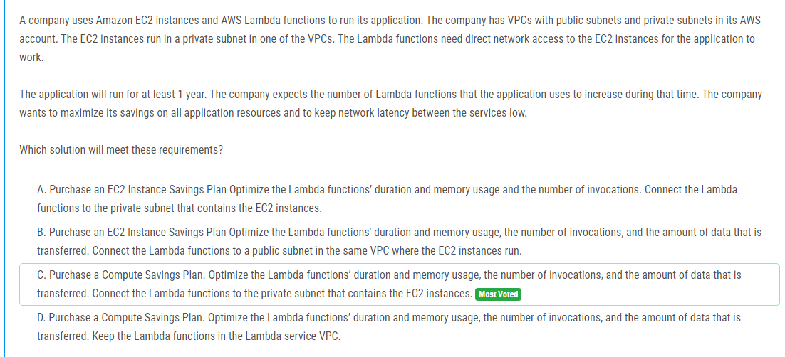

해설:

정답 C.

Compute Savings Plan 구매 및 Lambda 함수 설정: 이 솔루션은 장기적인 비용 절감을 위해 Compute Savings Plan을 구매하고, Lambda 함수의 실행 시간 및 메모리 사용량, 호출 횟수 및 전송되는 데이터 양을 최적화하는 것을 권장합니다. 또한 Lambda 함수를 EC2 인스턴스가 있는 프라이빗 서브넷에 연결하여 Lambda 함수가 EC2 인스턴스와 직접 네트워크 통신을 할 수 있도록 합니다.

이 솔루션은 장기적인 시점에서 비용 절감을 극대화하기 위해 Compute Savings Plan을 활용하고, Lambda 함수의 성능을 최적화하여 네트워크 지연을 최소화하고자 합니다. 또한 Lambda 함수를 EC2 인스턴스가 있는 프라이빗 서브넷에 연결하여 필요한 네트워크 액세스를 유지합니다.

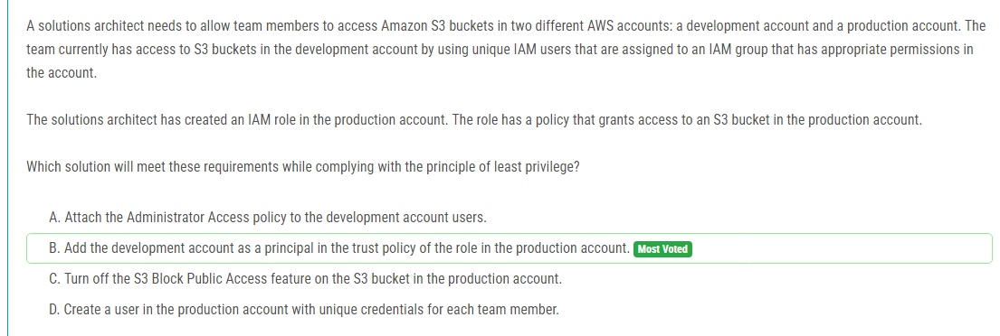

해설:

정답 B.

생산 계정의 역할 신뢰 정책에 개발 계정 추가: 이 솔루션은 개발팀이 생산 계정의 S3 버킷에 액세스할 수 있도록 하는 가장 효율적인 방법입니다. 역할을 생성하고 해당 역할에 적절한 IAM 정책을 부여하여 개발 계정을 신뢰할 수 있도록 구성합니다. 이렇게 하면 개발팀이 실제 IAM 사용자를 관리하고, 필요한 권한을 가진 개발 계정의 IAM 그룹에 IAM 사용자를 추가하여 개발 계정의 S3 버킷에 액세스할 수 있습니다.

이 솔루션은 최소 권한의 원칙을 준수하면서도 필요한 액세스를 제공합니다. 개발팀의 IAM 사용자는 개발 계정의 S3 버킷에만 액세스할 수 있으며, 역할을 통해 신뢰된 개발 계정에만 액세스할 수 있습니다.

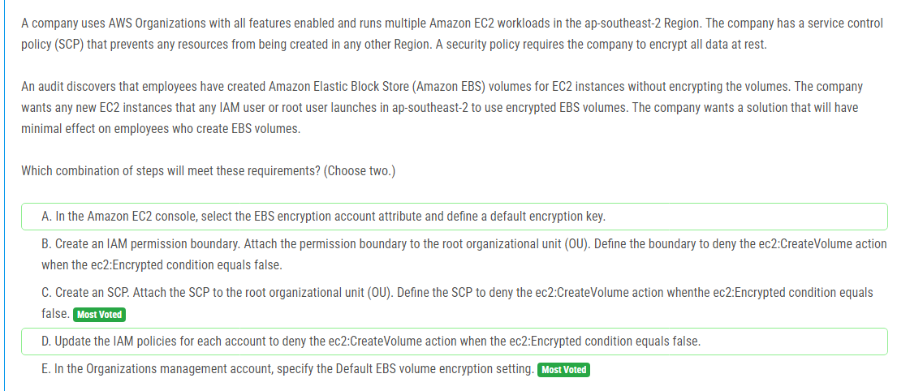

해설:

정답 C, E.

C. SCP 생성 및 적용: SCP를 사용하여 모든 IAM 사용자 및 루트 사용자가 ap-southeast-2 리전에서 새로운 EC2 인스턴스를 시작할 때 자동으로 암호화된 EBS 볼륨을 사용하도록 요구할 수 있습니다. SCP를 루트 조직 단위(OU)에 첨부하여 전체 조직에 적용하고, ec2:CreateVolume 액션을 거부하도록 SCP를 정의합니다. 이렇게 하면 모든 새로운 EBS 볼륨이 자동으로 암호화됩니다.

E. 기본 EBS 볼륨 암호화 설정 구성: 조직 관리 계정에서 기본 EBS 볼륨 암호화 설정을 지정하여 ap-southeast-2 리전에서 생성되는 모든 EBS 볼륨이 기본적으로 암호화되도록 합니다. 이렇게 하면 새로운 EC2 인스턴스를 시작할 때 IAM 사용자들이 추가 조치를 취하지 않아도 자동으로 EBS 볼륨이 암호화됩니다.

이러한 단계를 통해 조직의 보안 정책을 준수하면서도 직원들이 EBS 볼륨을 생성하는 데 최소한의 영향을 미칩니다.

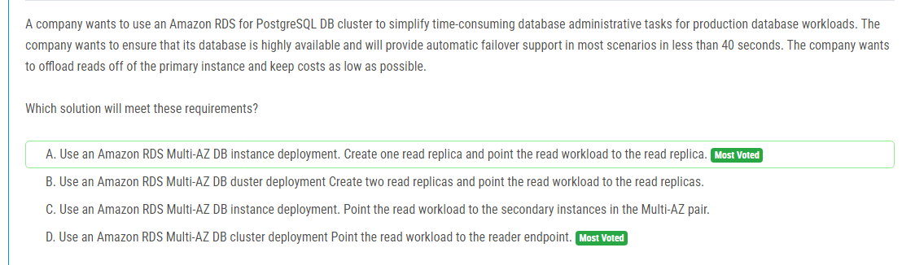

해설:

정답 D.

고가용성 및 자동 장애 조치: Amazon RDS Multi-AZ DB 클러스터 배포를 사용하여 주 데이터베이스와 보조 데이터베이스 간의 자동 장애 조치(failover)를 제공할 수 있습니다. 이렇게 하면 대부분의 시나리오에서 40초 미만의 자동 장애 조치 시간을 달성할 수 있습니다.

읽기 전용 작업 로드 분산: 리더 엔드포인트를 통해 읽기 전용 작업을 별도의 리드 노드로 라우팅할 수 있습니다. 이렇게 하면 주 데이터베이스에 대한 읽기 작업이 분산되어 성능이 향상되고, 주 데이터베이스에 대한 부하가 줄어듭니다.
