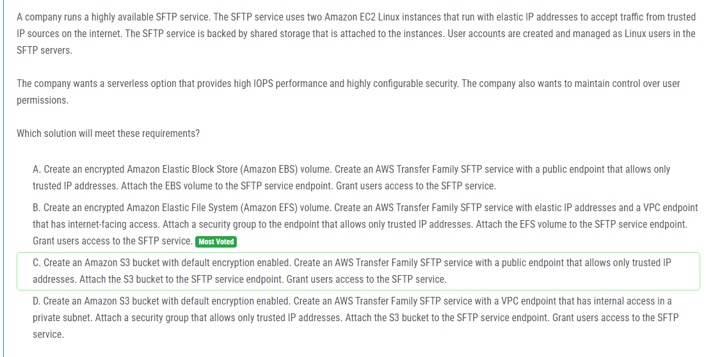

해설:

정답 B.

고성능 IOPS 및 보안 요구 사항: Amazon Elastic File System (EFS)는 높은 IOPS 성능을 제공하며 데이터 암호화를 지원합니다. 또한 AWS Transfer Family SFTP 서비스는 엔드포인트 보안을 높일 수 있으며, 보안 그룹을 통해 특정 IP 주소에서의 액세스를 허용할 수 있습니다.

서버리스 옵션: Amazon EFS 및 AWS Transfer Family SFTP 서비스는 서버리스로 관리되는 서비스입니다. 즉, 서버를 직접 프로비저닝하고 관리할 필요가 없습니다.

사용자 권한 제어: Linux 사용자로서 사용자 계정이 관리되는 것과 유사하게, AWS Transfer Family SFTP 서비스는 사용자 액세스를 관리할 수 있습니다.

Elastic IP 및 VPC 엔드포인트: 보안을 강화하기 위해 VPC 엔드포인트를 사용하여 인터넷 트래픽을 제어하고, Elastic IP를 통해 정적 IP 주소를 유지할 수 있습니다.

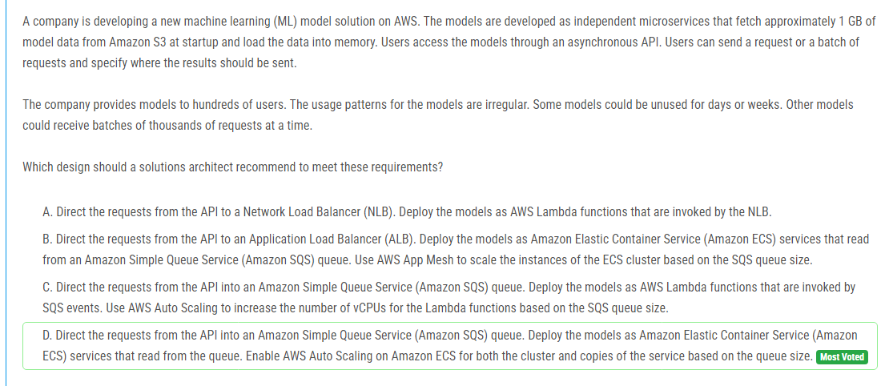

해설:

정답 D.

Irregular Usage Patterns: 수백 명의 사용자가 모델을 사용하고, 사용 패턴이 불규칙하며, 일부 모델은 수일 또는 수주 동안 사용되지 않을 수 있습니다. 이러한 불규칙한 사용 패턴에 대응하기 위해 유연한 확장이 필요합니다.

Amazon SQS를 통한 비동기 처리: 사용자의 요청을 Amazon SQS 큐에 보내면 모델 서비스에 부하를 조절하고 요청을 안정적으로 처리할 수 있습니다. 또한, SQS 큐에 요청이 쌓일 경우, 서비스가 비동기적으로 요청을 처리할 수 있도록 해줍니다.

Amazon ECS와 Auto Scaling: Amazon ECS를 사용하여 모델 서비스를 배포하고, Amazon SQS 큐에서 메시지를 읽어들이도록 구성합니다. Amazon ECS에서 Auto Scaling을 활성화하여 모델 서비스의 인스턴스 수를 자동으로 조정합니다. 이는 큐의 크기에 따라 서비스의 복사본을 동적으로 확장하거나 축소하여 요청을 처리하는 데 유용합니다.

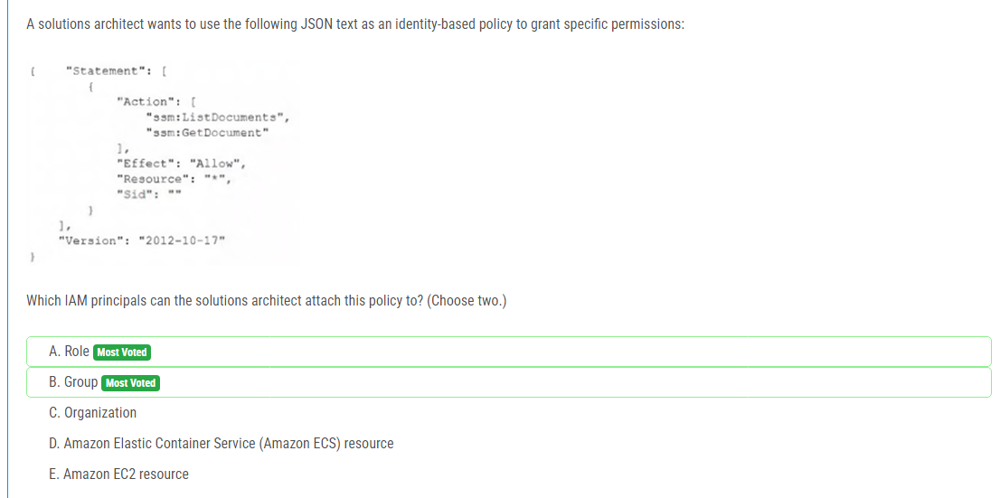

해설:

정답 A, B.

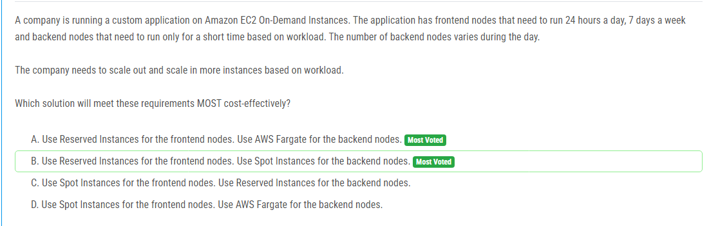

해설:

정답 B.

Frontend Nodes: 프론트엔드 노드는 항상 실행되어야 하므로 예약된 인스턴스(Reserved Instances)를 사용하여 이러한 인스턴스를 유지하는 것이 가장 효율적입니다. 이렇게 함으로써 운영 비용을 최소화할 수 있습니다.

Backend Nodes: 백엔드 노드는 작업 부하에 따라 짧은 시간 동안만 실행되어야 하므로 스팟 인스턴스(Spot Instances)를 사용하여 이러한 인스턴스를 프로비저닝하는 것이 가장 경제적입니다. 스팟 인스턴스는 저렴한 가격에 이용할 수 있지만 언제든지 인스턴스를 중단할 수 있으므로, 짧은 시간 동안 실행되어야 하는 백엔드 노드에 적합합니다.

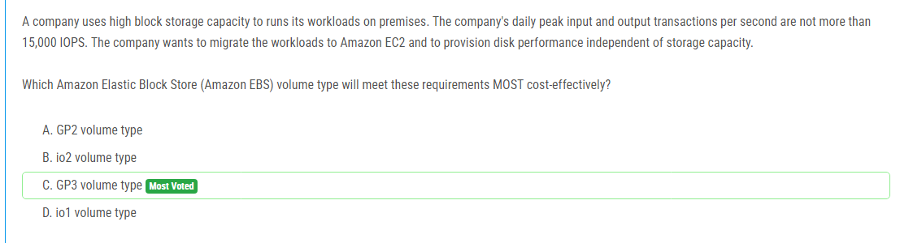

해설:

정답 C.

GP3 (General Purpose SSD) 볼륨 유형은 IOPS와 스토리지 용량을 분리하여 제공하는 것으로, IOPS에 대한 비용을 더욱 효율적으로 관리할 수 있습니다. 이 유형의 볼륨은 IOPS와 스토리지 용량을 독립적으로 조정할 수 있으므로, 고성능의 IOPS를 필요로 할 때는 IOPS를 높일 수 있고, 일반적인 I/O 요구 사항이 있을 때는 IOPS를 줄이고 스토리지 비용을 절감할 수 있습니다.

따라서, 요구사항을 가장 효율적으로 충족시키면서 비용을 절감할 수 있는 옵션은 GP3 볼륨 유형인 C입니다.

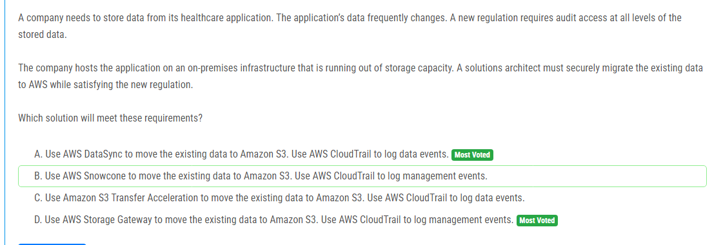

해설:

정답 A.

AWS DataSync를 사용하여 데이터 이전: AWS DataSync를 사용하면 안전하고 신속하게 대량의 데이터를 온프레미스 환경에서 Amazon S3로 이전할 수 있습니다. 이것은 데이터를 안전하게 전송하고 복제하며, 높은 성능을 제공하여 데이터 이전을 용이하게 합니다.

AWS CloudTrail을 사용하여 데이터 이벤트 로깅: AWS CloudTrail을 사용하여 데이터 이벤트를 로깅하면 데이터에 대한 변경 및 액세스 이력을 추적할 수 있습니다. 이는 새로운 규정을 준수하기 위해 데이터에 대한 감사 접근이 필요한 요구사항을 충족시킵니다.

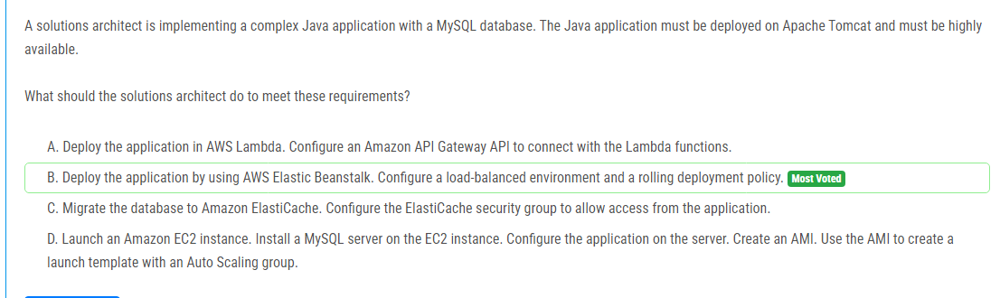

해설:

정답 B.

Apache Tomcat 및 MySQL을 사용한 복잡한 Java 애플리케이션: Elastic Beanstalk은 Java 애플리케이션을 쉽게 배포하고 관리할 수 있는 플랫폼입니다. Tomcat은 Elastic Beanstalk의 지원되는 환경 중 하나이며, 애플리케이션을 쉽게 배포하고 관리할 수 있습니다.

고가용성: Elastic Beanstalk은 로드 밸런싱된 환경을 구성하여 애플리케이션의 고가용성을 제공할 수 있습니다. 또한, 롤링 배포 정책을 구성하여 애플리케이션 업데이트를 신속하고 안정적으로 배포할 수 있습니다.

간편한 관리: Elastic Beanstalk은 애플리케이션을 배포하고 관리하는 데 필요한 리소스를 자동으로 프로비저닝하고 관리합니다. 이로써 관리 작업을 간소화하고 개발자가 애플리케이션에 집중할 수 있습니다.

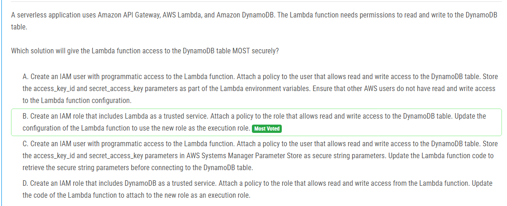

해설:

정답 B.

IAM Role을 사용한 가장 안전한 접근: IAM Role을 사용하여 AWS Lambda 함수에 대한 액세스를 관리하는 것이 가장 안전한 방법입니다. IAM Role은 AWS 서비스 간에 자격 증명을 안전하게 교환할 수 있는 역할을 수행합니다.

실행 역할(Execution Role): IAM 역할을 생성하고 Lambda를 신뢰하는 서비스로 지정합니다. 그런 다음 DynamoDB 테이블에 대한 읽기 및 쓰기 권한을 부여하는 IAM 정책을 역할에 연결합니다. 이렇게 하면 Lambda 함수가 DynamoDB 테이블에 안전하게 액세스할 수 있습니다.

보안 및 관리: IAM 역할을 사용하면 AWS에서 직접 관리하므로 자격 증명을 환경 변수로 저장하거나 다른 보안 취약점을 만들지 않습니다. 또한 IAM 역할은 다른 AWS 서비스 또는 사용자에게 직접적으로 액세스되지 않으므로 보안성이 향상됩니다.

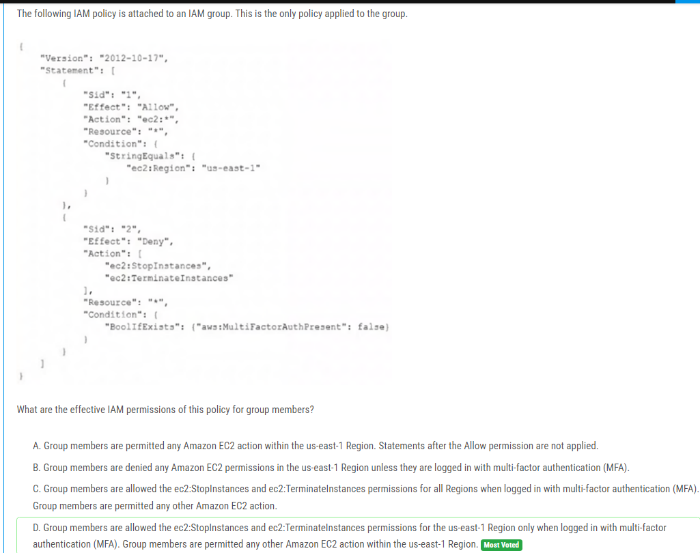

해설:

정답 D.

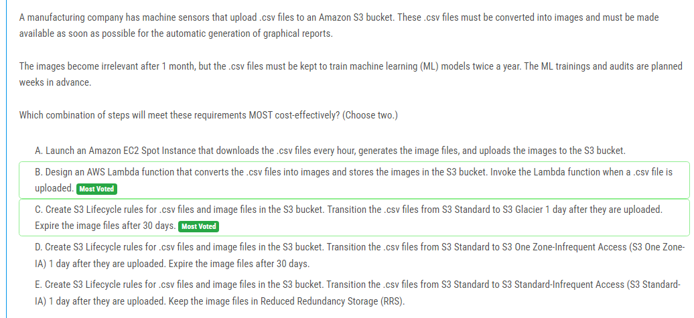

해설:

정답 B, C.

B. AWS Lambda 함수 설계: AWS Lambda 함수를 사용하여 .csv 파일을 이미지로 변환하고, 변환된 이미지를 S3 버킷에 저장합니다. 이것은 이벤트 기반으로 동작하므로 .csv 파일이 업로드될 때마다 자동으로 Lambda 함수가 호출되어 이미지를 생성하고 업로드합니다. 이것은 비용 효율적이고, 자동화된 처리를 제공합니다.

C. S3 생명 주기 규칙 생성: S3 버킷에 .csv 파일 및 이미지 파일에 대한 생명 주기 규칙을 설정합니다. .csv 파일은 1일 후에 S3 Standard에서 S3 Glacier로 전환되어 비용을 절감하고, 이미지 파일은 30일 후에 만료되어 관련성이 없어진 파일을 자동으로 삭제합니다. 이것은 비용을 최소화하고 관리 부담을 줄여줍니다.

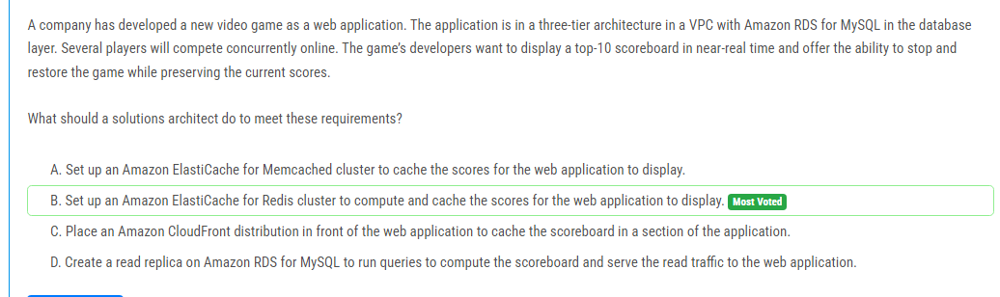

해설:

정답 B.

Amazon ElastiCache for Redis: Redis는 메모리 기반의 고성능 키-값 스토어로서, 실시간 스코어 보드를 계산하고 캐싱하는 데 이상적입니다. 여러 플레이어가 동시에 온라인으로 경쟁하는 경우, 게임에서 발생하는 스코어를 빠르게 처리하고 관리할 수 있어야 합니다.

실시간 스코어 보드: Redis는 in-memory 데이터 구조 저장소로서 매우 빠른 속도로 데이터를 캐시하고 조회할 수 있습니다. 따라서 게임에서 발생하는 점수를 실시간으로 계산하고 보드에 표시하는 데 적합합니다.

게임 일시 중지 및 복구: Redis는 데이터를 영구적으로 저장할 수도 있으므로 게임을 일시 중지하고 복구할 때 현재 스코어를 보존하는 데 도움이 됩니다.

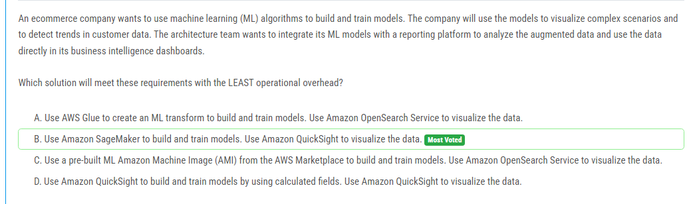

해설:

정답 B.

Amazon SageMaker를 사용하여 모델 빌드 및 학습: Amazon SageMaker는 머신러닝 모델을 빌드하고 학습하기 위한 완전 관리형 서비스로서, 기능이 풍부하고 사용하기 쉽습니다. 이를 통해 ML 모델을 구축하고 학습시킬 때의 작업 부담이 최소화됩니다.

Amazon QuickSight를 사용하여 데이터 시각화: Amazon QuickSight는 비즈니스 인텔리전스 및 대시보드를 생성하기 위한 서비스로, 데이터를 시각적으로 분석하고 표현하는 데 탁월합니다. Amazon SageMaker와 통합하여 모델로부터 생성된 데이터를 시각화할 수 있으므로, 효율적인 비즈니스 결정에 도움이 됩니다.

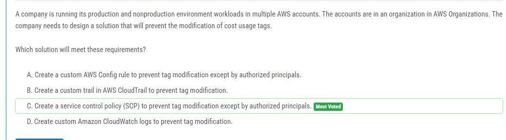

해설:

정답 C.

서비스 제어 정책(SCP): 서비스 제어 정책을 사용하면 AWS Organizations에서 계정에 대한 중앙 집중식 제어를 구현할 수 있습니다. 이를 사용하여 특정 리소스에 대한 액세스를 제어할 수 있으며, 태그 수정을 허용하거나 거부할 수 있습니다.

태그 수정 방지: SCP를 사용하여 특정 리소스에 대한 태그 수정을 금지할 수 있습니다. 이를 통해 비인가된 사용자가 태그를 수정하는 것을 방지할 수 있습니다.

권한 부여: SCP를 사용하여 태그를 수정할 수 있는 권한을 가진 사용자를 지정할 수 있습니다. 이를 통해 필요한 권한을 가진 사용자만이 태그를 수정할 수 있도록 제어할 수 있습니다.

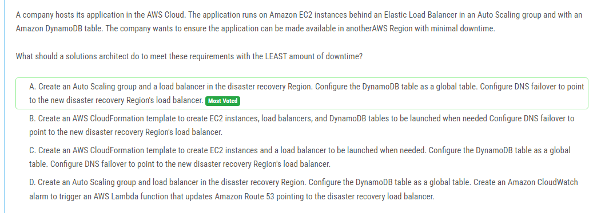

해설:

정답 A.

Auto Scaling 그룹 및 로드 밸런서 생성: 재해 복구(Disaster Recovery) 리전에 Auto Scaling 그룹과 로드 밸런서를 생성하여 애플리케이션을 배포합니다. 이를 통해 애플리케이션의 가용성이 확보됩니다.

DynamoDB 테이블을 글로벌 테이블로 구성: DynamoDB 테이블을 글로벌 테이블로 설정하여 데이터를 여러 리전에 복제하고 동기화시킵니다. 이를 통해 재해 복구 리전에서도 동일한 데이터에 접근할 수 있습니다.

DNS 장애 조치 설정: Route 53을 사용하여 DNS 장애 조치를 설정하여 사용자의 요청을 새로운 재해 복구 리전의 로드 밸런서로 리디렉션합니다. 이를 통해 최소한의 다운 타임으로 새로운 리전으로 애플리케이션을 전환할 수 있습니다.

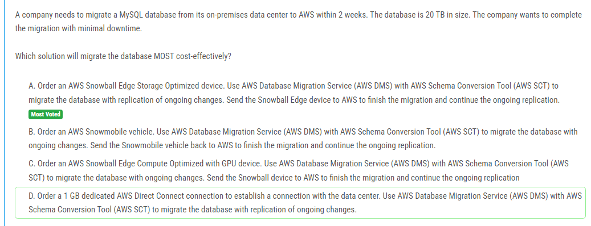

해설:

정답 A.

AWS Snowball Edge Storage Optimized 디바이스: Snowball Edge Storage Optimized 디바이스를 사용하여 대규모 데이터를 안전하고 신속하게 전송할 수 있습니다. 이 디바이스는 대량의 데이터를 한 번에 전송하는 데 적합하며, 네트워크 대역폭에 따른 제약을 줄여줍니다.

AWS Database Migration Service (AWS DMS) 및 AWS Schema Conversion Tool (AWS SCT): AWS DMS와 AWS SCT를 사용하여 데이터베이스 마이그레이션을 쉽게 수행할 수 있습니다. 데이터베이스 마이그레이션 중에도 지속적인 변경 사항을 복제할 수 있어, 마이그레이션 과정에서의 다운타임을 최소화할 수 있습니다.

지속적인 복제 및 마이그레이션 완료: Snowball Edge 디바이스를 사용하여 데이터를 AWS로 전송하고, 마이그레이션을 완료한 후에도 지속적인 변경 사항을 복제할 수 있습니다. 이를 통해 마이그레이션 작업이 완료될 때까지 데이터의 일관성을 유지할 수 있습니다.

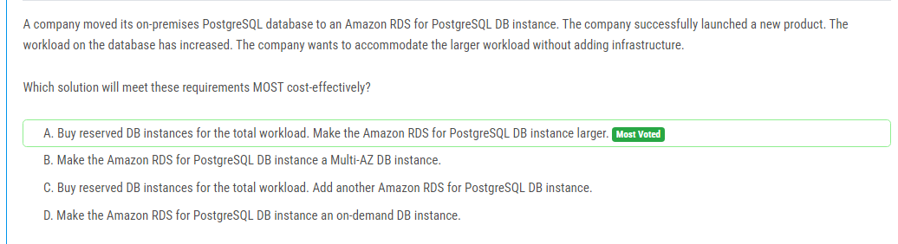

해설:

정답 A.

예약된 DB 인스턴스 구매: 총 워크로드에 대해 예약된 DB 인스턴스를 구매하여 비용을 절감할 수 있습니다. 예약된 인스턴스를 구매하면 특정 시간에 일관된 용량을 예약할 수 있으며, 할인된 가격으로 인스턴스를 이용할 수 있습니다.

Amazon RDS 인스턴스 크기 확장: Amazon RDS for PostgreSQL DB 인스턴스를 더 큰 사양으로 확장하여 워크로드의 증가에 대응할 수 있습니다. 이를 통해 인스턴스의 용량을 확장함으로써 성능을 향상시킬 수 있습니다.

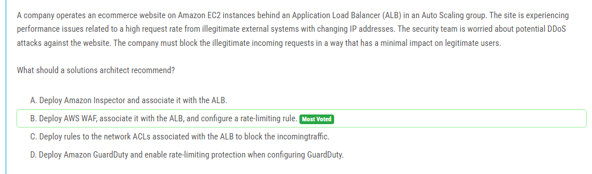

해설:

정답 B.

AWS WAF (웹 애플리케이션 방화벽): AWS WAF는 웹 애플리케이션의 보안을 강화하는 관리형 서비스로서, 악성 트래픽을 식별하고 차단할 수 있습니다. 이를 사용하여 악의적인 외부 시스템에서의 공격을 탐지하고 차단할 수 있습니다.

ALB와 연관시키기: AWS WAF를 ALB와 연관시켜서 ALB로 유입되는 트래픽을 모니터링하고 필터링할 수 있습니다. 이를 통해 악성 트래픽을 차단하고 실시간으로 대응할 수 있습니다.

Rate-limiting rule 설정: 악의적인 외부 시스템에서의 공격은 보통 대량의 요청으로 이루어지므로, AWS WAF에서 rate-limiting rule을 설정하여 특정 IP 주소나 IP 주소 범위로부터의 요청을 제한할 수 있습니다. 이를 통해 정당한 사용자에게는 영향을 미치지 않으면서 공격을 방어할 수 있습니다.

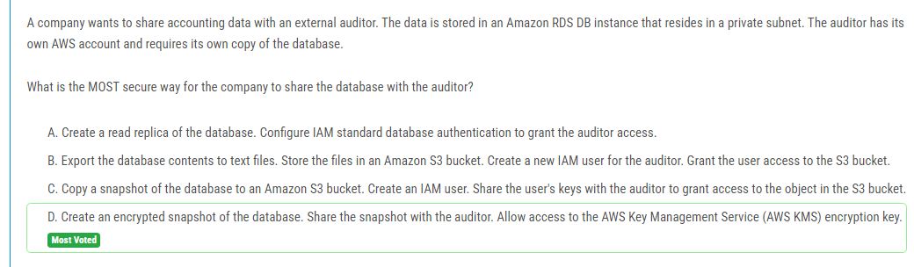

해설:

정답 D.

암호화된 스냅샷 생성: 먼저, 데이터베이스의 스냅샷을 생성할 때 데이터를 암호화해야 합니다. 이를 통해 데이터는 안전하게 저장되며 외부에 노출되는 것을 방지할 수 있습니다.

스냅샷 공유: 암호화된 스냅샷을 생성한 후, 해당 스냅샷을 외부 감사인과 공유합니다. 이를 통해 감사인은 데이터베이스의 복사본을 자신의 AWS 계정으로 가져갈 수 있습니다.

AWS KMS 키 접근 권한 부여: 스냅샷을 공유할 때 AWS KMS(KMS) 암호화 키에 대한 액세스 권한을 부여합니다. 이를 통해 감사인은 해당 KMS 키를 사용하여 스냅샷을 복호화하여 데이터에 접근할 수 있습니다.

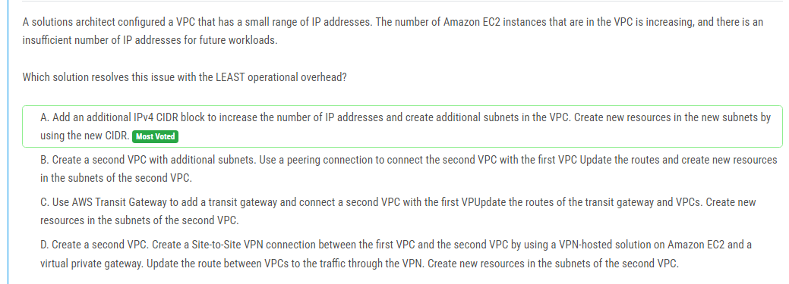

해설:

정답 A.

추가 IPv4 CIDR 블록 추가: 현재 VPC에 추가적인 IPv4 CIDR 블록을 추가하여 IP 주소의 범위를 확장합니다. 이를 통해 현재 및 미래의 EC2 인스턴스에 대한 충분한 IP 주소를 확보할 수 있습니다.

추가 서브넷 생성: 새로운 CIDR 블록을 사용하여 새로운 서브넷을 생성합니다. 새로운 EC2 인스턴스는 이러한 새로운 서브넷에 배치됩니다.

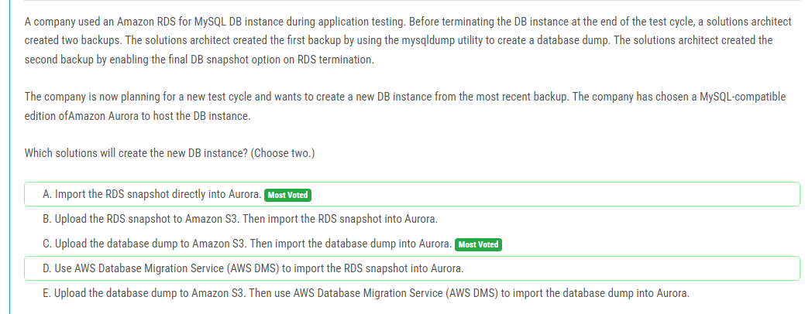

해설:

정답 A, C.

A. RDS 스냅샷을 직접 Aurora로 가져오는 것이 가능합니다. 이 방법은 가장 간단하고 효율적인 방법 중 하나입니다. Aurora는 MySQL과 호환되기 때문에, RDS 스냅샷을 Aurora로 바로 가져올 수 있습니다.

C. 데이터베이스 덤프를 Amazon S3에 업로드한 다음, 이를 Aurora로 가져오는 것 또한 가능합니다. 이 방법은 덤프 파일을 통해 데이터를 Amazon S3로 내보낸 후, Aurora로 데이터를 다시 가져오는 방식입니다. 이 방법은 Aurora의 호환성과 함께 유연성을 제공합니다.