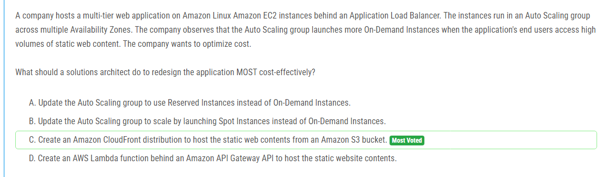

해설:

정답 C.

Amazon CloudFront은 캐싱 기능을 통해 정적 웹 콘텐츠를 효율적으로 제공할 수 있다. 이는 사용자가 요청할 때마다 EC2 인스턴스에서 정적 콘텐츠를 제공하는 대신 CloudFront의 캐시에서 콘텐츠를 제공함으로써 EC2 인스턴스에 대한 부하를 줄여준다. 이는 EC2 인스턴스를 추가로 확장하는 것을 줄여 비용을 절감할 수 있다.

또한 Amazon S3는 정적 웹 콘텐츠를 저장하기에 이상적인 서비스이며, CloudFront와의 통합을 통해 정적 콘텐츠를 효율적으로 제공할 수 있다.

따라서 정적 웹 콘텐츠를 Amazon S3에 호스팅하고 Amazon CloudFront를 사용하여 배포하는 것은 비용을 절감하면서 성능을 향상시키는 가장 좋은 방법이다.

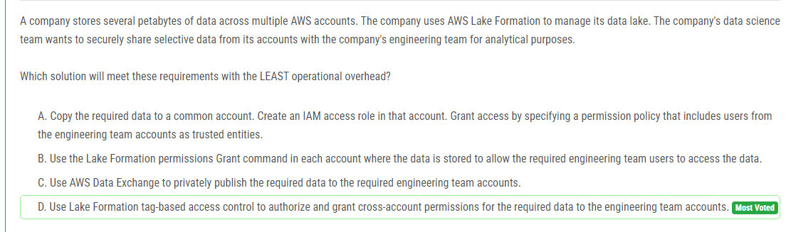

해설:

정답 D.

Lake Formation의 태그 기반 액세스 제어를 사용하면 데이터에 대한 액세스 권한을 부여할 때 태그를 활용할 수 있습니다. 이는 데이터에 대한 접근을 태그에 따라 자동으로 제어함으로써 관리 오버헤드를 줄일 수 있습니다.

또한 이 방법은 데이터 과학 팀이나 엔지니어링 팀의 AWS 계정에 별도의 IAM 역할을 생성하거나 데이터를 다른 계정으로 복사할 필요가 없으므로 운영 오버헤드가 최소화됩니다.

따라서 Lake Formation의 태그 기반 액세스 제어를 사용하여 데이터에 대한 엔지니어링 팀의 권한을 부여하는 것이 가장 효율적이고 운영 오버헤드가 적은 방법입니다.

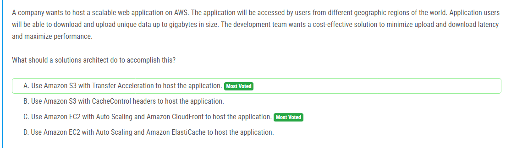

해설:

정답 A.

Amazon S3의 Transfer Acceleration을 사용하면 전 세계 사용자가 빠르게 파일을 업로드하고 다운로드할 수 있습니다. Transfer Acceleration은 전 세계 여러 위치에 있는 엣지 로케이션을 통해 데이터 전송 속도를 높여줍니다. 이는 전 세계적으로 사용자가 웹 애플리케이션에 빠르게 액세스할 수 있도록 도와줍니다.

Amazon S3는 파일의 크기가 크고 많은 양의 데이터를 저장할 수 있는 안정적이고 확장 가능한 스토리지 서비스입니다. 또한 Amazon S3는 다양한 AWS 서비스 및 클라이언트 애플리케이션과 통합되어 있어 개발자가 쉽게 사용할 수 있습니다.

따라서 Amazon S3를 사용하여 Transfer Acceleration을 활성화하여 웹 애플리케이션을 호스팅하는 것이 가장 적합한 선택입니다.

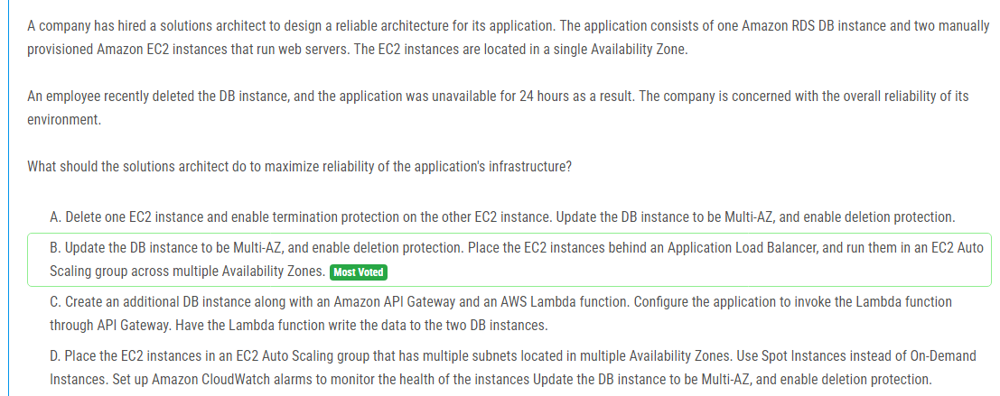

해설:

정답 B.

다중 가용 영역 (Multi-AZ)으로 DB 인스턴스를 업데이트하고 삭제 방지를 활성화함으로써 데이터베이스의 내결함성을 높일 수 있습니다. 다중 AZ에서 실행 중인 RDS 인스턴스는 주 데이터베이스 인스턴스와 동기화된 스탠바이 인스턴스를 보유하므로 하나의 AZ에서 장애가 발생하더라도 시스템이 중단되지 않습니다.

EC2 인스턴스를 여러 가용 영역에 걸쳐 EC2 Auto Scaling 그룹에서 실행함으로써 웹 서버의 가용성을 높일 수 있습니다. 이는 하나의 가용 영역에서 장애가 발생할 경우 다른 가용 영역으로 트래픽을 분산시킴으로써 애플리케이션의 가용성을 보장합니다. 또한 Application Load Balancer를 사용하여 트래픽을 분산시킴으로써 인스턴스에 대한 부하를 균형있게 분배할 수 있습니다.

이러한 조치를 통해 데이터베이스 및 웹 서버 레이어에 대한 내결함성을 증가시키고, 단일 AZ에서의 장애로부터 시스템을 보호하며, 사용 가능한 가용성을 최대화할 수 있습니다.

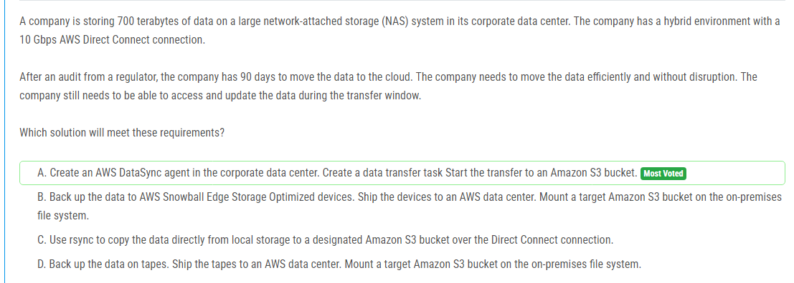

해설:

정답 A.

AWS DataSync은 대량의 데이터를 안전하고 신속하게 AWS로 이동하는 데 사용할 수 있는 관리형 데이터 전송 서비스입니다. DataSync는 네트워크를 최대한 활용하여 데이터 이전을 가속화하고, 중복 데이터를 제거하고, 전송 중에 오류를 복구할 수 있는 기능을 제공합니다.

DataSync 에이전트를 데이터 센터에 배치하고 데이터 전송 작업을 설정하면 데이터 이전을 시작할 수 있습니다. 이는 기존 데이터에 대한 작업 중단 없이 데이터를 안정적으로 이전할 수 있도록 해줍니다.

Amazon S3는 안정적이고 확장 가능한 객체 스토리지 서비스로, 대규모 데이터를 안전하게 보관할 수 있습니다. 이전이 완료되면 S3 버킷에서 데이터에 액세스할 수 있으며, 필요한 경우 추가 처리나 분석을 수행할 수 있습니다.

따라서 AWS DataSync를 사용하여 기업 데이터 센터의 데이터를 안전하게 AWS로 이동하는 것이 가장 적합한 선택입니다.

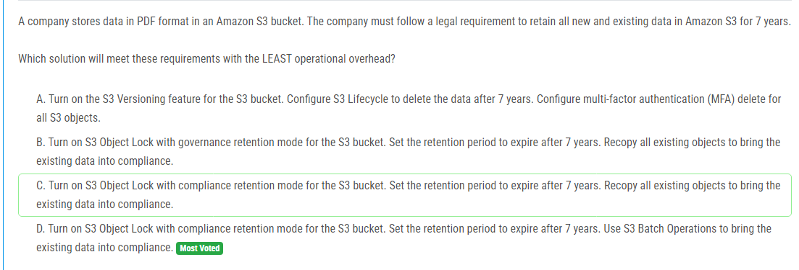

해설:

정답 D.

S3 Object Lock은 객체를 수정하거나 삭제하는 것을 방지하여 데이터의 무결성과 보존을 보장합니다. Compliance retention mode는 관리자와 같은 권한을 가진 사용자도 객체를 삭제할 수 없게 합니다.

솔루션 D를 선택하면 S3 버킷에 Compliance retention mode로 S3 Object Lock을 설정할 수 있습니다. 이를 통해 모든 객체를 7년 동안 보존할 수 있습니다.

기존 데이터를 새로운 보존 정책에 맞게 복사하기 위해 S3 Batch Operations를 사용할 수 있습니다. 이렇게 하면 기존 데이터를 새로운 정책에 맞게 재조정할 수 있으며, 운영 오버헤드를 최소화할 수 있습니다.

따라서 솔루션 D는 운영 오버헤드를 최소화하면서 요구 사항을 충족하는 가장 적절한 선택입니다.

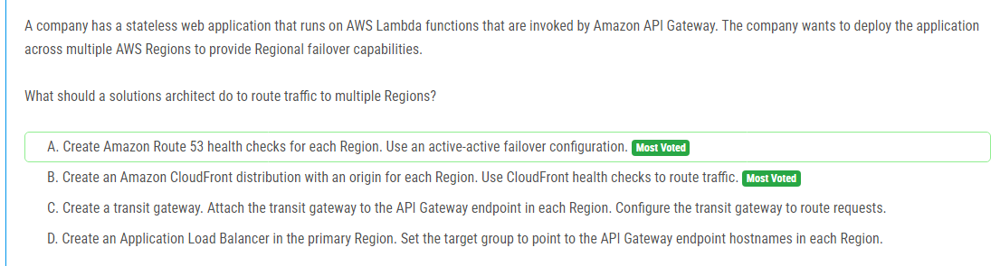

해설:

정답 A.

Amazon Route 53은 AWS의 관리형 DNS 서비스로, 다양한 라우팅 정책을 지원하여 트래픽을 여러 대상에 분산시킬 수 있습니다.

Health check을 사용하여 각 리전의 상태를 모니터링하고, 이를 기반으로 트래픽을 라우팅할 수 있습니다. Active-active failover 구성을 사용하여 여러 리전 간에 트래픽을 균형있게 분산시킬 수 있습니다.

이 방법을 사용하면 리전 간에 장애 발생 시 트래픽을 자동으로 안전하게 이동시킬 수 있습니다. 따라서 지역적인 장애 대응 능력을 제공하면서 애플리케이션의 가용성을 향상시킬 수 있습니다.

따라서 솔루션 A가 트래픽을 여러 리전으로 라우팅하는 가장 적절한 방법입니다.

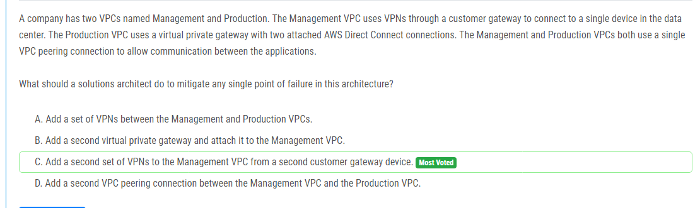

해설:

정답 C.

Management VPC에서 Production VPC로의 연결이 단일 고객 게이트웨이를 통해 이루어지므로 이 게이트웨이가 실패하면 Management VPC와 Production VPC 간의 통신이 불가능해질 수 있습니다.

따라서 단일 고객 게이트웨이 대신 두 번째 고객 게이트웨이를 추가하고, Management VPC와 Production VPC 간에 두 번째 집합의 VPN을 설정하여 단일 고객 게이트웨이의 장애에 대비할 수 있습니다.

이를 통해 두 VPC 간의 통신을 더욱 견고하고 신뢰할 수 있으며, 장애가 발생했을 때 이중화된 VPN 연결을 통해 서비스의 연속성을 유지할 수 있습니다.

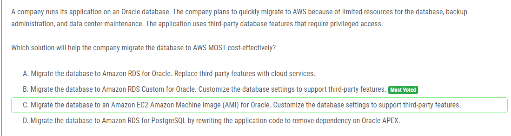

해설:

정답 B.

Amazon RDS Custom은 Amazon RDS의 관리형 데이터베이스 서비스로, 사용자가 Oracle 데이터베이스의 많은 측면을 사용자 정의할 수 있는 옵션을 제공합니다. 따라서 기존의 세분화된 요구 사항을 지원하기 위해 필요한 조치를 취할 수 있습니다.

이 솔루션은 기존의 Oracle 데이터베이스를 그대로 유지하면서 필요한 설정을 조정할 수 있기 때문에, 새로운 기능을 배우거나 애플리케이션을 변경할 필요가 없습니다. 따라서 마이그레이션 및 설정 변경에 대한 리소스 및 비용을 절약할 수 있습니다.

또한, Amazon RDS는 관리형 서비스이므로 데이터베이스의 관리와 백업 등을 AWS가 자동으로 처리해 줍니다. 이로 인해 데이터베이스 및 데이터 센터 유지 관리에 대한 리소스 및 비용을 절감할 수 있습니다.

따라서 솔루션 B가 Oracle 데이터베이스를 AWS로 가장 비용 효율적으로 마이그레이션하는 데 가장 좋은 옵션입니다.

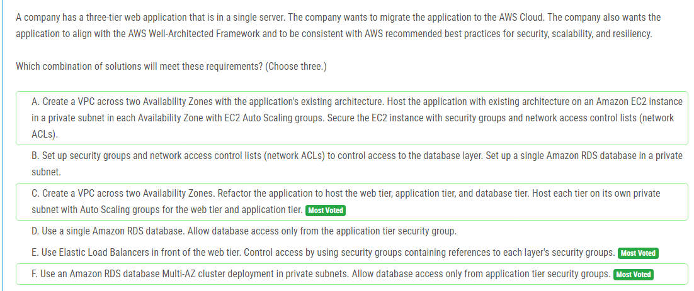

해설:

정답 C, E, F.

C. VPC를 두 가용 영역에 걸쳐 생성하여 가용성을 확보하고, 웹 티어, 응용 프로그램 티어 및 데이터베이스 티어를 개별적인 개인 서브넷에 호스팅하여 보안과 격리성을 강화합니다. 각 티어에 대한 Auto Scaling 그룹을 구성하여 확장성을 확보합니다.

E. 웹 티어 앞에 Elastic Load Balancer를 배치하여 트래픽을 분산시키고, 각 레이어의 보안 그룹을 참조하는 보안 그룹을 사용하여 액세스를 제어합니다. 이렇게 하면 웹 애플리케이션에 대한 안전한 액세스가 가능하며, 애플리케이션 및 데이터베이스 레이어에 대한 보안을 유지할 수 있습니다.

F. Amazon RDS의 Multi-AZ 클러스터 배포를 사용하여 데이터베이스의 가용성을 높입니다. 데이터베이스 액세스는 응용 프로그램 티어의 보안 그룹에서만 허용되므로 보안이 강화됩니다.

이러한 조합을 사용하면 보안, 확장성 및 복원력과 같은 AWS Well-Architected Framework 및 AWS 권장 모범 사례를 준수하면서도 웹 애플리케이션을 AWS 클라우드로 성공적으로 마이그레이션할 수 있습니다.

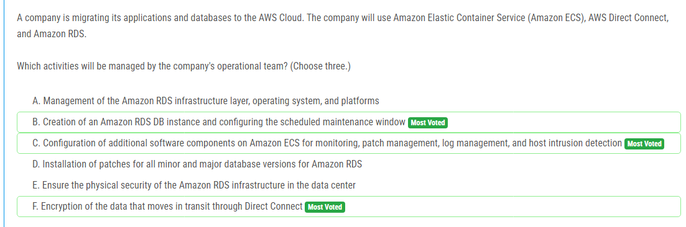

해설:

정답 B, C, F.

B. Amazon RDS DB 인스턴스를 생성하고 유지 관리 창을 구성해야 합니다. 이는 데이터베이스의 설정, 보안 그룹, 네트워크 및 액세스 제어 등과 같은 중요한 구성 요소를 설정하는 데 관여합니다.

C. Amazon ECS에 대한 모니터링, 패치 관리, 로그 관리 및 호스트 침입 탐지와 같은 추가 소프트웨어 구성은 운영 팀의 책임입니다. 이러한 구성 요소는 애플리케이션 및 인프라의 안정성과 보안을 보장하기 위해 필요합니다.

F. Direct Connect를 통해 이동하는 데이터의 보안 및 안전을 위해 데이터의 이동 중에 암호화를 보장하는 것은 운영 팀의 책임입니다. 이는 데이터의 기밀성과 무결성을 보장하고 보안 요구 사항을 준수하는 데 중요합니다.

따라서 Amazon RDS DB 인스턴스 생성 및 유지 관리 창 구성, Amazon ECS에 대한 소프트웨어 구성 및 Direct Connect를 통한 데이터 암호화와 같은 활동은 운영 팀에 의해 관리되어야 합니다.

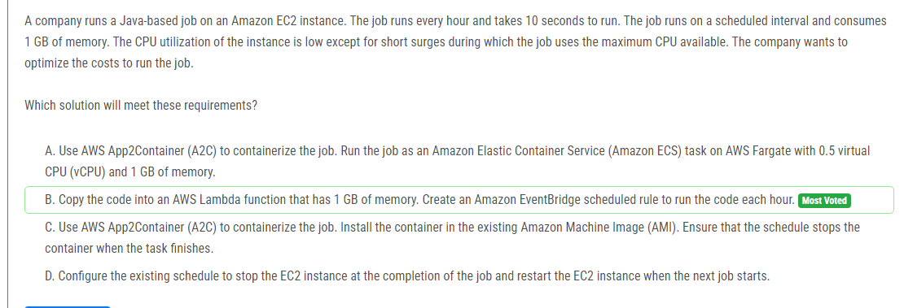

해설:

정답 B.

AWS Lambda 함수를 사용하면 실행 시간에만 과금되므로 매 시간 실행되는 작업에 대해 비용을 효과적으로 최적화할 수 있습니다. 또한 Lambda 함수를 사용하면 관리 오버헤드가 없으며 코드를 배포하고 관리하는 데 간편합니다.

Lambda 함수의 메모리 할당은 1 GB로 설정되며, 작업에 필요한 메모리만 사용됩니다. 따라서 메모리 사용량을 최적화할 수 있습니다.

Amazon EventBridge 스케줄된 규칙을 사용하여 매 시간마다 코드를 실행할 수 있습니다. 이는 매 시간마다 작업을 실행할 수 있도록 자동화된 방법을 제공합니다.

또한 EC2 인스턴스를 실행하는 것보다 Lambda 함수를 사용하는 것이 비용면에서 훨씬 효율적입니다. 실행 시간만큼만 과금되기 때문에 작업을 실행하는 데 소요되는 비용을 크게 줄일 수 있습니다.

따라서 솔루션 B가 비용을 최적화하면서 요구 사항을 충족하는 가장 좋은 옵션입니다.

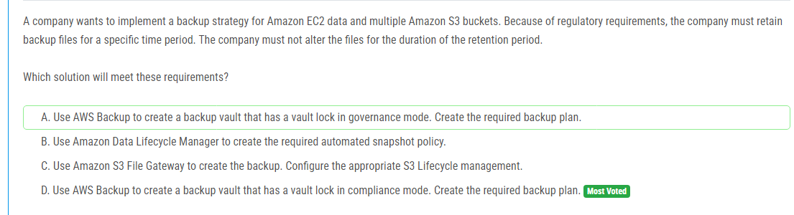

해설:

정답 D.

AWS Backup을 사용하여 백업 볼트를 생성하고 볼트 잠금을 컴플라이언스 모드로 설정할 수 있습니다. 이것은 백업 파일을 변경할 수 없도록 보장합니다.

컴플라이언스 모드에서 설정된 백업 볼트 잠금은 지정된 보존 기간 동안 백업 파일이 변경되거나 삭제되지 않도록 보장합니다. 이는 규제 요구 사항을 준수하는 데 중요합니다.

AWS Backup을 사용하여 EC2 데이터와 여러 Amazon S3 버킷의 백업을 관리할 수 있으므로, 복잡한 환경에서도 통합된 백업 솔루션을 유지할 수 있습니다.

따라서 솔루션 D가 요구 사항을 충족하고 가장 적절한 선택입니다.

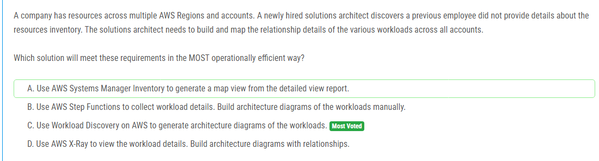

해설:

정답 C.

AWS에서 제공하는 Workload Discovery 서비스를 사용하면 각 리전 및 계정에 있는 워크로드에 대한 자동화된 아키텍처 다이어그램을 생성할 수 있습니다. 이를 통해 모든 리전 및 계정에 걸쳐 워크로드의 관계와 구성을 시각적으로 파악할 수 있습니다.

Workload Discovery는 AWS 리소스의 구성 및 관계를 식별하고 문서화하는데 도움이 되는 강력한 도구입니다. 이를 사용하여 이전 직원이 문서화하지 않은 리소스에 대한 자세한 정보를 제공할 수 있습니다.

자동화된 아키텍처 다이어그램을 생성함으로써 운영 효율성을 높일 수 있으며, 수동으로 다이어그램을 작성하는 번거로움을 피할 수 있습니다.

따라서 솔루션 C가 요구 사항을 가장 효율적으로 충족하며, 작업을 가장 효율적으로 수행할 수 있는 방법입니다.

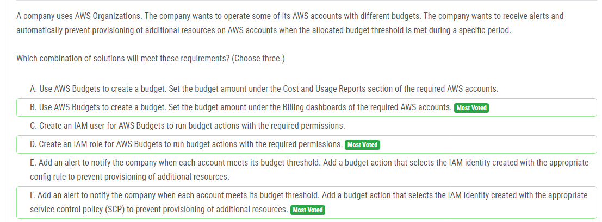

해설:

정답 B, D, F.

B. AWS Budgets를 사용하여 예산을 생성하고, 해당 AWS 계정의 청구 대시보드에서 예산 금액을 설정합니다. 이를 통해 각 계정의 예산을 설정하고 관리할 수 있습니다.

D. AWS Budgets에서 예산 작업을 실행할 수 있는 필요한 권한을 갖는 IAM 역할을 생성합니다. 이를 통해 예산 액션을 수행할 수 있는 역할을 설정합니다.

F. 각 계정이 예산 임계값에 도달할 때 회사에 알림을 보내는 경고를 추가합니다. 그리고 예산 액션을 추가하여 적절한 서비스 제어 정책(SCP)이 있는 IAM ID를 선택하여 추가 리소스 프로비저닝을 방지합니다. 이를 통해 예산 초과 시 자동으로 리소스 프로비저닝을 방지할 수 있습니다.

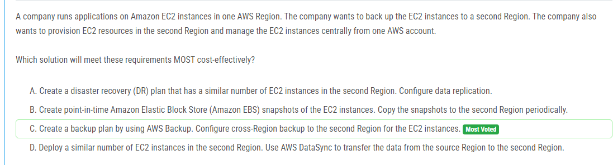

해설:

정답 C.

AWS Backup을 사용하여 백업 계획을 생성하고, EC2 인스턴스를 대상으로 설정합니다. 이를 통해 EC2 인스턴스의 데이터를 쉽게 백업할 수 있습니다.

AWS Backup을 사용하여 교차 리전 백업을 구성하여 데이터를 두 번째 리전으로 복제합니다. 이를 통해 두 번째 리전에 대한 DR(DR) 백업이 만들어집니다.

AWS Backup은 관리 오버헤드를 최소화하고 자동화된 방식으로 데이터를 백업하므로 운영 비용을 절감할 수 있습니다.

이 솔루션은 중앙 집중식 관리를 제공하므로 모든 EC2 인스턴스를 한 AWS 계정에서 효과적으로 관리할 수 있습니다.

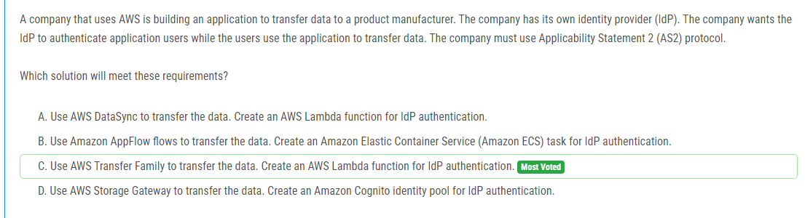

해설:

정답 C.

AWS Transfer Family는 AS2 프로토콜을 사용하여 데이터를 안전하게 전송하는 데 사용됩니다. 따라서 AS2 프로토콜을 필요로 하는 경우 데이터 전송에 가장 적합한 옵션 중 하나입니다.

AWS Transfer Family는 사용자 인증을 위해 자체 IdP(Identity Provider)와 통합할 수 있습니다. 이 경우에는 IdP에서 제공하는 사용자 인증 기능을 사용하여 데이터 전송 중에 사용자를 인증할 수 있습니다.

AWS Lambda 함수를 사용하여 IdP 인증을 구현할 수 있습니다. Lambda 함수를 통해 인증된 사용자를 확인하고 데이터 전송을 허용하거나 거부할 수 있습니다.

따라서 솔루션 C가 AS2 프로토콜을 사용하는 데이터 전송 애플리케이션에 가장 적합하며 요구 사항을 충족하는 데 가장 적합한 선택입니다.

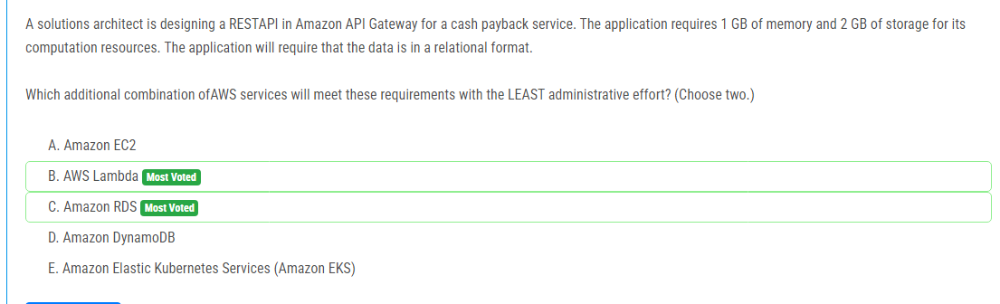

해설:

정답 B, C.

B. AWS Lambda: AWS Lambda는 서버리스 컴퓨팅 서비스로, 개발자가 코드를 실행할 때만 요금이 청구됩니다. 이는 관리 작업이 필요 없고, 인프라 관리나 운영에 대한 걱정이 줄어들게 됩니다. 또한 Lambda는 필요한 메모리 및 스토리지를 사용자가 지정한 용량에 따라 자동으로 할당하므로, 용량 관리를 대신 처리해줍니다.

C. Amazon RDS: Amazon RDS는 관리형 관계형 데이터베이스 서비스로, 데이터를 관리하는 데 필요한 작업을 대부분 자동화합니다. 데이터베이스 배포, 확장, 백업 및 복원과 같은 관리 작업이 자동으로 처리되므로, 관리 작업을 최소화할 수 있습니다. 또한 RDS는 관계형 데이터베이스를 지원하므로 요구 사항과 일치합니다.

따라서 AWS Lambda와 Amazon RDS를 조합하여 관리 오버헤드를 최소화하면서 요구 사항을 충족할 수 있습니다.

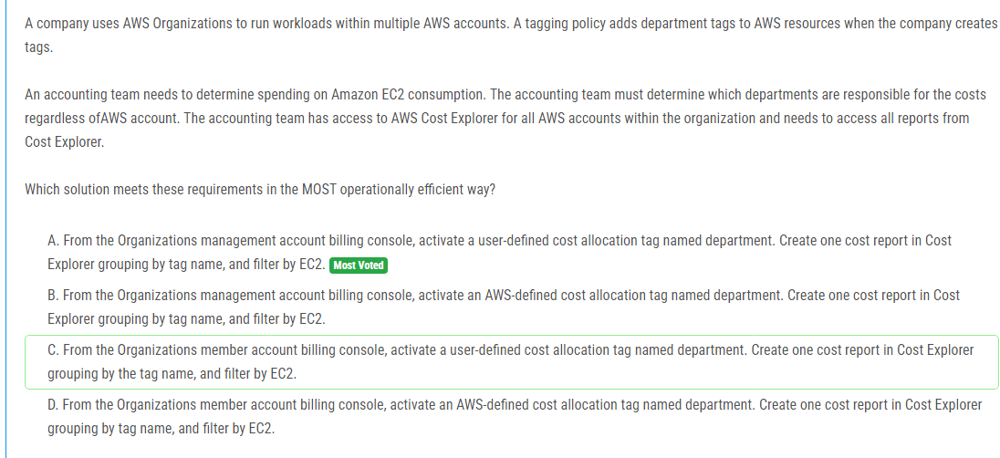

해설:

정답 A.

AWS 조직 관리 계정의 청구 콘솔에서 사용자 정의 비용 할당 태그(named department)를 활성화합니다. 이를 통해 비용 태그를 사용하여 부서별 비용을 추적할 수 있습니다.

Cost Explorer에서 태그 이름으로 그룹화하고 EC2로 필터링하여 비용 보고서를 생성합니다. 이를 통해 EC2 리소스에 대한 비용을 부서별로 보고 분석할 수 있습니다.

조직의 모든 AWS 계정에 대한 비용 보고서에 액세스해야 하므로 조직 관리 계정에서 이러한 작업을 수행하는 것이 가장 효율적입니다.

따라서 솔루션 A가 요구 사항을 가장 효율적으로 충족하면서 작업을 수행하는 데 가장 적합한 선택입니다.

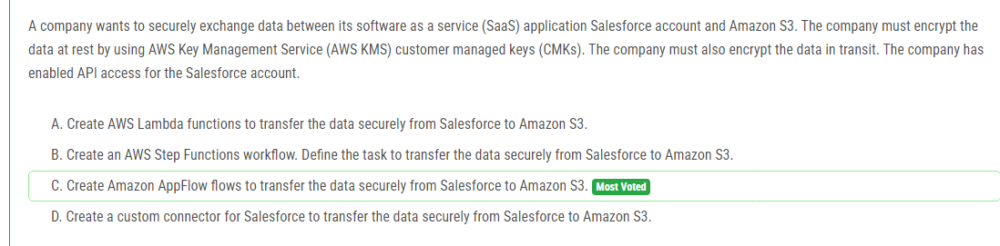

해설:

정답 C.

Amazon AppFlow는 Salesforce와 Amazon S3 간에 데이터를 안전하게 전송하는 데 사용할 수 있는 관리형 통합 서비스입니다. 이 서비스를 사용하면 데이터를 암호화하고 S3에 안전하게 전송할 수 있습니다.

Amazon AppFlow는 데이터 전송 중에 데이터를 암호화하여 데이터를 안전하게 전송할 수 있습니다. 또한 사용자가 AWS KMS를 사용하여 데이터를 암호화할 수 있으므로 데이터가 휴식 중에도 안전하게 보호됩니다.

따라서 Amazon AppFlow를 사용하여 Salesforce와 Amazon S3 간에 데이터를 안전하게 전송하는 것이 가장 적합한 선택입니다.

