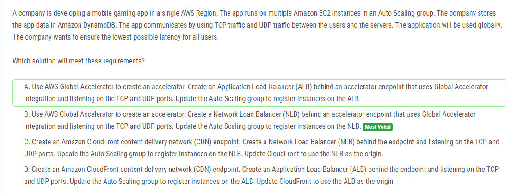

해설:

정답 B.

AWS Global Accelerator를 사용하여 글로벌 네트워크 경로 최적화를 활용하여 사용자와 EC2 인스턴스 간의 통신에 대한 최적의 경로를 제공할 수 있습니다. 이를 통해 모든 사용자에게 가능한 최저 지연 시간을 보장할 수 있습니다.

Network Load Balancer (NLB)는 TCP 및 UDP 트래픽을 처리할 수 있습니다. NLB는 매우 낮은 지연 시간과 높은 처리량을 제공하므로 대규모 게임 애플리케이션에 이상적입니다.

AWS Global Accelerator의 통합을 통해 NLB를 사용하여 TCP 및 UDP 트래픽을 수신할 수 있습니다. 이를 통해 더 빠르고 안정적인 사용자 경험을 제공할 수 있습니다.

따라서 솔루션 B가 사용자에게 가능한 최저 지연 시간을 보장하면서 TCP 및 UDP 트래픽을 효율적으로 처리하는 데 가장 적합한 선택입니다.

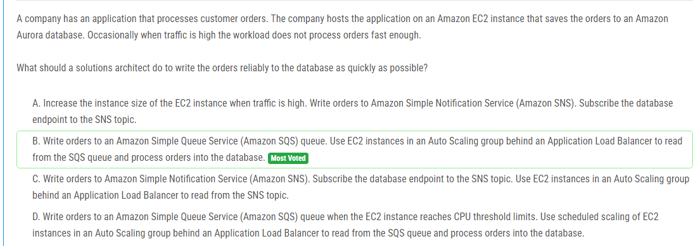

해설:

정답 B.

Amazon SQS는 메시지 대기열 서비스로, 메시지를 안전하게 저장하고 여러 컴퓨팅 리소스가 이를 처리할 수 있도록 지원합니다. 주문이 SQS 대기열에 안정적으로 기록되면 서버의 부하나 트래픽 증가로 인해 처리가 지연되어도 메시지는 안전하게 대기할 수 있습니다.

EC2 인스턴스를 사용하여 SQS 대기열에서 주문을 읽고 처리할 수 있습니다. Auto Scaling 그룹을 사용하여 EC2 인스턴스를 동적으로 조정하여 트래픽 증가에 따라 스케일 아웃하거나 스케일 인하여 처리량을 조절할 수 있습니다.

Application Load Balancer를 사용하여 여러 EC2 인스턴스에 분산되는 트래픽을 처리할 수 있습니다. 이렇게 하면 시스템의 가용성이 향상되고 부하가 균형 잡히게 됩니다.

따라서 솔루션 B는 주문을 신속하게 안정적으로 처리하는 데 가장 적합한 방법입니다.

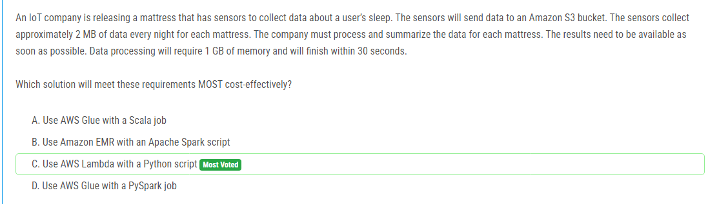

해설:

정답 C.

AWS Lambda는 이벤트 기반 서버리스 컴퓨팅 서비스로, 데이터가 Amazon S3 버킷에 업로드될 때 트리거되어 데이터 처리 및 요약 작업을 수행할 수 있습니다. 이는 데이터가 업로드될 때마다 자동으로 처리됨을 의미하며, 즉시 사용 가능한 결과를 제공합니다.

Python은 AWS Lambda에서 지원하는 언어 중 하나이며, 간단한 데이터 처리 및 요약 작업을 위해 충분히 효과적입니다.

Lambda 함수는 메모리와 실행 시간을 구성할 수 있으므로, 요구 사항에 따라 메모리 요구 사항을 충족시킬 수 있습니다. 또한, 처리 시간이 30 초 이내이므로 Lambda 함수의 실행 시간 제한 내에서 데이터 처리를 완료할 수 있습니다.

따라서 AWS Lambda를 사용하여 Python 스크립트를 실행하여 데이터를 처리하는 것이 요구 사항을 가장 비용 효율적으로 충족하는 방법입니다.

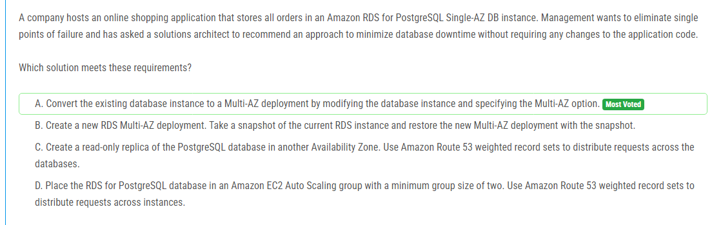

해설:

정답 A.

Multi-AZ 배포는 Amazon RDS의 내결함성을 향상시키는 데 가장 효과적인 방법 중 하나입니다. Multi-AZ 배포를 선택하면 RDS 인스턴스가 본래의 Availability Zone과 동기화된 다른 Availability Zone에 자동으로 복제됩니다. 이를 통해 단일 장애 지점이 제거되고 데이터베이스의 가용성이 향상됩니다.

Multi-AZ 배포를 선택하면 애플리케이션 코드의 변경이 필요하지 않습니다. 애플리케이션은 다중 AZ 배포의 기능에 대해 알 필요가 없으며, 이전과 동일한 방식으로 데이터베이스에 액세스할 수 있습니다.

단일 AZ 배포에서 Multi-AZ 배포로의 변환은 간단하게 RDS 콘솔 또는 AWS CLI를 사용하여 수행할 수 있습니다. 기존 인스턴스를 수정하고 Multi-AZ 옵션을 지정하면 됩니다.

따라서 단일 AZ RDS 인스턴스를 Multi-AZ 배포로 변환하는 것이 요구 사항을 가장 잘 충족하는 방법입니다.

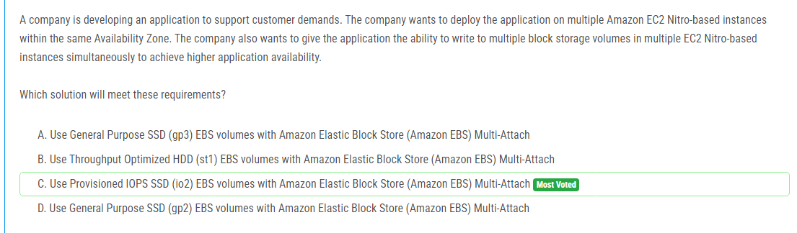

해설:

정답 C.

Provisioned IOPS SSD (io2) EBS 볼륨은 높은 IOPS(입출력 작업 수) 및 지연 시간이 낮은 성능을 제공하여 요구 사항에 적합합니다. 이는 다중 EC2 인스턴스가 볼륨에 동시에 쓰기 작업을 수행할 때 필요한 성능을 제공할 수 있습니다.

Amazon EBS Multi-Attach는 여러 EC2 인스턴스에서 동시에 하나의 EBS 볼륨에 연결할 수 있도록 지원합니다. 이를 통해 여러 EC2 인스턴스 간에 데이터를 공유하고 고가용성을 확보할 수 있습니다.

General Purpose SSD (gp3) 및 Throughput Optimized HDD (st1) 볼륨은 다중 EC2 인스턴스 간에 동시에 연결할 수 없습니다. 따라서 이러한 유형의 볼륨은 이러한 요구 사항을 충족시키기에 적합하지 않습니다.

따라서 Provisioned IOPS SSD (io2) EBS 볼륨을 사용하여 Amazon EBS Multi-Attach를 활용하는 것이 요구 사항을 가장 잘 충족하는 방법입니다.

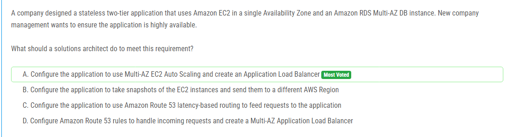

해설:

정답 A.

Multi-AZ EC2 Auto Scaling을 사용하여 애플리케이션을 여러 Availability Zone으로 확장함으로써 고가용성을 확보할 수 있습니다. 이렇게 함으로써 단일 장애 지점이 제거되고 시스템의 가용성이 향상됩니다.

Application Load Balancer(ALB)를 사용하여 여러 EC2 인스턴스 간에 트래픽을 분산시킬 수 있습니다. 이를 통해 애플리케이션에 대한 요청이 여러 인스턴스로 분산되고 특정 인스턴스의 장애로 인한 영향을 최소화할 수 있습니다.

Amazon RDS Multi-AZ DB 인스턴스를 사용하여 데이터베이스의 가용성을 향상시킵니다. 이를 통해 데이터베이스의 장애가 발생할 경우 자동으로 대체 데이터베이스로 스위치되어 애플리케이션의 연속성을 보장할 수 있습니다.

따라서 Multi-AZ EC2 Auto Scaling과 Application Load Balancer를 사용하여 애플리케이션을 구성하는 것이 요구 사항을 가장 잘 충족하는 방법입니다.

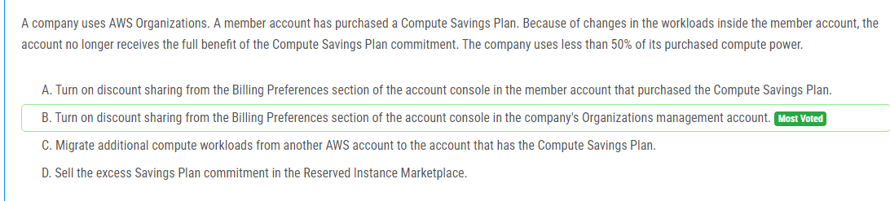

해설:

정답 B.

할인 공유(discount sharing)은 AWS 조직(Organizations)의 관리 계정에서 설정됩니다. 따라서 할인 공유를 사용하여 Compute Savings Plan의 할인 혜택을 여러 계정 간에 공유할 수 있습니다.

할인 공유를 활성화하면 특정 계정이 사용하지 못하는 할인 혜택을 다른 계정에서 사용할 수 있습니다. 이 경우 Compute Savings Plan의 할인을 받지 못하는 특정 회원 계정에서 다른 계정으로 할인을 공유하면 할인 혜택을 최대화할 수 있습니다.

할인 공유를 사용하면 더 많은 계정에서 할인 혜택을 활용할 수 있으므로 비용 절감을 극대화할 수 있습니다.

따라서 요구 사항을 가장 잘 충족하는 방법은 조직 관리 계정에서 할인 공유를 활성화하는 것입니다.

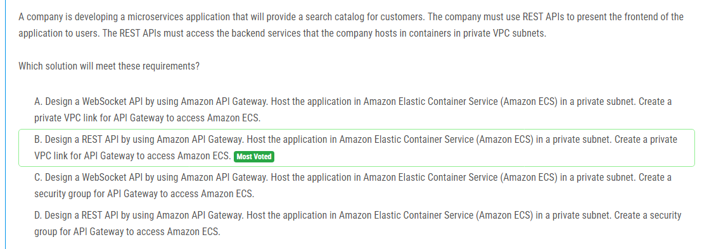

해설:

정답 B.

Amazon API Gateway를 사용하여 REST API를 설계하면 사용자에게 RESTful 인터페이스를 제공할 수 있습니다. 이는 요구 사항에서 명시된 대로 REST API를 사용하여 프론트엔드를 사용자에게 제공해야 함을 의미합니다.

애플리케이션은 Amazon ECS에서 호스팅되며, 이를 통해 마이크로서비스 아키텍처를 쉽게 구축할 수 있습니다. Amazon ECS는 컨테이너화된 백엔드 서비스를 개인 VPC 서브넷에서 호스팅할 수 있습니다.

Amazon API Gateway는 프라이빗 VPC 링크를 통해 Amazon ECS에 액세스할 수 있도록 설정할 수 있습니다. 이를 통해 API Gateway가 백엔드 서비스에 안전하게 연결될 수 있습니다.

따라서 Amazon API Gateway를 사용하여 REST API를 설계하고, Amazon ECS에서 애플리케이션을 호스팅하고, API Gateway를 통해 Amazon ECS에 액세스하는 것이 요구 사항을 가장 잘 충족하는 방법입니다.

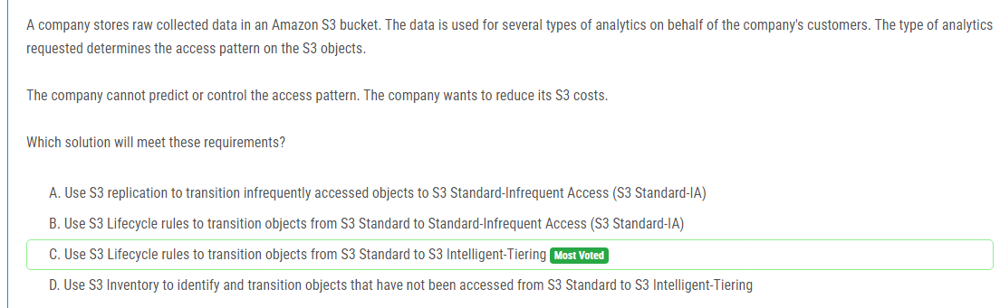

해설:

정답 C.

S3 Intelligent-Tiering은 객체의 액세스 패턴에 따라 자동으로 스토리지 클래스를 조정하여 비용을 최적화합니다. 데이터가 자주 액세스되는 경우 자동으로 S3 Standard로 유지되고, 데이터가 드물게 액세스되는 경우 자동으로 S3 Standard-IA로 이동됩니다.

이해를 돕기 위해 S3 Intelligent-Tiering은 자주 액세스되는 객체에 대한 추가 비용을 청구하지 않고 S3 Standard와 유사한 가격으로 데이터를 저장합니다. 또한 드물게 액세스되는 객체에 대해서는 S3 Standard-IA와 같은 저렴한 비용으로 저장됩니다.

S3 Intelligent-Tiering은 액세스 패턴에 따라 객체를 자동으로 이동시키므로, 회사는 액세스 패턴을 예측하거나 제어하지 않아도 됩니다. 이는 요구 사항에서 명시된 대로 회사가 액세스 패턴을 예측하거나 제어할 수 없다는 제약 사항을 충족합니다.

따라서 S3 Intelligent-Tiering을 사용하여 객체를 자동으로 최적화하고 비용을 절감하는 것이 가장 효율적인 해결책입니다.

해설:

정답 D.

IPv6에서는 NAT(Network Address Translation)을 사용하지 않으며, 대신 Egress-only Internet Gateway를 사용하여 인스턴스가 외부로 통신하는 데 필요한 구성을 제공합니다. Egress-only Internet Gateway는 IPv6 트래픽을 인터넷으로 보낼 수 있지만 인터넷에서 EC2 인스턴스로 들어오는 연결을 차단합니다. 이는 보안 정책에 따라 외부 서비스가 EC2 인스턴스로의 연결을 시작하지 않도록 하는 요구 사항을 충족시킵니다.

따라서 Egress-only Internet Gateway를 생성하고 해당 서브넷의 라우팅 테이블의 대상으로 지정함으로써 이러한 제약을 해결할 수 있습니다.

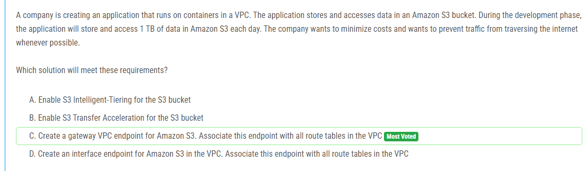

해설:

정답 C.

Amazon S3 Gateway VPC 엔드포인트를 생성하고 해당 엔드포인트를 VPC의 모든 라우팅 테이블에 연결함으로써 인터넷을 통해 트래픽을 방지할 수 있습니다. 이를 통해 애플리케이션에서 Amazon S3에 액세스할 때 인터넷을 거치지 않고도 VPC 내에서 안전하게 데이터를 전송할 수 있습니다. 또한 데이터 전송 비용을 최소화할 수 있으며, 보안을 강화할 수 있습니다.

따라서 Amazon S3 Gateway VPC 엔드포인트를 사용하는 것이 비용을 절감하고 트래픽을 최소화하는 가장 좋은 방법입니다.

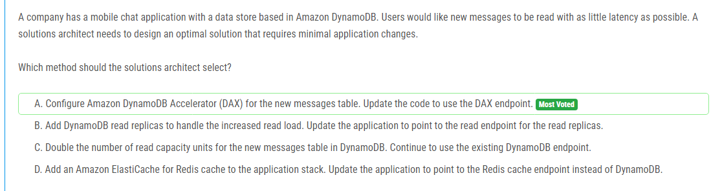

해설:

정답 A.

Amazon DynamoDB 가속기(DAX)를 새로운 메시지 테이블에 구성하고 코드를 DAX 엔드포인트를 사용하도록 업데이트함으로써 이러한 요구 사항을 충족할 수 있습니다. DAX는 DynamoDB의 메모리 캐시 서비스로, 읽기 작업의 지연 시간을 줄이기 위해 메시지 데이터에 대한 고속 캐싱을 제공합니다. 이를 통해 사용자가 새로운 메시지를 더 빠르게 읽을 수 있으며, 애플리케이션의 기존 DynamoDB 쿼리를 변경할 필요가 없습니다. 따라서 A가 가장 적합한 옵션입니다.

해설:

정답 A.

Amazon CloudFront는 정적 콘텐츠를 전 세계의 엣지 로케이션에 캐시하여 사용자에게 빠르게 제공하는 CDN(Content Delivery Network) 서비스입니다. 정적 콘텐츠를 CloudFront로 캐싱함으로써 EC2 인스턴스의 부하를 줄이고 대역폭 소비를 최적화할 수 있습니다. 이를 통해 비용을 줄이면서도 사용자에게 더 빠른 웹 페이지로드를 제공할 수 있습니다. 따라서 A가 가장 적절한 옵션입니다.

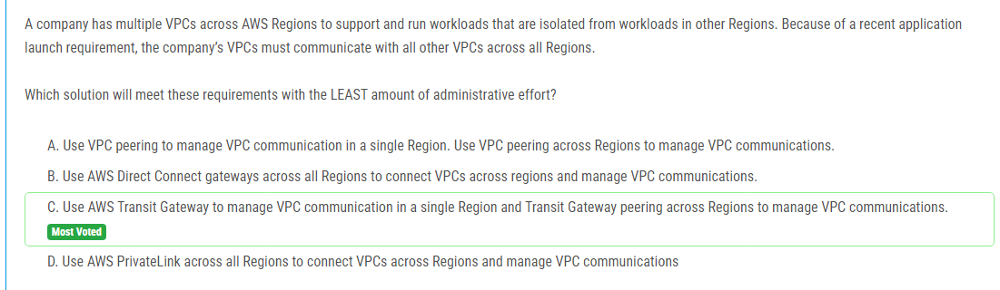

해설:

정답 C.

AWS Transit Gateway를 사용하면 여러 VPC 간의 통신을 단순화하고 중앙 집중식으로 관리할 수 있습니다. 하나의 리전에서 VPC 통신을 관리하고 다른 리전 간에는 Transit Gateway 피어링을 사용하여 VPC 통신을 관리할 수 있습니다. 이를 통해 관리 작업이 단순화되고 네트워크 연결이 효율적으로 구성됩니다. 따라서 C가 가장 적합한 선택지입니다.

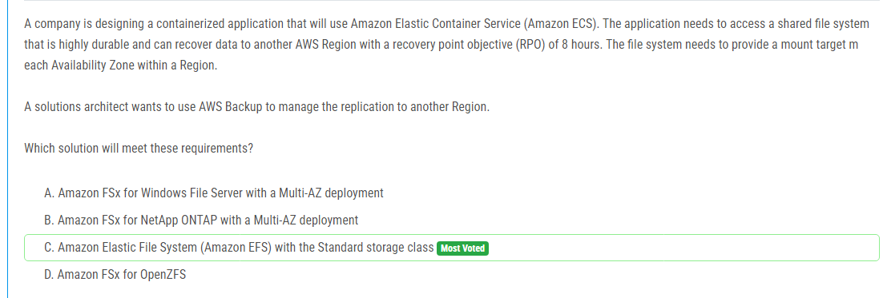

해설:

정답 C.

Amazon Elastic File System (EFS)는 여러 가용 영역에서 사용 가능한 고성능 및 내구성을 갖춘 완전 관리형 파일 시스템입니다. Amazon EFS는 모든 가용 영역에 자동으로 마운트 타겟을 생성하여 확장 가능한 파일 시스템을 제공합니다. 또한 AWS Backup을 사용하여 Amazon EFS 파일 시스템의 백업을 관리하고, 다른 리전으로의 데이터 복제를 설정하여 회복 시간 목표(RPO)를 충족할 수 있습니다. 따라서 Amazon EFS는 요구 사항을 충족하기 위한 이상적인 선택입니다.

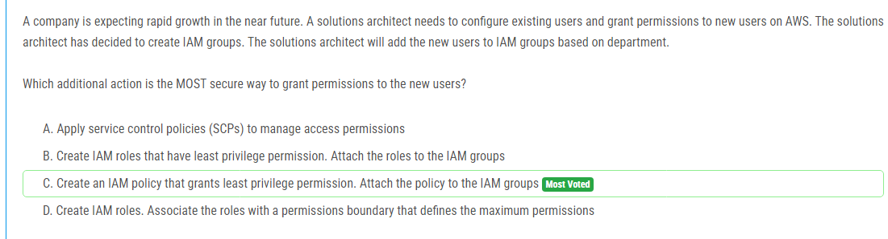

해설:

정답 C.

IAM 그룹을 사용하여 사용자를 그룹화하고, 해당 그룹에 대한 권한을 관리하는 것이 좋은 방법입니다. 이 경우, 새로운 사용자가 추가될 때 새로운 그룹에 추가하여 해당 부서 또는 역할에 따라 적절한 권한을 부여할 수 있습니다. 그런 다음 IAM 정책을 작성하여 각 그룹에 필요한 최소한의 권한을 명시할 수 있습니다. 이러한 방법을 통해 새로운 사용자에게 가장 적절한 권한을 부여하고, 최소한의 권한 원칙을 준수할 수 있습니다. 따라서 정답 C가 가장 적절합니다.

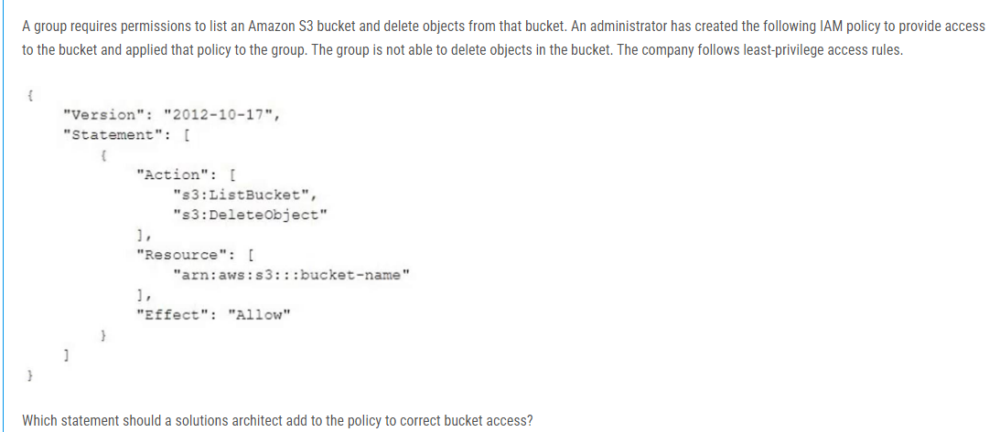
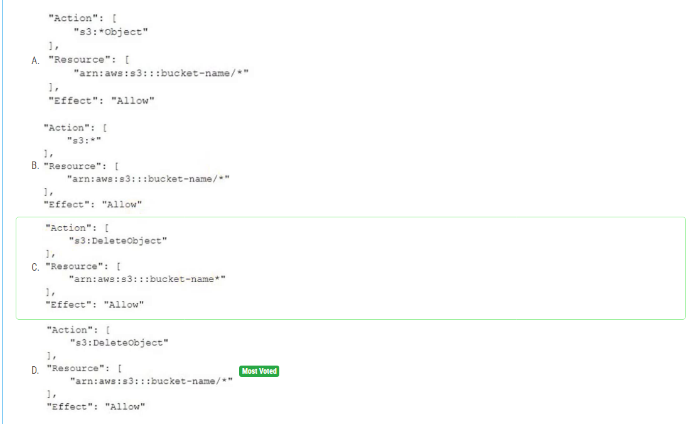

해설:

정답 D.

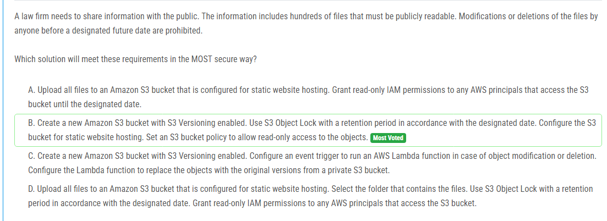

해설:

정답 B.

첫째로, Amazon S3 버킷을 생성하고 S3 버전 관리를 활성화하여 모든 파일의 버전을 추적할 수 있습니다. 이를 통해 파일이 수정 또는 삭제되어도 이전 버전에 접근할 수 있습니다.

둘째로, S3 객체 잠금을 사용하여 특정 날짜까지 파일의 수정 및 삭제를 방지할 수 있습니다. 이를 통해 공개된 파일에 대한 보안을 강화할 수 있습니다.

셋째로, S3 버킷을 정적 웹 사이트 호스팅을 구성하여 파일을 공개적으로 읽을 수 있게 만들 수 있습니다.

네 번째로, S3 버킷 정책을 사용하여 객체에 대한 읽기 전용 액세스를 허용할 수 있습니다. 이는 AWS 주체가 버킷에 액세스 할 수 있도록 허용하면서도 수정 및 삭제를 방지합니다.

따라서 정답 B가 요구 사항을 가장 안전하게 충족시키는 방법입니다.

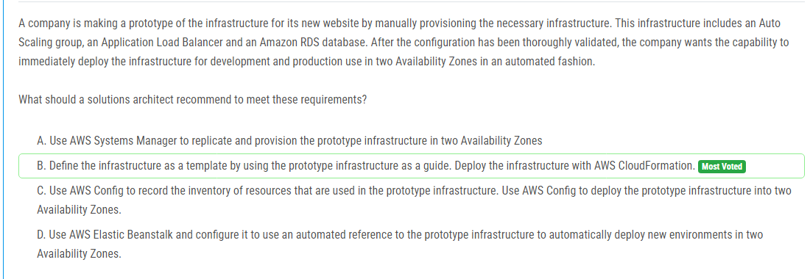

해설:

정답 B.

AWS CloudFormation은 인프라를 코드로 정의하고 프로비저닝하는 서비스입니다. 프로토 타입 인프라를 CloudFormation 템플릿으로 정의하여 원하는대로 수정할 수 있습니다. 이렇게 하면 인프라를 쉽게 재사용하고 프로덕션 환경으로 빠르게 배포할 수 있습니다. CloudFormation은 여러 AWS 리소스를 프로비저닝하고 관리하는 데 사용되므로 인프라를 자동화하고 반복적인 작업을 줄일 수 있습니다. 따라서 새로운 환경을 빠르게 프로비저닝하고 개발 및 프로덕션 환경에서의 사용을 자동화하기에 이상적인 도구입니다.

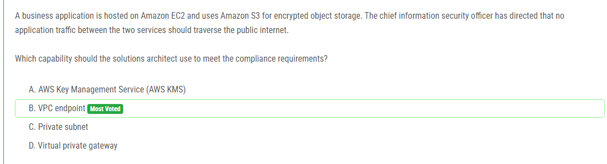

해설:

정답 B.

VPC 엔드포인트는 VPC 내에서 AWS 서비스에 안전하게 연결할 수 있는 프라이빗 연결을 제공합니다. EC2와 S3가 모두 VPC 내에서 호스팅되어 있다면, VPC 엔드포인트를 사용하여 EC2와 S3 간의 트래픽을 퍼블릭 인터넷을 통하지 않고 안전하게 전송할 수 있습니다. 이를 통해 보안 및 규정 준수 요구 사항을 충족하고 데이터의 안전성을 보장할 수 있습니다.