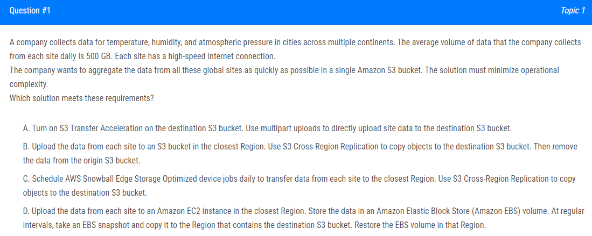
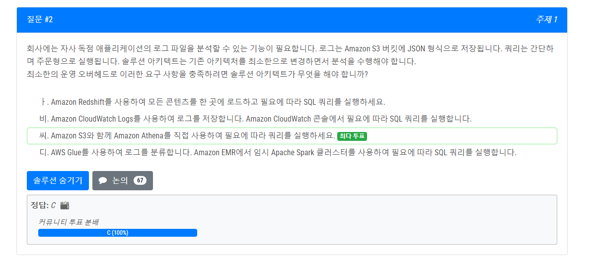
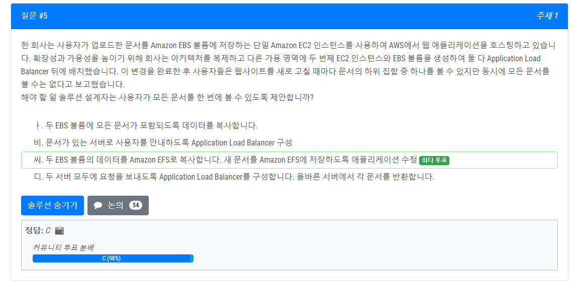
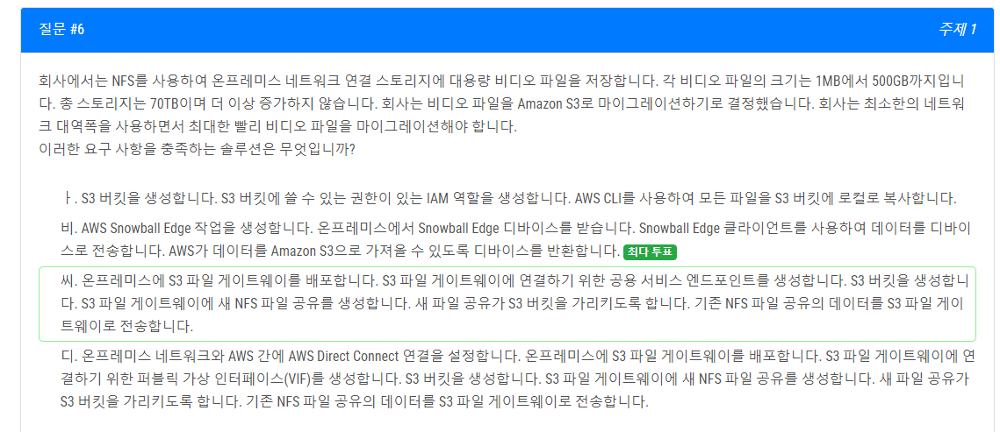

# Day 1

---

- 총 문제 : 10
- 성공 : 5
- 실패 : 5

## 문제 1

[ 문제 설명 ]
- 한 회사는 여러 대륙에 걸쳐 도시의 온도, 습도, 기압에 대한 데이터를 수집합니다. 회사가 매일 각 사이트에서 수집하는 평균 데이터 양은 500GB입니다. 각 사이트에는 고속 인터넷 연결이 제공됩니다.
  회사는 이러한 모든 글로벌 사이트의 데이터를 단일 Amazon S3 버킷에 가능한 한 빨리 집계하려고 합니다. 솔루션은 운영 복잡성을 최소화해야 합니다.
  이러한 요구 사항을 충족하는 솔루션은 무엇입니까?

[ 일반 ]
- 여러 대륙에서 엄청난 파일을 수집한다.

[ 조건 ]
- 고속 인터넷 연결

[ 작업 ]
- 단일 S3 버킷의 모든 데이터를 집계한다.
- 가능한 빨리, 운영 복잡성 최소화

[ 해설 ]
정답 A: S3 Transfer Acceleration
- 장거리 전송을 위한 개체와 이상적으로 작동합니다(에지 위치 사용).
- S3와의 콘텐츠 전송 속도를 50-500%까지 높일 수 있습니다.

---
## 문제2

- 오답 : B 

[ 해설 ]
- 조건 
1. 로그 파일 분석
2. AWS S3 JSON 형식
3. 쿼리 간단한 주문형 및 최소한의 오버헤드

[ Amazon Athena ]
- https://docs.aws.amazon.com/athena/latest/ug/what-is.html
- 데이터를 쉽게 분석하는 대화형 쿼리 서비스
- 표준 SQL을 사용하는 S3 콘솔에서 쉽게 사용이 가능하며 표준 SQL을 사용하여 임시 실행이 가능하다.

[ Redshift ]
- Redshift은 2단계를 거쳐야한다. Redshift에 로드하고 SQL 쿼리를 실행한다. -> 간단한 쿼리는 Athena에서 수행하고 복잡한 쿼리는 Redshit이 적합하다.

---

### 문제 3

- 다양한 부서의 여러 aws 계정을 관리한다.
- 마스터 계정이 프로젝트 보고서 S3 버킷을 가진다.
 - S3 버킷에 대한 액세스를 AWS Organizations의 조직 내 계정 사용자로만 제한
- 최소한의 오버헤드

[ 해설 ]
- aws:PrincipalOrgID 리소스에 액세스하는 보안 주체가 조직의 계정에 속하는지 확인한다.

### 문제 5

- EFS에 대한 동시 키워드
- 아직 이해도가 부족해서 추후에 학습

### 문제 6 

[ 해설 ]  
- 정답은 C입니다. 키워드는 NFS, S3, 낮은 대역폭입니다. 
- NFS는 파일 공유 및 저장을 위한 작업을 수행한다.  FILE Gateway를 통해 s3을 사용
- 그런데 토론에서는 a,c 둘다 너무 느리기 때문에 일회성 마이그레이션 snowball edge가 효율적이다.
